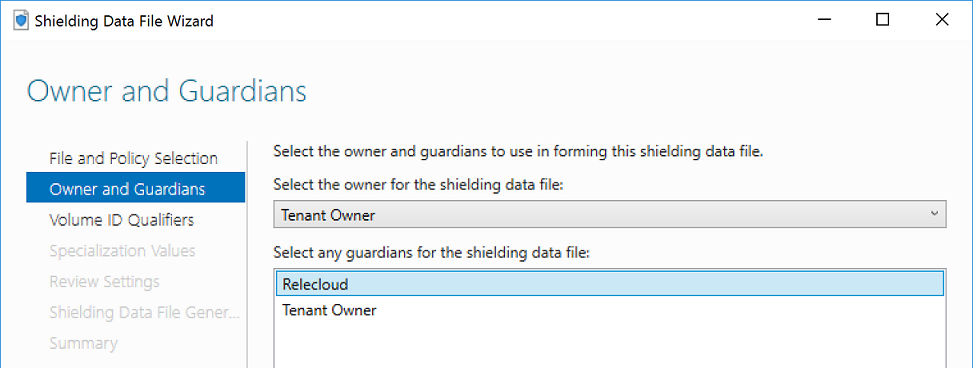

# Shielded VMs for tenants - Creating shielding data to define a shielded VM

>Applies to: Windows Server 2019, Windows Server (Semi-Annual Channel), Windows Server 2016

A shielding data file (also called a provisioning data file or PDK file) is an encrypted file that a tenant or VM owner creates to protect important VM configuration information, such as the administrator password, RDP and other identity-related certificates, domain-join credentials, and so on. This topic provides information about how to create a shielding data file. Before you can create the file, you must either obtain a template disk from your hosting service provider, or create a template disk as described in [Shielded VMs for tenants - Creating a template disk (optional)](guarded-fabric-tenant-creates-template-disk.md).

For a list and a diagram of the contents of a shielding data file, see [What is shielding data and why is it necessary?](guarded-fabric-and-shielded-vms.md#what-is-shielding-data-and-why-is-it-necessary).

> [!IMPORTANT]
> The steps in this section should be completed on a separate, trusted machine outside of the guarded fabric. Typically, the VM owner (tenant) would create the shielding data for their VMs, not the fabric administrators.

To prepare to create a shielding data file, take the following steps:

- [Obtain a certificate for Remote Desktop Connection](#optional-obtain-a-certificate-for-remote-desktop-connection)
- [Create an answer file](#create-an-answer-file)
- [Get the volume signature catalog file](#get-the-volume-signature-catalog-file)
- [Select trusted fabrics](#select-trusted-fabrics)

Then you can create the shielding data file:

- [Create a shielding data file and add guardians](#create-a-shielding-data-file-and-add-guardians-using-the-shielding-data-file-wizard)

## (Optional) Obtain a certificate for Remote Desktop Connection

Since tenants are only able to connect to their shielded VMs using Remote Desktop Connection or other remote management tools, it is important to ensure that tenants can verify they are connecting to the right endpoint (that is, there is not a "man in the middle" intercepting the connection).

One way to verify you are connecting to the intended server is to install and configure a certificate for Remote Desktop Services to present when you initiate a connection. The client machine connecting to the server will check whether it trusts the certificate and show a warning if it does not. Generally, to ensure the connecting client trusts the certificate, RDP certificates are issued from the tenant's PKI. More information about [Using certificates in Remote Desktop Services](https://technet.microsoft.com/library/dn781533.aspx) can be found on TechNet.

 To help you decide if you need to obtain a custom RDP certificate, consider the following:

- If you're just testing shielded VMs in a lab environment, you **do not** need a custom RDP certificate.
- If your VM is configured to join an Active Directory domain, a computer certificate will typically be issued by your organization's certificate authority automatically and used to identify the computer during RDP connections. You **do not** need a custom RDP certificate.
- If your VM is not domain joined but you want a way to verify you're connecting to the correct machine when you use Remote Desktop, you **should consider** using custom RDP certificates.

> [!TIP]
> When selecting an RDP certificate to include in your shielding data file, be sure to use a wildcard certificate. One shielding data file may be used to create an unlimited number of VMs. Since each VM will share the same certificate, a wildcard certificate ensures the certificate will be valid regardless of the VM's hostname.

## Create an answer file

Since the signed template disk in VMM is generalized, tenants are required to provide an answer file to specialize their shielded VMs during the provisioning process. The answer file (often called the unattend file) can configure the VM for its intended role - that is, it can install Windows features, register the RDP certificate created in the previous step, and perform other custom actions. It will also supply required information for Windows setup, including the default administrator's password and product key.

For information about obtaining and using the **New-ShieldingDataAnswerFile** function to generate an answer file (Unattend.xml file) for creating shielded VMs, see [Generate an answer file by using the New-ShieldingDataAnswerFile function](guarded-fabric-sample-unattend-xml-file.md). Using the function, you can more easily generate an answer file that reflects choices such as the following:

- Is the VM intended to be domain joined at the end of the initialization process?
- Will you be using a volume license or specific product key per VM?
- Are you using DHCP or static IP?
- Will you use a custom Remote Desktop Protocol (RDP) certificate that will be used to prove that the VM belongs to your organization?
- Do you want to run a script at the end of the initialization?

Answer files used in shielding data files will be used on every VM created using that shielding data file. Therefore, you should make sure that you do not hard code any VM-specific information into the answer file. VMM supports some substitution strings (see the table below) in the unattend file to handle specialization values that may change from VM to VM. You are not required to use these; however, if they are present VMM will take advantage of them.

When creating an unattend.xml file for shielded VMs, keep in mind the following restrictions:

- If you're using VMM to manage your datacenter, the unattend file must result in the VM being turned off after it has been configured. This is to allow VMM to know when it should report to the tenant that the VM finished provisioning and is ready for use. VMM will automatically power the VM back on once it detects it has been turned off during provisioning.

- Be sure to enable RDP and the corresponding firewall rule so you can access the VM after it has been configured. You cannot use the VMM console to access shielded VMs, so you will need RDP to connect to your VM. If you prefer to manage your systems with Windows PowerShell remoting, ensure WinRM is enabled, too.

- The only substitution strings supported in shielded VM unattend files are the following:

    | Replaceable Element | Substitution String |
    |-----------|-----------|
    | ComputerName        | @ComputerName@      |
    | TimeZone            | @TimeZone@          |
    | ProductKey          | @ProductKey@        |
    | IPAddr4-1           | @IP4Addr-1@         |
    | IPAddr6-1           | @IP6Addr-1@         |
    | MACAddr-1           | @MACAddr-1@         |
    | Prefix-1-1          | @Prefix-1-1@        |
    | NextHop-1-1         | @NextHop-1-1@       |
    | Prefix-1-2          | @Prefix-1-2@        |
    | NextHop-1-2         | @NextHop-1-2@       |

    If you have more than one NIC, you can add multiple substitution strings for the IP configuration by incrementing the first digit. For example, to set the IPv4 address, subnet, and gateway for 2 NICs, you would use the following substitution strings:

    | Substitution String | Example substitution |
    |---------------------|----------------------|
    | @IP4Addr-1@         | 192.168.1.10/24      |
    | @MACAddr-1@         | Ethernet             |
    | @Prefix-1-1@        | 24                   |
    | @NextHop-1-1@       | 192.168.1.254        |
    | @IP4Addr-2@         | 10.0.20.30/24        |
    | @MACAddr-2@         | Ethernet 2           |
    | @Prefix-2-1@        | 24                   |
    | @NextHop-2-1@       | 10.0.20.1            |

When using substitution strings, it is important to ensure that the strings will be populated during the VM provisioning process. If a string such as @ProductKey@ is not supplied at deployment time, leaving the &lt;ProductKey&gt; node in the unattend file blank, the specialization process will fail and you will be unable to connect to your VM.

Also, note that the networking-related substitution strings towards the end of the table are only used if you are leveraging VMM Static IP Address Pools. Your hosting service provider should be able to tell you if these substitution strings are required. For more information about static IP addresses in VMM templates, see the following in the VMM documentation:

- [Guidelines for IP address pools](https://technet.microsoft.com/system-center-docs/vmm/plan/plan-network#guidelines-for-ip-address-pools)
- [Set up static IP address pools in the VMM fabric](https://technet.microsoft.com/system-center-docs/vmm/manage/manage-network-static-address-pools)

Finally, it is important to note that the shielded VM deployment process will only encrypt the OS drive. If you deploy a shielded VM with one or more data drives, it is strongly recommended that you add an unattend command or Group Policy setting in the tenant domain to automatically encrypt the data drives.

## Get the volume signature catalog file

Shielding data files also contain information about the template disks a tenant trusts. Tenants acquire the disk signatures from trusted template disks in the form of a volume signature catalog (VSC) file. These signatures are then validated when a new VM is deployed. If none of the signatures in the shielding data file match the template disk trying to be deployed with the VM (i.e. it was modified or swapped with a different, potentially malicious disk), the provisioning process will fail.

> [!IMPORTANT]
> While the VSC ensures that a disk has not been tampered with, it is still important for the tenant to trust the disk in the first place. If you are the tenant and the template disk is provided by your hoster, deploy a test VM using that template disk and run your own tools (antivirus, vulnerability scanners, and so on) to validate the disk is, in fact, in a state that you trust.

There are two ways to acquire the VSC of a template disk:

1. The hoster (or tenant, if the tenant has access to VMM) uses the VMM PowerShell cmdlets to save the VSC and gives it to the tenant. This can be performed on any machine with the VMM console installed and configured to manage the hosting fabric's VMM environment. The PowerShell cmdlets to save the VSC are:

    ```powershell
    $disk = Get-SCVirtualHardDisk -Name "templateDisk.vhdx"

    $vsc = Get-SCVolumeSignatureCatalog -VirtualHardDisk $disk

    $vsc.WriteToFile(".\templateDisk.vsc")
    ```

2. The tenant has access to the template disk file. This may be the case if the tenant creates a template disk to uploaded to a hosting service provider or if the tenant can download the hoster's template disk. In this case, without VMM in the picture, the tenant would run the following cmdlet (installed with the Shielded VM Tools feature, part of Remote Server Administration Tools):

    ```powershell
    Save-VolumeSignatureCatalog -TemplateDiskPath templateDisk.vhdx -VolumeSignatureCatalogPath templateDisk.vsc
    ```

## Select trusted fabrics

The last component in the shielding data file relates to the owner and guardians of a VM. Guardians are used to designate both the owner of a shielded VM and the guarded fabrics on which it is authorized to run.

To authorize a hosting fabric to run a shielded VM, you must obtain the guardian metadata from the hosting service provider's Host Guardian Service. Often, the hosting service provider will provide you with this metadata through their management tools. In an enterprise scenario, you may have direct access to obtain the metadata yourself.

You or your hosting service provider can obtain the guardian metadata from HGS by performing one of the following actions:

- Obtain the guardian metadata directly from HGS by running the following Windows PowerShell command, or browsing to the website and saving the XML file that is displayed:

    ```powershell
    Invoke-WebRequest 'http://hgs.bastion.local/KeyProtection/service/metadata/2014-07/metadata.xml' -OutFile .\RelecloudGuardian.xml
    ```

- Obtain the guardian metadata from VMM using the VMM PowerShell cmdlets:

    ```powershell
    $relecloudmetadata = Get-SCGuardianConfiguration
    $relecloudmetadata.InnerXml | Out-File .\RelecloudGuardian.xml -Encoding UTF8
    ```

Obtain the guardian metadata files for each guarded fabric you wish to authorize your shielded VMs to run on before continuing.

## Create a shielding data file and add guardians using the Shielding Data File wizard

Run the Shielding Data File wizard to create a shielding data (PDK) file. Here, you'll add the RDP certificate, unattend file, volume signature catalogs, owner guardian and the downloaded guardian metadata obtained in the preceding step.

1. Install **Remote Server Administration Tools &gt; Feature Administration Tools &gt; Shielded VM Tools** on your machine using Server Manager or the following Windows PowerShell command:

    ```powershell
    Install-WindowsFeature RSAT-Shielded-VM-Tools
    ```

2. Open the Shielding Data File Wizard from the Administrator Tools section on your Start menu or by running the following executable **C:\\Windows\\System32\\ShieldingDataFileWizard.exe**.

3. On the first page, use the second file selection box to choose a location and file name for your shielding data file. Normally, you would name a shielding data file after the entity who owns any VMs created with that shielding data (for example, HR, IT, Finance) and the workload role it is running (for example, file server, web server, or anything else configured by the unattend file). Leave the radio button set to **Shielding data for Shielded templates**.

    > [!NOTE]
    > In the Shielding Data File Wizard you will notice the two options below:
    >- **Shielding data for Shielded templates**
    >- **Shielding data for existing VMs and non-Shielded templates**<br>
    > The first option is used when creating new shielded VMs from shielded templates. The second option allows you to create shielding data that can only be used when converting existing VMs or creating shielded VMs from non-shielded templates.

    

    Additionally, you must choose whether VMs created using this shielding data file will be truly shielded or configured in "encryption supported" mode. For more information about these two options, see [What are the types of virtual machines that a guarded fabric can run?](guarded-fabric-and-shielded-vms.md#what-are-the-types-of-virtual-machines-that-a-guarded-fabric-can-run).

    > [!IMPORTANT]
    > Pay careful attention to the next step as it defines the owner of your shielded VMs and which fabrics your shielded VMs will be authorized to run on.<br>Possession of **owner guardian** is required in order to later change an existing shielded VM from **Shielded** to **Encryption Supported** or vice-versa.

4. Your goal in this step is two-fold:

    - Create or select an owner guardian that represents you as the VM owner

    - Import the guardian that you downloaded from the hosting provider's (or your own) Host Guardian Service in the preceding step

    To designate an existing owner guardian, select the appropriate guardian from the drop down menu. Only guardians installed on your local machine with the private keys intact will show up in this list. You can also create your own owner guardian by selecting **Manage Local Guardians** in the lower right corner and clicking **Create** and completing the wizard.

    Next, we import the guardian metadata downloaded earlier again using the **Owner and Guardians** page. Select **Manage Local Guardians** from the lower right corner. Use the **Import** feature to import the guardian metadata file. Click **OK** once you have imported or added all of the necessary guardians. As a best practice, name guardians after the hosting service provider or enterprise datacenter they represent. Finally, select all the guardians that represent the datacenters in which your shielded VM is authorized to run. You do not need to select the owner guardian again. Click **Next** once finished.

    

5. On the Volume ID Qualifiers page, click **Add** to authorize a signed template disk in your shielding data file. When you select a VSC in the dialog box, it will show you information about that disk's name, version, and the certificate that was used to sign it. Repeat this process for each template disk you wish to authorize.

6. On the **Specialization Values** page, click **Browse** to select your unattend.xml file that will be used to specialize your VMs.

    Use the **Add** button at the bottom to add any additional files to the PDK that are needed during the specialization process. For example, if your unattend file is installing an RDP certificate onto the VM (as described in [Generate an answer file by using the New-ShieldingDataAnswerFile function](guarded-fabric-sample-unattend-xml-file.md)), you should add the RDP certificate PFX file and the RDPCertificateConfig.ps1 script here. Note that any files you specify here will automatically be copied to C:\\temp\\ on the VM that is created. Your unattend file should expect the files to be in that folder when referencing them by path.

7. Review your selections on the next page, and then click **Generate**.

8. Close the wizard after it has completed.

## Create a shielding data file and add guardians using PowerShell

As an alternative to the Shielding Data File wizard, you can run [New-ShieldingDataFile](https://docs.microsoft.com/powershell/module/shieldedvmdatafile/new-shieldingdatafile?view=win10-ps) to create a shielding data file.

All shielding data files need to be configured with the correct owner and guardian certificates to authorize your shielded VMs to be run on a guarded fabric.
You can check if you have any guardians installed locally by running [Get-HgsGuardian](https://docs.microsoft.com/powershell/module/hgsclient/get-hgsguardian?view=win10-ps). Owner guardians have private keys while guardians for your datacenter typically do not.

If you need to create an owner guardian, run the following command:

```powershell
New-HgsGuardian -Name "Owner" -GenerateCertificates
```

This command creates a pair of signing and encryption certificates in the local machine's certificate store under the "Shielded VM Local Certificates" folder.
You will need the owner certificates and their corresponding private keys to unshield a virtual machine, so ensure these certificates are backed up and protected from theft.
An attacker with access to the owner certificates can use them to start up your shielded virtual machine or change its security configuration.

If you need to import guardian information from a guarded fabric where you want to run your virtual machine (your primary datacenter, backup datacenters, etc.), run the following command for each [metadata file retrieved from your guarded fabrics](#select-trusted-fabrics).

```powershell
Import-HgsGuardian -Name 'EAST-US Datacenter' -Path '.\EastUSGuardian.xml'
```

> [!TIP]
> If you used self-signed certificates or the certificates registered with HGS are expired, you may need to use the `-AllowUntrustedRoot` and/or `-AllowExpired` flags with the Import-HgsGuardian command to bypass the security checks.

You will also need to [obtain a volume signature catalog](#get-the-volume-signature-catalog-file) for each template disk you want to use with this shielding data file and a [shielding data answer file](#create-an-answer-file) to allow the operating system to complete its specialization tasks automatically.
Lastly, decide if you want your VM to be fully shielded or just vTPM-enabled.
Use `-Policy Shielded` for a fully shielded VM or `-Policy EncryptionSupported` for a vTPM enabled VM that allows basic console connections and PowerShell Direct.

Once everything is ready, run the following command to create your shielding data file:

```powershell
$viq = New-VolumeIDQualifier -VolumeSignatureCatalogFilePath 'C:\temp\marketing-ws2016.vsc' -VersionRule Equals
New-ShieldingDataFile -ShieldingDataFilePath "C:\temp\Marketing-LBI.pdk" -Policy EncryptionSupported -Owner 'Owner' -Guardian 'EAST-US Datacenter' -VolumeIDQualifier $viq -AnswerFile 'C:\temp\marketing-ws2016-answerfile.xml'
```

> [!TIP]
> If you are using a custom RDP certificate, SSH keys, or other files that need to be included with your shielding data file, use the `-OtherFile` parameter to include them. You can provide a comma separated list of file paths, like `-OtherFile "C:\source\myRDPCert.pfx", "C:\source\RDPCertificateConfig.ps1"`

In the above command, the guardian named "Owner" (obtained from Get-HgsGuardian) will be able to change the security configuration of the VM in the future, while 'EAST-US Datacenter' can run the VM but not change its settings.
If you have more than one guardian, separate the names of the guardians with commas like `'EAST-US Datacenter', 'EMEA Datacenter'`.
The volume ID qualifier specifies whether you trust only the exact version (Equals) of the template disk or future versions (GreaterThanOrEquals) as well.
The disk name and signing certificate must match exactly for the version comparison to considered at deployment time.
You can trust more than one template disk by providing a comma-separated list of volume ID qualifiers to the `-VolumeIDQualifier` parameter.
Finally, if you have other files that need to accompany the answer file with the VM, use the `-OtherFile` parameter and provide a comma-separated list of file paths.

See the cmdlet documentation for [New-ShieldingDataFile](https://docs.microsoft.com/powershell/module/shieldedvmdatafile/New-ShieldingDataFile?view=win10-ps) and [New-VolumeIDQualifier](https://docs.microsoft.com/powershell/module/shieldedvmdatafile/New-VolumeIDQualifier?view=win10-ps) to learn about additional ways to configure your shielding data file.

## See also

- [Deploy shielded VMs](guarded-fabric-configuration-scenarios-for-shielded-vms-overview.md)
- [Guarded fabric and shielded VMs](guarded-fabric-and-shielded-vms-top-node.md)
