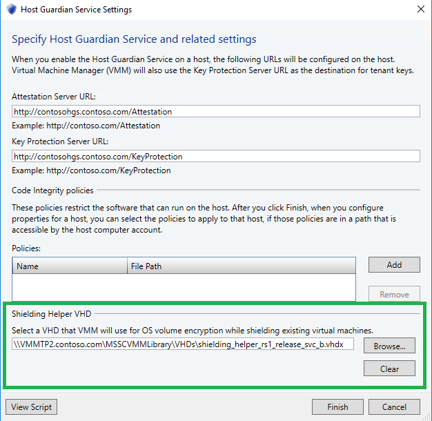

# Shielded VMs - Preparing a VM Shielding Helper VHD

>Applies to: Windows Server 2019, Windows Server (Semi-Annual Channel), Windows Server 2016

> [!IMPORTANT]
> Before beginning these procedures, ensure that you have installed the latest cumulative update for Windows Server 2016 or are using the latest Windows 10 [Remote Server Administration Tools](https://www.microsoft.com/en-us/download/details.aspx?id=45520). Otherwise, the procedures will not work. 

This section outlines steps performed by a hosting service provider to enable support for converting existing VMs to shielded VMs.

To understand how this topic fits in the overall process of deploying shielded VMs, see [Hosting service provider configuration steps for guarded hosts and shielded VMs](guarded-fabric-configuration-scenarios-for-shielded-vms-overview.md).

## Which VMs can be shielded?

The shielding process for existing VMs is only available for VMs that meet the following prerequisites:

- The guest OS is Windows Server 2012, 2012 R2, 2016, or a semi-annual channel release. Existing Linux VMs cannot be converted to shielded VMs.
- The VM is a generation 2 VM (UEFI firmware)
- The VM does not use differencing disks for its OS volume.

## Prepare Helper VHD

1.  On a machine with Hyper-V and the Remote Server Administration Tools feature **Shielded VM Tools** installed, create a new generation 2 VM with a blank VHDX and install Windows Server 2016 on it using the Windows Server ISO installation media. This VM should not be shielded and must run Server Core or Server with Desktop Experience.

    > [!IMPORTANT]
    > The VM Shielding Helper VHD **must not** be related to the template disks you created in [Hosting service provider creates a shielded VM template](guarded-fabric-create-a-shielded-vm-template.md). If you re-use a template disk, there will be a disk signature collision during the shielding process because both disks will have the same GPT disk identifier. You can avoid this by creating a new (blank) VHD and installing Windows Server 2016 onto it using your ISO installation media.

2.  Start the VM, complete any setup steps, and log into the desktop. Once you have verified the VM is in a working state, shut down the VM.

3.  In an elevated Windows PowerShell window, run the following command to prepare the VHDX created earlier to become a VM shielding helper disk. Update the path with the correct path for your environment.

    ```powershell
    Initialize-VMShieldingHelperVHD -Path 'C:\VHD\shieldingHelper.vhdx'
    ```

4.  Once the command has completed successfully, copy the VHDX to your VMM library share. **Do not** start up the VM from step 1 again. Doing so will corrupt the helper disk.

5.  You can now delete the VM from step 1 in Hyper-V.

## Configure VMM Host Guardian Server Settings

In the VMM Console, open the settings pane and then **Host Guardian Service Settings** under **General**. At the bottom of this window, there is a field to configure the location of your helper VHD. Use the browse button to select the VHD from your library share. If you do not see your disk in the share, you may need to manually refresh the library in VMM for it to show up.



## See also

- [Hosting service provider configuration steps for guarded hosts and shielded VMs](guarded-fabric-configuration-scenarios-for-shielded-vms-overview.md)
- [Guarded fabric and shielded VMs](guarded-fabric-and-shielded-vms-top-node.md)
