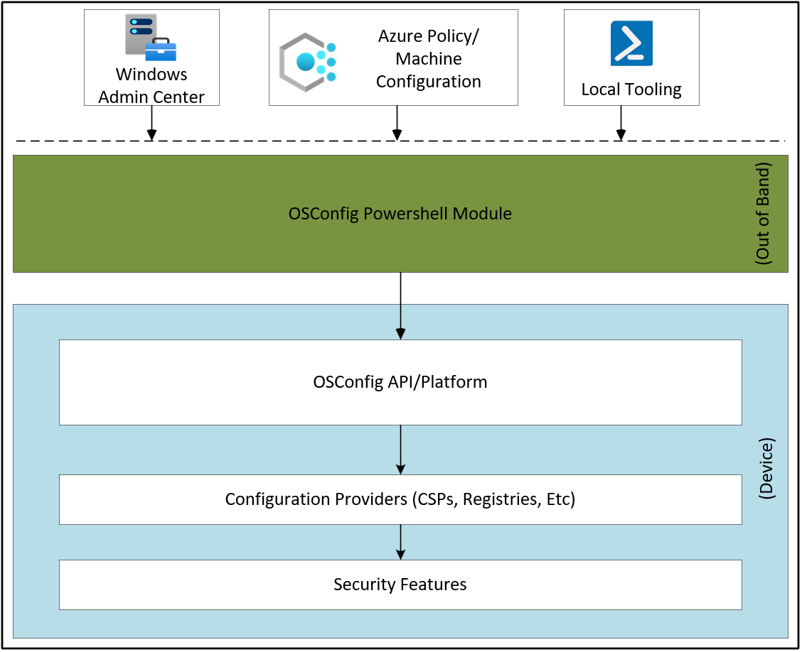

# OSConfig overview

OSConfig is a security configuration stack that uses scenarios to efficiently deliver and apply administrative intent for achieving the desired state of on-premises and Azure Arc-connected devices.

The OSConfig stack consists of base cmdlets, native APIs, and a scenario definition that defines the desired state configuration. The scenario definition is a data-driven description of configurations. The configurations are groups of settings that use name/value pairs with a predefined order and dependencies that correspond to subareas.

OSConfig is commonly released with the Windows Server operating system (OS) to provide an abstraction for local device configuration. Its object model design is data driven, which allows for mapping to various providers in the Windows OS for device configuration. The following diagram describes the OSConfig flow.

Currently, with OSConfig, you can establish security baselines for various Microsoft OSs, including Windows Server 2025 and Azure Local 2311.2 and later. It integrates with Azure Policy, Microsoft Defender, Windows Admin Center, and Azure Automanage machine configuration to facilitate monitoring and compliance reporting.

OSConfig enables improved mapping or even direct conversion with other preexisting management definitions. These definitions include `.admx` files in Group Policy, `.mof` files in Windows Management Instrumentation (WMI), and Device Description Framework (DDF) files in the configuration service provider (CSP).

## OSConfig drift control

One of the main features of OSConfig is *drift control*. It helps ensure that the system starts and remains in a known good security state. When you turn it on, OSConfig automatically corrects any system changes that deviate from the desired state. OSConfig makes the correction through a refresh task.

When you turn off the feature, the refresh task is also disabled. Users can then use other tools, with or without OSConfig, to modify the system. Each management tool can serve various purposes and be used by different actors, so multiple authorities can manage the same set of device settings. For instance, authorities can use Azure Policy for cloud or Azure Arc-enabled resources at scale, whereas they can use Windows Admin Center for local management.

To address multiple authorities, an orchestrator ensures deterministic configuration in an environment where multiple authorities use various IT admin tools. Under this model, each authority is assigned a precedence order. This precedence order doesn't just apply from a configuration perspective. It also ensures that drift control is allowed per authority and even per scenario document.

For users of cloud or Azure Arc-enabled resources, the precedence order is:

1. Cloud authority (Azure Policy)
1. Local authority (Windows Admin Center and Windows PowerShell)
1. Any other deployment tool

## OSConfig security baselines

With Windows Server, you can prioritize security from the outset by deploying a recommended security posture to your devices and virtual machines. Throughout the device life cycle, you can apply these security baselines by using PowerShell or Windows Admin Center.

Applying the OSConfig security baselines in your environment:

- Enhances the security posture by disabling legacy protocols and ciphers.
- Reduces operating expenses with the built-in drift protection mechanism that enables consistent at-scale monitoring via the Azure Arc Hybrid Edge baseline.
- Enables you to meet the [Center for Internet Security (CIS) Benchmarks](https://www.cisecurity.org/cis-benchmarks) and [Defense Information Systems Agency Security Technical Implementation Guides (DISA STIGs)](https://public.cyber.mil/stigs) requirements for the recommended OS security baseline.

### OSConfig security benefits

OSConfig is a single platform that:

- Applies security payloads to devices throughout their configuration life cycle, including security configuration, remediation, monitoring, reporting, and versioning.
- Provides a scalable, data-driven solution with a single, consistent implementation for several administrative tool sets, such as Windows Admin Center, Azure Arc, PowerShell, Azure Policy, and Azure Automanage machine configuration.
- Drives consistent results and enforces which authority takes precedence through the multiple-authority model.
- Supports orchestration directives that honor prerequisites and dependencies among settings.
- Enforces the desired state via configuration drift detection, reporting, and correction.
- Provides abstraction to allow extensibility models that support different configuration providers.

## Related content

- [Deploy OSConfig security baselines locally](osconfig-how-to-configure-security-baselines.md)

