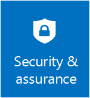

# Security and Assurance in Windows Server 

>Applies To: Windows Server (Semi-Annual Channel), Windows Server 2016

 You can rely on new layers of protection built into the operating system to further safeguard against security breaches. Help block malicious attacks and enhance the security of your virtual machines, applications, and data.
      

### [Windows Server 2016 Security Blog Post](https://blogs.technet.microsoft.com/windowsserver/2016/04/25/ten-reasons-youll-love-windows-server-2016-8-security/)
This blog post from the Windows Server security team highlights many of the improvements in Windows Servers 2016 that increase security for hosting and hybrid cloud environments.

### [Datacenter and Private Cloud Security Blog](https://blogs.technet.microsoft.com/datacentersecurity/)
This is the central blog site for technical content from the Microsoft Datacenter and Private Cloud Security team.                                    

### [Addressing emerging threats and landscape shifts](https://www.youtube.com/watch?v=B5JMYxYWx1k&feature=youtu.be)
In this 6-minute video, Anders Vinberg provides an overview of Microsoft's security and assurance strategy, and discusses industry trends and landscape shifts as they relate to security. He then focuses on Microsoft's key initiatives to protect workloads from the underlying fabric, and protect against direct attacks from privileged accounts. Finally, in case of breach, he explains how new detection and forensic capabilities can help better identify the threat.

### [Protecting Your Datacenter and Cloud from Emerging Threats blog post](http://blogs.technet.com/b/windowsserver/archive/2015/11/18/protecting-your-datacenter-and-cloud-november-update.aspx)
This blog post discusses how you can use Microsoft technologies to protect your datacenter and cloud investments from emerging threats.                   

### [Security and Assurance Overview session at Ignite](http://channel9.msdn.com/events/ignite/2015/brk2482)
This Ignite session addresses persistent threats, insider breaches, organized cybercrime, and securing the Microsoft Cloud Platform (on-premises and connected services with Azure). It includes scenarios for securing workloads, large enterprise tenants, and service providers.                                                                   

## Secure virtualization with Shielded VMs

### [Shielded VM in Channel 9](http://channel9.msdn.com/Shows/Mechanics/Introduction-to-Shielded-Virtual-Machines-in-Windows-Server-2016)
A walkthrough of Shielded VM technology and benefits                           

### [Shielded VM Demo](https://www.youtube.com/watch?v=xip5Qtk-7d8)
This 4-minute video describes the value of shielded VMs and the differences between a shielded VM and a non-shielded VM.                                   

### [Shielded Virtual Machines in Windows Server video walkthrough](http://microsoft-cloud.cloudguides.com/Guides/Shielded Virtual Machines in Windows Server.htm)
This video walkthrough shows how the Host Guardian Service enables shielded virtual machines so that sensitive data is protected from unauthorized access by Hyper-V host administrators.

### [Harden the Fabric: Protecting Tenant Secrets in Hyper-V (Ignite Video)](http://channel9.msdn.com/events/ignite/2015/brk3457)

This Ignite presentation discusses enhancements in Hyper-V, Virtual Machine Manager, and a new Guardian Server role to enable shielded VMs.                

### [Guarded Fabric Deployment Guide](http://go.microsoft.com/fwlink/?LinkId=708624)
This guide provides installation and validation information for Windows Server and System Center Virtual Machine Manager for Guarded Fabric Hosts and Shielded VMs.

### [Shielded VM and Guarded Fabric Operations Guide](http://go.microsoft.com/fwlink/?LinkId=708320)
This guide provides best practices and recommendations for how to configure your Shielded VM environment, including information specific to Guarded Hosts and tenants.

### [Shielded VM and Guarded Fabric Troubleshooting Guide](http://go.microsoft.com/fwlink/?LinkId=708321)
This guide provides information about how to resolve issues you may encounter in your Shielded VM environment.

### [Shielded VM Article](http://windowsitpro.com/hyper-v/super-secure-hyper-v-environments-shielded-vms-2016)
This white paper provides an overview of how shielded VMs provide increased overall security to prevent tampering.                                         

## Privileged Access Management
### [Securing Privileged Access](https://technet.microsoft.com/en-us/windows-server-docs/security/securing-privileged-access/securing-privileged-access)
A road-map for how you can secure your privileged access. This road-map is built based on the combined expertise of the server security team, Microsoft IT, Azure team and the Microsoft Consulting Services                           

### [Just in Time Administration with Microsoft Identity Manager](https://technet.microsoft.com/library/mt150258.aspx)
This article discusses features and capabilities included in Microsoft Identity Manager, including support for Just In Time (JIT) Privileged Access Management.                                                                    

### [Protecting Windows and Microsoft Azure Active Directory with Privileged Access Management](http://channel9.msdn.com/events/ignite/2015/brk3873)
This Ignite presentation covers Microsoft's strategy and investments in Windows Server, PowerShell, Active Directory, Identity Manager, and Azure Active Directory for addressing the risks of administrator access through stronger authentication, and managing access using Just in Time and Just Enough Administration (JEA).

### [Just Enough Administration Article](http://aka.ms/JEA)
This document shares the vision and technical details of Just Enough Administration, a PowerShell toolkit designed to help organizations reduce risk by restricting operators to the only access required to perform specific tasks.

### [Just Enough Administration demo video](https://www.youtube.com/watch?v=xnBrbkY9P20)
Just Enough Administration demo walk through                                                                                                                  
## Credential Protection

### [Protect derived domain credentials with Credential Guard](https://technet.microsoft.com/itpro/windows/keep-secure/credential-guard)
Credential Guard uses virtualization-based security to isolate secrets so that only privileged system software can access them. Unauthorized access to these secrets can lead to credential theft attacks, such as Pass-the-Hash or Pass-The-Ticket. Credential Guard prevents these attacks by protecting NTLM password hashes and Kerberos Ticket Granting Tickets.

### [Protect Remote Desktop credentials with Remote Credential Guard](https://technet.microsoft.com/itpro/windows/keep-secure/remote-credential-guard)
Remote Credential Guard helps you protect your credentials over a Remote Desktop connection by redirecting the Kerberos requests back to the device that's requesting the connection. It also provides single sign on experiences for Remote Desktop sessions.                                                                                                        |
### [Credential Guard demo video](https://www.youtube.com/watch?v=eUpKOGSl7yk)
This 5-minute video demos Credential Guard and Remote Credential Guard         

## Hardening the OS and applications
### [Device Guard Deployment Guide](https://technet.microsoft.com/itpro/windows/keep-secure/device-guard-deployment-guide)
Device Guard is a combination of enterprise-related hardware and software security features that, when configured together, will lock a device down so that it can only run trusted applications that you define in your code integrity.

### [Device Guard demo video](https://www.youtube.com/watch?v=F-pTkesjkhI)
This 7-minute video presents Device Guard and its usage on Windows Server 2016

### [Control Flow Guard](https://msdn.microsoft.com/en-us/library/windows/desktop/mt637065(v=vs.85).aspx)
Control Flow Guard provides built-in protection against some classes of memory corruption attacks.

### [Windows Defender](https://technet.microsoft.com/en-us/windows-server-docs/security/windows-defender/windows-defender-overview-windows-server)
Windows Defender provides active detection capabilities to block known malware. Windows Defender is turned on by default and is optimized to support the various server roles in Windows Server 2016.

##Detecting and Responding to Threats
### [Security Threat Analysis Using Microsoft Operations Management Suite](https://channel9.msdn.com/events/ignite/2015/brk3464)
This Ignite presentation discusses how you can use Operational Insights to perform security threat analysis.

### [Microsoft Operations Management Suite (OMS)](https://www.microsoft.com/en-us/server-cloud/operations-management-suite/overview.aspx)
The Microsoft Operations Management Suite (OMS) Security and Audit solution processes security logs and firewall events from on-premises and cloud environments to analyze and detect malicious behavior.

### [OMS and Windows Server](https://www.youtube.com/watch?v=_SaDw1dRy2k)
This 3-minute video shows how OMS can help detect potential malicious behavior that is blocked by Windows Server.  

### [Microsoft Advanced Threat Analytics](http://blogs.technet.com/b/ad/archive/2015/07/22/microsoft-advanced-threat-analytics-coming-next-month.aspx)
This blog post discusses Microsoft Advanced Threat Analytics, an on-premises product that uses Active Directory network traffic and SIEM data to discover and alert on potential threats.

### [Microsoft Advanced Threat Analytics](https://www.youtube.com/watch?v=0nA9FeTRZFw&list=PL8nfc9haGeb5IZGM8HvmRozetHRpBDKSw)
This 3-minute video presents an overview of how Microsoft is adding threat analytics capabilities in Windows Server.                                                                                 |

## Network Security

### [Datacenter Firewall Overview](https://technet.microsoft.com/library/dn920240.aspx)
This overview discusses Datacenter Firewall, a network layer, 5-tuple (protocol, source and destination port numbers, source and destination IP addresses), stateful, multitenant firewall.

### [What's New in DNS in Windows Server](https://technet.microsoft.com/en-us/windows-server-docs/networking/dns/what-s-new-in-dns-server)
This overview topic provides brief descriptions of new capabilities in DNS, along with links for more information.                                                                           

## Mapping security features to compliance regulations

Compliance is an important aspect of security features. We leave the expert advice on how to achieve your compliance and what compliance looks like to your trusted compliance advisers, but we also want to provide initial mapping for you to be able to use when evaluating Windows Server.

-   [Hyper-V Shielded VMs compliance mapping whitepaper](http://download.microsoft.com/download/6/D/0/6D06E149-B4C1-4EED-ACD5-DF6066E93CC0/Coalfire_Branded_Hyper_V_Shielded_VMs_Whitepaper_EN_US.pdf)

-   [JEA and JIT compliance mapping whitepaper](http://download.microsoft.com/download/2/7/A/27A2B5BB-6B52-4482-87C1-DA9D6B6D8C8D/Coalfire_Branded_Privileged_Identity_Manager_Whitepaper_EN_US.pdf)

-   [Device Guard compliance mapping whitepaper](http://download.microsoft.com/download/6/9/D/69D9E610-D23C-4F7E-A8CC-D65B87CEB4F8/Coalfire_Branded_Device_Guard_Whitepaper_EN_US.pdf)

-   [Credential Guard compliance mapping whitepaper](http://download.microsoft.com/download/8/1/2/812009C9-E4B8-4D4B-AADD-FDC373D0A076/Coalfire_Branded_Credential_Guard_Whitepaper_EN_US.pdf)

-   [Windows Defender compliance mapping whitepaper](http://download.microsoft.com/download/C/7/7/C778B7BB-0783-42D7-93A9-B86DFB5A7BAD/Coalfire_Branded_Windows_Defender_Whitepaper_EN_US.pdf)
