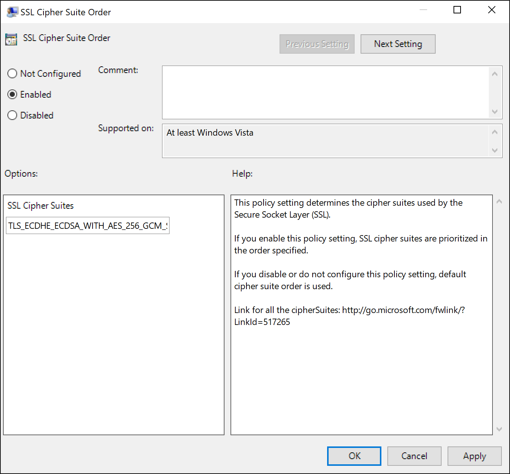
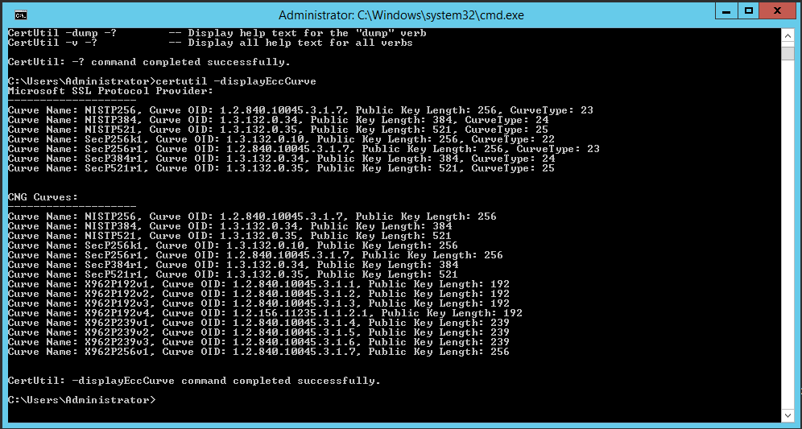
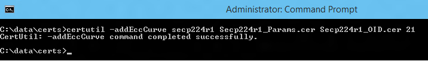
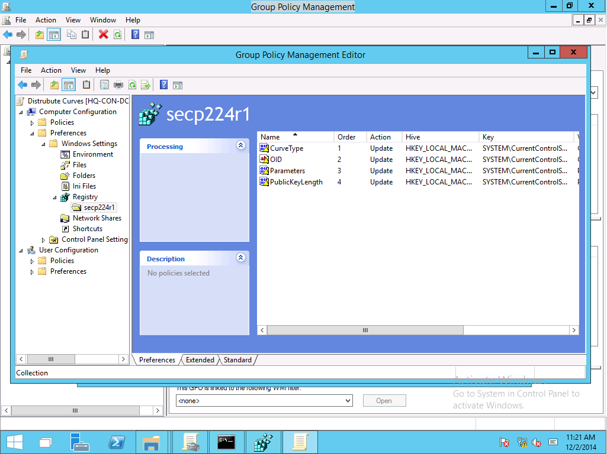
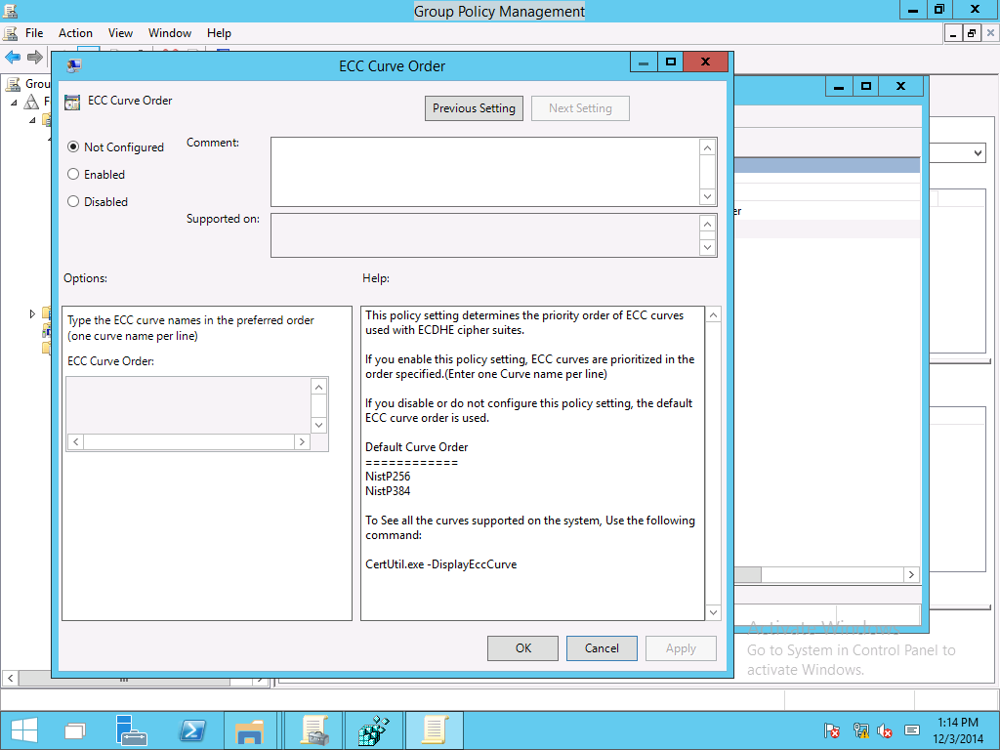

# Manage Transport Layer Security (TLS)

>Applies to: Windows Server (Semi-Annual Channel), Windows Server 2016, Windows 10

## Configuring TLS Cipher Suite Order

Different Windows versions support different TLS cipher suites and priority order. See [Cipher Suites in TLS/SSL (Schannel SSP)](https://msdn.microsoft.com/library/windows/desktop/aa374757.aspx) for the default order supported by the Microsoft Schannel Provider in different Windows versions.

> [!NOTE] 
> You can also modify the list of cipher suites by using CNG functions, see [Prioritizing Schannel Cipher Suites](https://msdn.microsoft.com/library/windows/desktop/bb870930.aspx) for details.

Changes to the TLS cipher suite order will take effect on the next boot. Until restart or shutdown, the existing order will be in effect.

> [!WARNING] 
> Updating the registry settings for the default priority ordering is not supported and may be reset with servicing updates. 

### Configuring TLS Cipher Suite Order by using Group Policy

You can use the SSL Cipher Suite Order Group Policy settings to configure the default TLS cipher suite order.

1. From the Group Policy Management Console, go to **Computer Configuration** > **Administrative Templates** > **Networks** > **SSL Configuration Settings**.
2. Double-click **SSL Cipher Suite Order**, and then click the **Enabled** option.
3. Right-click **SSL Cipher Suites** box and select **Select all** from the pop-up menu.

   

4. Right-click the selected text, and select **copy** from the pop-up menu.
5. Paste the text into a text editor such as notepad.exe and update with the new cipher suite order list.

   > [!NOTE]
   > The TLS cipher suite order list must be in strict comma delimited format. Each cipher suite string will end with a comma (,) to the right side of it. 
   > 
   > Additionally, the list of cipher suites is limited to 1,023 characters.

6. Replace the list in the **SSL Cipher Suites** with the updated ordered list.
7. Click **OK** or **Apply**.

### Configuring TLS Cipher Suite Order by using MDM

The Windows 10 Policy CSP supports configuration of the TLS Cipher Suites. See [Cryptography/TLSCipherSuites](https://msdn.microsoft.com/windows/hardware/commercialize/customize/mdm/policy-configuration-service-provider#cryptography-tlsciphersuites) for more information.

### Configuring TLS Cipher Suite Order by using TLS PowerShell Cmdlets

The TLS PowerShell module supports getting the ordered list of TLS cipher suites, disabling a cipher suite, and enabling a cipher suite. See [TLS Module](https://technet.microsoft.com/itpro/powershell/windows/tls/tls) for more information.

## Configuring TLS ECC Curve Order 

Beginning with Windows 10 & Windows Server 2016, ECC curve order can be configured independent of the cipher suite order. If the TLS cipher suite order list has elliptic curve suffixes, they will be overridden by the new elliptic curve priority order, when enabled. This allow organizations to use a Group Policy object to configure different versions of Windows with the same cipher suites order.

> [!NOTE]
> Prior to Windows 10, cipher suite strings were appended with the elliptic curve to determine the curve priority.

### Managing Windows ECC curves using CertUtil

Beginning with Windows 10 and Windows Server 2016, Windows provides elliptic curve parameter management through the command line utility certutil.exe. 
Elliptic curve parameters are stored in the bcryptprimitives.dll. Using certutil.exe, administrators can add and remove curve parameters to and from Windows, respectively. Certutil.exe stores the curve parameters securely in the registry. 
Windows can begin using the curve parameters by the name associated with the curve.    

#### Displaying Registered Curves

Use the following certutil.exe command to display a list of curves registered for the current computer.

```powershell
certutil.exe –displayEccCurve
```



*Figure 1 Certutil.exe output to display the list of registered curves.*

#### Adding a New Curve

Organizations can create and use curve parameters researched by other trusted entities.  
Administrators wanting to use these new curves in Windows must add the curve.  
Use the following certutil.exe command to add a curve to current computer:

```powershell
Certutil —addEccCurue curveName curveParameters [curveOID] [curveType]
```

- The **curveName** argument represents the name of the curve under which the curve parameters were added.
- The **curveParameters** argument represents the filename of a certificate that contains the parameters of the curves you want to add.
- The **curveOid** argument represents a filename of a certificate that contains the OID of the curve parameters you want to add (optional).
- The **curveType** argument represents a decimal value of the named curve from the [EC Named Curve Registry](http://www.iana.org/assignments/tls-parameters/tls-parameters.xhtml#tls-parameters-8) (optional).



*Figure 2 Adding a curve using certutil.exe.*

#### Removing a Previously Added Curve

Administrators can remove a previously added curve using the following certutil.exe command:

```powershell
Certutil.exe –deleteEccCurve curveName
```

Windows cannot use a named curve after an administrator removes the curve from computer.

## Managing Windows ECC curves using Group Policy

Organizations can distribute curve parameters to enterprise, domain-joined, computer using Group Policy and the Group Policy Preferences Registry extension.  
The process for distributing a curve is:

1.	On Windows 10 and Windows Server 2016, use **certutil.exe** to add a new registered named curve to Windows.
2.	From that same computer, Open the Group Policy Management Console (GPMC), create a new Group Policy object, and edit it.
3.	Navigate to **Computer Configuration|Preferences|Windows Settings|Registry**.  Right-click **Registry**. Hover over **New** and select **Collection Item**. Rename the collection item to match the name of the curve. You'll create one Registry Collection item for each registry key under *HKEY_LOCAL_MACHINE\CurrentControlSet\Control\Cryptography\ECCParameters*.
4.	Configure the newly created Group Policy Preference Registry Collection by adding a new **Registry Item** for each registry value listed under *HKEY_LOCAL_MACHINE\CurrentControlSet\Control\Cryptography\ECCParameters\[curveName]*.
5.	Deploy the Group Policy object containing Group Policy Registry Collection item to Windows 10 and Windows Server 2016 computers that should receive the new named curves.

    

    *Figure 3 Using Group Policy Preferences to distribute curves*

## Managing TLS ECC order

Beginning with Windows 10 and Windows Server 2016, ECC Curve Order group policy settings can be used configure the default TLS ECC Curve Order. 
Using Generic ECC and this setting, organizations can add their own trusted named curves (that are approved for use with TLS) to the operating system and then add those named curves to the curve priority Group Policy setting to ensure they are used in future TLS handshakes. 
New curve priority lists become active on the next reboot after receiving the policy settings.     



*Figure 4 Managing TLS curve priority using Group Policy*


