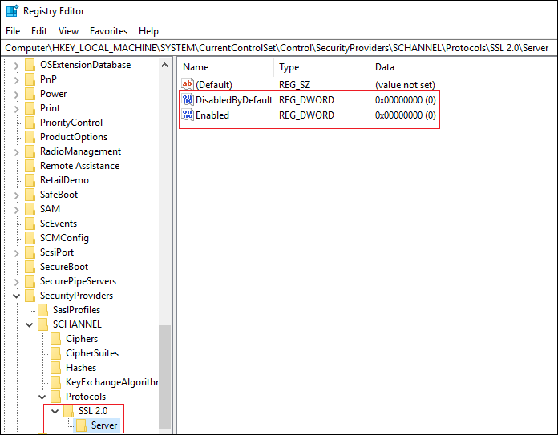
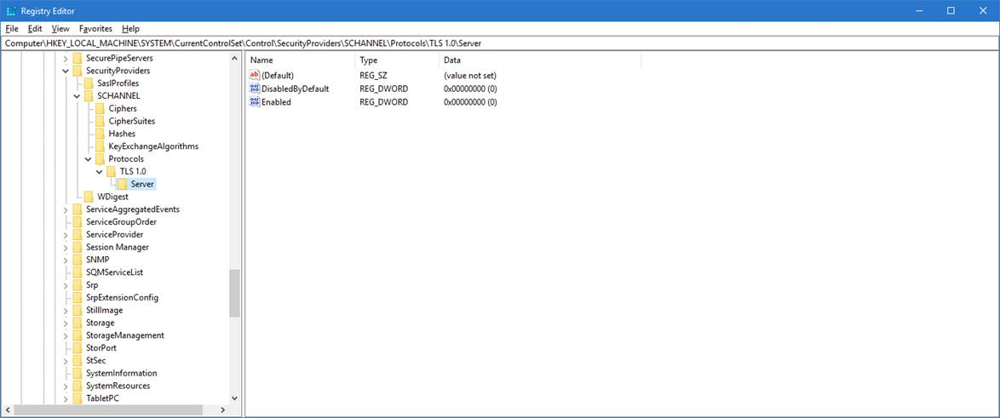
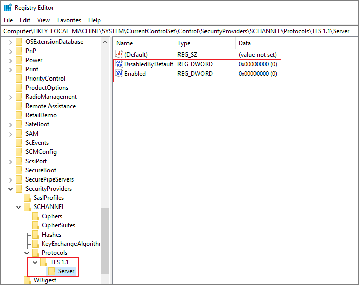
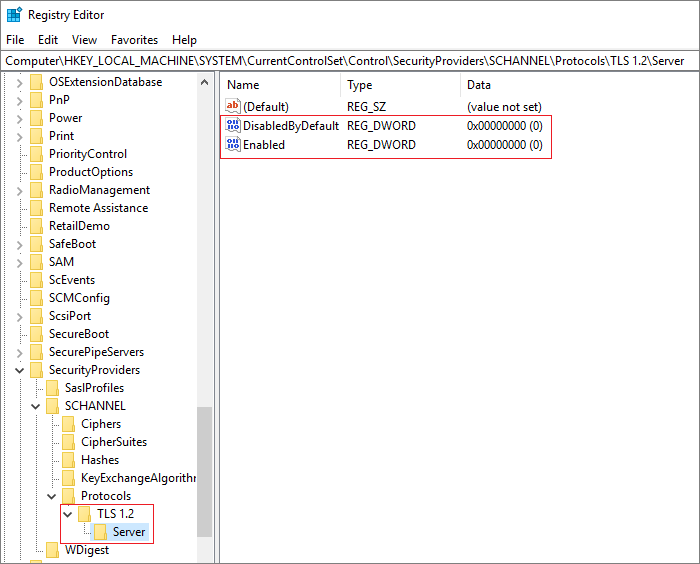
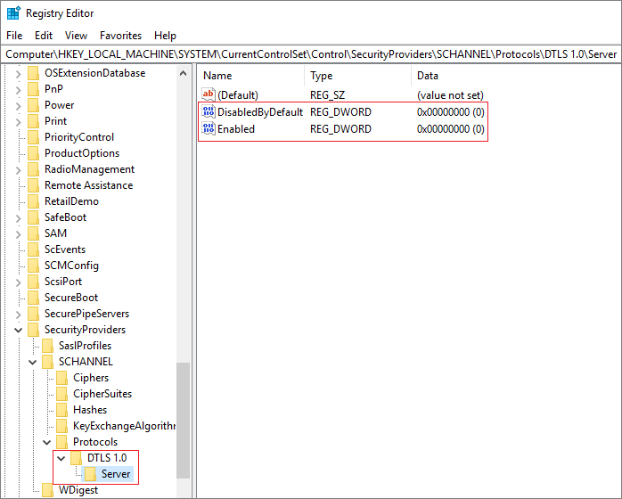
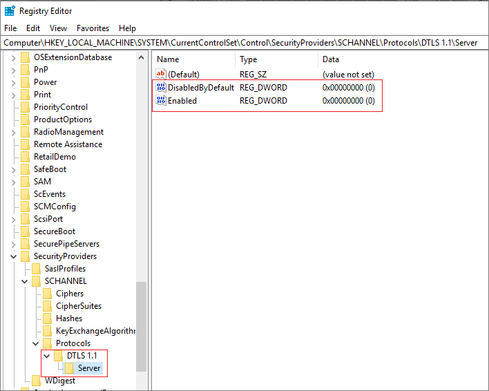

# Transport Layer Security (TLS) registry settings

>Applies to: Windows Server (Semi-Annual Channel), Windows Server 2019, Windows Server 2016, Windows 10

This reference topic for the IT professional contains supported registry setting information for the Windows implementation of the Transport Layer Security (TLS) protocol and the Secure Sockets Layer (SSL) protocol through the Schannel Security Support Provider (SSP). 
The registry subkeys and entries covered in this topic help you administer and troubleshoot the Schannel SSP, specifically the TLS and SSL protocols. 

> [!CAUTION]
> This information is provided as a reference to use when you are troubleshooting or verifying that the required settings are applied.
> We recommend that you do not directly edit the registry unless there is no other alternative.
> Modifications to the registry are not validated by the Registry Editor or by the Windows operating system before they are applied.
> As a result, incorrect values can be stored, and this can result in unrecoverable errors in the system.
> When possible, instead of editing the registry directly, use Group Policy or other Windows tools such as the Microsoft Management Console (MMC) to accomplish tasks.
> If you must edit the registry, use extreme caution.

## CertificateMappingMethods 

This entry does not exist in the registry by default. 
The default value is that all four certificate mapping methods, listed below, are supported.

When a server application requires client authentication, Schannel automatically attempts to map the certificate that is supplied by the client computer to a user account. 
You can authenticate users who sign in with a client certificate by creating mappings, which relate the certificate information to a Windows user account. 
After you create and enable a certificate mapping, each time a client presents a client certificate, your server application automatically associates that user with the appropriate Windows user account.

In most cases, a certificate is mapped to a user account in one of two ways: 

- A single certificate is mapped to a single user account (one-to-one mapping).
- Multiple certificates are mapped to one user account (many-to-one mapping).

By default, the Schannel provider will use the following four certificate mapping methods, listed in order of preference:

1. Kerberos service-for-user (S4U) certificate mapping
2. User principal name mapping
3. One-to-one mapping (also known as subject/issuer mapping)
4. Many-to-one mapping

Applicable versions: As designated in the **Applies To** list that is at the beginning of this topic.

Registry path: HKLM SYSTEM\CurrentControlSet\Control\SecurityProviders\SCHANNEL

## Ciphers

TLS/SSL ciphers should be controlled by configuring the cipher suite order. For details, see [Configuring TLS Cipher Suite Order](manage-tls.md#configuring-tls-cipher-suite-order).

For information about default cipher suites order that are used by the Schannel SSP, see [Cipher Suites in TLS/SSL (Schannel SSP)](https://msdn.microsoft.com/library/windows/desktop/aa374757.aspx). 

## CipherSuites

Configuring TLS/SSL cipher suites should be done using group policy, MDM or PowerShell, see [Configuring TLS Cipher Suite Order](manage-tls.md#configuring-tls-cipher-suite-order) for details.

For information about default cipher suites order that are used by the Schannel SSP, see [Cipher Suites in TLS/SSL (Schannel SSP)](https://msdn.microsoft.com/library/windows/desktop/aa374757.aspx). 

## ClientCacheTime

This entry controls the amount of time that the operating system takes in milliseconds to expire client-side cache entries. 
A value of 0 turns off secure-connection caching. 
This entry does not exist in the registry by default. 

The first time a client connects to a server through the Schannel SSP, a full TLS/SSL handshake is performed. 
When this is complete, the master secret, cipher suite, and certificates are stored in the session cache on the respective client and server.

Beginning with Windows Server 2008 and Windows Vista, the default client cache time is 10 hours.

Registry path: HKLM SYSTEM\CurrentControlSet\Control\SecurityProviders\SCHANNEL

Default client cache time

## EnableOcspStaplingForSni

Online Certificate Status Protocol (OCSP) stapling enables a web server, such as Internet Information Services (IIS), to provide the current revocation status of a server certificate when it sends the server certificate to a client during the TLS handshake. 
This feature reduces the load on OCSP servers because the web server can cache the current OCSP status of the server certificate and send it to multiple web clients. 
Without this feature, each web client would try to retrieve the current OCSP status of the server certificate from the OCSP server. 
This would generate a high load on that OCSP server. 

In addition to IIS, web services over http.sys can also benefit from this setting, including Active Directory Federation Services (AD FS) and Web Application Proxy (WAP). 

By default, OCSP support is enabled for IIS websites that have a simple secure (SSL/TLS) binding. 
However, this support is not enabled by default if the IIS website is using either or both of the following types of secure (SSL/TLS) bindings:
- Require Server Name Indication
- Use Centralized Certificate Store

In this case, the server hello response during the TLS handshake won't include an OCSP stapled status by default. 
This behavior improves performance: The Windows OCSP stapling implementation scales to hundreds of server certificates. 
Because SNI and CCS enable IIS to scale to thousands of websites that potentially have thousands of server certificates, setting this behavior to be enabled by default may cause performance issues.

Applicable versions: All versions beginning with Windows Server 2012 and Windows 8. 

Registry path: [HKEY_LOCAL_MACHINE\SYSTEM\CurrentControlSet\Control\SecurityProviders\SCHANNEL]

Add the following key:

"EnableOcspStaplingForSni"=dword:00000001

To disable, set the DWORD value to 0:

"EnableOcspStaplingForSni"=dword:00000000

> [!NOTE] 
> Enabling this registry key has a potential performance impact.

## FIPSAlgorithmPolicy

This entry controls Federal Information Processing (FIPS) compliance. 
The default is 0.

Applicable versions: All versions beginning with Windows Server 2012 and Windows 8. 

Registry path: HKLM SYSTEM\CurrentControlSet\Control\LSA

Windows Server FIPS cipher suites: See [Supported Cipher Suites and Protocols in the Schannel SSP](https://technet.microsoft.com/library/dn786419.aspx).

## Hashes

TLS/SSL hash algorithms should be controlled by configuring the cipher suite order. 
See [Configuring TLS Cipher Suite Order](manage-tls.md#configuring-tls-cipher-suite-order) for details.

## IssuerCacheSize

This entry controls the size of the issuer cache, and it is used with issuer mapping. 
The Schannel SSP attempts to map all of the issuers in the client’s certificate chain—not only the direct issuer of the client certificate. 
When the issuers do not map to an account, which is the typical case, the server might attempt to map the same issuer name repeatedly, hundreds of times per second. 

To prevent this, the server has a negative cache, so if an issuer name does not map to an account, it is added to the cache and the Schannel SSP will not attempt to map the issuer name again until the cache entry expires. 
This registry entry specifies the cache size. 
This entry does not exist in the registry by default. 
The default value is 100. 

Applicable versions: All versions beginning with Windows Server 2008 and Windows Vista.

Registry path: HKLM SYSTEM\CurrentControlSet\Control\SecurityProviders\SCHANNEL

## IssuerCacheTime

This entry controls the length of the cache timeout interval in milliseconds. 
The Schannel SSP attempts to map all of the issuers in the client’s certificate chain—not only the direct issuer of the client certificate. 
In the case where the issuers do not map to an account, which is the typical case, the server might attempt to map the same issuer name repeatedly, hundreds of times per second.

To prevent this, the server has a negative cache, so if an issuer name does not map to an account, it is added to the cache and the Schannel SSP will not attempt to map the issuer name again until the cache entry expires. 
This cache is kept for performance reasons, so that the system does not continue trying to map the same issuers. 
This entry does not exist in the registry by default. 
The default value is 10 minutes.

Applicable versions: All versions beginning with Windows Server 2008 and Windows Vista.

Registry path: HKLM SYSTEM\CurrentControlSet\Control\SecurityProviders\SCHANNEL

## KeyExchangeAlgorithm - Client RSA key sizes

This entry controls the client RSA key sizes. 

Use of key exchange algorithms should be controlled by configuring the cipher suite order.

Added in Windows 10, version 1507 and Windows Server 2016.

Registry path: HKLM\SYSTEM\CurrentControlSet\Control\SecurityProviders\SCHANNEL\KeyExchangeAlgorithms\PKCS

To specify a minimum supported range of RSA key bit length for the TLS client, create a **ClientMinKeyBitLength** entry. 
This entry does not exist in the registry by default. 
After you have created the entry, change the DWORD value to the desired bit length. 
If not configured, 1024 bits will be the minimum. 

To specify a maximum supported range of RSA key bit length for the TLS client, create a **ClientMaxKeyBitLength** entry. 
This entry does not exist in the registry by default. 
After you have created the entry, change the DWORD value to the desired bit length. 
If not configured, then a maximum is not enforced.

## KeyExchangeAlgorithm - Diffie-Hellman key sizes

This entry controls the Diffie-Hellman key sizes. 

Use of key exchange algorithms should be controlled by configuring the cipher suite order.

Added in Windows 10, version 1507 and Windows Server 2016.

Registry path: HKLM\SYSTEM\CurrentControlSet\Control\SecurityProviders\SCHANNEL\KeyExchangeAlgorithms\Diffie-Hellman

To specify a minimum supported range of Diffie-Helman key bit length for the TLS client, create a **ClientMinKeyBitLength** entry. 
This entry does not exist in the registry by default. 
After you have created the entry, change the DWORD value to the desired bit length. 
If not configured, 1024 bits will be the minimum. 
 
To specify a maximum supported range of Diffie-Helman key bit length for the TLS client, create a **ClientMaxKeyBitLength** entry. 
This entry does not exist in the registry by default. 
After you have created the entry, change the DWORD value to the desired bit length. 
If not configured, then a maximum is not enforced. 
 
To specify the Diffie-Helman key bit length for the TLS server default, create a **ServerMinKeyBitLength** entry. 
This entry does not exist in the registry by default. 
After you have created the entry, change the DWORD value to the desired bit length. 
If not configured, 2048 bits will be the default. 

## MaximumCacheSize

This entry controls the maximum number of cache elements. 
Setting MaximumCacheSize to 0 disables the server-side session cache and prevents reconnection. 
Increasing MaximumCacheSize above the default values causes Lsass.exe to consume additional memory. 
Each session-cache element typically requires 2 to 4 KB of memory. 
This entry does not exist in the registry by default. 
The default value is 20,000 elements. 

Applicable versions: All versions beginning with Windows Server 2008 and Windows Vista.

Registry path: HKLM SYSTEM\CurrentControlSet\Control\SecurityProviders\SCHANNEL

## Messaging – fragment parsing

________________________________________
This entry controls the maximum allowed size of fragmented TLS handshake messages that will be accepted. 
Messages larger than the allowed size will not be accepted and the TLS handshake will fail. 
These entries do not exist in the registry by default. 

When you set the value to 0x0, fragmented messages are not processed and will cause the TLS handshake to fail. 
This makes TLS clients or servers on the current machine non-compliant with the TLS RFCs. 

The maximum allowed size can be increased up to 2^24-1 bytes. 
Allowing a client or server to read and store large amounts of unverified data from the network is not a good idea and will consume additional memory for each security context. 

Added in Windows 7 and Windows Server 2008 R2.
An update that enables Internet Explorer in Windows XP, in Windows Vista, or in Windows Server 2008 to parse fragmented TLS/SSL handshake messages is available.

Registry path: HKLM\SYSTEM\CurrentControlSet\Control\SecurityProviders\SCHANNEL\Messaging

To specify a maximum allowed size of fragmented TLS handshake messages that the TLS client will accept, create a **MessageLimitClient** entry. 
After you have created the entry, change the DWORD value to the desired bit length. 
If not configured, the default value will be 0x8000 bytes. 

To specify a maximum allowed size of fragmented TLS handshake messages that the TLS server will accept when there is no client authentication, create a **MessageLimitServer** entry. 
After you have created the entry, change the DWORD value to the desired bit length. 
If not configured, the default value will be 0x4000 bytes. 

To specify a maximum allowed size of fragmented TLS handshake messages that the TLS server will accept when there is client authentication, create a **MessageLimitServerClientAuth** entry. 
After you have created the entry, change the DWORD value to the desired bit length. 
If not configured, the default value will be 0x8000 bytes. 

## SendTrustedIssuerList

This entry controls the flag that is used when the list of trusted issuers is sent. 
In the case of servers that trust hundreds of certification authorities for client authentication, there are too many issuers for the server to be able to send them all to the client computer when requesting client authentication. 
In this situation, this registry key can be set, and instead of sending a partial list, the Schannel SSP will not send any list to the client.

Not sending a list of trusted issuers might impact what the client sends when it is asked for a client certificate. 
For example, when Internet Explorer receives a request for client authentication, it only displays the client certificates that chain up to one of the certification authorities that is sent by the server. 
If the server did not send a list, Internet Explorer displays all of the client certificates that are installed on the client. 

This behavior might be desirable. 
For example, when PKI environments include cross certificates, the client and server certificates will not have the same root CA; therefore, Internet Explorer cannot chose a certificate that chains up to one of the server’s CAs. 
By configuring the server to not send a trusted issuer list, Internet Explorer will send all its certificates.

This entry does not exist in the registry by default.

Default Send Trusted Issuer List behavior

| Windows version | Time |
|-----------------|------|
| Windows Server 2012 and Windows 8 and later | FALSE |
| Windows Server 2008 R2 and Windows 7 and earlier | TRUE |

Applicable versions: All versions beginning with Windows Server 2008 and Windows Vista.

Registry path: HKLM SYSTEM\CurrentControlSet\Control\SecurityProviders\SCHANNEL

## ServerCacheTime

This entry controls the amount of time in milliseconds that the operating system takes to expire server-side cache entries. 
A value of 0 disables the server-side session cache and prevents reconnection. 
Increasing ServerCacheTime above the default values causes Lsass.exe to consume additional memory. 
Each session cache element typically requires 2 to 4 KB of memory. 
This entry does not exist in the registry by default. 

Applicable versions: All versions beginning with Windows Server 2008 and Windows Vista.

Registry path: HKLM SYSTEM\CurrentControlSet\Control\SecurityProviders\SCHANNEL

Default server cache time: 10 hours

## SSL 2.0

This subkey controls the use of SSL 2.0.

Beginning with Windows 10, version 1607 and Windows Server 2016, SSL 2.0 has been removed and is no longer supported.
For a SSL 2.0 default settings, see [Protocols in the TLS/SSL (Schannel SSP)](https://msdn.microsoft.com/library/windows/desktop/mt808159.aspx). 

Registry path: HKLM SYSTEM\CurrentControlSet\Control\SecurityProviders\SCHANNEL\Protocols

To enable the SSL 2.0 protocol, create an **Enabled** entry in either the Client or Server subkey, as described in the following table. 
This entry does not exist in the registry by default. 
After you have created the entry, change the DWORD value to 1. 

SSL 2.0 subkey table

| Subkey | Description |
|--------|-------------|
| Client | Controls the use of SSL 2.0 on the SSL client. |
| Server | Controls the use of SSL 2.0 on the SSL server. |

To disable SSL 2.0 for client or server, change the DWORD value to 0. 
If an SSPI app requests to use SSL 2.0, it will be denied. 

To disable SSL 2.0 by default, create a **DisabledByDefault** entry and change the DWORD value to 1. 
If an SSPI app explcitly requests to use SSL 2.0, it may be negotiated. 

The following example shows SSL 2.0 disabled in the registry:

## SSL 3.0

This subkey controls the use of SSL 3.0.

Beginning with Windows 10, version 1607 and Windows Server 2016, SSL 3.0 has been disabled by default. 
For SSL 3.0 default settings, see [Protocols in the TLS/SSL (Schannel SSP)](https://msdn.microsoft.com/library/windows/desktop/mt808159.aspx). 

Registry path: HKLM SYSTEM\CurrentControlSet\Control\SecurityProviders\SCHANNEL\Protocols

To enable the SSL 3.0 protocol, create an **Enabled** entry in either the Client or Server subkey, as described in the following table.  
This entry does not exist in the registry by default. 
After you have created the entry, change the DWORD value to 1. 

SSL 3.0 subkey table

| Subkey | Description |
|--------|-------------|
| Client | Controls the use of SSL 3.0 on the SSL client. |
| Server | Controls the use of SSL 3.0 on the SSL server. |

To disable SSL 3.0 for client or server, change the DWORD value to 0.
If an SSPI app requests to use SSL 3.0, it will be denied. 

To disable SSL 3.0 by default, create a **DisabledByDefault** entry and change the DWORD value to 1. 
If an SSPI app explicitly requests to use SSL 3.0, it may be negotiated. 

The following example shows SSL 3.0 disabled in the registry:

## TLS 1.0

This subkey controls the use of TLS 1.0.

For TLS 1.0 default settings, see [Protocols in the TLS/SSL (Schannel SSP)](https://msdn.microsoft.com/library/windows/desktop/mt808159.aspx).

Registry path: HKLM SYSTEM\CurrentControlSet\Control\SecurityProviders\SCHANNEL\Protocols

To enable the TLS 1.0 protocol, create an **Enabled** entry in either the Client or Server subkey as described in the following table. 
This entry does not exist in the registry by default. 
After you have created the entry, change the DWORD value to 1. 

TLS 1.0 subkey table

| Subkey | Description |
|--------|-------------|
| Client | Controls the use of TLS 1.0 on the TLS client. |
| Server | Controls the use of TLS 1.0 on the TLS server. |

To disable TLS 1.0 for client or server, change the DWORD value to 0.
If an SSPI app requests to use TLS 1.0, it will be denied. 

To disable TLS 1.0 by default, create a **DisabledByDefault** entry and change the DWORD value to 1. 
If an SSPI app explicitly requests to use TLS 1.0, it may be negotiated. 

The following example shows TLS 1.0 disabled in the registry:

## TLS 1.1

This subkey controls the use of TLS 1.1.

For TLS 1.1 default settings, see [Protocols in the TLS/SSL (Schannel SSP)](https://msdn.microsoft.com/library/windows/desktop/mt808159.aspx).

Registry path: HKLM SYSTEM\CurrentControlSet\Control\SecurityProviders\SCHANNEL\Protocols

To enable the TLS 1.1 protocol, create an **Enabled** entry in either the Client or Server subkey as described in the following table. 
This entry does not exist in the registry by default. 
After you have created the entry, change the DWORD value to 1. 

TLS 1.1 subkey table

| Subkey | Description |
|--------|-------------|
| Client | Controls the use of TLS 1.1 on the TLS client. |
| Server | Controls the use of TLS 1.1 on the TLS server. |

To disable TLS 1.1 for client or server, change the DWORD value to 0.
If an SSPI app requests to use TLS 1.1, it will be denied. 

To disable TLS 1.1 by default, create a **DisabledByDefault** entry and change the DWORD value to 1. 
If an SSPI app explicitly requests to use TLS 1.1, it may be negotiated. 

The following example shows TLS 1.1 disabled in the registry:

## TLS 1.2

This subkey controls the use of TLS 1.2.

For TLS 1.2 default settings, see [Protocols in the TLS/SSL (Schannel SSP)](https://msdn.microsoft.com/library/windows/desktop/mt808159.aspx).

Registry path: HKLM SYSTEM\CurrentControlSet\Control\SecurityProviders\SCHANNEL\Protocols

To enable the TLS 1.2 protocol, create an **Enabled** entry in either the Client or Server subkey as described in the following table. 
This entry does not exist in the registry by default. 
After you have created the entry, change the DWORD value to 1. 

TLS 1.2 subkey table

| Subkey | Description |
|--------|-------------|
| Client | Controls the use of TLS 1.2 on the TLS client. |
| Server | Controls the use of TLS 1.2 on the TLS server. |

To disable TLS 1.2 for client or server, change the DWORD value to 0.
If an SSPI app requests to use TLS 1.2, it will be denied. 

To disable TLS 1.2 by default, create a **DisabledByDefault** entry and change the DWORD value to 1. 
If an SSPI app explicitly requests to use TLS 1.2, it may be negotiated. 

The following example shows TLS 1.2 disabled in the registry:

## DTLS 1.0

This subkey controls the use of DTLS 1.0.

For DTLS 1.0 default settings, see [Protocols in the TLS/SSL (Schannel SSP)](https://msdn.microsoft.com/library/windows/desktop/mt808159.aspx).

Registry path: HKLM SYSTEM\CurrentControlSet\Control\SecurityProviders\SCHANNEL\Protocols

To enable the DTLS 1.0 protocol, create an **Enabled** entry in either the Client or Server subkey as described in the following table. 
This entry does not exist in the registry by default. 
After you have created the entry, change the DWORD value to 1. 

DTLS 1.0 subkey table

| Subkey | Description |
|--------|-------------|
| Client | Controls the use of DTLS 1.0 on the DTLS client. |
| Server | Controls the use of DTLS 1.0 on the DTLS server. |

To disable DTLS 1.0 for client or server, change the DWORD value to 0.
If an SSPI app requests to use DTLS 1.0, it will be denied. 

To disable DTLS 1.0 by default, create a **DisabledByDefault** entry and change the DWORD value to 1. 
If an SSPI app explicitly requests to use DTLS 1.0, it may be negotiated. 

The following example shows DTLS 1.0 disabled in the registry:

## DTLS 1.2

This subkey controls the use of DTLS 1.2.

For DTLS 1.2 default settings, see [Protocols in the TLS/SSL (Schannel SSP)](https://msdn.microsoft.com/library/windows/desktop/mt808159.aspx).

Registry path: HKLM SYSTEM\CurrentControlSet\Control\SecurityProviders\SCHANNEL\Protocols

To enable the DTLS 1.2 protocol, create an **Enabled** entry in either the Client or Server subkey as described in the following table. 
This entry does not exist in the registry by default. 
After you have created the entry, change the DWORD value to 1. 

DTLS 1.2 subkey table

| Subkey | Description |
|--------|-------------|
| Client | Controls the use of DTLS 1.2 on the DTLS client. |
| Server | Controls the use of DTLS 1.2 on the DTLS server. |

To disable DTLS 1.2 for client or server, change the DWORD value to 0.
If an SSPI app requests to use DTLS 1.0, it will be denied. 

To disable DTLS 1.2 by default, create a **DisabledByDefault** entry and change the DWORD value to 1. 
If an SSPI app explicitly requests to use DTLS 1.2, it may be negotiated. 

The following example shows DTLS 1.1 disabled in the registry:

