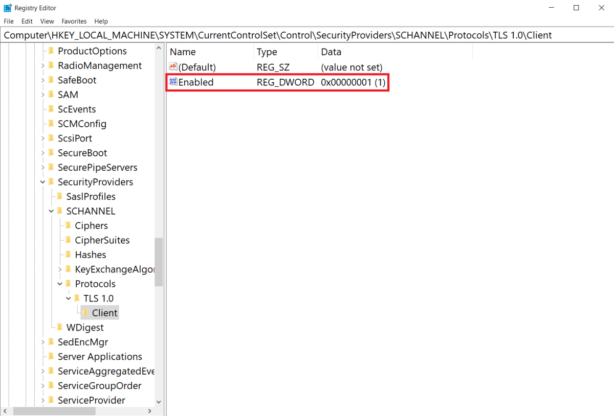

# Transport Layer Security (TLS) registry settings

> Applies to: Windows Server 2022, Windows Server 2019, Windows Server 2016, Windows 11, Windows 10, and earlier versions as noted

This article explains the supported registry setting information for the Windows implementation of the Transport Layer Security (TLS) protocol and the Secure Sockets Layer (SSL) protocol through the SChannel Security Support Provider (SSP). The registry subkeys and entries covered in this article help you administer and troubleshoot the SChannel SSP, specifically the TLS and SSL protocols.

> [!CAUTION]
> This information is provided as a reference to use when you are troubleshooting or verifying that the required settings are applied. We recommend that you do not directly edit the registry unless there is no other alternative. Modifications to the registry are not validated by the Registry Editor or by the Windows operating system before they are applied. As a result, incorrect values can be stored, and this can result in unrecoverable errors in the system. When possible, instead of editing the registry directly, use Group Policy or other Windows tools such as the Microsoft Management Console (MMC). If you must edit the registry, use extreme caution.

## SChannel logging

There are eight logging levels for SChannel events saved to the system event log and viewable using Event Viewer. This registry path is stored in **HKLM\SYSTEM\CurrentControlSet\Control\SecurityProviders\SCHANNEL** under the **EventLogging** key with a DWORD value set to **1**.

| Decimal or Hex | SChannel logging events |
|---|---|
|0|No events|
|1|Error events|
|2|Warning events|
|3|Error and Warning events|
|4|Informational and Success events|
|5|Error, Informational, and Success events|
|6|Warning, Informational, and Success events|
|7|Error, Warning, Informational and Success events|

> [!NOTE]
> You must reboot your device after changing the SChannel logging level.

## CertificateMappingMethods

When a server application requires client authentication, SChannel automatically attempts to map the certificate that is supplied by the client computer to a user account. You can authenticate users who sign in with a client certificate by creating mappings, which relate the certificate information to a Windows user account.

After you create and enable a certificate mapping, each time a client presents a client certificate, your server application automatically associates that user with the appropriate Windows user account.

In most cases, a certificate is mapped to a user account in one of two ways:

- A single certificate is mapped to a single user account (one-to-one mapping).
- Multiple certificates are mapped to one user account (many-to-one mapping).

The SChannel provider uses four (4) certificate mapping methods:

1. Kerberos service-for-user (S4U) mapping (**enabled by default**)
1. User principal name mapping
1. One-to-one mapping (also known as subject/issuer mapping)
1. Many-to-one mapping

Registry path: **HKLM SYSTEM\CurrentControlSet\Control\SecurityProviders\SCHANNEL**

|Entry name|DWORD|Enabled by default|
|--|--|--|
|Subject/Issuer|0x000000001|No|
|Issuer|0x000000002|No|
|UPN|0x000000004|No|
|S4U2Self|0x000000008|Yes|
|S4U2Self Explicit|0x000000010|Yes|

Applicable versions: As designated in the **Applies To** list at the beginning of this article.

## Ciphers

TLS/SSL ciphers should be controlled by configuring the cipher suite order. For details, see [Configuring TLS Cipher Suite Order](manage-tls.md#configuring-tls-cipher-suite-order).

For information about default cipher suite orders that are used by the SChannel SSP, see [Cipher Suites in TLS/SSL (SChannel SSP)](/windows/win32/secauthn/cipher-suites-in-schannel).

## CipherSuites

Configuring TLS/SSL cipher suites should be done using group policy, MDM or PowerShell, see [Configuring TLS Cipher Suite Order](manage-tls.md#configuring-tls-cipher-suite-order) for details.

For information about default cipher suite orders that are used by the SChannel SSP, see [Cipher Suites in TLS/SSL (SChannel SSP)](/windows/win32/secauthn/cipher-suites-in-schannel).

## ClientCacheTime

This entry specifies client TLS session cache item lifetime in milliseconds. Beginning with Windows Server 2008 and Windows Vista the default is 10 hours. A value of **0** turns off TLS session caching on the client.

The first time a client connects to a server through the SChannel SSP, a full TLS/SSL handshake is performed. When this is complete, the master secret, cipher suite, and certificates are stored in the session cache on the respective client and server.

Registry path: **HKLM SYSTEM\CurrentControlSet\Control\SecurityProviders\SCHANNEL**

## EnableOcspStaplingForSni

Online Certificate Status Protocol (OCSP) stapling enables a web server, such as Internet Information Services (IIS), to provide the current revocation status of a server certificate when it sends the server certificate to a client during the TLS handshake. This feature reduces the load on OCSP servers because the web server can cache the current OCSP status of the server certificate and send it to multiple web clients. Without this feature, each web client would try to retrieve the current OCSP status of the server certificate from the OCSP server. This would generate a high load on that OCSP server.

In addition to IIS, web services over http.sys can also benefit from this setting, including Active Directory Federation Services (AD FS) and Web Application Proxy (WAP).

By default, OCSP support is enabled for IIS websites that have a simple secure (SSL/TLS) binding. However, this support isn't enabled by default if the IIS website is using either or both of the following types of SSL/TLS bindings:

- Require Server Name Indication
- Use Centralized Certificate Store

In this case, the server hello response during the TLS handshake won't include an OCSP stapled status by default. This behavior improves performance: The Windows OCSP stapling implementation scales to hundreds of server certificates. However, Server Name Indication (SNI) and Central Certificate Store (CCS) enable IIS to scale to thousands of websites that potentially have thousands of server certificates, therefore enabling OCSP stapling for CCS bindings may cause performance issues.

Applicable versions: All versions beginning with Windows Server 2012 and Windows 8.

Registry path: **HKEY_LOCAL_MACHINE\SYSTEM\CurrentControlSet\Control\SecurityProviders\SCHANNEL**

Add the following key:

"EnableOcspStaplingForSni"=dword:00000001

To disable, set the DWORD value to 0:

"EnableOcspStaplingForSni"=dword:00000000

> [!NOTE]
> Enabling this registry key has potential performance impact.

## Hashes

TLS/SSL hash algorithms should be controlled by configuring the cipher suite order. See [Configuring TLS Cipher Suite Order](manage-tls.md#configuring-tls-cipher-suite-order) for details.

## IssuerCacheSize

This entry controls the size of the issuer cache, and it's used with issuer mapping. The SChannel SSP attempts to map all of the issuers in the client's certificate chain, not just the direct issuer of the client certificate. When the issuers don't map to an account, which is the typical case, the server might attempt to map the same issuer name repeatedly, hundreds of times per second.

To prevent this, the server has a negative cache, so if an issuer name doesn't map to an account, it's added to the cache and the SChannel SSP won't attempt to map the issuer name again until the cache entry expires. This registry entry specifies the cache size. This entry does **not** exist in the registry by default. The default value is **100**.

Applicable versions: All versions beginning with Windows Server 2008 and Windows Vista.

Registry path: **HKLM SYSTEM\CurrentControlSet\Control\SecurityProviders\SCHANNEL**

## IssuerCacheTime

This entry controls the length of the cache timeout interval in milliseconds. The SChannel SSP attempts to map all of the issuers in the client's certificate chain, not just the direct issuer of the client certificate. In the case where the issuers don't map to an account, which is the typical case, the server might attempt to map the same issuer name repeatedly, hundreds of times per second.

To prevent this, the server has a negative cache, so if an issuer name doesn't map to an account, it's added to the cache and the SChannel SSP won't attempt to map the issuer name again until the cache entry expires. This cache is kept for performance reasons, so that the system doesn't continue trying to map the same issuers. This entry doesn't exist in the registry by default. The default value is 10 minutes.

Applicable versions: All versions beginning with Windows Server 2008 and Windows Vista.

Registry path: **HKLM SYSTEM\CurrentControlSet\Control\SecurityProviders\SCHANNEL**

## KeyExchangeAlgorithm key sizes

These entries listed below may not exist in the registry by default and must be manually created. Use of key exchange algorithms should be controlled by configuring the cipher suite order.

# [Diffie-Hellman](#tab/diffie-hellman)

Added in Windows 10, version 1507 and Windows Server 2016.

Registry path: **HKLM\SYSTEM\CurrentControlSet\Control\SecurityProviders\SCHANNEL\KeyExchangeAlgorithms\Diffie-Hellman**

To specify a minimum supported range of Diffie-Hellman key bit length for the TLS client, create a **ClientMinKeyBitLength** entry. After you've created the entry, change the DWORD value to the desired bit length. If not configured, 1024 bits will be the minimum.

To specify a maximum supported range of Diffie-Hellman key bit length for the TLS client, create a **ClientMaxKeyBitLength** entry. After you've created the entry, change the DWORD value to the desired bit length.

To specify the Diffie-Hellman key bit length for the TLS server default, create a **ServerMinKeyBitLength** entry. After you've created the entry, change the DWORD value to the desired bit length. If not configured, 2048 bits is the default.

# [RSA](#tab/rsa)

Added in Windows 10, version 1507 and Windows Server 2016.

Registry path: **HKLM\SYSTEM\CurrentControlSet\Control\SecurityProviders\SCHANNEL\KeyExchangeAlgorithms\PKCS**

To specify a minimum supported range of RSA key bit length for the TLS client, create a **ClientMinKeyBitLength** entry. After you've created the entry, change the DWORD value to the desired bit length. If not configured, 1024 bits is the minimum.

To specify a maximum supported range of RSA key bit length for the TLS client, create a **ClientMaxKeyBitLength** entry. After you've created the entry, change the DWORD value to the desired bit length. On the server-side, the strength of the RSA key exchange is controlled by the specified server certificate.

---

> [!NOTE]
> Configured elliptic curves determine the cryptographic strength of the ECDHE key exchange. For more information, see [Manage Transport Layer Security (TLS)](manage-tls.md#configuring-tls-ecc-curve-order).

To learn more about TLS/SSL cipher suite cryptographic algorithms, see:

- [Cipher Suites in TLS/SSL (SChannel SSP)](/windows/win32/secauthn/cipher-suites-in-schannel)
- [Demystifying SChannel](https://techcommunity.microsoft.com/t5/core-infrastructure-and-security/demystifying-schannel/ba-p/259233) (blog)

## MaximumCacheSize

This entry controls the maximum number of TLS sessions to cache. Setting MaximumCacheSize to **0** disables the
server-side session cache to prevent session resumption. Increasing MaximumCacheSize above the
default values causes Lsass.exe to consume additional memory. Each session-cache element typically
requires 2 KB to 4 KB of memory. This entry doesn't exist in the registry by default. The default
value is 20,000 elements.

Applicable versions: All versions beginning with Windows Server 2008 and Windows Vista.

Registry path: **HKLM SYSTEM\CurrentControlSet\Control\SecurityProviders\SCHANNEL**

## Messaging – fragment parsing

This entry controls the maximum allowed size of a TLS handshake message that will be accepted. Messages larger than the allowed size won't be accepted and the TLS handshake will fail. These entries don't exist in the registry by default.

When you set the value to **0x0**, fragmented messages aren't processed and will cause the TLS handshake to fail. This makes TLS clients or servers on the current machine noncompliant with the TLS RFCs.

The maximum allowed size can be increased up to 2^16 bytes. Allowing a client or server to read and store large amounts of unverified data from the network isn't a good idea and will consume additional memory for each security context.

Added in Windows 7 and Windows Server 2008 R2: An update that enables Internet Explorer in Windows XP, in Windows Vista, or in Windows Server 2008 to parse fragmented TLS/SSL handshake messages is available.

Registry path: **HKLM\SYSTEM\CurrentControlSet\Control\SecurityProviders\SCHANNEL\Messaging**

To specify a maximum allowed size of fragmented TLS handshake messages that the TLS client will accept, create a **MessageLimitClient** entry. After you've created the entry, change the DWORD value to the desired bit length. If not configured, the default value is **0x8000** bytes.

To specify a maximum allowed size of fragmented TLS handshake messages that the TLS server will accept when there's no client authentication, create a **MessageLimitServer** entry. After you've created the entry, change the DWORD value to the desired bit length. If not configured, the default value is **0x4000** bytes.

To specify a maximum allowed size of fragmented TLS handshake messages that the TLS server will accept when there's client authentication, create a **MessageLimitServerClientAuth** entry. After you've created the entry, change the DWORD value to the desired bit length. If not configured, the default value is **0x8000** bytes.

## SendTrustedIssuerList

TLS servers may send a list of the distinguished names of acceptable certificate authorities when requesting client authentication. This may help TLS clients select an appropriate TLS client certificate. SChannel-based TLS servers don't send this trusted issuer list by default because it exposes the certificate authorities trusted by the server to passive observers and also increases the amount of data exchanged in the course of the TLS handshake. Setting this value to **1** causes SChannel-based servers to send their lists of trusted issuers.

Not sending a list of trusted issuers might impact what the client sends when it's asked for a client certificate. For example, when Internet Explorer receives a request for client authentication, it only displays the client certificates that chain up to one of the certification authorities that is sent by the server. If the server didn't send a list, Internet Explorer displays all of the client certificates that are installed on the client.

This behavior might be desirable. For example, when PKI environments include cross certificates, the client and server certificates won't have the same root CA; therefore, Internet Explorer cannot choose a certificate that chains up to one of the server's CAs. TLS clients may offer any available client certificate when a server does not send the trusted issuer list. This entry doesn't exist in the registry by default.

### Default Send Trusted Issuer List behavior

| Windows version | Default behavior |
|-----------------|------|
| Windows Server 2012, Windows 8 and later | FALSE |
| Windows Server 2008 R2, Windows 7, and earlier | TRUE |

Applicable versions: All versions beginning with Windows Server 2008 and Windows Vista.

Registry path: **HKLM SYSTEM\CurrentControlSet\Control\SecurityProviders\SCHANNEL**

## ServerCacheTime

This entry specifies server TLS session cache item lifetime in milliseconds. The default is 10 hours. A value of **0** turns off TLS session caching on the server and prevents session resumption. Increasing ServerCacheTime above the default values causes Lsass.exe to consume additional memory. Each session cache element typically requires 2 KB to 4 KB of memory. This entry doesn't exist in the registry by default.

Applicable versions: All versions beginning with Windows Server 2008 and Windows Vista.

Registry path: **HKLM SYSTEM\CurrentControlSet\Control\SecurityProviders\SCHANNEL**

Default server cache time: 10 hours

## TLS, DTLS, and SSL protocol version settings

SChannel SSP implements versions of the TLS, DTLS, and SSL protocols. Different Windows releases support different [protocol versions](/windows/win32/secauthn/protocols-in-tls-ssl--schannel-ssp-). The set of (D)TLS and SSL versions available system-wide can be restricted (but not expanded) by SSPI callers specifying the [SCH_CREDENTIALS](/windows/win32/api/schannel/ns-schannel-sch_credentials) structure in the [AcquireCredentialsHandle](/windows/win32/secauthn/acquirecredentialshandle--schannel) call. It's recommended that SSPI callers use the system defaults, rather than imposing protocol version restrictions.

A supported (D)TLS or SSL protocol version can exist in one of the following states:

- **Enabled**: Unless the SSPI caller explicitly disables this protocol version using [SCH_CREDENTIALS](/windows/win32/api/schannel/ns-schannel-sch_credentials) structure, SChannel SSP may negotiate this protocol version with a supporting peer.
- **Disabled**: SChannel SSP won't negotiate this protocol version regardless of the settings the SSPI caller may specify.

These registry values are configured separately for the protocol client and server roles under the registry subkeys named using the following format:

<SSL/TLS/DTLS> \<major version number\>.\<minor version number\>\<Client\Server>

These version-specific subkeys can be created under the following registry path:

**HKLM SYSTEM\CurrentControlSet\Control\SecurityProviders\SCHANNEL\Protocols**

For example, here are some valid registry paths with version-specific subkeys:

- **HKLM SYSTEM\CurrentControlSet\Control\SecurityProviders\SCHANNEL\Protocols\SSL 3.0\Client**

- **HKLM SYSTEM\CurrentControlSet\Control\SecurityProviders\SCHANNEL\Protocols\TLS 1.2\Server**

- **HKLM SYSTEM\CurrentControlSet\Control\SecurityProviders\SCHANNEL\Protocols\DTLS 1.2\Client**

In order to override a system default and set a supported (D)TLS or SSL protocol version to the **Enabled** state, create a DWORD registry value named "Enabled" with an entry value of "**1**" under the corresponding version-specific subkey.

The following example shows TLS 1.0 client set to the **Enabled** state:

In order to override a system default and set a supported (D)TLS or SSL protocol version to the **Disabled** state, change the DWORD registry value of "Enabled" to "**0**" under the corresponding version-specific subkey.

The following example shows DTLS 1.2 disabled in the registry:

Switching a (D)TLS or SSL protocol version to **Disabled** state may cause [AcquireCredentialsHandle](/windows/win32/secauthn/acquirecredentialshandle--schannel) calls to fail due to the lack of protocol versions enabled system-wide and at the same time allowed by particular SSPI callers. In addition, reducing the set of **Enabled** (D)TLS and SSL versions may break interoperability with remote peers.

Once the (D)TLS or SSL protocol version settings have been modified, they take effect on connections established using credential handles opened by subsequent [AcquireCredentialsHandle](/windows/win32/secauthn/acquirecredentialshandle--schannel) calls. (D)TLS and SSL client and server applications and services tend to reuse credential handles for multiple connections, for performance reasons. In order to get these applications to reacquire their credential handles, an application or service restart may be required.

These registry settings only apply to SChannel SSP and don't affect any third-party (D)TLS and SSL implementations that may be installed on the system.
