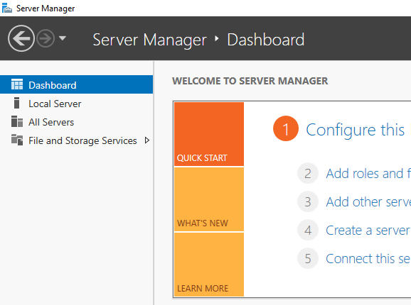
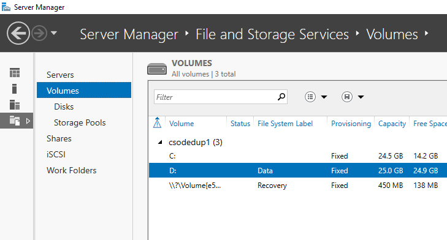
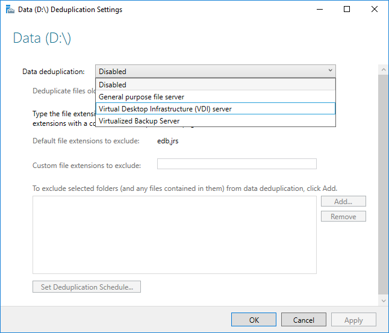

# Install and enable Data Deduplication
> Applies to Windows Server (Semi-Annual Channel), Windows Server 2016

This topic explains how to install [Data Deduplication](overview.md), evaluate workloads for deduplication, and enable Data Deduplication on specific volumes.

> [!Note]  
> If you're planning to run Data Deduplication in a Failover Cluster, every node in the cluster must have the Data Deduplication server role installed.

## <a id="install-dedup"></a>Install Data Deduplication
> [!Important]  
> [KB4025334](https://support.microsoft.com/kb/4025334) contains a roll up of fixes for Data Deduplication, including important reliability fixes, and we strongly recommend installing it when using Data Deduplication with Windows Server 2016.

### <a id="install-dedup-via-server-manager"></a>Install Data Deduplication by using Server Manager
1. In the Add Roles and Feature wizard, select **Server Roles**, and then select **Data Deduplication**.  

2. Click **Next** until the **Install** button is active, and then click **Install**.  


### <a id="install-dedup-via-powershell"></a>Install Data Deduplication by using PowerShell
To install Data Deduplication, run the following PowerShell command as an administrator:  
`Install-WindowsFeature -Name FS-Data-Deduplication`

To install Data Deduplication in a Nano Server installation:

1. Create a Nano Server installation with the Storage installed as described in [Getting Started with Nano Server](../../get-started/getting-started-with-nano-server.md).
2. From a server running Windows Server 2016 in any mode other than Nano Server, or from a Windows PC with the [Remote Server Administration Tools](https://www.microsoft.com/download/details.aspx?id=45520) (RSAT) installed, install Data Deduplication with an explicit reference to the Nano Server instance (replace 'MyNanoServer' with the real name of the Nano Server instance):  
	```PowerShell
	Install-WindowsFeature -ComputerName <MyNanoServer> -Name FS-Data-Deduplication
    ```  
	<br />
    <strong>-- OR --</strong>
	<br />
	Connect remotely to the Nano Server instance with PowerShell remoting and install Data Deduplication by using DISM:  
	
	```PowerShell
	Enter-PSSession -ComputerName MyNanoServer 
	dism /online /enable-feature /featurename:dedup-core /all
    ```

## <a id="enable-dedup"></a>Enable Data Deduplication
### <a id="enable-dedup-candidate-workloads"></a>Determine which workloads are candidates for Data Deduplication
Data Deduplication can effectively minimize the costs of a server application's data consumption by reducing the amount of disk space consumed by redundant data. Before enabling deduplication, it is important that you understand the characteristics of your workload to ensure that you get the maximum performance out of your storage. There are two classes of workloads to consider:

* *Recommended workloads* that have been proven to have both datasets that benefit highly from deduplication and have resource consumption patterns that are compatible with Data Deduplication's post-processing model. We recommend that you always [enable Data Deduplication](install-enable.md#enable-dedup-lights-on) on these workloads:
	* General purpose file servers (GPFS) serving shares such as team shares, user home folders, work folders, and software development shares.
	* Virtualized desktop infrastructure (VDI) servers.
	* Virtualized backup applications, such as [Microsoft Data Protection Manager (DPM)](https://technet.microsoft.com/library/hh758173.aspx).
* Workloads that might benefit from deduplication, but aren't always good candidates for deduplication. For example, the following workloads could work well with deduplication, but you should evaluate the benefits of deduplication first:
	* General purpose Hyper-V hosts
	* SQL servers
	* Line-of-business (LOB) servers

### <a id="enable-dedup-evaluating-sometimes-workloads"></a>Evaluate workloads for Data Deduplication
> [!Important]  
> If you are running a recommended workload, you can skip this section and go to [Enable Data Deduplication](install-enable.md#enable-dedup-lights-on) for your workload.

To determine whether a workload works well with deduplication, answer the following questions. If you're unsure about a workload, consider doing a pilot deployment of Data Deduplication on a test dataset for your workload to see how it performs.

1. **Does my workload's dataset have enough duplication to benefit from enabling deduplication?**  
	Before enabling Data Deduplication for a workload, investigate how much duplication your workload's dataset has by using the Data Deduplication Savings Evaluation tool, or DDPEval. After installing Data Deduplication, you can find this tool at `C:\Windows\System32\DDPEval.exe`. DDPEval can evaluate the potential for optimization against directly connected volumes (including local drives or Cluster Shared Volumes) and mapped or unmapped network shares.  
	&nbsp;   
	Running DDPEval.exe will return an output similar to the following:  
	&nbsp;  
	`Data Deduplication Savings Evaluation Tool`  
	`Copyright 2011-2012 Microsoft Corporation.  All Rights Reserved.`    
	&nbsp;   
	`Evaluated folder: E:\Test`     
	`Processed files: 34`  
	`Processed files size: 12.03MB`  
	`Optimized files size: 4.02MB`  
	`Space savings: 8.01MB`  
	`Space savings percent: 66`  
	`Optimized files size (no compression): 11.47MB`  
	`Space savings (no compression): 571.53KB`  
	`Space savings percent (no compression): 4`  
	`Files with duplication: 2`  
	`Files excluded by policy: 20`  
	`Files excluded by error: 0`  

2. **What do my workload's I/O patterns to its dataset look like? What performance do I have for my workload?**  
	 Data Deduplication optimizes files as a periodic job, rather than when the file is written to disk. As a result, it is important to examine is a workload's expected read patterns to the deduplicated volume. Because Data Deduplication moves file content into the Chunk Store and attempts to organize the Chunk Store by file as much as possible, read operations perform best when they are applied to sequential ranges of a file.  

	Database-like workloads typically have more random read patterns than sequential read patterns because databases do not typically guarantee that the database layout will be optimal for all possible queries that may be run. Because the sections of the Chunk Store may exist all over the volume, accessing data ranges in the Chunk Store for database queries may introduce additional latency. High performance workloads are particularly sensitive to this extra latency, but other database-like workloads might not be.

	> [!Note]  
	> These concerns primarily apply to storage workloads on volumes made up of traditional rotational storage media (also known as Hard Disk drives, or HDDs). All-flash storage infrastructure (also known as Solid State Disk drives, or SSDs), is less affected by random I/O patterns because one of the properties of flash media is equal access time to all locations on the media. Therefore, deduplication will not introduce the same amount of latency for reads to a workload's datasets stored on all-flash media as it would on traditional rotational storage media.

3. **What are the resource requirements of my workload on the server?**  
	Because Data Deduplication uses a post-processing model, Data Deduplication periodically needs to have sufficient system resources to complete its [optimization and other jobs](understand.md#job-info). This means that workloads that have idle time, such as in the evening or on weekends, are excellent candidates for deduplication, and workloads that run all day, every day may not be. Workloads that have no idle time may still be good candidates for deduplication if the workload does not have high resource requirements on the server.

### <a id="enable-dedup-lights-on"></a>Enable Data Deduplication
Before enabling Data Deduplication, you must choose the [Usage Type](understand.md#usage-type) that most closely resembles your workload. There are three Usage Types included with Data Deduplication.

* [Default](understand.md#usage-type-default) - tuned specifically for general purpose file servers
* [Hyper-V](understand.md#usage-type-hyperv) - tuned specifically for VDI servers
* [Backup](understand.md#usage-type-backup) - tuned specifically for virtualized backup applications, such as [Microsoft DPM](https://technet.microsoft.com/library/hh758173.aspx)

#### <a id="enable-dedup-via-server-manager"></a>Enable Data Deduplication by using Server Manager
1. Select **File and Storage Services** in Server Manager.  

2. Select **Volumes** from **File and Storage Services**.  

3. Right-click the desired volume and select **Configure Data Deduplication**.  

4. Select the desired **Usage Type** from the drop-down box and select **OK**.  

5. If you are running a recommended workload, you're done. For other workloads, see [Other considerations](#enable-dedup-sometimes-considerations).

> [!Note]  
> You can find more information on excluding file extensions or folders and selecting the deduplication schedule, including why you would want to do this, in [Configuring Data Deduplication](advanced-settings.md).

#### <a id="enable-dedup-via-powershell"></a>Enable Data Deduplication by using PowerShell
1. With an administrator context, run the following PowerShell command:  
	```PowerShell
	Enable-DedupVolume -Volume <Volume-Path> -UsageType <Selected-Usage-Type>
    ```

2. If you are running a recommended workload, you're done. For other workloads, see [Other considerations](#enable-dedup-sometimes-considerations).

> [!Note]  
> The Data Deduplication PowerShell cmdlets, including [`Enable-DedupVolume`](https://technet.microsoft.com/library/hh848441.aspx), can be run remotely by appending the `-CimSession` parameter with a CIM Session. This is particularly useful for running the Data Deduplication PowerShell cmdlets remotely against a Nano Server instance. To create a new CIM Session run [`New-CimSession`](https://technet.microsoft.com/library/jj590760.aspx).

#### <a id="enable-dedup-sometimes-considerations"></a>Other considerations
> [!Important]  
> If you are running a recommended workload, you can skip this section.

* Data Deduplication's Usage Types give sensible defaults for recommended workloads, but they also provide a good starting point for all workloads. For workloads other than the recommended workloads, it is possible to modify [Data Deduplication's advanced settings](advanced-settings.md) to improve deduplication performance.
* If your workload has high resource requirements on your server, the Data Deduplication jobs [should be scheduled to run during the expected idle times for that workload](advanced-settings.md#modifying-job-schedules-change-schedule). This is particularly important when running deduplication on a hyper-converged host, because running Data Deduplication during expected working hours can starve VMs.
* If your workload does not have high resource requirements, or if it is more important that optimization jobs complete than workload requests be served, [the memory, CPU, and priority of the Data Deduplication jobs can be adjusted](advanced-settings.md#modifying-job-schedules).

## <a id="faq"></a>Frequently asked questions (FAQ)
**I want to run Data Deduplication on the dataset for X workload. Is this supported?**  
Aside from workloads that are [known not to interoperate with Data Deduplication](interop.md), we fully support the data integrity of Data Deduplication with any workload. Recommended workloads are supported by Microsoft for performance as well. The performance of other workloads depends greatly on what they are doing on your server. You must determine what performance impacts Data Deduplication has on your workload, and if this is acceptable for this workload.

**What are the volume sizing requirements for deduplicated volumes?**  
In Windows Server 2012 and Windows Server 2012 R2, volumes had to be carefully sized to ensure that Data Deduplication could keep up with the churn on the volume. This typically meant that the average maximum size of a deduplicated volume for a high-churn workload was 1-2 TB, and the absolute maximum recommended size was 10 TB. In Windows Server 2016, these limitations were removed. For more information, see [What's new in Data Deduplication](whats-new.md#large-volume-support).

**Do I need to modify the schedule or other Data Deduplication settings for recommended workloads?**  
No, the provided [Usage Types](understand.md#usage-type) were created to provide reasonable defaults for recommended workloads.

**What are the memory requirements for Data Deduplication?**  
At a minimum, Data Deduplication should have 300 MB + 50 MB for each TB of logical data. For instance, if you are optimizing a 10 TB volume, you would need a minimum of 800 MB of memory allocated for deduplication (`300 MB + 50 MB * 10 = 300 MB + 500 MB = 800 MB`). While Data Deduplication can optimize a volume with this low amount of memory, having such constrained resources will slow down Data Deduplication's jobs.

Optimally, Data Deduplication should have 1 GB of memory for every 1 TB of logical data. For instance, if you are optimizing a 10 TB volume, you would optimally need 10 GB of memory allocated for Data Deduplication (`1 GB * 10`). This ratio will ensure the maximum performance for Data Deduplication jobs.

**What are the storage requirements for Data Deduplication?**  
In Windows Server 2016, Data Deduplication can support volume sizes up to 64 TB. For more information, view [What's new in Data Deduplication](whats-new.md#large-volume-support).
