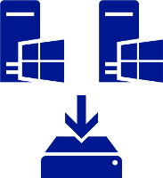

# Data Deduplication Overview

> Applies to: Windows Server 2019, Windows Server 2016, Windows Server (Semi-Annual Channel), 

## What is Data Deduplication?

Data Deduplication, often called Dedup for short, is a feature that can help reduce the impact of redundant data on storage costs. When enabled, Data Deduplication optimizes free space on a volume by examining the data on the volume by looking for duplicated portions on the volume. Duplicated portions of the volume's dataset are stored once and are (optionally) compressed for additional savings. Data Deduplication optimizes redundancies without compromising data fidelity or integrity. More information about how Data Deduplication works can be found in the '[How does Data Deduplication work?](understand.md#how-does-dedup-work)' section of the [Understanding Data Deduplication](understand.md) page.

> [!Important]  
> [KB4025334](https://support.microsoft.com/kb/4025334) contains a roll up of fixes for Data Deduplication, including important reliability fixes, and we strongly recommend installing it when using Data Deduplication with Windows Server 2016 and Windows Server 2019.

## Why is Data Deduplication useful?

Data Deduplication helps storage administrators reduce costs that are associated with duplicated data. Large datasets often have **<u>a lot</u>** of duplication, which increases the costs of storing the data. For example:

- User file shares may have many copies of the same or similar files.
- Virtualization guests might be almost identical from VM-to-VM.
- Backup snapshots might have minor differences from day to day.

The space savings that you can gain from Data Deduplication depend on the dataset or workload on the volume. Datasets that have high duplication could see optimization rates of up to 95%, or a 20x reduction in storage utilization. The following table highlights typical deduplication savings for various content types:

| Scenario       | Content                                        | Typical space savings |
|----------------|------------------------------------------------|-----------------------|
| User documents | Office documents, photos, music, videos, etc.  | 30-50%                |
| Deployment shares | Software binaries, cab files, symbols, etc. | 70-80%                |
| Virtualization libraries | ISOs, virtual hard disk files, etc.  | 80-95%                |
| General file share | All the above                           | 50-60%                |

## When can Data Deduplication be used?  
<table>
    <tbody>
        <tr>
            <td style="text-align:center;min-width:150px;vertical-align:center;"></td>
            <td style="vertical-align:top">
                <b>General purpose file servers</b> 
                General purpose file servers are general use file servers that might contain any of the following types of shares:
                <ul>
                    <li>Team shares</li>
                    <li>User home folders</li>
                    <li><a href="https://technet.microsoft.com/library/dn265974.aspx">Work Folders</a></li>
                    <li>Software development shares</li>
                </ul>
                General purpose file servers are a good candidate for Data Deduplication because multiple users tend to have many copies or versions of the same file. Software development shares benefit from Data Deduplication because many binaries remain essentially unchanged from build to build. 
            </td>
        </tr>
        <tr>
            <td style="text-align:center;min-width:150px;vertical-align:center;"></td>
            <td style="vertical-align:top">
                <b>Virtualized Desktop Infrastructure (VDI) deployments</b> 
                VDI servers, such as <a href="https://technet.microsoft.com/library/cc725560.aspx">Remote Desktop Services</a>, provide a lightweight option for organizations to provision desktops to users. There are many reasons for an organization to rely on such technology:
                <ul>
                    <li><b>Application deployment</b>: You can quickly deploy applications across your enterprise. This is especially useful when you have applications that are frequently updated, infrequently used, or difficult to manage.</li>
                    <li><b>Application consolidation</b>: When you install and run applications from a set of centrally managed virtual machines, you eliminate the need to update applications on client computers. This option also reduces the amount of network bandwidth that is required to access applications.</li>
                    <li><b>Remote access</b>: Users can access enterprise applications from devices such as home computers, kiosks, low-powered hardware, and operating systems other than Windows.</li>
                    <li><b>Branch office access</b>: VDI deployments can provide better application performance for branch office workers who need access to centralized data stores. Data-intensive applications sometimes do not have client/server protocols that are optimized for low-speed connections.</li>
                </ul>
                VDI deployments are great candidates for Data Deduplication because the virtual hard disks that drive the remote desktops for users are essentially identical. Additionally, Data Deduplication can help with the so-called <em>VDI boot storm</em>, which is the drop in storage performance when many users simultaneously sign in to their desktops to start the day.
            </td>
        </tr>
        <tr>
            <td style="text-align:center;min-width:150px;vertical-align:center;"></td>
            <td style="vertical-align:top">
                <b>Backup targets, such as virtualized backup applications</b> 
                Backup applications, such as <a href="https://technet.microsoft.com/library/hh758173.aspx">Microsoft Data Protection Manager (DPM)</a>, are excellent candidates for Data Deduplication because of the significant duplication between backup snapshots.
            </td>
        </tr>
        <tr>
            <td style="text-align:center;min-width:150px;vertical-align:center;"></td>
            <td style="vertical-align:top">
                <b>Other workloads</b> 
                <a href="install-enable.md#enable-dedup-candidate-workloads" data-raw-source="[Other workloads may also be excellent candidates for Data Deduplication](install-enable.md#enable-dedup-candidate-workloads)">Other workloads may also be excellent candidates for Data Deduplication</a>.
            </td>
        </tr>
    </tbody>
</table>
