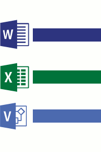
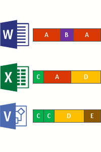
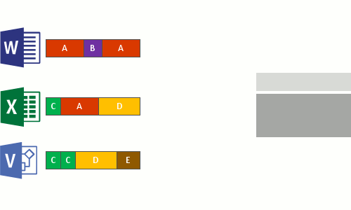
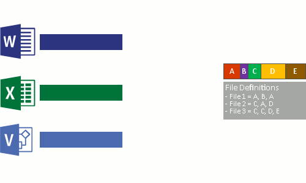

---
title:"Understanding Data Deduplication"  
description:"Learn how Data Deduplication (Dedup) works, including Dedup's job model and default settings."  
author:"wmgries"    
ms.author:"wgries"   
manager:"eldenc"  
ms.date:"08/19/2016"   
ms.topic:"get-started-article"  
ms.prod:"windows-server-threshold"  
ms.service:"na"  
ms.technology:
- techgroup-storage
- dedup
---

# Understanding Data Deduplication
> Applies to Windows Server 2016

This document describes how the [Data Deduplication](overview.md), or Dedup, works. 

## How does Data Deduplication work?
Data Deduplication in Windows Server was created with the following two principles:

1. **Optimization should not get in the way of writes to the disk**  
	This means that Dedup optimizes data using a post-processing model; all data is written unoptimized to the disk, and then optimized later by Dedup.

2. **Optimization should not change access semantics**
	This means that users and applications which access data on an optimized volume are completely unaware that the files they are accessing have been deduplicated. 

Once enabled for a volume, Data Deduplication runs in the background to identify repeated patterns across files on that volume and to seamlessly move those portions, or chunks, with special pointers called Reparse Points that point to a unique copy of that chunk. This occurs in the following four steps:

1. Scan file system for files eligible per policy for optimization.  
  
&nbsp;  
2. Break files into variable-size chunks.  

3. Identify unique chunks.  

4. Place chunks in the Dedup Chunk Store and optionally compress.  

5. Replace the original file stream of now optimized files with a Reparse Point to the Dedup Chunk Store.  

When optimized files are read, the file system hands off the files with a Dedup Reparse Point to the Dedup file system filter, which redirects the read operation to the appropriate chunks in the Dedup Chunk Store that constitute the stream for that file. If/when a modifications are made to ranges of a deduplicated file, those modifications get written unoptimized to the disk and are optimized by the by Dedup's [Optimization job](understanding-dedup.md#usage-type-optimization) the next time it runs.

## Usage Types
The following Usage Types provide reasonable Dedup configuration for common workloads:  
&nbsp;
<table style="padding-top:0px;margin-top:0px;margin-bottom:20px">
	<thread>
		<tr>
			<th style="min-width:125px">Usage Type</th>
			<th style="min-width:125px">Ideal Workloads</th>
			<th style="min-width:125px">What's Different</th>
		</tr>
	</thead>
	<tbody>
		<tr>
			<td>Default</th>
			<td>General purpose file server:<ul>
				<li>Team shares</li>
				<li>Work Folders</li>
				<li>Folder redirection</li>
				<li>Software development shares</li>
			</td>
			<td><ul>
				<li>Background Optimization</li>
				<li>Default optimization policy:<ul>
					<li>Minimum File Age = 3 days</li>
					<li>Optimize in-use files = No</li>
					<li>Optimize partial files = No</li>
				</ul></li></ul>
			</td>
		</tr>
		<tr>
			<td>Hyper-V</th>
			<td>Virtualized Desktop Infrastructure (VDI) servers</td>
			<td><ul>
				<li>Background Optimization</li>
				<li>Default optimization policy:<ul>
					<li>Minimum File Age = 3 days</li>
					<li>Optimize in-use files = Yes</li>
					<li>Optimize partial files = Yes</li>
				</ul></li>
				<li>"Under-the-hood" tweaks for Hyper-V interop</li></ul>
			</td>
		</tr>
		<tr>
			<td>Backup</th>
			<td>Virtualized Backup Applications, such as [Microsoft Data Protection Manager (DPM)](https://technet.microsoft.com/en-us/library/hh758173.aspx)</td>
			<td><ul>
				<li>Priority Optimization</li>
				<li>Default optimization policy:<ul>
					<li>Minimum File Age = 0 days</li>
					<li>Optimize in-use files = Yes</li>
					<li>Optimize partial files = No</li>
				</ul></li>
				<li>"Under-the-hood" tweaks for interop with DPM/DPM-like solutions</li></ul>
			</td>
		</tr>
	</tbody>
</table>

## Jobs
Dedup, uses a post-processing strategy to optimize and maintain a volume's space efficiency. 

<table style="padding-top:0px;margin-top:0px;margin-bottom:20px">
	<thead>
		<tr>
			<th style="min-width:125px">Job Name</th>
			<th style="min-width:125px">Job Description</th>
			<th style="min-width:125px;">Default Schedule</th>
		</tr>
	</thead>
	<tbody>
		<tr>
			<td>Optimization</td>
			<td>The **Optimization** job deduplicates by chunking data on a volume per the volume policy settings, (optionally) compressing those chunks, and storing chunks uniquely in the Dedup Chunk Store. The optimization process that Dedup uses is described in detail [here](understand.md#how-does-dedup-work).</td>	
			<td>Once every hour</td>
		</tr>
		<tr>
			<td>Garbage Collection</td>
			<td>The **Garbage Collection** job is responsible for reclaiming disk space by removing unnecessary chunks that are no longer being referenced by files that have been recently modified or deleted.</td>
			<td>Every Saturday at 2:35 am.</td>
		</tr>
		<tr>
			<td>Integrity Scrubbing</td>
			<td>The **Integrity Scrubbing** job is responsible for identifiying corruption in the Dedup chunk store due to disk failures or bad sectors. When possible, Dedup can automatically use volume features (such as mirror or parity on a Storage Spaces volume) to reconstruct the corrupted data. Additionally, Dedup keeps backup copies of popular chunks when they are referenced over 100 times in an area called the hotspot.</td>
			<td>Every Saturday at 3:35 am.</td>
		</tr>
		<tr>
			<td>Unoptimization</td>
			<td>The **Unoptimization** job is a special job that can only be run manually that undoes the optimization done by Dedup and disables Dedup for that volume.</td>
			<td>[On-demand only](run.md#disabling-dedup)</td>
		</tr>
	</tbody>
</table>

## Data Deduplication Terminology
<table>
	<thead>
		<tr>
			<th style="min-width:125px">Term</th>
			<th style="min-width:125px">Definition</th>
		</tr>
	</thead>
	<tbody>
		<tr>
			<td>Always Workload</td>
			<td>An always workload is a workload that benefits so greatly from and works so well with Dedup that you should always enable it. See 'Always' workloads on the [Installing and Enabling Data Deduplication](install-enable.md#enable-dedup-candidate-workloads) page.</td>
		</tr>
		<tr>
			<td>Chunk</td>
			<td>A chunk is a section of a file that has been selected by the Dedup chunking algorithm as likely to occur in other, similiar files.</td>
		</tr>
		<tr>
			<td>Chunk Store</td>
			<td>The Chunk Store is an organized series of container files in the System Volume Information folder that Dedup uses to uniquely store chunks.</td>
		</tr>
		<tr>
			<td>File Metadata</td>
			<td>Every file contains metadata that describe interesting properties about the file that are not related to the main content of the file. For instance, Date Created, Last Read Date, Author, etc.</td>
		</tr>
		<tr>
			<td>File Stream</td>
			<td>The File Stream is the main content of the file. This is the part of the file that Dedup optimizes.</td>
		</tr>
		<tr>
			<td>File System</td>
			<td>The File System is the software and on-disk data structure that allow the Operating System to store files on storage media. Dedup is supported on NTFS formatted volumes.</td>
		</tr>		
		<tr>
			<td>File System Filter</td>
			<td>A File System Filter is a plugin that modifies the default behavior of the File System. In order to preserve access semantics, Dedup uses a File System Filter (Dedup.sys) to redirect reads to optimized content completely transparently to the user/application making the read request.</td>
		</tr>
		<tr>
			<td>Optimization</td>
			<td>A file is considered optimized (or deduplicated) by Dedup if it has been chunked and its unique chunks have been stored in the Chunk Store.</td>
		</tr>
		<tr>
			<td>Optimization Policy</td>
			<td>The Optimization Policy specifies which files should be considered for Dedup. For example, files may be considered out-of-policy if they are brand new, open, in a certain path on the volume, or are of a certain file type.</td>
		</tr>
		<tr>
			<td>Reparse Point</td>
			<td>A Reparse Point is a special tag that notifies the File System to pass off IO to a specified File System Filter. When a file's file stream has been optimized, Dedup replaces the file stream with a Reparse Point, which allows Dedup to preserve the access semantics for that file. More information about Reparse Points can be found [here](https://msdn.microsoft.com/en-us/library/windows/desktop/aa365503.aspx).</td>
		</tr>
		<tr>
			<td>Sometimes Workload</td>
			<td>A sometimes workload is a workload that may benefit from Dedup, but should be evaluated for its fitness for Dedup to ensure that you get maximum optimization and performance out of your storage. See 'Sometimes' workloads on the [Installing and Enabling Data Deduplication](install-enable.md#enable-dedup-candidate-workloads)</td>
		</tr>
		<tr>
			<td>Volume</td>
			<td>A volume is a Windows construct for a logical storage drive that may span multiple physical storage devices across a one or more servers. Dedup is enabled on a volume by volume basis.</td>
		</tr>
		<tr>
			<td>Workload</td>
			<td>A workload is an application that runs on Windows Server. Example workloads include general purpose file server, Hyper-V, and SQL Server.</td>
		</tr>
	</tbody>
</table>

> [!Warning]  
> Unless instructed by authorized Microsoft Support Personnel, do not attempt to manually modify the Dedup Chunk Store. Doing so may result in data corruption and/or loss.

## Frequently Asked Questions
**How does Data Deduplication differ from other optimization products?**  
There are several important differences between Data Deduplication, and other common storage optimization products:

* *How does Data Deduplication differ from Single Instance Store?*  
	Single Instance Store, or SIS, was a predecessor technology to Dedup first introduced in Windows Storage Server 2008 R2. SIS optimized a volume by identifying files which were completely identical and replacing them with logical links to a single copy of a file stored in the SIS Common Store. Unlike SIS, Dedup can get space savings from files which are not identical but share many common patterns and from files which themselves contain many repeated patterns. SIS was deprecated in Windows Server 2012 R2 and removed in Windows Server 2016 in favor of Data Deduplication.

* *How does Data Deduplication differ from NTFS Compression?*  
	NTFS Compression is a feature of NTFS that can be optionally enabled at the volume level. With NTFS Compression, each individual file is optimized individually via compression at write-time. Unlike NTFS Compression, Dedup can get spacing savings across all the files on a volume. This is advantageous over NTFS Compression because files may have <u>both</u> internal duplication (which is addressed by NTFS Compression) and have similarities with other files on the volume (which is not addressed by NTFS Compression). Additionally, Dedup has a post-processing model, which means that new files (or modifications to existing files), will be written to disk unoptimized and will be optimized later on by Dedup.

* *How does Data Deduplication differ from archive file formats like zip, rar, 7z, cab, etc?*  
	Archive file formats like zip, rar, 7z, cab, etc perform compression over a specified set of files. Like Dedup, this means that both duplicated patterns within files and duplicated patterns across files are optimized, however this requires manual intervention, in the form of choosing which files should be included in the archive, and changes the access semantics, because now accessing a specific file within the archive means opening the archive, selecting the specific file desired, and decompressing that file for use. Dedup operates transparently to users and administrators, and requires no manual kick-off. Additionally, Dedup preserves access semantics - optimized files appear unchanged after optimization.

**Can I change the Dedup settings for my selected Usage Type?**  
Yes, although Dedup provides reasonable defaults for 'Always' workloads, you may still find it desirable to tweak Dedup settings to get the most out of your storage. Additionally, 'Sometimes' workloads will [require some tweaking to ensure that Dedup does not interfere with the workload](install-enable.md#enable-dedup-sometimes-considerations). More information about how to change Dedup Volume settings can be found [here](advanced-settings.md#modifying-volume-settings).

**Can I manually run a Dedup job?**  
Yes, all Dedup jobs may be run manually. This may be desirable if scheduled jobs did not run due to insufficient system resources or because of an error. Additionally, the Unoptimization job can only be run manually. More information about how to run Dedup jobs manually can be found [here](run.md).

**Can I monitor the historical outcomes of Dedup jobs?**  
Yes, all Dedup jobs make entries in the Windows Event Log. More information about how to interpret the events for Dedup can be found [here](run.md).

**Can I change the default schedules for the Dedup jobs on my system?**  
Yes, all schedules are configurable. Modifying the default Dedup schedules is particularly desirable for 'Sometimes' workloads to ensure that the Dedup jobs have time to finish and do not compete for resources with the workload. More information about how to change the Dedup schedules can be found [here](dedup-settings).