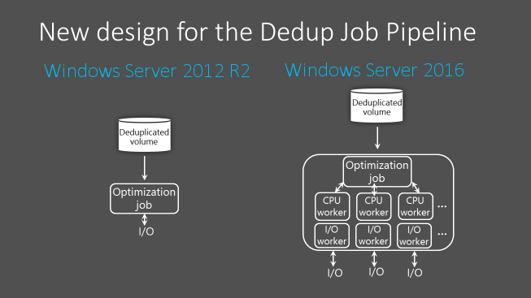

# What's New in Data Deduplication

> Applies to: Windows Server 2019, Windows Server 2016, Windows Server (Semi-Annual Channel)

[Data Deduplication](overview.md) in Windows Server has been optimized to be highly performant, flexible, and manageable at private cloud scale. For more information about the software-defined storage stack in Windows Server, please see [What's New in Storage in Windows Server](../whats-new-in-storage.md).

Data Deduplication has the following enhancements in Windows Server 2019:

| Functionality | New or updated | Description |
|---------------|----------------|-------------|
| ReFS support  | New            | Store up to 10X more data on the same volume with deduplication and compression for the ReFS filesystem. (It's [just one click](https://www.youtube.com/watch?v=PRibTacyKko&feature=youtu.be) to turn on with Windows Admin Center.) The variable-size chunk store with optional compression maximizes savings rates, while the multi-threaded post-processing architecture keeps performance impact minimal. Supports volumes up to 64 TB and will deduplicate the first 4 TB of each file.|

Data Deduplication has the following enhancements starting in Windows Server 2016:

| Functionality | New or updated | Description |
|---------------|----------------|-------------|
| [Support for large volumes](whats-new.md#large-volume-support) | Updated | Prior to Windows Server 2016, volumes had to be specifically sized for the expected churn, with volume sizes above 10 TB not being good candidates for deduplication. In Windows Server 2016, Data Deduplication supports volume sizes up to 64 TB. |
| [Support for large files](whats-new.md#large-file-support) | Updated | Prior to Windows Server 2016, files approaching 1 TB in size were not good candidates for deduplication. In Windows Server 2016, files up to 1 TB are fully supported. |
| [Support for Nano Server](whats-new.md#nano-server-support) | New | Data Deduplication is available and fully supported in the new Nano Server deployment option for Windows Server 2016. |
| [Simplified backup support](whats-new.md#simple-backup-support) | New | Windows Server 2012 R2 supported Virtualized  Backup Applications, such as Microsoft's [Data Protection Manager](https://technet.microsoft.com/library/hh758173.aspx), through a series of manual configuration steps. Windows Server 2016 has added a new default Usage Type (Backup) for seamless deployment of Data Deduplication for Virtualized Backup Applications.|
| [Support for Cluster OS Rolling Upgrade](whats-new.md#cluster-upgrade-support) | New | Data Deduplication fully supports the new [Cluster OS Rolling Upgrade](../..//failover-clustering/cluster-operating-system-rolling-upgrade.md) feature of Windows Server 2016. |

## Support for large volumes

**What value does this change add?**  
To get the best performance out of Data Deduplication in Windows Server 2012 R2, volumes must be sized properly to ensure that the Optimization job can keep up with the rate of data changes, or "churn." Typically, this means that Data Deduplication is only performant on volumes of 10 TB or less, depending on the workload's write patterns.

In Windows Server 2016, Data Deduplication is highly performant on volumes up to 64 TB.

**What works differently?**  
In Windows Server 2012 R2, the Data Deduplication Job Pipeline uses a single-thread and I/O queue for each volume. To ensure that the Optimization jobs do not fall behind, which would cause the overall savings rate for the volume to decrease, large datasets must be broken up into smaller volumes. The appropriate volume size depends on the expected churn for that volume. On average, the maximum is ~6-7 TB for high churn volumes and ~9-10 TB for low churn volumes.

In Windows Server 2016, the Data Deduplication Job pipeline has been redesigned to run multiple threads in parallel using multiple I/O queues for each volume. This results in performance that was previously only possible by dividing up data into multiple smaller volumes. This change is represented in the following image:

These optimizations apply to [all Data Deduplication Jobs](understand.md#job-info), not just the Optimization Job.

## Support for large files
**What value does this change add?**  
In Windows Server 2012 R2, very large files are not good candidates for Data Deduplication due to decreased performance of the Deduplication Processing Pipeline. In Windows Server 2016, deduplication of files up to 1 TB is very performant, enabling administrators to apply deduplication savings to a larger range of workloads. For example, you can deduplicate very large files normally associated with backup workloads.

**What works differently?**  
In Windows Server 2016, Data Deduplication makes use of new stream map structures and other "under- the hood" improvements to increase optimization throughput and access performance. Additionally, the Deduplication Processing Pipeline can now resume optimization after a failover rather than restarting. These changes make deduplication on files up to 1 TB highly performant.

## Support for Nano Server
**What value does this change add?**  
Nano Server is a new headless deployment option in Windows Server 2016 that requires a far smaller system resource footprint, starts up significantly faster, and requires fewer updates and restarts than the Windows Server Core deployment option. Data Deduplication is fully supported on Nano Server. For more information about Nano Server, see [Getting Started with Nano Server](../../get-started/getting-started-with-nano-server.md).

## <a name="simple-backup-support">Simplified configuration for Virtualized Backup Applications</a>
**What value does this change add?**  
Data Deduplication for Virtualized Backup Applications is a supported scenario in Windows Server 2012 R2, but it requires manually tuning of the deduplication settings. In Windows Server 2016, the configuration of Deduplication for Virtualized Backup Applications is drastically simplified. It uses a predefined Usage Type option when enabling Deduplication for a volume, just like our options for General Purpose File Server and VDI.

## <a name="cluster-upgrade-support">Support for Cluster OS Rolling Upgrade</a>
**What value does this change add?**  
Windows Server Failover Clusters running Data Deduplication can have a mix of nodes running Windows Server 2012 R2 versions of Data Deduplication alongside nodes running Windows Server 2016 versions of Data Deduplication. This enhancement provides full data access to all deduplicated volumes during a cluster rolling upgrade, allowing for the gradual rollout of the new version of Data Deduplication on an existing Windows Server 2012 R2 cluster without incurring downtime to upgrade all nodes at once.

**What works differently?** 
With previous versions of Windows Server, a Windows Server Failover Cluster required all nodes in the cluster to have the same Windows Server version. Starting with the Windows Server 2016, the cluster rolling upgrade functionality allows a cluster to run in a mixed-mode. Data Deduplication supports this new mixed-mode cluster configuration to enable full data access during a cluster rolling upgrade.
