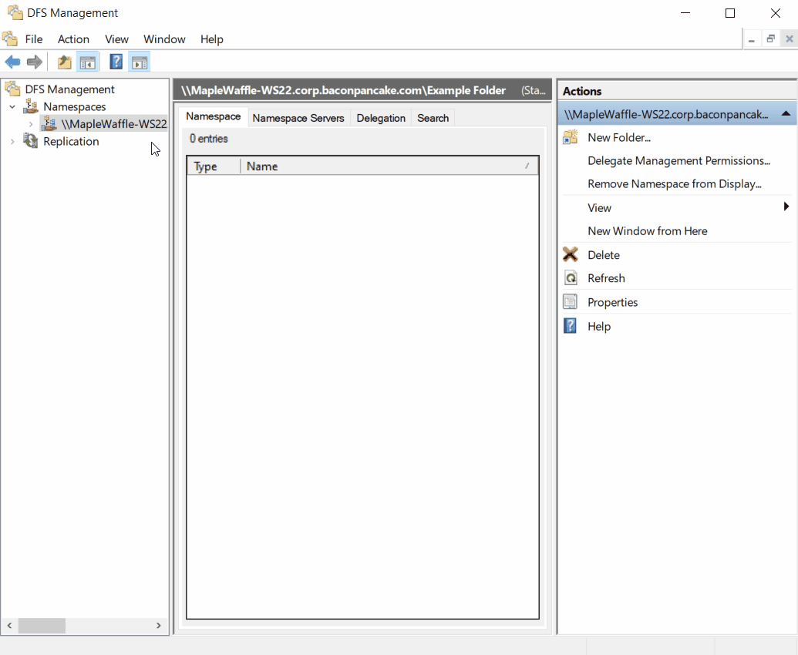

# Add folder targets

> Applies to: Windows Server 2022, Windows Server 2019, Windows Server 2016, Windows Server 2012 R2, Windows Server 2012, Windows Server 2008 R2, Windows Server 2008

A folder target is the Universal Naming Convention (UNC) path of a shared folder or another namespace that is associated with a folder in a namespace. Adding multiple folder targets increases the availability of the folder in the namespace.

## Prerequisites

The following must be installed to use this feature:

- A Windows Server with the **DFS Namespaces** role service installed as part of the **File and Storage Services** server role. To learn more, see [Install or Uninstall Roles, Role Services, or Features](/windows-server/administration/server-manager/install-or-uninstall-roles-role-services-or-features).
- An account with Administrative privileges.
- A server to host the DFS folder target.

## Add a folder target

To add a folder target by using DFS Management, perform the following:

1. Click **Start** > **Windows Administrative Tools** > select **DFS Management**.
 _Alternatively, click **Start** > type **dfsmgmt.msc** > hit_ <kbd>Enter</kbd>.
1. In the console tree, under the **Namespaces** node, right-click on the namespace where you want to add the folder, then select **New Folder**.
1. In the popup box, provide a name for this folder in the **Name** field, then click **Add**.
1. Type the path to the folder target, or click **Browse** to locate the folder target, click **OK**, then click **OK** again.

The following animation demonstrates the steps to add a folder target by using DFS Management.

If the folder is replicated using DFS Replication, you can specify whether to add the new folder target to the replication group.

> [!TIP]
> To add a folder target by using Windows PowerShell, use the [New-DfsnFolderTarget](/powershell/module/dfsn/new-dfsnfoldertarget) cmdlet. The DFSN Windows PowerShell module was introduced in Windows Server 2012.

> [!NOTE]
> Folders can contain folder targets or other DFS folders, but not both, at the same level in the folder hierarchy.

## Additional references

- [Deploying DFS Namespaces](deploying-dfs-namespaces.md)
- [Delegate Management Permissions for DFS Namespaces](delegate-management-permissions-for-dfs-namespaces.md)
- [Replicate Folder Targets Using DFS Replication](replicate-folder-targets-using-dfs-replication.md)
