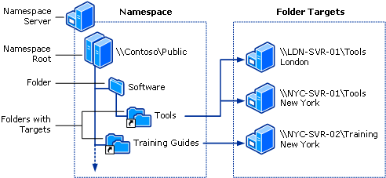

# DFS Namespaces overview

> Applies to: Windows Server 2019, Windows Server 2016, Windows Server 2012 R2, Windows Server 2012, Windows Server 2008 R2, Windows Server 2008, Windows Server (Semi-Annual Channel)

DFS Namespaces is a role service in Windows Server that enables you to group shared folders located on different servers into one or more logically structured namespaces. This makes it possible to give users a virtual view of shared folders, where a single path leads to files located on multiple servers, as shown in the following figure:



Here's a description of the elements that make up a DFS namespace:

- **Namespace server** - A namespace server hosts a namespace. The namespace server can be a member server or a domain controller.
- **Namespace root** - The namespace root is the starting point of the namespace. In the previous figure, the name of the root is Public, and the namespace path is \\\\Contoso\\Public. This type of namespace is a domain-based namespace because it begins with a domain name (for example, Contoso) and its metadata is stored in Active Directory Domain Services (AD DS). Although a single namespace server is shown in the previous figure, a domain-based namespace can be hosted on multiple namespace servers to increase the availability of the namespace.
- **Folder** - Folders without folder targets add structure and hierarchy to the namespace, and folders with folder targets provide users with actual content. When users browse a folder that has folder targets in the namespace, the client computer receives a referral that transparently redirects the client computer to one of the folder targets.
- **Folder targets** - A folder target is the UNC path of a shared folder or another namespace that is associated with a folder in a namespace. The folder target is where data and content is stored. In the previous figure, the folder named Tools has two folder targets, one in London and one in New York, and the folder named Training Guides has a single folder target in New York. A user who browses to \\\\Contoso\\Public\\Software\\Tools is transparently redirected to the shared folder \\\\LDN-SVR-01\\Tools or \\\\NYC-SVR-01\\Tools, depending on which site the user is currently located in.

This topic discusses how to install DFS, what’s new, and where to find evaluation and deployment information.

You can administer namespaces by using DFS Management, the [DFS Namespace (DFSN) Cmdlets in Windows PowerShell](https://docs.microsoft.com/powershell/module/dfsn/?view=win10-ps), the **DfsUtil** command, or scripts that call WMI.

## Server requirements and limits

There are no additional hardware or software requirements for running DFS Management or using DFS Namespaces.

A namespace server is a domain controller or member server that hosts a namespace. The number of namespaces you can host on a server is determined by the operating system running on the namespace server.

Servers that are running the following operating systems can host multiple domain-based namespaces in addition to a single stand-alone namespace. 

- Windows Server 2019
- Windows Server 2016
- Windows Server 2012 R2
- Windows Server 2012
- Windows Server 2008 R2 Datacenter and Enterprise Editions
- Windows Server (Semi-Annual Channel)

Servers that are running the following operating systems can host a single stand-alone namespace:

- Windows Server 2008 R2 Standard

The following table describes additional factors to consider when choosing servers to host a namespace.

| Server Hosting Stand-Alone Namespaces | Server Hosting Domain-Based Namespaces |
| ---                                   |        ---                                |
| Must contain an NTFS volume to host the namespace.|Must contain an NTFS volume to host the namespace. |
| Can be a member server or domain controller.|Must be a member server or domain controller in the domain in which the namespace is configured. (This requirement applies to every namespace server that hosts a given domain-based namespace.) |
| Can be hosted by a failover cluster to increase the availability of the namespace.|The namespace cannot be a clustered resource in a failover cluster. However, you can locate the namespace on a server that also functions as a node in a failover cluster if you configure the namespace to use only local resources on that server. |

## Installing DFS Namespaces

DFS Namespaces and DFS Replication are a part of the File and Storage Services role. The management tools for DFS (DFS Management, the DFS Namespaces module for Windows PowerShell, and command-line tools) are installed separately as part of the Remote Server Administration Tools.

Install DFS Namespaces by using [Windows Admin Center](../../manage/windows-admin-center/understand/windows-admin-center.md), Server Manager, or PowerShell, as described in the next sections.

### To install DFS by using Server Manager

1. Open Server Manager, click **Manage**, and then click **Add Roles and Features**. The Add Roles and Features Wizard appears.

2. On the **Server Selection** page, select the server or virtual hard disk (VHD) of an offline virtual machine on which you want to install DFS.

3. Select the role services and features that you want to install.

    - To install the DFS Namespaces service, on the **Server Roles** page, select **DFS Namespaces**.

    - To install only the DFS Management Tools, on the **Features** page, expand **Remote Server Administration Tools**, **Role Administration Tools**, expand **File Services Tools**, and then select **DFS Management Tools**.

         **DFS Management Tools** installs the DFS Management snap-in, the DFS Namespaces module for Windows PowerShell, and command-line tools, but it does not install any DFS services on the server.

### To install DFS by using Windows PowerShell

Open a Windows PowerShell session with elevated user rights, and then type the following command, where <name\> is the role service or feature that you want to install (see the following table for a list of relevant role service or feature names):

```PowerShell
Install-WindowsFeature <name>
```

| Role service or feature | Name |
| ----------------------- | ---- |
| DFS Namespaces          | `FS-DFS-Namespace` |
| DFS Management Tools    | `RSAT-DFS-Mgmt-Con` |

For example, to install the Distributed File System Tools portion of the Remote Server Administration Tools feature, type:

```PowerShell
Install-WindowsFeature "RSAT-DFS-Mgmt-Con"
```

To install the DFS Namespaces, and the Distributed File System Tools portions of the Remote Server Administration Tools feature, type:

```PowerShell
Install-WindowsFeature "FS-DFS-Namespace", "RSAT-DFS-Mgmt-Con"
```

## Interoperability with Azure virtual machines

Using DFS Namespaces on a virtual machine in Microsoft Azure has been tested; however, there are some limitations and requirements that you must follow.

- You can’t cluster stand-alone namespaces in Azure virtual machines.

- You can host domain-based namespaces in Azure virtual machines, including environments with Azure Active Directory.

To learn about how to get started with Azure virtual machines, see [Azure virtual machines documentation](https://docs.microsoft.com/azure/virtual-machines/).

## See also

For additional related information, see the following resources.

| Content type        | References |
| ------------------  | ----------------|
| **Product evaluation** | [What's New in DFS Namespaces and DFS Replication in Windows Server](https://technet.microsoft.com/library/dn281957(v=ws.11).aspx) |
| **Deployment**    | [DFS Namespace Scalability Considerations](http://blogs.technet.com/b/filecab/archive/2012/08/26/dfs-namespace-scalability-considerations.aspx) |
| **Operations**    | [DFS Namespaces: Frequently Asked Questions](https://technet.microsoft.com/library/ee404780.aspx) |
| **Community resources** | [The File Services and Storage TechNet Forum](https://social.technet.microsoft.com/forums/winserverfiles/threads/) |
| **Protocols**        | [File Services Protocols in Windows Server](https://msdn.microsoft.com/library/cc239318.aspx) (Deprecated) |
| **Related technologies** | [Failover Clustering](../../failover-clustering/failover-clustering-overview.md)|
| **Support** | [Windows IT Pro Support](https://www.microsoft.com/itpro/windows/support)|
