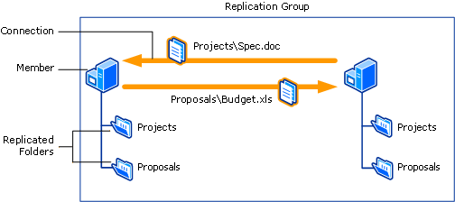

# DFS Replication overview

> Applies to: Windows Server 2019, Windows Server 2016, Windows Server 2012 R2, Windows Server 2012, Windows Server 2008 R2, Windows Server 2008, Windows Server (Semi-Annual Channel)

DFS Replication is a role service in Windows Server that enables you to efficiently replicate folders (including those referred to by a DFS namespace path) across multiple servers and sites. DFS Replication 
is an efficient, multiple-master replication engine that you can use to keep folders synchronized between servers across limited bandwidth network connections. It replaces the File Replication Service (FRS) as the replication engine for DFS Namespaces, as well as for replicating the Active Directory Domain Services (AD DS) SYSVOL folder in domains that use the Windows Server 2008 or later domain functional level.

DFS Replication uses a compression algorithm known as remote differential compression (RDC). RDC detects changes to the data in a file and enables DFS Replication to replicate only the changed file blocks instead of the entire file.

For more information about replicating SYSVOL using DFS Replication, see [Migrate the SYSVOL replication to DFS Replication](migrate-sysvol-to-dfsr.md).

To use DFS Replication, you must create replication groups and add replicated folders to the groups. Replication groups, replicated folders, and members are illustrated in the following figure.



This figure shows that a replication group is a set of servers, known as members, which participates in the replication of one or more replicated folders. A replicated folder is a folder that stays synchronized on each member. In the figure, there are two replicated folders: Projects and Proposals. As the data changes in each replicated folder, the changes are replicated across connections between the members of the replication group. The connections between all members form the replication topology.
Creating multiple replicated folders in a single replication group simplifies the process of deploying replicated folders because the topology, schedule, and bandwidth throttling for the replication group are applied to each replicated folder. To deploy additional replicated folders, you can use Dfsradmin.exe or a follow the instructions in a wizard to define the local path and permissions for the new replicated folder.

Each replicated folder has unique settings, such as file and subfolder filters, so that you can filter out different files and subfolders for each replicated folder.

The replicated folders stored on each member can be located on different volumes in the member, and the replicated folders do not need to be shared folders or part of a namespace. However, the DFS Management snap-in makes it easy to share replicated folders and optionally publish them in an existing namespace.

You can administer DFS Replication by using DFS Management, the DfsrAdmin and Dfsrdiag commands, or scripts that call WMI.

## Requirements

Before you can deploy DFS Replication, you must configure your servers as follows:

- Update the Active Directory Domain Services (AD DS) schema to include Windows Server 2003 R2 or later schema additions. You cannot use read-only replicated folders with the Windows Server 2003 R2 or older schema additions.
- Ensure that all servers in a replication group are located in the same forest. You cannot enable replication across servers in different forests.
- Install DFS Replication on all servers that will act as members of a replication group.
- Contact your antivirus software vendor to check that your antivirus software is compatible with DFS Replication.
- Locate any folders that you want to replicate on volumes formatted with the NTFS file system. DFS Replication does not support the Resilient File System (ReFS) or the FAT file system. DFS Replication also does not support replicating content stored on Cluster Shared Volumes.

## Interoperability with Azure virtual machines

Using DFS Replication on a virtual machine in Azure has been tested with Windows Server; however, there are some limitations and requirements that you must follow.

- Using snapshots or saved states to restore a server running DFS Replication for replication of anything other than the SYSVOL folder causes DFS Replication to fail, which requires special database recovery steps. Similarly, don’t export, clone, or copy the virtual machines. For more information, see article [2517913](http://support.microsoft.com/kb/2517913) in the Microsoft Knowledge Base, as well as [Safely Virtualizing DFSR](https://blogs.technet.microsoft.com/filecab/2013/04/05/safely-virtualizing-dfsr/).
- When backing up data in a replicated folder hosed in a virtual machine, you must use backup software from within the guest virtual machine.
- DFS Replication requires access to physical or virtualized domain controllers – it can’t communicate directly with Azure AD.
- DFS Replication requires a VPN connection between your on premise replication group members and any members hosted in Azure VMs. You also need to configure the on premise router (such as Forefront Threat Management Gateway) to allow the RPC Endpoint Mapper (port 135) and a randomly assigned port between 49152 and 65535 to pass over the VPN connection. You can use the Set-DfsrMachineConfiguration cmdlet or the Dfsrdiag command line tool to specify a static port instead of the random port. For more information about how to specify a static port for DFS Replication, see [Set-DfsrServiceConfiguration](https://docs.microsoft.com/powershell/module/dfsr/set-dfsrserviceconfiguration). For information about related ports to open for managing Windows Server, see article [832017](http://support.microsoft.com/kb/832017) in the Microsoft Knowledge Base.

To learn about how to get started with Azure virtual machines, visit the [Microsoft Azure web site](https://docs.microsoft.com/azure/virtual-machines/).

## Installing DFS Replication

DFS Replication is a part of the File and Storage Services role. The management tools for DFS (DFS Management, the DFS Replication module for Windows PowerShell, and command-line tools) are installed separately as part of the Remote Server Administration Tools.

Install DFS Replication by using [Windows Admin Center](../../manage/windows-admin-center/understand/windows-admin-center.md), Server Manager, or PowerShell, as described in the next sections.

### To install DFS by using Server Manager

1. Open Server Manager, click **Manage**, and then click **Add Roles and Features**. The Add Roles and Features Wizard appears.

2. On the **Server Selection** page, select the server or virtual hard disk (VHD) of an offline virtual machine on which you want to install DFS.

3. Select the role services and features that you want to install.

    - To install the DFS Replication service, on the **Server Roles** page, select **DFS Replication**.

    - To install only the DFS Management Tools, on the **Features** page, expand **Remote Server Administration Tools**, **Role Administration Tools**, expand **File Services Tools**, and then select **DFS Management Tools**.

         **DFS Management Tools** installs the DFS Management snap-in, the DFS Replication and DFS Namespaces modules for Windows PowerShell, and command-line tools, but it does not install any DFS services on the server.

### To install DFS Replication by using Windows PowerShell

Open a Windows PowerShell session with elevated user rights, and then type the following command, where <name\> is the role service or feature that you want to install (see the following table for a list of relevant role service or feature names):

```PowerShell
Install-WindowsFeature <name>
```

|Role service or feature|Name|
|---|---|
|DFS Replication|`FS-DFS-Replication`|
|DFS Management Tools|`RSAT-DFS-Mgmt-Con`|

For example, to install the Distributed File System Tools portion of the Remote Server Administration Tools feature, type:

```PowerShell
Install-WindowsFeature "RSAT-DFS-Mgmt-Con"
```

To install the DFS Replication, and the Distributed File System Tools portions of the Remote Server Administration Tools feature, type:

```PowerShell
Install-WindowsFeature "FS-DFS-Replication", "RSAT-DFS-Mgmt-Con"
```

## See also

- [DFS Namespaces and DFS Replication overview](https://docs.microsoft.com/previous-versions/windows/it-pro/windows-server-2012-R2-and-2012/jj127250(v%3dws.11))
- [Checklist: Deploy DFS Replication](https://docs.microsoft.com/previous-versions/windows/it-pro/windows-server-2008-R2-and-2008/cc772201(v%3dws.11))
- [Checklist: Manage DFS Replication](https://docs.microsoft.com/previous-versions/windows/it-pro/windows-server-2008-R2-and-2008/cc755035(v%3dws.11))
- [Deploying DFS Replication](https://docs.microsoft.com/previous-versions/windows/it-pro/windows-server-2008-R2-and-2008/cc770925(v%3dws.11))
- [Managing DFS Replication](https://docs.microsoft.com/previous-versions/windows/it-pro/windows-server-2008-R2-and-2008/cc770925(v%3dws.11))
- [Troubleshooting DFS Replication](https://docs.microsoft.com/previous-versions/windows/it-pro/windows-server-2008-R2-and-2008/cc732802(v%3dws.11))
