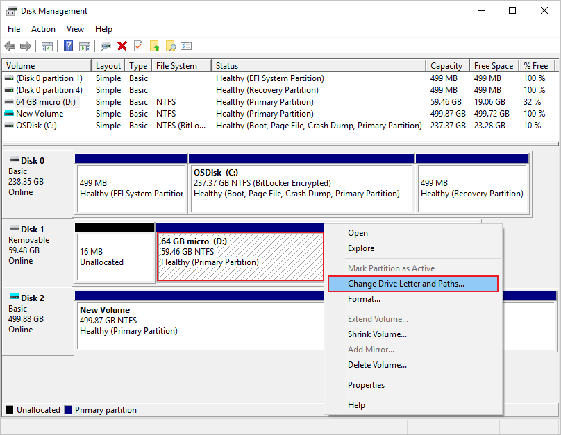
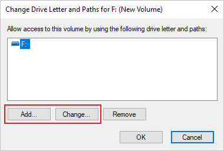
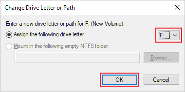

# Change a drive letter

> **Applies To:** Windows 10, Windows 8.1, Windows 7, Windows Server (Semi-Annual Channel), Windows Server 2019, Windows Server 2016, Windows Server 2012 R2, Windows Server 2012

If you don't like the drive letter assigned to a drive, or if you've got a drive that doesn't yet have a drive letter, you can use Disk Management to change it.

> [!IMPORTANT]
> If you change the drive letter of a drive where Windows or apps are installed, apps might have trouble running or finding that drive. For this reason we suggest that you don't change the drive letter of a drive on which Windows or apps are installed.

Here's how to change the drive letter (to instead to mount the drive in an empty folder so that it appears as just another folder, see [Assign a mount point folder path to a drive](assign-a-mount-point-folder-path-to-a-drive.md)).

1. Open Disk Management with administrator permissions. 
    To do so, in the search box on the taskbar, type **Disk Management**, select and hold (or right-click) **Disk Management**, then select **Run as administrator** > **Yes**. If you can't open it as an administrator, type **Computer Management** instead, and then go to **Storage** > **Disk Management**.
1. In Disk Management, right-click the drive for which you want to change or add a drive letter, and then select **Change Drive Letter and Paths**.

    
    > [!TIP]
    > If you don't see the **Change Drive Letter and Paths** option or it's grayed out, it's possible the volume isn't ready to receive a drive letter, which can be the case if the drive is unallocated and needs to be [initialized](initialize-new-disks.md). Or, maybe it's not meant to be accessed, which is the case of EFI system partitions and recovery partitions. If you've confirmed that you have a formatted volume with a drive letter that you can access and you still can't change it, unfortunately this topic probably can't help you, so we suggest [contacting Microsoft](https://support.microsoft.com/contactus/) or the manufacturer of your PC for more help.

1. To change the drive letter, select **Change**. To add a drive letter if the drive doesn't already have one, select **Add**.

    
1. Select the new drive letter, select **OK**, and then select **Yes** when prompted about how programs that rely on the drive letter might not run correctly.

    