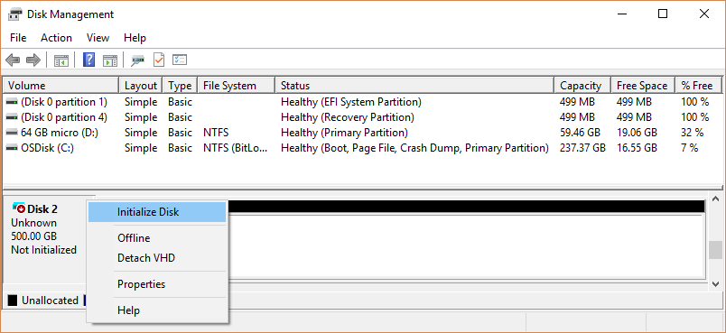
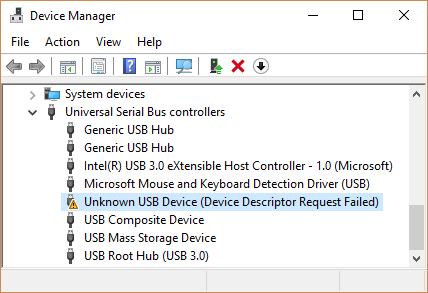

# Troubleshooting Disk Management

> **Applies To:** Windows 10, Windows 8.1, Windows 7, Windows Server (Semi-Annual Channel), Windows Server 2019, Windows Server 2016, Windows Server 2012 R2, Windows Server 2012

This topic lists a few common issues you may encounter when using Disk Management and troubleshooting steps to try.

> [!TIP]
> If you get an error or something doesn't work when following these procedures - don't panic! This topic is just the first thing to try; there's also a ton of info on the [Microsoft community](https://answers.microsoft.com/en-us/windows) site in the [Files, folders, and storage](https://answers.microsoft.com/en-us/windows/forum/windows_10-files?sort=lastreplydate&dir=desc&tab=All&status=all&mod=&modAge=&advFil=&postedAfter=&postedBefore=&threadType=all&isFilterExpanded=true&tm=1514405359639) section about the wide variety of hardware and software configurations you might be dealing with. If you still need help, post a question there, or [Contact Microsoft Support](https://support.microsoft.com/contactus/) or the manufacturer of your hardware.

## How to open Disk Management

Before we launch into the tricky stuff, here's an easy way to get to Disk Management in case you're not there already:

1. Type **Computer Management** in the search box on the taskbar, select and hold (or right-click) **Computer Management**, and then select **Run as administrator** > **Yes**.
2. After Computer Management opens, go to **Storage** > **Disk Management**.

## Disks that are missing or not initialized, plus general troubleshooting steps

**Cause:**
If you have a disk that doesn't appear in File Explorer and is listed in Disk Management as *Not Initialized*, it could be because the disk doesn't have a valid disk signature. Basically this means that the disk has never been initialized and formatted, or the drive formatting has become corrupted somehow. 

It's also possible that the disk is having hardware problems or issues plugging in, but we'll get to that in a few paragraphs.

**Solution:**  If the drive is brand new and just needs to be initialized, erasing any data on it, the solution is easy - see [Initialize New Disks](initialize-new-disks.md). However, there's a good chance you've already tried this, and it didn't work. Or maybe you have a disk full of important files, and you don't want to erase the disk by initializing it.

There are a bunch of reasons a disk or memory card might be missing or fail to initialize, with a common reason being because the disk is failing. There's only so much you can do to fix a failing disk, but here are some steps to try to see if we can get it working again. If the disk works after one of these steps, don't bother with the next steps, just kick back, celebrate, and maybe update your backups.

1. Look at the disk in Disk Management. If it appears *Offline* as shown here, try right-clicking it and selecting **Online**.

    
2. If the disk appears in Disk Management as *Online*, and has a primary partition that's listed as *Healthy*, as shown here, that's a good sign.

    
    - If a partition has a file system, but no drive letter (for example, E:), see [Change a drive letter](change-a-drive-letter.md) to add a drive letter manually.
    - If a partition doesn't have a file system (it's listed as RAW instead of NTFS, ReFS, FAT32, or exFAT) and you know that the disk is empty, select and hold (or right-click) the partition and select **Format**. Formatting a disk erases all data on it, so don't do this if you're trying to recover files from the disk - instead, skip ahead to the next step.
    - If the partition is listed as *Unallocated* and you know that the partition is empty, select and hold (or right-click) the unallocated partition and then select **New Simple Volume** and follow the instructions to create a volume in the free space. Don't do this if you're trying to recover files from this partition - instead, skip ahead to the next step.

    > [!NOTE]
    > Ignore any partitions that are listed as **EFI System Partition** or **Recovery Partition**. These partitions are full of really important files your PC needs to operate properly. It's best to just leave them alone to do their jobs starting your PC and helping you recover from problems.
3. If you have an external disk that's not showing up, unplug the disk, plug it back in, and then select **Action** > **Rescan Disks**. 
4. Shut down your PC, turn off your external hard disk (if it's an external disk with a power cord), and then turn your PC and the disk back on.
    To turn off your PC in Windows 10, select the Start button, select the Power button, and then select **Shut down**.
5. Plug the disk into a different USB port that's directly on your PC (not on a hub).
    Sometimes USB disks don't get enough power from some ports, or have other issues with particular ports. This is especially common with USB hubs, but sometimes there are differences between ports on a PC, so try a few different ports if you have them.
6. Try a different cable.
    It might sound crazy, but cables fail a lot, so try using a different cable to plug the disk in. If you have an internal disk in a desktop PC, you'll probably need to shut your PC down before switching cables - see your PC's manual for details.
7. Check Device Manager for issues.
    Select and hold (or right-click) the Start button, then select Device Manager from the context menu. Look for any devices with an exclamation point next to it or other issues, double-click the device and then read its status.

    Here's a list of [Error codes in Device Manager](https://support.microsoft.com/help/310123/error-codes-in-device-manager-in-windows), but one approach that sometimes works is to select and hold (or right-click) the problematic device, select **Uninstall device**, and then **Action** > **Scan for hardware changes**.

    
8. Plug the disk into a different PC.
    
    If the disk doesn't work on another PC, it's a good sign that there's something bad going on with the disk, and not your PC. No fun, we know. There are some more steps you can try in [External USB drive error "You must initialize the disk before Logical Disk Manager can access it"](https://social.technet.microsoft.com/Forums/windows/en-US/2b069948-82e9-49ef-bbb7-e44ec7bfebdb/forum-faq-external-usb-drive-error-you-must-initialize-the-disk-before-logical-disk-manager-can?forum=w7itprohardware), but it might be time to search for and ask for help at the [Microsoft community](https://answers.microsoft.com/en-us/windows/forum/windows_10-files?sort=lastreplydate&dir=desc&tab=All&status=all&mod=&modAge=&advFil=&postedAfter=&postedBefore=&threadType=all&isFilterExpanded=true&tm=1514405359639) site, or contact your disk manufacturer or [Microsoft Support](https://support.microsoft.com/contactus/).

    If you just can't get it working, there are also apps that can try to recover data from a failing disk, or if the files are really important, you can pay a data recovery lab to try to recover them. If you find something that works for you, let us know in the comments section below.

> [!IMPORTANT]
> Disks fail pretty often, so it's important to regularly backup any files you care about. If you have a disk that sometimes doesn't appear or gives errors, consider this a reminder to double-check your backup methods. It's OK if you're a little behind - we've all been there. The best backup solution is one you use, so we encourage you to find one that works for you and stick with it.
> 
> [!TIP]
> For info on how to use apps built into Windows to backup files to an external drive such as a USB drive, see [Back up and restore your files](https://support.microsoft.com/help/17143/windows-10-back-up-your-files). You can also save files in Microsoft OneDrive, which syncs files from your PC to the cloud. If your hard disk fails, you'll still be able to get any files you store in OneDrive from OneDrive.com. For more info, see [OneDrive on your PC](https://support.microsoft.com/help/17184/windows-10-onedrive).

## A basic or dynamic disk's status is Unreadable

**Cause:** The basic or dynamic disk is not accessible and might have experienced hardware failure, corruption, or I/O errors. The disk's copy of the system's disk configuration database might be corrupted. An error icon appears on disks that display the **Unreadable** status.

Disks might also display the **Unreadable** status while they are spinning up or when Disk Management is rescanning all of the disks on the system. In some cases, an unreadable disk has failed and is not recoverable. For dynamic disks, the **Unreadable** status usually results from corruption or I/O errors on part of the disk, rather than failure of the entire disk.

**Solution:** Rescan the disks or restart the computer to see if the disk status changes. Also try the troubleshooting steps described in [A disk's status is Not Initialized or the disk is missing entirely](#disks-that-are-missing-or-not-initialized-plus-general-troubleshooting-steps).

## A dynamic disk's status is Foreign

**Cause:** The **Foreign** status occurs when you move a dynamic disk to the local computer from another computer PC. A warning icon appears on disks that display the **Foreign** status.

In some cases, a disk that was previously connected to the system can display the **Foreign** status. Configuration data for dynamic disks is stored on all dynamic disks, so the information about which disks are owned by the system is lost when all dynamic disks fail.

**Solution:** Add the disk to your computer's system configuration so that you can access data on the disk. To add a disk to your computer's system configuration, import the foreign disk (select and hold (or right-click) the disk and then click **Import Foreign Disks**). Any existing volumes on the foreign disk become visible and accessible when you import the disk. 

## A dynamic disk's status is Online (Errors)

**Cause:** The dynamic disk has I/O errors on a region of the disk. A warning icon appears on the dynamic disk with errors.

**Solution:**  If the I/O errors are temporary, reactivate the disk to return it to **Online** status.

## A dynamic disk's status is Offline or Missing

**Cause:** An **Offline** dynamic disk might be corrupted or intermittently unavailable. An error icon appears on the offline dynamic disk.

If the disk status is **Offline** and the disk's name changes to **Missing**, the disk was recently available on the system but can no longer be located or identified. The missing disk may be corrupted, powered down, or disconnected.

**Solution:**
To bring a disk that is Offline and Missing back online:

1. Repair any disk, controller, or cable problems. 
2. Make sure that the physical disk is turned on, plugged in, and attached to the computer. 
3. Next, use the **Reactivate Disk** command to bring the disk back online.
4. Try the troubleshooting steps described in [A disk's status is Not Initialized or the disk is missing entirely](#disks-that-are-missing-or-not-initialized-plus-general-troubleshooting-steps).
5. If the disk status remains **Offline** and the disk name remains **Missing**, and you determine that the disk has a problem that cannot be repaired, you can remove the disk from the system by selecting and holding (or right-clicking) the disk and then clicking **Remove Disk**). However, before you can remove the disk, you must delete all volumes (or mirrors) on the disk. You can save any mirrored volumes on the disk by removing the mirror instead of the entire volume. Deleting a volume destroys the data in the volume, so you should remove a disk only if you are absolutely certain that the disk is permanently damaged and unusable.

**To bring a disk that is Offline and is still named Disk \# (not Missing) back online, try one or more of the following procedures:**

1. In Disk Management, select and hold (or right-click) the disk and then click **Reactivate Disk** to bring the disk back online. If the disk status remains **Offline**, check the cables and disk controller, and make sure that the physical disk is healthy. Correct any problems and try to reactivate the disk again. If the disk reactivation succeeds, any volumes on the disk should automatically return to the **Healthy** status.
2. In Event Viewer, check the event logs for any disk-related errors such as "No good config copies". If the event logs contain this error, contact [Microsoft Product Support Services](https://msdn.microsoft.com/library/aa263468(v=vs.60).aspx).

3. Try moving the disk to another computer. If you can get the disk to go **Online** on another computer, the problem is most likely due to the configuration of the computer on which the disk does not go **Online**.

4. Try moving the disk to another computer that has dynamic disks. Import the disk on that computer and then move the disk back to the computer on which it would not go **Online**. 

## A basic or dynamic volume's status is Failed

**Cause:**  The basic or dynamic volume cannot be started automatically, the disk is damaged, or the file system is corrupt. Unless the disk or file system can be repaired, the **Failed** status indicates data loss.

**Solution:**

If the volume is a basic volume with **Failed** status:

- Make sure that the underlying physical disk is turned on, plugged in, and attached to the computer.
- Try the troubleshooting steps described in [A disk's status is Not Initialized or the disk is missing entirely](#disks-that-are-missing-or-not-initialized-plus-general-troubleshooting-steps).

If the volume is a dynamic volume with **Failed** status:

-   Make sure the underlying disks are online. If not, return the disks to the **Online** status. If this succeeds, the volume automatically restarts and returns to the **Healthy** status. If the dynamic disk returns to the **Online** status, but the dynamic volume does not return to the **Healthy** status, you can reactivate the volume manually.
-   If the dynamic volume is a mirrored or RAID-5 volume with old data, bringing the underlying disk online will not automatically restart the volume. If the disks that contain current data are disconnected,  bring those disks online first (to allow the data to become synchronized). Otherwise, restart the mirrored or RAID-5 volume manually, and then run the Error-checking tool or Chkdsk.exe.
- Try the troubleshooting steps described in [A disk's status is Not Initialized or the disk is missing entirely](#disks-that-are-missing-or-not-initialized-plus-general-troubleshooting-steps).

## A basic or dynamic volume's status is Unknown

**Cause:**  The **Unknown** status occurs when the boot sector for the volume is corrupted (possibly due to a virus) and you can no longer access data on the volume. The **Unknown** status also occurs when you install a new disk but do not successfully complete the wizard to create a disk signature.

**Solution**  Initialize the disk. For instructions, see [Initialize New Disks](initialize-new-disks.md).

## A dynamic volume's status is Data Incomplete

**Cause:** You moved some, but not all of the disks in a multi-disk volume. Data on this volume will be destroyed unless you move and import the remaining disks that contain this volume.

**Solution:**

1. Move all the disks that comprise the multi-disk volume to the computer.
2. Import the disks. For instructions describing how to move and import disks, see [Move Disks to Another Computer](move-disks-to-another-computer.md).

If you no longer require the multi-disk volume, you can import the disk and create new volumes on it. To do so:

1. Select and hold (or right-click) the volume with **Failed** or **Failed Redundancy** status and then click **Delete Volume**.
2. Select and hold (or right-click) the disk and then click **New Volume**.

## A dynamic volume's status is Healthy (At Risk)

**Cause:**  Indicates that the dynamic volume is currently accessible, but I/O errors have been detected on the underlying dynamic disk. If an I/O error is detected on any part of a dynamic disk, all volumes on the disk display the **Healthy (At Risk)** status and a warning icon appears on the volume.

When the volume status is **Healthy (At Risk)**, an underlying disk's status is usually **Online (Errors)**.

**Solution:**  
1. Return the underlying disk to the **Online** status. Once the disk is returned to **Online** status, the volume should return to the **Healthy** status. If the **Healthy (At Risk)** status persists, the disk might be failing. 

2. Back up the data and replace the disk as soon as possible.

## Cannot manage striped volumes using Disk Management or DiskPart

**Cause:**  Some non-Microsoft disk management products replace Microsoft Logical Disk Manager (LDM) for advanced disk management, which can disable the LDM.

**Solution:**  If you are using non-Microsoft disk management software that has disabled LDM, you must contact the vendor on the non-Microsoft disk management software for support or assistance in troubleshooting problems with the disk configuration.

## Disk Management cannot start the Virtual Disk Service

**Cause:**  If a remote computer does not support the Virtual Disk Service (VDS) or if you cannot establish a connection to the remote computer because it is blocked by Windows Firewall, you may receive this error.

**Solution:**

1. If the remote computer supports VDS, you can configure Windows Defender Firewall to allow VDS connections. If the remote computer does not support VDS, you can use Remote Desktop Connection to connect to it and then run Disk Management directly on the remote computer.
2. To manage disks on remote computers that do support VDS, you must configure the Windows Defender Firewall on both the local computer (on which you are running Disk Management) and the remote computer.
3. On the local computer, configure Windows Defender Firewall to enable the Remote Volume Management Exception.

> [!NOTE]
> The Remote Volume Management Exception includes exceptions for Vds.exe, Vdsldr.exe, and TCP port 135.

> [!NOTE]
> Remote connections in workgroups are not supported. Both the local computer and the remote computer must be members of a domain.

See also

- [Free up drive space in Windows 10](https://support.microsoft.com/help/12425/windows-10-free-up-drive-space)