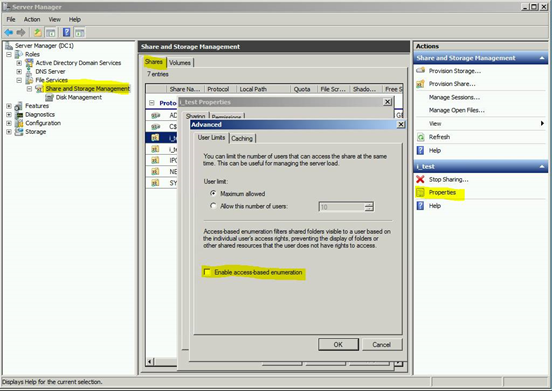

# High CPU usage issue on the SMB server

This article discusses how to troubleshoot the high CPU usage issue on the SMB server.

## High CPU usage because of storage performance issues

Storage performance issues can cause high CPU usage on SMB servers. Before you troubleshoot, make sure that the latest update rollup is installed on the SMB server to eliminate any known issues in srv2.sys.

In most cases, you will notice the issue of high CPU usage in the system process. Before you proceed, use Process Explorer to make sure that srv2.sys or ntfs.sys is consuming excessive CPU resources.

### Storage area network (SAN) scenario

In aggregate levels, the overall SAN performance may appear to be fine. However, when you work with SMB issues, the individual request response time is what matters the most.

Generally, this issue can be caused by some form of command queuing in the SAN. You can use **Perfmon** to capture a **Microsoft-Windows-StorPort** tracing, and analyze it to accurately determine storage responsiveness.

### Disk IO latency

Disk IO latency is a measure of the delay between the time that a disk IO request is created and completed.

The IO latency that is measured in Perfmon includes all the time that is spent in the hardware layers plus the time that is spent in the Microsoft Port Driver queue (Storport.sys for SCSI). If the running processes generate a large StorPort queue, the measured latency increases. This is because IO must wait before it is dispatched to the hardware layers.

In Perfmon, the following counters show physical disk latency:

- "Physical disk performance object" -\> "Avg. Disk sec/Read counter" – This shows the average read latency.

- "Physical disk performance object" -\> "Avg. Disk sec/Write counter" – This shows the average write latency.

- "Physical disk performance object" -\> "Avg. Disk sec/Transfer     counter" – This shows the combined averages for both reads and     writes.

The “\_Total” instance is an average of the latencies for all physical disks in the computer. Each of other instances represents an individual Physical Disk.

> [!NOTE]
> Do not confuse these counters with Avg. Disk Transfers/sec. These are completely different counters.

### Windows Storage Stack follows

This section gives a brief explanation on the Windows Storage Stack follows.

When an application creates an IO request, it sends the request to the Windows IO subsystem at the top of the stack. The IO then travels all the way down the stack to the hardware “Disk” subsystem. Then, the response travels all the way back up. During this process, each layer performs its function and then hands the IO to the next layer.


Perfmon does not create any performance data per second. Instead, it consumes data that is provided by other subsystems within Windows.

For the “physical disk performance object,” the data is captured at the "Partition manager" level in the storage stack.

When we measure the counters that are mentioned in the previous section, we are measuring all the time that is spent by the request below the "Partition manager" level. When the IO request is sent by the partition manager down the stack, we time stamp it. When it returns, we time stamp it again and calculate the time difference. The time difference is the latency.

By doing this, we are accounting for the time that is spent in the
following components:

- Class Driver - This manages the device type, such as disks, tapes, and so on.

- Port Driver - This manages the transport protocol, such as SCSI, FC, SATA, and so on.

- Device Miniport Driver - This is the device driver for the Storage Adapter. It is supplied by the manufacturer of the devices, such as Raid Controller, and FC HBA.

- Disk Subsystem - This includes everything that is below the Device Miniport Driver. This could be as simple as a cable that is connected to a single physical hard disk, or as complex as a Storage Area Network. If the issue is determined to be caused by this component, you can contact the hardware vendor for more information about troubleshooting.

### Disk queuing

There is a limited amount of IO that a disk subsystem can accept at a given time. The excess IO gets queued until the disk can accept IO again. The time that IO spends in the queues below the “Partition manager” level is accounted for in the Perfmon physical disk latency measurements. As queues grow larger and IO must wait longer, the measured latency also grows.

There are multiple queues below the “Partition manager” level, as
follows:

- Microsoft Port Driver Queue - SCSIport or Storport queue

- Manufacturer Supplied Device Driver Queue - OEM Device driver

- Hardware Queues – such as disk controller queue, SAN switches queue, array controller queue, and hard disk queue

We also account for the time that the hard disk spends actively servicing the IO and the travel time that is taken for the request to return to the “Partition manager” level to be marked as completed.

Finally, we have to pay special attention to the Port Driver Queue (for SCSI Storport.sys). The Port Driver is the last Microsoft component to touch an IO before we hand it off to the manufacturer-supplied Device Miniport Driver.

If the Device Miniport Driver can’t accept any more IO because its queue or the hardware queues below it are saturated, we will start accumulating IO on the Port Driver Queue. The size of the Microsoft Port Driver queue is limited only by the available system memory (RAM), and it can grow very large. This causes large measured latency.

## High CPU caused by enumerating folders 

To troubleshoot this issue, disable the Access Based Enumeration (ABE) feature.

To determine which SMB shares have ABE enabled, run the following PowerShell command,

```PowerShell
Get-SmbShare | Select Name, FolderEnumerationMode
```

Unrestricted = ABE disabled. <br />
AccessBase = ABE enabled.


You can enable ABE in **Server Manager**. Navigatie to **File and Storage Services** > **Shares**, right-click the share, select **Properties**, go to **Settings** and then select **Enable access-based enumeration**.



Also, you can reduce **ABELevel** to a lower level (1 or 2) to improve performance.

You can check disk performance when enumeration is slow by opening the folder locally through a console or an RDP session.
