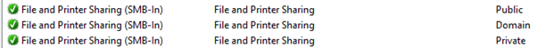
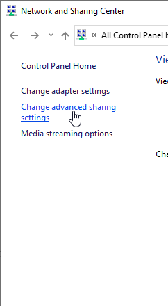

# SMB Multichannel troubleshooting

This article describes how to troubleshoot issues that are related to SMB Multichannel.

## Check the network interface status

Make sure that the binding for the network interface is set to **True** on the SMB client (MS\_client) and SMB server (MS\_server). When you run
the following command, the output should show **True** under **Enabled** for both network interfaces:

```PowerShell
Get-NetAdapterBinding -ComponentID ms_server,ms_msclient
```

After that, make sure the network interface is listed in the output of the following commands:

```PowerShell
Get-SmbServerNetworkInterface
```

```PowerShell
Get-SmbClientNetworkInterface
```

You can also run the **Get-NetAdapter** command to view the interface index to verify the result. The interface index shows all the active SMB adapters that are actively bound to the appropriate interface.

## Check the firewall

If there is only a link-local IP address, and no publicly routable address, the network profile is likely set to **Public**. This means that SMB is blocked at the firewall by default.

The following command reveals which connection profile is being used. You can also use the Network and Sharing Center to retrieve this information.

**Get-NetConnectionProfile**

Under the **File and Printer Sharing** group, check the firewall inbound rules to make sure that “SMB-In” is enabled for the correct profile.



You can also enable **File and Printer Sharing** in the **Network and Sharing Center** window. To do this, select **Change advanced sharing settings** in the menu on the left, and then select **Turn on file and printer sharing** for the profile. This option enables the File and Printer Sharing firewall rules.



## Capture client and server sided traffic for troubleshooting

You need the SMB connection tracing information that starts from the TCP three-way handshake. We recommend that you close all applications (especially Windows Explorer) before you start the capture. Restart the **Workstation** service on the SMB client, start the packet capture, and then reproduce the issue.

Make sure that the SMBv3.*x* connection is being negotiated, and that nothing in between the server and the client is affecting dialect negotiation. SMBv2 and earlier versions don’t support multichannel.

Look for the NETWORK\_INTERFACE\_INFO packets. This is where the SMB client requests a list of adapters from the SMB server. If these packets aren’t exchanged, multichannel doesn’t work.

The server responds by returning a list of valid network interfaces. Then, the SMB client adds those to the list of available adapters for multichannel. At this point, multichannel should start and, at least, try to start the connection.

For more information, see the following articles:

- [3.2.4.20.10 Application Requests Querying Server's Network Interfaces](https://docs.microsoft.com/openspecs/windows_protocols/ms-smb2/147adde4-d936-4597-924a-8caa3429c6b0)

- [2.2.32.5 NETWORK\_INTERFACE\_INFO Response](https://docs.microsoft.com/openspecs/windows_protocols/ms-smb2/fcd862d1-1b85-42df-92b1-e103199f531f)

- [3.2.5.14.11 Handling a Network Interfaces Response](https://docs.microsoft.com/openspecs/windows_protocols/ms-smb2/5459722b-1eaa-4ead-b465-284363264cad)

In the following scenarios, an adapter cannot be used:

- There is a routing issue on the client. This is typically caused by an incorrect routing table that forces traffic over the wrong interface.

- Multichannel constraints have been set. For more information, see [New-SmbMultichannelConstraint](https://docs.microsoft.com/powershell/module/smbshare/new-smbmultichannelconstraint).

- Something blocked the network interface request and response packets.

- The client and server can’t communicate over the extra network interface. For example, the TCP three-way handshake failed, the connection is blocked by a firewall, session setup failed, and so on.

If the adapter and its IPv6 address are on the list that is sent by the server, the next step is to see whether communications are tried over that interface. Filter the trace by the link-local address and SMB traffic, and look for a connection attempt. If this is a NetConnection trace, you can also examine Windows Filtering Platform (WFP) events to see whether the connection is being blocked.
