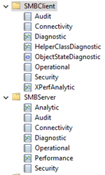
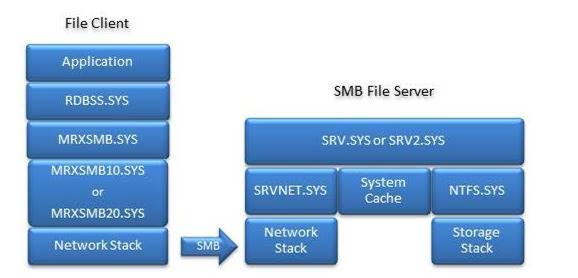

# Advanced Troubleshooting Server Message Block (SMB)

Server Message Block (SMB) is a network transport protocol for file systems operations to enable a client to access resources on a server. The primary purpose of the SMB protocol is to enable remote file system access between two systems over TCP/IP.

SMB troubleshooting can be extremely complex. This article is not an exhaustive troubleshooting guide Instead, it is a short primer to understand the basics of how to effectively troubleshoot SMB.

## Tools and data collection

One key aspect of quality SMB troubleshooting is communicating the correct terminology. Therefore, this article introduces basic SMB terminology to ensure accuracy of data collection and analysis.

> [!Note]
> The *SMB Server (SRV)* refers to the system that is hosting the file system, also known as the file server. *The SMB Client (CLI)* refers to the system that is trying to access the file system, regardless of the OS version or edition.

For example, if you use Windows Server 2016 to reach an SMB share that is hosted on Windows 10, Windows Server 2016 is the SMB Client and Windows 10 the SMB Server.

### Collect data

Before you troubleshoot SMB issues, we recommend that you first collect a network trace on both the client and server sides. The following guidelines apply:

- On Windows systems, you can use netshell (netsh), Network Monitor, Message Analyser, or Wireshark to collect a network trace.

- Third-party devices generally have an in-box packet capture tool, such as tcpdump (Linux/FreeBSD/Unix), or pktt (NetApp). For example, if the SMB client or SMB server is a Unix host, you can collect data by running the following command:
  
  ```cmd
  # tcpdump -s0 -n -i any -w /tmp/$(hostname)-smbtrace.pcap
  ```
  
  Stop collecting data by using **Ctrl+C** from keyboard.

To discover the source of the issue, you can check the two-sided traces: CLI, SRV, or somewhere in between.

#### Using netshell to collect data

This section provides the steps for using netshell to collect network trace.

> [!NOTE]  
> A Netsh trace creates an ETL file. ETL files can be opened only in Message Analyzer (MA) and Network Monitor 3.4 (set the parser to Network Monitor Parsers \> Windows).

1. On both the SMB server and SMB client, create a **Temp** folder on drive **C**. Then, run the following command:

   ```cmd
   netsh trace start capture=yes report=yes scenario=NetConnection level=5 maxsize=1024 tracefile=c:\\Temp\\%computername%\_nettrace.etl**
   ```
   
   If you are using PowerShell, run the following cmdlets:
   
   ```PowerShell
   New-NetEventSession -Name trace -LocalFilePath "C:\Temp\$env:computername`_netCap.etl" -MaxFileSize 1024

   Add-NetEventPacketCaptureProvider -SessionName trace -TruncationLength 1500

   Start-NetEventSession trace
   ```
   
2. Reproduce the issue.

3. Stop the trace by running the following command:

   ```cmd
   netsh trace stop
   ```
   
   If you are using PowerShell, run the following cmdlets:

   ```PowerShell
   Stop-NetEventSession trace  
   Remove-NetEventSession trace
   ```

> [!NOTE] 
> You should trace only a minimum amount of the data that’s transferred. For performance issues, always take both a good and bad trace, if the situation allows it.

### Analyze the traffic

SMB is an application-level protocol that uses TCP/IP as the network transport protocol. Therefore, an SMB issue can also be caused by TCP/IP issues.

Check whether TCP/IP experiences any of these issues:

1. The TCP three-way handshake does not finish. This typically indicates that there is a firewall block, or that the Server service is not running.

2. Retransmits are occurring. These can cause slow file transfers because of compound TCP congestion throttling.

3. Five retransmits followed by a TCP reset could mean that the connection between systems was lost, or that one of the SMB services crashed or stopped responding.

4. The TCP receive window is diminishing. This can be caused by slow storage or some other issue that prevents data from being retrieved from the Ancillary Function Driver (AFD) Winsock buffer.

If there is no noticeable TCP/IP issue, look for SMB errors. To do this, follow these steps:

1. Always check SMB errors against the MS-SMB2 protocol specification. Many SMB errors are benign (not harmful). Refer to the following information to determine why SMB returned the error before you conclude that the error is related to any of the following issues:

   - The [MS-SMB2 Message Syntax](https://docs.microsoft.com/openspecs/windows_protocols/ms-smb2/6eaf6e75-9c23-4eda-be99-c9223c60b181) topic details each SMB command and its options.
    
   - The [MS-SMB2 Client Processing](https://docs.microsoft.com/openspecs/windows_protocols/ms-smb2/df0625a5-6516-4fbe-bf97-01bef451cab2) topic details how the SMB client creates requests and responds to server messages.

   - The [MS-SMB2 Server Processing](https://docs.microsoft.com/openspecs/windows_protocols/ms-smb2/e1d08834-42e0-41ca-a833-fc26f5132a6f) topic details how the SMB server creates requests and responds to client requests.

2. Check whether a TCP reset command is sent immediately after an FSCTL\_VALIDATE\_NEGOTIATE\_INFO (validate negotiate) command. If so, refer to the following information:

   - The SMB session must be terminated (TCP reset) when the Validate Negotiate process fails on either the client or the server.

   - This process might fail because a WAN optimizer is modifying the SMB Negotiate packet.

   - If the connection ended prematurely, identify the last exchange communication between the client and server.

#### Analyze the protocol

Look at the actual SMB protocol details in the network trace to understand the exact commands and options that are used.

> [!NOTE]
> Only Message Analyzer can parse SMBv3 and later version commands.

- Remember that SMB does only what it is told to do.

- You can learn a lot about what the application is trying to do by examining the SMB commands.

Compare the commands and operations to the protocol specification to make sure that everything is operating correctly. If it is not, collect data that is closer to or at a lower level to look for more information about the root cause. To do this, follow these steps:

1. Collect a standard packet capture.

2. Run the **netsh** command to trace and gather details about whether there are issues in the network stack or drops in Windows Filtering Platform (WFP) applications, such as firewall or antivirus program.

3. If all other options fail, collect a t.cmd if you suspect that the issue occurs within SMB itself, or if none of the other data is sufficient to identify a root cause.

For example:

- You experience slow file transfers to a single file server.

- The two-sided traces show that the SRV responds slowly to a READ request.

- Removing an antivirus program resolves the slow file transfers.

- You contact the antivirus program manufactory to resolve the issue.

> [!NOTE]
> Optionally, you might **also** temporarily uninstall the antivirus program during troubleshooting.

#### Event logs

Both SMB Client and SMB Server have a detailed event log structure, as shown in the following screenshot. Collect the event logs to help find the root cause of the issue.



## SMB-related system files

This section lists the SMB-related system files. To keep the system files updated, make sure that the latest [update rollup](https://support.microsoft.com/help/4498140/windows-10-update-history) is installed.

SMB Client binaries that are listed under **%windir%\\system32\\Drivers**:

- RDBSS.sys

- MRXSMB.sys

- MRXSMB10.sys

- MRXSMB20.sys

- MUP.sys

- SMBdirect.sys

SMB Server binaries that are listed under **%windir%\\system32\\Drivers**:

- SRVNET.sys

- SRV.sys

- SRV2.sys

- SMBdirect.sys

- Under **%windir%\\system32**

- srvsvc.dll



### Update suggestions

We recommend that you update the following components before you troubleshoot SMB issues:

- A file server requires file storage. If your storage has iSCSI component, update those components.

- Update the network components.

- For better performance and stability, update Windows Core.

## Reference

[Microsoft SMB Protocol Packet Exchange Scenario](https://docs.microsoft.com/windows/win32/fileio/microsoft-smb-protocol-packet-exchange-scenario)