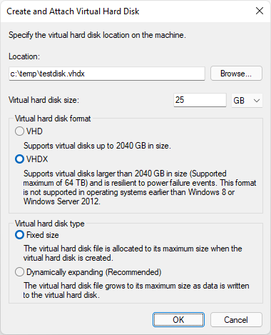

# SMB compression

>Applies to: Windows Server 2022, Windows 11

SMB compression allows an administrator, user or application to request compression of files as they transfer over the network. This removes the need to first manually deflate a file with an application, copy it, then inflate on the destination computer. Compressed files will consume less network bandwidth and take less time to transfer, at the cost of slightly increased CPU usage during transfers. SMB compression is most effective on networks with less bandwidth, such as a client's 1 Gbps ethernet or Wi-Fi network; a file transfer over an uncongested 100 Gbps ethernet network between two servers with flash storage may be as fast without SMB compression in practice, but will still create less congestion for other applications.

SMB compression in Windows has the following characteristics:

- Supports compression algorithms XPRESS (LZ77), XPRESS Huffman (LZ77+Huffman), LZNT1, or PATTERN_V1*. XPRESS is used automatically
- Supports SMB signing and SMB encryption
- Supports SMB over QUIC
- Supports SMB Multichannel
- Doesn't support SMB Direct over RDMA

For a demonstration of SMB compression, watch this video:

> [!VIDEO https://www.youtube.com/embed/zpMS6w33H7U]

## Requirements

To use SMB compression in a traditional client-file server workload, you need the following:

- A file server running Windows Server 2022 [on-premises](https://aka.ms/TryWS2022) or [in Azure](https://azuremarketplace.microsoft.com/marketplace/apps/microsoftwindowsserver.windowsserver?tab=Overview)
- A Windows 11 ([Windows for business](https://www.microsoft.com/windows/business)) computer
- Windows Admin Center - ([Homepage](https://aka.ms/windowsadmincenter))

## Configuring SMB compression

You can configure SMB compression from both a client and server perspective. Client and server don't refer to a particular edition like Windows Server 2022 or Windows 11 Insider Preview but instead to the architecture of a file transfer between two computers. Both Windows Server 2022 and Windows 11 support being a client or server of SMB compression.

### Requesting SMB compression on file shares

You can configure shares to always request compression when connected to by clients. You can use Windows Admin Center or PowerShell.

#### Using Windows Admin Center

1. Install Windows Admin Center and connect to a Windows Server 2022 file server.
1. Click on the **Files and file sharing** menu item.
1. Click on **File shares**.
1. Edit an existing share or create a new share.
1. Select **Compress data** and then click **Add** or **Edit**.


#### Using PowerShell

1. Open an elevated PowerShell command prompt as an administrator.
1. Create a new share with compression using `New-SMBShare` with the `-CompressData $true` parameter and argument. For example:

   ```powershell
   New-SmbShare -Name "Sales" -Path "C:\sales" -CompressData $true
   ```

1. Edit an existing share with compression using `Set-SMBShare` with the `-CompressData $true` parameter and argument. For example:

   ```powershell
   Set-SmbShare -Name "Sales" -CompressData $true
   ```

### Requesting SMB compression on mapped drives

You can request that all data copied over a mapped drive to be compressed. This can be done as part of a logon script or when run manually.

# [PowerShell](#tab/powershell)

1. Open a PowerShell command prompt.
1. Map a drive using `New-SMBMapping` with the `-CompressNetworkTraffic $true` parameter and argument. For example:

   ```powershell
   New-SmbMapping -LocalPath "Z:" -RemotePath "\\fs1.corp.contoso.com\sales" -CompressNetworkTraffic $true
   ```

# [Net Use](#tab/net-use)

1. Open a CMD prompt.
1. Map a drive using `NET USE` with the `/REQUESTCOMPRESSION:YES` parameter and argument. For example:

   ```cmd
   NET USE * \\fs1.corp.contoso.com\sales /REQUESTCOMPRESSION:YES
   ```

---

### Requesting SMB compression with copy tools

You can request that SMB compression is attempted for particular files using robocopy or xcopy.

> [!NOTE]
> If you want File Explorer, third party copy tools, or applications to use compression, map drives with compression, enable compression on shares, or set SMB clients to always compress.

# [Robocopy](#tab/robocopy)

1. Open a CMD prompt or PowerShell command prompt.
1. Copy with the /COMPRESS flag. For example:

   ```   
   ROBOCOPY c:\hypervdisks \\hypervcluster21.corp.contoso.com\disks$ *.vhdx /COMPRESS
   ```  

# [Xcopy](#tab/xcopy)

1. Open a CMD prompt or PowerShell command prompt.
1. Copy with the /COMPRESS flag. For example:

   ```
   XCOPY c:\hypervdisks\*.vhdx \\hypervcluster21.corp.contoso.com\disks$\* /COMPRESS
   ```

---

### Always require or always reject compression requests

Starting in Windows Server 2022 with update [KB5016693](https://support.microsoft.com/help/5016693) (OS Build 20348.946) and Windows 11 with update [KB5016691](https://support.microsoft.com/help/5016691) (OS Build 22000.918) you can configure an SMB client or SMB server to always request compression and to always reject requests for compression. You can now use Group Policy or PowerShell; in the initial release of Windows 11 and Windows Server 2022, you could only use registry settings to control most of these behaviors and you could not configure an SMB server to always request compression despite its share settings. An SMB client and SMB server refers to the SMB services, not to a Windows edition or SKU. All of these SMB changes take effect immediately without a reboot.

#### Always attempt compression (SMB client)

# [Group Policy](#tab/group-policy)

1. Run the Group Policy Management Console for your Active Directory domain and create or navigate to a group policy.
1. Expand policy **Computer Configuration\Policies\Administrative Templates\Network\Lanman Workstation**.
1. Enable policy **Use SMB Compression by Default**.
1. Close the policy editor.

# [PowerShell](#tab/powershell-2)

1. Open an elevated PowerShell command prompt as an administrator.
1. To have the SMB client always attempt to compress a file:

   ```powershell
   Set-SmbClientConfiguration -RequestCompression $true
   ```

---

#### Never compress (SMB client)

# [Group Policy](#tab/group-policy)

1. Run the Group Policy Management Console for your Active Directory domain and create or navigate to a group policy.
1. Expand policy **Computer Configuration\Policies\Administrative Templates\Network\Lanman Workstation**.
1. Enable policy **Disable SMB Compression**.
1. Close the policy editor.

# [PowerShell](#tab/powershell-2)

1. Open an elevated PowerShell command prompt as an administrator.
1. To never allow an SMB client to compress a file despite any other requests:

   ```powershell
   Set-SmbClientConfiguration -DisableCompression $true
   ```

---

#### Always attempt compression (SMB server)

# [Group Policy](#tab/group-policy)

1. Run the Group Policy Management Console for your Active Directory domain and create or navigate to a group policy.
1. Expand policy **Computer Configuration\Policies\Administrative Templates\Network\Lanman Server**.
1. Enable policy **Request traffic compression for all shares**.
1. Close the policy editor.

# [PowerShell](#tab/powershell-2)

1. Open an elevated PowerShell command prompt as an administrator.
1. To have the SMB server always attempt to compress a file:

   ```powershell
   Set-SmbServerConfiguration -RequestCompression $true
   ```

---

#### Never compress (SMB server)

# [Group Policy](#tab/group-policy)

1. Run the Group Policy Management Console for your Active Directory domain and create or navigate to a group policy.
1. Expand policy **Computer Configuration\Policies\Administrative Templates\Network\Lanman Server**.
1. Enable policy **Disable SMB Compression**.
1. Close the policy editor.

# [PowerShell](#tab/powershell-2)

1. Open an elevated PowerShell command prompt as an administrator.
1. To never allow an SMB client to compress a file despite any other requests:

   ```powershell
   Set-SmbServerConfiguration -DisableCompression $true
   ```

---

## Understanding and controlling compression behaviors

Starting in Windows Server 2022 with update [KB5016693](https://support.microsoft.com/help/5016693)
(OS Build 20348.946) and Windows 11 with update
[KB5016691](https://support.microsoft.com/help/5016691) (OS Build 22000.918), SMB by default always attempts to
compress a file when a client or server requests it, without using compression sampling.

> [!NOTE]
> In the original release of Windows Server 2022 and Windows 11, SMB compression defaulted to use of an algorithm where it attempted to compress the first 524,288,000 bytes (500 MiB) of a file during transfer and track that at least 104,857,600 bytes (100 MiB) compressed within that
500 MiB range. If fewer than 100 MiB was compressible, SMB compression stopped trying to compress the rest of the file. If at least 100 MiB compressed, SMB compression attempted to compress the rest of the file. With this behavior change, sampling is now disabled by default and SMB always attempts to compress the entire file when a client or server requests it. 


## Testing SMB compression

A simple way to test your compression configuration is using VHDX files. You can create and mount a VHDX, add some files to it, then dismount the VHDX and copy it as a file. Alternatively, you can just copy an existing dismounted virtual machine VHDX file, as much of its file contents will compress. For an example of creating a VHDX test file:

1. Start Diskmgmt.msc.
1. Select **Local Disk (C:)** by clicking on it.
1. Click **Action** then **Create VHD**.
1. In Diskmgmt, right-click your VHDX now shown as "Not initialized" and click **Initialize disk** and click **OK**. Right-click on the disks **Unallocated** section and click **New Simple Volume**, then **Next** for all menu prompts, then click **Finish**.
1. Specify a file path, set the size to "25 GB", select **VHDX** and **Fixed size**, then click **OK**.

   

1. Right-click on the disk and click **Detach VHD**, then click **OK**.
1. In File Explorer, double-click that VHDX file to mount it. Copy a few MB of uncompressible files, such as JPG format, then right-click the mounted disk and click **Eject**.

You now have a large test file with compressed contents.

Testing SMB compression between a pair of VMs running on the same Hyper-V host may not show time savings because the virtual switch is 10 Gbps and has no congestion, plus modern hypervisors often use flash storage. Test your compression over the real networks you plan to use. You can also reduce the network bandwidth on Hyper-V VMs for testing purposes using [Set-VMNetworkAdapter](/powershell/module/hyper-v/set-vmnetworkadapter) with `-MaximumBandwidth` set to `1Gb`, for example.

To see how well compression is working, you can robocopy the same file to a server twice, once with the `/compress` flag and again without compression, deleting the server file between each test. If the file is compressing, you should see less network utilization in Task Manager and a lower copy time. You can also observe the SMB server's Performance Monitor object "SMB Server Shares" for its "Compressed Requests/sec" and "Compressed Responses/sec" counters.

## RDMA and SMB Direct

SMB compression doesn't support SMB Direct and RDMA. This means that even if the client requests compression and the server supports it, compression will not be attempted with SMB Direct and RDMA. Support for SMB compression with SMB Direct and RDMA will come after the Windows Server 2022 and Windows 11 public previews.
