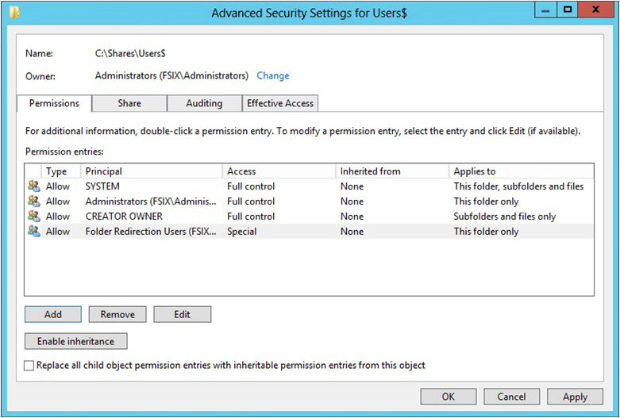

# Deploy Folder Redirection with Offline Files

>Applies to: Windows 10, Windows 7, Windows 8, Windows 8.1, Windows Vista, Windows Server 2019, Windows Server 2016, Windows Server 2012, Windows Server 2012 R2, Windows Server 2008 R2, Windows Server (Semi-annual Channel)

This topic describes how to use Windows Server to deploy Folder Redirection with Offline Files to Windows client computers.

For a list of recent changes to this topic, see [Change history](#change-history).

> [!IMPORTANT]
> Due to the security changes made in [MS16-072](https://support.microsoft.com/help/3163622/ms16-072-security-update-for-group-policy-june-14-2016), we updated [Step 3: Create a GPO for Folder Redirection](#step-3-create-a-gpo-for-folder-redirection) of this topic so that Windows can properly apply the Folder Redirection policy (and not revert redirected folders on affected PCs).

## Prerequisites

### Hardware requirements

Folder Redirection requires an x64-based or x86-based computer; it is not supported by Windows® RT.

### Software requirements

Folder Redirection has the following software requirements:

- To administer Folder Redirection, you must be signed in as a member of the Domain Administrators security group, the Enterprise Administrators security group, or the Group Policy Creator Owners security group.
- Client computers must run Windows 10, Windows 8.1, Windows 8, Windows 7, Windows Server 2019, Windows Server 2016, Windows Server (Semi-annual Channel), Windows Server 2012 R2, Windows Server 2012, Windows Server 2008 R2, or Windows Server 2008.
- Client computers must be joined to the Active Directory Domain Services (AD DS) that you are managing.
- A computer must be available with Group Policy Management and Active Directory Administration Center installed.
- A file server must be available to host redirected folders.
    - If the file share uses DFS Namespaces, the DFS folders (links) must have a single target to prevent users from making conflicting edits on different servers.
    - If the file share uses DFS Replication to replicate the contents with another server, users must be able to access only the source server to prevent users from making conflicting edits on different servers.
    - When using a clustered file share, disable continuous availability on the file share to avoid performance issues with Folder Redirection and Offline Files. Additionally, Offline Files might not transition to offline mode for 3-6 minutes after a user loses access to a continuously available file share, which could frustrate users who aren't yet using the Always Offline mode of Offline Files.

> [!NOTE]
> Some newer features in Folder Redirection have additional client computer and Active Directory schema requirements. For more info, see [Deploy primary computers](deploy-primary-computers.md), [Disable Offline Files on folders](disable-offline-files-on-folders.md), [Enable Always Offline mode](enable-always-offline.md), and [Enable optimized folder moving](enable-optimized-moving.md).

## Step 1: Create a folder redirection security group

If your environment is not already set up with Folder Redirection, the first step is to create a security group that contains all users to which you want to apply Folder Redirection policy settings.

Here's how to create a security group for Folder Redirection:

1. Open Server Manager on a computer with Active Directory Administration Center installed.
2. On the **Tools** menu, select **Active Directory Administration Center**. Active Directory Administration Center appears.
3. Right-click the appropriate domain or OU, select **New**, and then select **Group**.
4. In the **Create Group** window, in the **Group** section, specify the following settings:
    - In **Group name**, type the name of the security group, for example: **Folder Redirection Users**.
    - In **Group scope**, select **Security**, and then select **Global**.
5. In the **Members** section, select **Add**. The Select Users, Contacts, Computers, Service Accounts or Groups dialog box appears.
6. Type the names of the users or groups to which you want to deploy Folder Redirection, select **OK**, and then select **OK** again.

## Step 2: Create a file share for redirected folders

If you do not already have a file share for redirected folders, use the following procedure to create a file share on a server running Windows Server 2012.

> [!NOTE]
> Some functionality might differ or be unavailable if you create the file share on a server running another version of Windows Server.

Here's how to create a file share on Windows Server 2019, Windows Server 2016, and Windows Server 2012:

1. In the Server Manager navigation pane, select **File and Storage Services**, and then select **Shares** to display the Shares page.
2. In the **Shares** tile, select **Tasks**, and then select **New Share**. The New Share Wizard appears.
3. On the **Select Profile** page, select **SMB Share – Quick**. If you have File Server Resource Manager installed and are using folder management properties, instead select **SMB Share - Advanced**.
4. On the **Share Location** page, select the server and volume on which you want to create the share.
5. On the **Share Name** page, type a name for the share (for example, **Users$**) in the **Share name** box.
    >[!TIP]
    >When creating the share, hide the share by putting a ```$``` after the share name. This will hide the share from casual browsers.
6. On the **Other Settings** page, clear the Enable continuous availability checkbox, if present, and optionally select the **Enable access-based enumeration** and **Encrypt data access** checkboxes.
7. On the **Permissions** page, select **Customize permissions…**. The Advanced Security Settings dialog box appears.
8. Select **Disable inheritance**, and then select **Convert inherited permissions into explicit permission on this object**.
9. Set the permissions as described Table 1 and shown in Figure 1, removing permissions for unlisted groups and accounts, and adding special permissions to the Folder Redirection Users group that you created in Step 1.
    
    
    
    **Figure 1** Setting the permissions for the redirected folders share
10. If you chose the **SMB Share - Advanced** profile, on the **Management Properties** page, select the **User Files** Folder Usage value.
11. If you chose the **SMB Share - Advanced** profile, on the **Quota** page, optionally select a quota to apply to users of the share.
12. On the **Confirmation** page, select **Create.**

### Required permissions for the file share hosting redirected folders

| User Account  | Access  | Applies to  |
| --------- | --------- | --------- |
| User Account | Access | Applies to |
| System     | Full control        |    This folder, subfolders and files     |
| Administrators     | Full Control       | This folder only        |
| Creator/Owner     |   Full Control      |   Subfolders and files only      |
| Security group of users needing to put data on share (Folder Redirection Users)     |   List folder / read data *(Advanced permissions)* <br /><br />Create folders / append data *(Advanced permissions)* <br /><br />Read attributes *(Advanced permissions)* <br /><br />Read extended attributes *(Advanced permissions)* <br /><br />Read permissions *(Advanced permissions)*      |  This folder only       |
| Other groups and accounts     |  None (remove)       |         |

## Step 3: Create a GPO for Folder Redirection

If you do not already have a GPO created for Folder Redirection settings, use the following procedure to create one.

Here's how to create a GPO for Folder Redirection:

1. Open Server Manager on a computer with Group Policy Management installed.
2. From the **Tools** menu, select **Group Policy Management**.
3. Right-click the domain or OU in which you want to setup Folder Redirection, then select **Create a GPO in this domain, and Link it here**.
4. In the **New GPO** dialog box, type a name for the GPO (for example, **Folder Redirection Settings**), and then select **OK**.
5. Right-click the newly created GPO and then clear the **Link Enabled** checkbox. This prevents the GPO from being applied until you finish configuring it.
6. Select the GPO. In the **Security Filtering** section of the **Scope** tab, select **Authenticated Users**, and then select **Remove** to prevent the GPO from being applied to everyone.
7. In the **Security Filtering** section, select **Add**.
8. In the **Select User, Computer, or Group** dialog box, type the name of the security group you created in Step 1 (for example, **Folder Redirection Users**), and then select **OK**.
9. Select the **Delegation** tab, select **Add**, type **Authenticated Users**, select **OK**, and then select **OK** again to accept the default Read permissions.
    
    This step is necessary due to security changes made in [MS16-072](https://support.microsoft.com/help/3163622/ms16-072-security-update-for-group-policy-june-14-2016).

> [!IMPORTANT]
> Due to the security changes made in [MS16-072](https://support.microsoft.com/help/3163622/ms16-072-security-update-for-group-policy-june-14-2016), you now must give the Authenticated Users group delegated Read permissions to the Folder Redirection GPO - otherwise the GPO won't get applied to users, or if it's already applied, the GPO is removed, redirecting folders back to the local PC. For more info, see [Deploying Group Policy Security Update MS16-072](https://blogs.technet.microsoft.com/askds/2016/06/22/deploying-group-policy-security-update-ms16-072-kb3163622/).

## Step 4: Configure folder redirection with Offline Files

After creating a GPO for Folder Redirection settings, edit the Group Policy settings to enable and configure Folder Redirection, as discussed in the following procedure.

> [!NOTE]
> Offline Files is enabled by default for redirected folders on Windows client computers, and disabled on computers running Windows Server, unless changed by the user. To use Group Policy to control whether Offline Files is enabled, use the **Allow or disallow use of the Offline Files feature** policy setting.
> For information about some of the other Offline Files Group Policy settings, see [Enable Advanced Offline Files Functionality](<https://docs.microsoft.com/previous-versions/windows/it-pro/windows-server-2012-r2-and-2012/dn270369(v%3dws.11)>), and [Configuring Group Policy for Offline Files](<https://docs.microsoft.com/previous-versions/windows/it-pro/windows-server-2003/cc759721(v%3dws.10)>).

Here's how to configure Folder Redirection in Group Policy:

1. In Group Policy Management, right-click the GPO you created (for example, **Folder Redirection Settings**), and then select **Edit**.
2. In the Group Policy Management Editor window, navigate to **User Configuration**, then **Policies**, then **Windows Settings**, and then **Folder Redirection**.
3. Right-click a folder that you want to redirect (for example, **Documents**), and then select **Properties**.
4. In the **Properties** dialog box, from the **Setting** box, select **Basic - Redirect everyone's folder to the same location**.

    > [!NOTE]
    > To apply Folder Redirection to client computers running Windows XP or Windows Server 2003, select the **Settings** tab and select the **Also apply redirection policy to Windows 2000, Windows 2000 Server, Windows XP, and Windows Server 2003 operating systems** checkbox.

5. In the **Target folder location** section, select **Create a folder for each user under the root path** and then in the **Root Path** box, type the path to the file share storing redirected folders, for example: **\\\\fs1.corp.contoso.com\\users$**
6. Select the **Settings** tab, and in the **Policy Removal** section, optionally select **Redirect the folder back to the local userprofile location when the policy is removed** (this setting can help make Folder Redirection behave more predictably for administrators and users).
7. Select **OK**, and then select **Yes** in the Warning dialog box.

## Step 5: Enable the Folder Redirection GPO

Once you have completed configuring the Folder Redirection Group Policy settings, the next step is to enable the GPO, permitting it to be applied to affected users.

> [!TIP]
> If you plan to implement primary computer support or other policy settings, do so now, before you enable the GPO. This prevents user data from being copied to non-primary computers before primary computer support is enabled.

Here's how to enable the Folder Redirection GPO:

1. Open Group Policy Management.
2. Right-click the GPO that you created, and then select **Link Enabled**. A checkbox will appear next to the menu item.

## Step 6: Test Folder Redirection

To test Folder Redirection, sign in to a computer with a user account configured for Folder Redirection. Then confirm that the folders and profiles are redirected.

Here's how to test Folder Redirection:

1. Sign in to a primary computer (if you enabled primary computer support) with a user account for which you have enabled Folder Redirection.
2. If the user has previously signed in to the computer, open an elevated command prompt, and then type the following command to ensure that the latest Group Policy settings are applied to the client computer:
    
    ```PowerShell
    gpupdate /force
    ```
3. Open File Explorer.
4. Right-click a redirected folder (for example, the My Documents folder in the Documents library), and then select **Properties**.
5. Select the **Location** tab, and confirm that the path displays the file share you specified instead of a local path.

## Appendix A: Checklist for deploying Folder Redirection

| Status           | Action |
| ---              | ---    |
| ☐<br>☐<br>☐    | 1. Prepare domain<br>- Join computers to domain<br>- Create user accounts |
| ☐<br><br><br>   | 2. Create security group for Folder Redirection<br>- Group name:<br>- Members: |
| ☐<br><br>       | 3. Create a file share for redirected folders<br>- File share name: |
| ☐<br><br>       | 4. Create a GPO for Folder Redirection<br>- GPO name: |
| ☐<br><br>☐<br>☐<br>☐<br>☐<br>☐ | 5. Configure Folder Redirection and Offline Files policy settings<br>- Redirected folders:<br>- Windows 2000, Windows XP, and Windows Server 2003 support enabled?<br>- Offline Files enabled? (enabled by default on Windows client computers)<br>- Always Offline Mode enabled?<br>- Background file synchronization enabled?<br>- Optimized Move of redirected folders enabled? |
| ☐<br><br>☐<br><br>☐<br>☐ | 6. (Optional) Enable primary computer support<br>- Computer-based or User-based?<br>- Designate primary computers for users<br>- Location of user and primary computer mappings:<br>- (Optional) Enable primary computer support for Folder Redirection<br>- (Optional) Enable primary computer support for Roaming User Profiles |
| ☐         | 7. Enable the Folder Redirection GPO |
| ☐         | 8. Test Folder Redirection |

## Change history

The following table summarizes some of the most important changes to this topic.

| Date | Description | Reason|
| --- | --- | --- |
| January 18, 2017 | Added a step to [Step 3: Create a GPO for Folder Redirection](#step-3-create-a-gpo-for-folder-redirection) to delegate Read permissions to Authenticated Users, which is now required because of a Group Policy security update. | Customer feedback |

## More information

* [Folder Redirection, Offline Files, and Roaming User Profiles](folder-redirection-rup-overview.md)
* [Deploy Primary Computers for Folder Redirection and Roaming User Profiles](deploy-primary-computers.md)
* [Enable Advanced Offline Files Functionality](enable-always-offline.md)
* [Microsoft's Support Statement Around Replicated User Profile Data](https://blogs.technet.microsoft.com/askds/2010/09/01/microsofts-support-statement-around-replicated-user-profile-data/)
* [Sideload Apps with DISM](<https://docs.microsoft.com/previous-versions/windows/it-pro/windows-8.1-and-8/hh852635(v=win.10)>)
* [Troubleshooting packaging, deployment, and query of Windows Runtime-based apps](https://msdn.microsoft.com/library/windows/desktop/hh973484.aspx)
