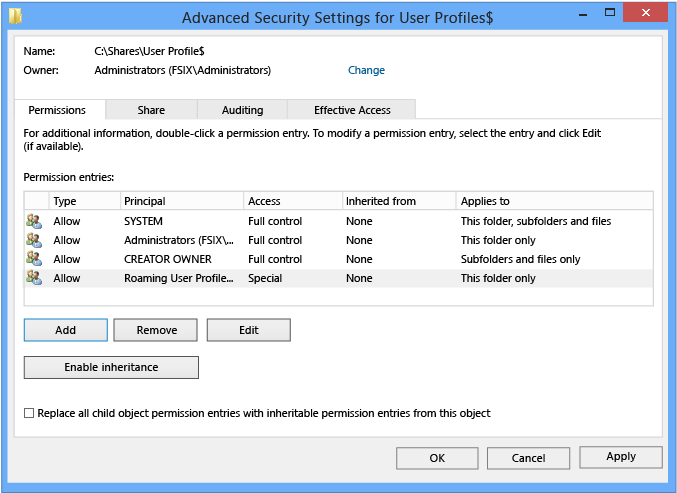

---
title: Deploying Roaming User Profiles
TOCTitle: Deploying Roaming User Profiles
ms.prod: windows-server
ms.technology: storage
ms.topic: article
author: JasonGerend
manager: brianlic
ms.date: 06/07/2019
ms.author: jgerend
---
# Deploying Roaming User Profiles

>Applies to: Windows 10, Windows 8.1, Windows 8, Windows 7, Windows Server 2019, Windows Server 2016, Windows Server (Semi-annual Channel), Windows Server 2012 R2, Windows Server 2012, Windows Server 2008 R2

This topic describes how to use Windows Server to deploy [Roaming User Profiles](folder-redirection-rup-overview.md) to Windows client computers. Roaming User Profiles redirects user profiles to a file share so that users receive the same operating system and application settings on multiple computers.

For a list of recent changes to this topic, see the [Change history](#change-history) section of this topic.

> [!IMPORTANT]
> Due to the security changes made in [MS16-072](https://support.microsoft.com/help/3163622/ms16-072-security-update-for-group-policy-june-14%2c-2016), we updated [Step 4: Optionally create a GPO for Roaming User Profiles](#step-4-optionally-create-a-gpo-for-roaming-user-profiles) in this topic so that Windows can properly apply the Roaming User Profiles policy (and not revert to local policies on affected PCs).

> [!IMPORTANT]
>  User customizations to Start is lost after an OS in-place upgrade in the following configuration:
> - Users are configured for a roaming profile
> - Users are allowed to make changes to Start
>
> As a result, the Start menu is reset to the default of the new OS version after the OS in-place upgrade. For workarounds, see [Appendix C: Working around reset Start menu layouts after upgrades](#appendix-c-working-around-reset-start-menu-layouts-after-upgrades).

## Prerequisites

### Hardware requirements

Roaming User Profiles requires an x64-based or x86-based computer; it isn't supported by Windows RT.

### Software requirements

Roaming User Profiles has the following software requirements:

- If you are deploying Roaming User Profiles with Folder Redirection in an environment with existing local user profiles, deploy Folder Redirection before Roaming User Profiles to minimize the size of roaming profiles. After the existing user folders have been successfully redirected, you can deploy Roaming User Profiles.
- To administer Roaming User Profiles, you must be signed in as a member of the Domain Administrators security group, the Enterprise Administrators security group, or the Group Policy Creator Owners security group.
- Client computers must run Windows 10, Windows 8.1, Windows 8, Windows 7, Windows Vista, Windows Server 2012 R2, Windows Server 2012, Windows Server 2008 R2, or Windows Server 2008.
- Client computers must be joined to the Active Directory Domain Services (AD DS) that you are managing.
- A computer must be available with Group Policy Management and Active Directory Administration Center installed.
- A file server must be available to host roaming user profiles.

    - If the file share uses DFS Namespaces, the DFS folders (links) must have a single target to prevent users from making conflicting edits on different servers.
    - If the file share uses DFS Replication to replicate the contents with another server, users must be able to access only the source server to prevent users from making conflicting edits on different servers.
    - If the file share is clustered, disable continuous availability on the file share to avoid performance issues.
- To use primary computer support in Roaming User Profiles, there are additional client computer and Active Directory schema requirements. For more information, see [Deploy Primary Computers for Folder Redirection and Roaming User Profiles](deploy-primary-computers.md).
- The layout of a user's Start menu won't roam on Windows 10, Windows Server 2019, or Windows Server 2016 if they're using more than one PC, Remote Desktop Session Host, or Virtualized Desktop Infrastructure (VDI) server. As a workaround, you can specify a Start layout as described in this topic. Or you can make use of user profile disks, which properly roam Start menu settings when used with Remote Desktop Session Host servers or VDI servers. For more info, see [Easier User Data Management with User Profile Disks in Windows Server 2012](https://blogs.technet.microsoft.com/enterprisemobility/2012/11/13/easier-user-data-management-with-user-profile-disks-in-windows-server-2012/).

### Considerations when using Roaming User Profiles on multiple versions of Windows

If you decide to use Roaming User Profiles across multiple versions of Windows, we recommend taking the following actions:

- Configure Windows to maintain separate profile versions for each operating system version. This helps prevent undesirable and unpredictable issues such as profile corruption.
- Use Folder Redirection to store user files such as documents and pictures outside of user profiles. This enables the same files to be available to users across operating system versions. It also keeps profiles small and sign-ins quick.
- Allocate sufficient storage for Roaming User Profiles. If you support two operating system versions, profiles will double in number (and thus total space consumed) because a separate profile is maintained for each operating system version.
- Don't use Roaming User Profiles across computers running Windows Vista/Windows Server 2008 and Windows 7/Windows Server 2008 R2. Roaming between these operating system versions isn't supported due to incompatibilities in their profile versions.
- Inform your users that changes made on one operating system version won't roam to another operating system version.
- When moving your environment to a version of Windows that uses a different profile version (such as from Windows 10 to Windows 10, version 1607—see [Appendix B: Profile version reference information](#appendix-b-profile-version-reference-information) for a list), users receive a new, empty roaming user profile. You can minimize the impact of getting a new profile by using Folder Redirection to redirect common folders. There isn't a supported method of migrating roaming user profiles from one profile version to another.

## Step 1: Enable the use of separate profile versions

If you are deploying Roaming User Profiles on computers running Windows 8.1, Windows 8, Windows Server 2012 R2, or Windows Server 2012, we recommend making a couple of changes to your Windows environment prior to deploying. These changes help ensure that future operating system upgrades go smoothly, and facilitate the ability to simultaneously run multiple versions of Windows with Roaming User Profiles.

To make these changes, use the following procedure.

1. Download and install the appropriate software update on all computers on which you're going to use roaming, mandatory, super-mandatory, or domain default profiles:

    - Windows 8.1, or Windows Server 2012 R2: install the software update described in article [2887595](https://support.microsoft.com/kb/2887595) in the Microsoft Knowledge Base (when released).
    - Windows 8 or Windows Server 2012: install the software update described in article [2887239](https://support.microsoft.com/kb/2887239) in the Microsoft Knowledge Base.

2. On all computers running Windows 8.1, Windows 8, Windows Server 2012 R2, or Windows Server 2012 on which you will use Roaming User Profiles, use Registry Editor or Group Policy to create the following registry key DWORD Value and set it to `1`. For information about creating registry keys by using Group Policy, see [Configure a Registry Item](<https://docs.microsoft.com/previous-versions/windows/it-pro/windows-server-2008-R2-and-2008/cc753092(v=ws.11)>).

    ```
    HKEY_LOCAL_MACHINE\SYSTEM\CurrentControlSet\Services\ProfSvc\Parameters\UseProfilePathExtensionVersion
    ```

    > [!WARNING]
    > Incorrectly editing the registry may severely damage your system. Before making changes to the registry, you should back up any valued data on the computer.
3. Restart the computers.

## Step 2: Create a Roaming User Profiles security group

If your environment is not already set up with Roaming User Profiles, the first step is to create a security group that contains all users and/or computers to which you want to apply Roaming User Profiles policy settings.

- Administrators of general-purpose roaming user profiles deployments typically create a security group for users.
- Administrators of Remote Desktop Services or virtualized desktop deployments typically use a security group for users and the shared computers.

Here's how to create a security group for Roaming User Profiles:

1. Open Server Manager on a computer with Active Directory Administration Center installed.
2. On the **Tools** menu, select **Active Directory Administration Center**. Active Directory Administration Center appears.
3. Right-click the appropriate domain or OU, select **New**, and then select **Group**.
4. In the **Create Group** window, in the **Group** section, specify the following settings:

    - In **Group name**, type the name of the security group, for example: **Roaming User Profiles Users and Computers**.
    - In **Group scope**, select **Security**, and then select **Global**.

5. In the **Members** section, select **Add**. The Select Users, Contacts, Computers, Service Accounts or Groups dialog box appears.
6. If you want to include computer accounts in the security group, select **Object Types**, select the **Computers** check box and then select **OK**.
7. Type the names of the users, groups, and/or computers to which you want to deploy Roaming User Profiles, select **OK**, and then select **OK** again.

## Step 3: Create a file share for roaming user profiles

If you do not already have a separate file share for roaming user profiles (independent from any shares for redirected folders to prevent inadvertent caching of the roaming profile folder), use the following procedure to create a file share on a server running Windows Server.

> [!NOTE]
> Some functionality might differ or be unavailable depending on the version of Windows Server you're using.

Here's how to create a file share on Windows Server:

1. In the Server Manager navigation pane, select **File and Storage Services**, and then select **Shares** to display the Shares page.
2. In the Shares tile, select **Tasks**, and then select **New Share**. The New Share Wizard appears.
3. On the **Select Profile** page, select **SMB Share – Quick**. If you have File Server Resource Manager installed and are using folder management properties, instead select **SMB Share - Advanced**.
4. On the **Share Location** page, select the server and volume on which you want to create the share.
5. On the **Share Name** page, type a name for the share (for example, **User Profiles$**) in the **Share name** box.

    > [!TIP]
    > When creating the share, hide the share by putting a ```$``` after the share name. This hides the share from casual browsers.

6. On the **Other Settings** page, clear the **Enable continuous availability** checkbox, if present, and optionally select the **Enable access-based enumeration** and **Encrypt data access** checkboxes.
7. On the **Permissions** page, select **Customize permissions…**. The Advanced Security Settings dialog box appears.
8. Select **Disable inheritance**, and then select **Convert inherited permissions into explicit permission on this object**.
9. Set the permissions as described in [Required permissions for the file share hosting roaming user profiles](#required-permissions-for-the-file-share-hosting-roaming-user-profiles) and shown in the following screen shot, removing permissions for unlisted groups and accounts, and adding special permissions to the Roaming User Profiles Users and Computers group that you created in Step 1.
    
    
    
    **Figure 1** Setting the permissions for the roaming user profiles share
10. If you chose the **SMB Share - Advanced** profile, on the **Management Properties** page, select the **User Files** Folder Usage value.
11. If you chose the **SMB Share - Advanced** profile, on the **Quota** page, optionally select a quota to apply to users of the share.
12. On the **Confirmation** page, select **Create.**

### Required permissions for the file share hosting roaming user profiles

| User Account | Access | Applies to |
|   -   |   -   |   -   |
|   System    |  Full control     |  This folder, subfolders and files     |
|  Administrators     |  Full Control     |  This folder only     |
|  Creator/Owner     |  Full Control     |  Subfolders and files only     |
| Security group of users needing to put data on share (Roaming User Profiles Users and Computers)      |  List folder / read data  *(Advanced permissions)* <br />Create folders / append data *(Advanced permissions)* |  This folder only     |
| Other groups and accounts   |  None (remove)     |       |

## Step 4: Optionally create a GPO for Roaming User Profiles

If you do not already have a GPO created for Roaming User Profiles settings, use the following procedure to create an empty GPO for use with Roaming User Profiles. This GPO allows you to configure Roaming User Profiles settings (such as primary computer support, which is discussed separately), and can also be used to enable Roaming User Profiles on computers, as is typically done when deploying in virtualized desktop environments or with Remote Desktop Services.

Here's how to create a GPO for Roaming User Profiles:

1. Open Server Manager on a computer with Group Policy Management installed.
2. From the **Tools** menu select **Group Policy Management**. Group Policy Management appears.
3. Right-click the domain or OU in which you want to setup Roaming User Profiles, then select **Create a GPO in this domain, and Link it here**.
4. In the **New GPO** dialog box, type a name for the GPO (for example, **Roaming User Profile Settings**), and then select **OK**.
5. Right-click the newly created GPO and then clear the **Link Enabled** checkbox. This prevents the GPO from being applied until you finish configuring it.
6. Select the GPO. In the **Security Filtering** section of the **Scope** tab, select **Authenticated Users**, and then select **Remove** to prevent the GPO from being applied to everyone.
7. In the **Security Filtering** section, select **Add**.
8. In the **Select User, Computer, or Group** dialog box, type the name of the security group you created in Step 1 (for example, **Roaming User Profiles Users and Computers**), and then select **OK**.
9. Select the **Delegation** tab, select **Add**, type **Authenticated Users**, select **OK**, and then select **OK** again to accept the default Read permissions.
    
    This step is necessary due to security changes made in [MS16-072](https://support.microsoft.com/help/3163622/ms16-072-security-update-for-group-policy-june-14%2c-2016).

>[!IMPORTANT]
>Due to the security changes made in [MS16-072A](https://support.microsoft.com/help/3163622/ms16-072-security-update-for-group-policy-june-14%2c-2016), you now must give the Authenticated Users group delegated Read permissions to the GPO - otherwise the GPO won't get applied to users, or if it's already applied, the GPO is removed, redirecting user profiles back to the local PC. For more info, see [Deploying Group Policy Security Update MS16-072](https://blogs.technet.microsoft.com/askds/2016/06/22/deploying-group-policy-security-update-ms16-072-kb3163622/).

## Step 5: Optionally set up Roaming User Profiles on user accounts

If you are deploying Roaming User Profiles to user accounts, use the following procedure to specify roaming user profiles for user accounts in Active Directory Domain Services. If you are deploying Roaming User Profiles to computers, as is typically done for Remote Desktop Services or virtualized desktop deployments, instead use the procedure documented in [Step 6: Optionally set up Roaming User Profiles on computers](#step-6-optionally-set-up-roaming-user-profiles-on-computers).

> [!NOTE]
> If you set up Roaming User Profiles on user accounts by using Active Directory and on computers by using Group Policy, the computer-based policy setting takes precedence.

Here's how to set up Roaming User Profiles on user accounts:

1. In Active Directory Administration Center, navigate to the **Users** container (or OU) in the appropriate domain.
2. Select all users to which you want to assign a roaming user profile, right-click the users and then select **Properties**.
3. In the **Profile** section, select the **Profile path:** checkbox and then enter the path to the file share where you want to store the user's roaming user profile, followed by `%username%` (which is automatically replaced with the user name the first time the user signs in). For example:
    
    `\\fs1.corp.contoso.com\User Profiles$\%username%`
    
    To specify a mandatory roaming user profile, specify the path to the NTuser.man file that you created previously, for example, `fs1.corp.contoso.comUser Profiles$default`. For more information, see [Create mandatory user profiles](https://docs.microsoft.com/windows/client-management/mandatory-user-profile).
4. Select **OK**.

> [!NOTE]
> By default, deployment of all Windows® Runtime-based (Windows Store) apps is allowed when using Roaming User Profiles. However, when using a special profile, apps are not deployed by default. Special profiles are user profiles where changes are discarded after the user signs out:
> <br><br>To remove restrictions on app deployment for special profiles, enable the **Allow deployment operations in special profiles** policy setting (located in Computer Configuration\Policies\Administrative Templates\Windows Components\App Package Deployment). However, deployed apps in this scenario will leave some data stored on the computer, which could accumulate, for example, if there are hundreds of users of a single computer. To clean up apps, locate or develop a tool that uses the [CleanupPackageForUserAsync](https://msdn.microsoft.com/library/windows/apps/windows.management.deployment.packagemanager.cleanuppackageforuserasync.aspx) API to clean up app packages for users who no longer have a profile on the computer.
> <br><br>For additional background information about Windows Store apps, see [Manage Client Access to the Windows Store](<https://docs.microsoft.com/previous-versions/windows/it-pro/windows-8.1-and-8/hh832040(v=ws.11)>).

## Step 6: Optionally set up Roaming User Profiles on computers

If you are deploying Roaming User Profiles to computers, as is typically done for Remote Desktop Services or virtualized desktop deployments, use the following procedure. If you are deploying Roaming User Profiles to user accounts, instead use the procedure described in [Step 5: Optionally set up Roaming User Profiles on user accounts](#step-5-optionally-set-up-roaming-user-profiles-on-user-accounts).

You can use Group Policy to apply Roaming User Profiles to computers running Windows 8.1, Windows 8, Windows 7, Windows Vista, Windows Server 2019, Windows Server 2016, Windows Server 2012 R2, Windows Server 2012, Windows Server 2008 R2, or Windows Server 2008.

> [!NOTE]
> If you set up Roaming User Profiles on computers by using Group Policy and on user accounts by using Active Directory, the computer-based policy setting takes precedence.

Here's how to set up Roaming User Profiles on computers:

1. Open Server Manager on a computer with Group Policy Management installed.
2. From the **Tools** menu, select **Group Policy Management**. Group Policy Management will appear.
3. In Group Policy Management, right-click the GPO you created in Step 3 (for example, **Roaming User Profiles Settings**), and then select **Edit**.
4. In the Group Policy Management Editor window, navigate to **Computer Configuration**, then **Policies**, then **Administrative Templates**, then **System**, and then **User Profiles**.
5. Right-click **Set roaming profile path for all users logging onto this computer** and then select **Edit**.
    > [!TIP]
    > A user's home folder, if configured, is the default folder used by some programs such as Windows PowerShell. You can configure an alternative local or network location on a per-user basis by using the **Home folder** section of the user account properties in AD DS. To configure the home folder location for all users of a computer running Windows 8.1, Windows 8, Windows Server 2019, Windows Server 2016, Windows Server 2012 R2, or Windows Server 2012 in a virtual desktop environment, enable the **Set user home folder** policy setting, and then specify the file share and drive letter to map (or specify a local folder). Do not use environment variables or ellipses. The user's alias is appended to the end of the path specified during user sign on.
6. In the **Properties** dialog box, select **Enabled**
7. In the **Users logging onto this computer should use this roaming profile path** box, enter the path to the file share where you want to store the user's roaming user profile, followed by `%username%` (which is automatically replaced with the user name the first time the user signs in). For example:

    `\\fs1.corp.contoso.com\User Profiles$\%username%`

    To specify a mandatory roaming user profile, which is a preconfigured profile to which users cannot make permanent changes (changes are reset when the user signs out), specify the path to the NTuser.man file that you created previously, for example, `\\fs1.corp.contoso.com\User Profiles$\default`. For more information, see [Creating a Mandatory User Profile](https://docs.microsoft.com/windows/client-management/mandatory-user-profile).
8. Select **OK**.

## Step 7: Optionally specify a Start layout for Windows 10 PCs

You can use Group Policy to apply a specific Start menu layout so that users see the same Start layout on all PCs. If users sign in to more than one PC and you want them to have a consistent Start layout across PCs, make sure that the GPO applies to all of their PCs.

To specify a Start layout, do the following:

1. Update your Windows 10 PCs to Windows 10 version 1607 (also known as the Anniversary Update) or newer, and install the March 14th, 2017 cumulative update ([KB4013429](https://support.microsoft.com/kb/4013429)) or newer.
2. Create a full or partial Start menu layout XML file. To do so, see [Customize and export Start layout](https://docs.microsoft.com/windows/configuration/customize-and-export-start-layout).
    * If you specify a *full* Start layout, a user can't customize any part of the Start menu. If you specify a *partial* Start layout, users can customize everything but the locked groups of tiles you specify. However, with a partial Start layout, user customizations to the Start menu won't roam to other PCs.
3. Use Group Policy to apply the customized Start layout to the GPO you created for Roaming User Profiles. To do so, see [Use Group Policy to apply a customized Start layout in a domain](https://docs.microsoft.com/windows/configuration/customize-windows-10-start-screens-by-using-group-policy#bkmk-domaingpodeployment).
4. Use Group Policy to set the following registry value on your Windows 10 PCs. To do so, see [Configure a Registry Item](<https://docs.microsoft.com/previous-versions/windows/it-pro/windows-server-2008-R2-and-2008/cc753092(v=ws.11)>).

| **Action**   | **Update**                  |
| ------------ | ------------                |
| Hive         | **HKEY_LOCAL_MACHINE**      |
| Key path     | **Software\Microsoft\Windows\CurrentVersion\Explorer** |
| Value name   | **SpecialRoamingOverrideAllowed** |
| Value type   | **REG_DWORD**               |
| Value data   | **1** (or **0** to disable) |
| Base         | **Decimal**                 |

5. (Optional) Enable first-time logon optimizations to make signing in faster for users. To do so, see [Apply policies to improve sign-in time](https://docs.microsoft.com/windows/client-management/mandatory-user-profile#apply-policies-to-improve-sign-in-time).
6. (Optional) Further decrease sign-in times by removing unnecessary apps from the Windows 10 base image you use to deploy client PCs. Windows Server 2019 and Windows Server 2016 don't have any pre-provisioned apps, so you can skip this step on server images.
    - To remove apps, use the [Remove-AppxProvisionedPackage](https://docs.microsoft.com/powershell/module/dism/remove-appxprovisionedpackage?view=win10-ps) cmdlet in Windows PowerShell to uninstall the following applications. If your PCs are already deployed you can script the removal of these apps using the [Remove-AppxPackage](https://docs.microsoft.com/powershell/module/appx/remove-appxpackage?view=win10-ps).
    
      - Microsoft.windowscommunicationsapps\_8wekyb3d8bbwe
      - Microsoft.BingWeather\_8wekyb3d8bbwe
      - Microsoft.DesktopAppInstaller\_8wekyb3d8bbwe
      - Microsoft.Getstarted\_8wekyb3d8bbwe
      - Microsoft.Windows.Photos\_8wekyb3d8bbwe
      - Microsoft.WindowsCamera\_8wekyb3d8bbwe
      - Microsoft.WindowsFeedbackHub\_8wekyb3d8bbwe
      - Microsoft.WindowsStore\_8wekyb3d8bbwe
      - Microsoft.XboxApp\_8wekyb3d8bbwe
      - Microsoft.XboxIdentityProvider\_8wekyb3d8bbwe
      - Microsoft.ZuneMusic\_8wekyb3d8bbwe

>[!NOTE]
>Uninstalling these apps decreases sign-in times, but you can leave them installed if your deployment needs any of them.

## Step 8: Enable the Roaming User Profiles GPO

If you set up Roaming User Profiles on computers by using Group Policy, or if you customized other Roaming User Profiles settings by using Group Policy, the next step is to enable the GPO, permitting it to be applied to affected users.

>[!TIP]
>If you plan to implement primary computer support, do so now, before you enable the GPO. This prevents user data from being copied to non-primary computers before primary computer support is enabled. For the specific policy settings, see [Deploy Primary Computers for Folder Redirection and Roaming User Profiles](deploy-primary-computers.md).

Here's how to enable the Roaming User Profile GPO:

1. Open Group Policy Management.
2. Right-click the GPO that you created and then select **Link Enabled**. A checkbox appears next to the menu item.

## Step 9: Test Roaming User Profiles

To test Roaming User Profiles, sign in to a computer with a user account configured for Roaming User Profiles, or sign in to a computer configured for Roaming User Profiles. Then confirm that the profile is redirected.

Here's how to test Roaming User Profiles:

1. Sign in to a primary computer (if you enabled primary computer support) with a user account for which you have enabled Roaming User Profiles enabled. If you enabled Roaming User Profiles on specific computers, sign in to one of these computers.
2. If the user has previously signed in to the computer, open an elevated command prompt, and then type the following command to ensure that the latest Group Policy settings are applied to the client computer:
    
    ```PowerShell
    GpUpdate /Force
    ```
3. To confirm that the user profile is roaming, open **Control Panel**, select **System and Security**, select **System**, select **Advanced System Settings**, select **Settings** in the User Profiles section and then look for **Roaming** in the **Type** column.

## Appendix A: Checklist for deploying Roaming User Profiles

| Status                     | Action                                                |
| ---                        | ------                                                |
| ☐<br>☐<br>☐<br>☐<br>☐   | 1. Prepare domain<br>- Join computers to domain<br>- Enable the use of separate profile versions<br>- Create user accounts<br>- (Optional) Deploy Folder Redirection |
| ☐<br><br><br>             | 2. Create security group for Roaming User Profiles<br>- Group name:<br>- Members: |
| ☐<br><br>                 | 3. Create a file share for Roaming User Profiles<br>- File share name: |
| ☐<br><br>                 | 4. Create a GPO for Roaming User Profiles<br>- GPO name:|
| ☐                         | 5. Configure Roaming User Profiles policy settings    |
| ☐<br>☐<br>☐              | 6. Enable Roaming User Profiles<br>- Enabled in AD DS on user accounts?<br>- Enabled in Group Policy on computer accounts?<br> |
| ☐                         | 7. (Optional) Specify a mandatory Start layout for Windows 10 PCs |
| ☐<br>☐<br><br>☐<br><br>☐ | 8. (Optional) Enable primary computer support<br>- Designate primary computers for users<br>- Location of user and primary computer mappings:<br>- (Optional) Enable primary computer support for Folder Redirection<br>- Computer-based or User-based?<br>- (Optional) Enable primary computer support for Roaming User Profiles |
| ☐                        | 9. Enable the Roaming User Profiles GPO                |
| ☐                        | 10. Test Roaming User Profiles                         |

## Appendix B: Profile version reference information

Each profile has a profile version that corresponds roughly to the version of Windows on which the profile is used. For example, Windows 10, version 1703 and version 1607 both use the .V6 profile version. Microsoft creates a new profile version only when necessary to maintain compatibility, which is why not every version of Windows includes a new profile version.

The following table lists the location of Roaming User Profiles on various versions of Windows.

| Operating system version | Roaming User Profile location |
| --- | --- |
| Windows XP and Windows Server 2003 | ```\\<servername>\<fileshare>\<username>``` |
| Windows Vista and Windows Server 2008 | ```\\<servername>\<fileshare>\<username>.V2``` |
| Windows 7 and Windows Server 2008 R2 | ```\\<servername>\<fileshare>\<username>.V2``` |
| Windows 8 and Windows Server 2012 | ```\\<servername>\<fileshare>\<username>.V3``` (after the software update and registry key are applied)<br>```\\<servername>\<fileshare>\<username>.V2``` (before the software update and registry key are applied) |
| Windows 8.1 and Windows Server 2012 R2 | ```\\<servername>\<fileshare>\<username>.V4``` (after the software update and registry key are applied)<br>```\\<servername>\<fileshare>\<username>.V2``` (before the software update and registry key are applied) |
| Windows 10 | ```\\<servername>\<fileshare>\<username>.V5``` |
| Windows 10, version 1703 and version 1607 | ```\\<servername>\<fileshare>\<username>.V6``` |

## Appendix C: Working around reset Start menu layouts after upgrades

Here are some ways to work around Start menu layouts getting reset after an in-place upgrade:

- If only one user ever uses the device and the IT Admin uses a managed OS deployment strategy such as Configuration Manager they can do the following:
    
  1. Export the Start menu layout with Export-Startlayout before the upgrade 
  2. Import the Start menu layout with Import-StartLayout after OOBE but before the user signs in  
 
     > [!NOTE] 
     > Importing a StartLayout modifies the Default User profile. All user profiles created after the import has occurred will get the imported Start-Layout.
 
- IT Admins can opt to manage Start's Layout with Group Policy. Using Group Policy provides a centralized management solution to apply a standardized Start Layout to users. There are 2 modes to modes to using Group Policy for Start management. Full Lockdown and Partial Lockdown. The full lockdown scenario prevents the user from making any changes to Start's layout. The partial lockdown scenario allows user to make changes to a specific area of Start. For more info, see [Customize and export Start layout](https://docs.microsoft.com/windows/configuration/customize-and-export-start-layout).
        
   > [!NOTE]
   > User made changes in the partial lockdown scenario will still be lost during upgrade.

- Let the Start layout reset occur and allow end users to reconfigure Start. A notification email or other notification can be sent to end users to expect their Start layouts to be reset after the OS upgrade to minimized impact. 

## Change history

The following table summarizes some of the most important changes to this topic.

| Date | Description |Reason|
| --- | ---         | ---   |
| May 1st, 2019 | Added updates for Windows Server 2019 |
| April 10th, 2018 | Added discussion of when user customizations to Start are lost after an OS in-place upgrade|Callout known issue. |
| March 13th, 2018 | Updated for Windows Server 2016 | Moved out of Previous Versions library and updated for current version of Windows Server. |
| April 13th, 2017 | Added profile information for Windows 10, version 1703, and clarified how roaming profile versions work when upgrading operating systems—see [Considerations when using Roaming User Profiles on multiple versions of Windows](#considerations-when-using-roaming-user-profiles-on-multiple-versions-of-windows). | Customer feedback. |
| March 14th, 2017 | Added optional step for specifying a mandatory Start layout for Windows 10 PCs in [Appendix A: Checklist for deploying Roaming User Profiles](#appendix-a-checklist-for-deploying-roaming-user-profiles). |Feature changes in latest Windows update. |
| January 23rd, 2017 | Added a step to [Step 4: Optionally create a GPO for Roaming User Profiles](#step-4-optionally-create-a-gpo-for-roaming-user-profiles) to delegate Read permissions to Authenticated Users, which is now required because of a Group Policy security update.|Security changes to Group Policy processing. |
| December 29th, 2016 | Added a link in [Step 8: Enable the Roaming User Profiles GPO](#step-8-enable-the-roaming-user-profiles-gpo) to make it easier to get info on how to set Group Policy for primary computers. Also fixed a couple references to steps 5 and 6 that had the numbers wrong.|Customer feedback. |
| December 5th, 2016 | Added info explaining a Start menu settings roaming issue. | Customer feedback. |
| July 6th, 2016 | Added Windows 10 profile version suffixes in [Appendix B: Profile version reference information](#appendix-b-profile-version-reference-information). Also removed Windows XP and Windows Server 2003 from the list of supported operating systems. | Updates for the new versions of Windows, and removed info about versions of Windows that are no longer supported. |
| July 7th, 2015 | Added requirement and step to disable continuous availability when using a clustered file server. | Clustered file shares have better performance for small writes (which are typical with roaming user profiles) when continuous availability is disabled. |
| March 19th, 2014 | Capitalized profile version suffixes (.V2, .V3, .V4) in [Appendix B: Profile version reference information](#appendix-b-profile-version-reference-information). | Although Windows is case insensitive, if you use NFS with the file share, it's important to have the correct (uppercase) capitalization for the profile suffix. |
| October 9th, 2013 | Revised for Windows Server 2012 R2 and Windows 8.1, clarified a few things, and added the [Considerations when using Roaming User Profiles on multiple versions of Windows](#considerations-when-using-roaming-user-profiles-on-multiple-versions-of-windows) and [Appendix B: Profile version reference information](#appendix-b-profile-version-reference-information) sections. | Updates for new version; customer feedback. |

## More information

- [Deploy Folder Redirection, Offline Files, and Roaming User Profiles](deploy-folder-redirection.md)
- [Deploy Primary Computers for Folder Redirection and Roaming User Profiles](deploy-primary-computers.md)
- [Implementing User State Management](<https://docs.microsoft.com/previous-versions/windows/it-pro/windows-server-2003/cc784645(v=ws.10)>)
- [Microsoft's Support Statement Around Replicated User Profile Data](https://blogs.technet.microsoft.com/askds/2010/09/01/microsofts-support-statement-around-replicated-user-profile-data/)
- [Sideload Apps with DISM](<https://docs.microsoft.com/previous-versions/windows/it-pro/windows-8.1-and-8/hh852635(v=win.10)>)
- [Troubleshooting packaging, deployment, and query of Windows Runtime-based apps](https://msdn.microsoft.com/library/windows/desktop/hh973484.aspx)