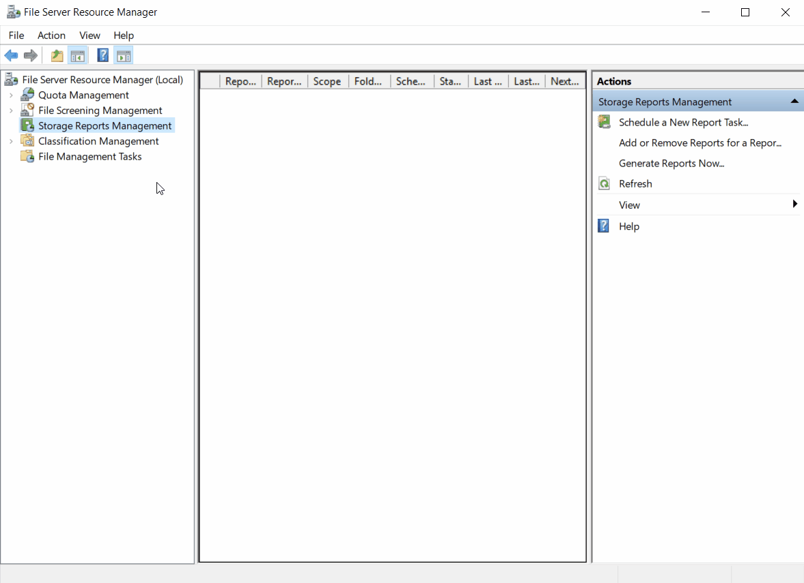

# Generate reports on demand

> Applies to: Windows Server 2022, Windows Server 2019, Windows Server 2016, Windows Server 2012 R2, Windows Server 2012, Windows Server 2008 R2

You can generate reports on demand using the **File Server Resource Manager** (FSRM). With these reports, you can analyze the different aspects of current disk usage on the server. Current data is gathered before the reports are generated.

When you generate reports on demand, the reports are saved in a default location unless specified in **FSRM > Action > Configure Options > Report Locations**. No report task is created for later use. You can view the reports immediately after they're generated or e-mail the reports to a group of administrators.

> [!NOTE]
> If you choose to open the reports immediately, you must wait while the reports are generated. Processing time varies depending on the types of reports and the scope of the data.

## Prerequisites

The following must be installed to use this feature:

- A Windows Server with the **File and Storage Services** role service installed. To learn more, see [Install or Uninstall Roles, Role Services, or Features](/windows-server/administration/server-manager/install-or-uninstall-roles-role-services-or-features).
- An account with Administrative privileges.

## How to generate reports

1. Click **Start** > **Windows Administrative Tools** > select **File Server Resource Management**.
 _Alternatively, click **Start** > type **fsrm.msc** > hit_ <kbd>Enter</kbd>.
1. Select **Storage Reports Management**, right-click **Storage Reports Management**, then select **Generate Reports Now** (or select **Generate Reports Now** from the **Actions** pane).
1. In the **Storage Reports Task Properties** dialog box, select the data you want to include from the **Report data** selection box.
1. Under **Report formats**, select one or more formats for your report. The default is set to _Dynamic HTML (DHTML)_. Other available formats are HTML, XML, CSV, and Text. The default save location for the reports are stored in **C:\StorageReports** unless changed.
1. Click the **Scope** tab > click **Add** > browse to the volume or folder that you want to generate the reports from and click **OK** to add it to your report scope.
   - You can add as many volumes or folders as you want to include in the reports.
   - To remove a volume or folder, select it from the list > click **Remove**.
   - You can also include the following data types by selecting them within the **Scope** tab:
      - Application Files
      - Backup and Archival Files
      - Group Files
      - User Files
1. Click **OK** > select one of two available options to generate your report > then click **OK** to generate your report.
   - Generate reports in the background
   - Wait for reports to be generated and then display them

The following animation demonstrates the steps to generate a report using the **Generate Reports Now** feature.

## Generate custom reports

To customize your reports, perform the following:

1. In the **Storage Reports Task Properties** dialog box, select the data you want to include from the **Report data** selection box.
1. Click **Edit Parameters**, then in the **Report Parameters** dialog box, edit the parameters as needed, then click **OK**.

   > [!TIP]
   > Each report data label has its own set of parameters. When customizing reports, it's recommended to select one report label at a time in making modifications.
   >
   > To see a list of parameters set for all the selected reports, click **Review Selected Reports**, then click **Close** when complete.

1. After customizing your report, select the report output type from **Report format**, click **OK**, select how you want your report generated, and then click **OK**.

## Deliver reports via email

To deliver copies of the reports to administrators by e-mail:

1. In the **Storage Reports Task Properties** dialog box, complete your selection of the report data you want to generate along with the **Report format** of choice.
1. Click the **Delivery** tab, select the **Send reports to the following administrators** check box, then enter the names of the administrative accounts that receive reports in _account@domain_ formatting using the semicolon (**;**) to indicate multiple accounts.
1. Click **OK**, select how you want your report generated, and then click **OK**.

   > [!NOTE]
   > In order to use this feature, an SMTP server must be configured to prevent e-mail delivery failure.

## Additional references

- [Storage Reports Management](storage-reports-management.md)
- [Setting File Server Resource Manager Options](setting-file-server-resource-manager-options.md)
