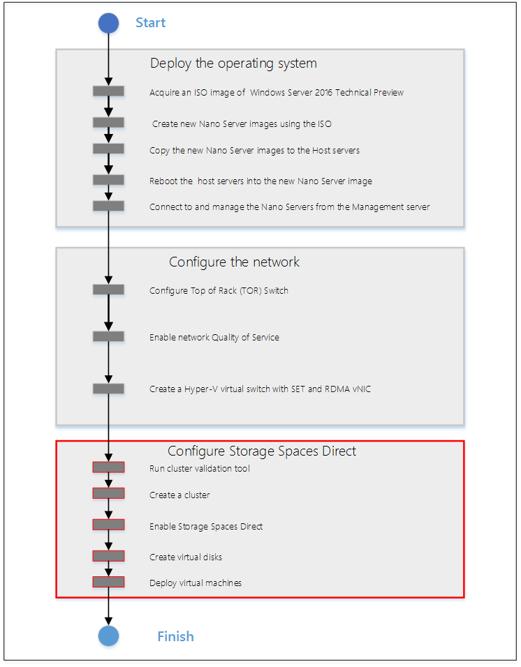

# Hyper-converged solution using Storage Spaces Direct in Windows Server 2016

>Applies To: Windows Server 2016

Windows Server 2016 introduces Storage Spaces Direct, which enables building highly available (HA) storage systems with local storage. This is a significant step forward in Microsoft Windows Server software-defined storage (SDS) as it simplifies the deployment and management of SDS systems and also unlocks use of new classes of disk devices, such as SATA and NVMe disk devices, that were previously not possible with clustered Storage Spaces with shared disks.  

Windows Server 2016 provides a hyper-converged solution by allowing the same set of servers to provide SDS, through Storage Spaces Direct (S2D), and serve as the hosts for virtual machines using Hyper-V. This guide provides instructions to create a hyper-converged solution using Storage Spaces Direct in Windows Server 2016 and includes the following sections:  
*  [How to use this guide](#BKMK_S2D1)  
* [Hyper-converged Solution with Software Defined Storage Overview](#BKMK_S2D2)  
*  [Hardware requirements](#BKMK_S2D3)  
* [Information gathering](#BKMK_S2D4)  
* [Nano or Full/Core Installation Options](#BKMK_InstallOptions)  
* [Installing and configuring Hyper-Converged solution using Storage Spaces Direct with Windows Server 2016 Nano Server](#BKMK_S2D5)  
* [Definitions](#BKMK_S2D6)  
* [Storage Spaces Optmize Pool](#BKMK_S2D7)  

## <a name="BKMK_S2D1"></a> How to Use this Guide   

This document provides both an introductory overview and specific standalone examples of how to deploy a Hyper Converged Solution with Storage Spaces Direct.  

Before taking any action, it is recommended that you do a quick read through of this document to familiarize yourself with the overall approach, to get a sense for the important **Notes** associated with some steps, and to acquaint yourself with the additional supporting resources and documentation.  

## <a name="BKMK_S2D2"></a> Hyper-converged Solution with Software Defined Storage Overview  


In the Hyper-Converged configuration described in this guide, Storage Spaces Direct seamlessly integrates with the features you know today that make up the Windows Server software defined storage stack, including Clustered Shared Volume File System (CSVFS), Storage Spaces and Failover Clustering.  

The **hyper-converged** deployment scenario has the Hyper-V (compute) and Storage Spaces Direct (storage) components on the same cluster. Virtual machine's files are stored on local CSVs. This allows for scaling Hyper-V compute clusters together with the storage it is using. Once Storage Spaces Direct is configured and the CSV volumes are available, configuring and provisioning Hyper-V is the same process and uses the same tools that you would use with any other Hyper-V deployment on a failover cluster. Figure 1 illustrates the hyper-converged deployment scenario.  

  

**FIGURE 1: Hyperconverged - same cluster configured for Storage Spaces Direct and the hosting of virtual machines**  

## <a name="BKMK_S2D3"></a> Hardware requirements  

We are working with our hardware partners to define and validate specific hardware configurations, including SAS HBA, SATA SSD and HDD, RDMA enabled network adapters etc. to ensure a good user experience. You should contact your hardware vendors for the solutions that they have verified are compatible for use with Storage Spaces Direct.  

If you would like to evaluate Storage Spaces Direct in Windows Server 2016 without investing in hardware, you can use Hyper-V virtual machines, see [Testing Storage Spaces Direct using Windows Server 2016 virtual machines](http://blogs.msdn.com/b/clustering/archive/2015/05/27/10617612.aspx).  

  > [!NOTE]
  > Storage Spaces Direct does not support disks connected via multiple paths, and the Microsoft Multipath MPIO software stack.  

### Example Hardware for this Guide  
For simplicity, this guide references a specific set of hardware that we were able to test.  This is for example purposes only and most of the steps are not specific to hardware. Where something is specific to hardware, it will be noted. There are many hardware vendors with solutions that are compatible with the hyper-converged system described in this guide and this hardware example does not indicate a preference over other systems or hardware vendors. Due to limited resources and time constraints imposed by TP5, we are in a position to offer detailed guidance only for a specific subset of tested hardware configurations at this time.  

* Server: Dell 730XD  
  - Bios: 1.5.54  
* HBA: Dell HBA330  
  - Firmware: 9.17.20.07 A00  
* Network Interfaces:  
  *  Mellanox ConnectX-3 Pro (dual port 10Gb, SFP+) for RoCEv2 networks. You can download the Mellanox drivers [here](http://go.microsoft.com/fwlink/?LinkId=786461).  
  - Firmware: 2.34.50.60 or newer  
 * Top of Rack Switch (TOR) Cisco Nexus 3132  
   -    BIOS version: 1.7.0  


## <a name="BKMK_S2D4"></a>Information Gathering   

The following information will be needed as inputs to configure provision and manage the hyper-converged system, and therefore it will speed up the process and make it easier for you if you have it on hand when you start:  

-   **Server Names** You should be familiar with your organization's naming policies for computers, files, paths, and other resources as you will be provisioning several servers with Nano installations and each will need to have a unique server name.  

-   **Domain name** You will be joining computers to your domain, and you will need to specify the domain name. It would be good to familiarize with your internal domain naming and domain joining policies.  

-   **Administrator Password for the new servers** When the Nano images are created, the command to create the images will prompt you to input the password for the local administrator account.  

-   **For RDMA configurations:**  

    -   Top of Rack switch make/model  

    -   Network Adapter make/model  

        -   There are 2 types of RDMA protocols, note which type your RDMA adapter is (RoCEv2 or iWarp)  

    -   VLAN ID to be used for the 2 network interfaces used by the management OS on the hyper-converged hosts. You should be able to obtain this from your network administrator.  
-   **[Service Package KB3157663](https://support.microsoft.com/kb/3157663)**  This package has updates that are important to have the hyper-converged nodes, as well as any server managing a Windows Server 2016 hyper-converged deployment.  

## <a name="BKMK_InstallOptions"></a>Nano or Full/Core Installation Options  
Hyper-converged deployments can be done using either Nano or Full/Core installations of Windows Server 2016. Nano is a new install type for Windows Server 2016, see [Getting Started with Nano Server](https://technet.microsoft.com/library/mt126167.aspx) for more information on the advantages of using Nano and deploying and managing Nano server.   
This guide focuses on deploying hyper-converged systems using Nano server and the "Deploy the operating system" section is a step-by-step method of deploying Nano server.  
However, the steps in the "Configure the Network" and "Configure Storage Spaces Direct" sections are identical whether you are using Nano or Full or Core installations.  
For full and core installations, instead of following the "Deploy the operating system" in this guide, you can deploy Windows Server 2012 Datacenter like you would any other Failover Cluster deployment.  This includes joining them to an Active Directory domain and installing the Hyper-V role and Failover Cluster feature.   
Nano server installations require all management to be done remotely, except what can be done through the Nano Recovery Console.  On Full and core installations you can use the remote management steps in this guide, or in some cases you can log into the servers and do the commands and management locally.  
>[!IMPORTANT]
>The Mellanox driver for Windows Server 2016 Technical Preview 5 has some extra configuration required when installing on a Full or Core install (not on Nano).  See the section [Mellanox Driver Install for Full and Core Installations](#BKMK_S2D8).  

## <a name="BKMK_S2D5"></a> Nano Server: Installing and configuring Hyper-Converged solution with Storage Spaces Direct  

This section includes instructions to install and configure the components of a Hyper-Converged system using the Windows Server 2016 with a Nano Server configuration of the operating system. The act of deploying a Hyper-Converged system can be divided into three high level phases:  

1.  [Deploy the operating system](#BKMK_S2D5a)  

2.  [Configure the network](#BKMK_S2D5b)  

3.  [Configure Storage Spaces Direct](#BKMK_S2D5c)  

Figure 2 illustrates the process for building a hyper-converged solution using Windows Server 2016.  

  

**Figure 2: Process for building a hyper-converged solution using Windows Server 2016.**  

You can work on these steps a few at a time or all at once. However, they do need to be completed in the order shown in Figure 2. After describing some prerequisites and terminology, this guide describes each of the three phases in more detail and provides examples.  

>[!IMPORTANT]
> This preview release should not be used in production environments.  

### Prerequisites and Terminology ###  

The provisioning and deployment process for a Windows Server Nano server involves specific steps that include:  

-   Creating a bootable .VHDx file for each Nano server  

-   Copying the bootable .VHDx files to a physical host and configuring the host to boot from the .VHDx files  

-   Remotely managing the newly deployed host machines running Nano Servers  

 **Image creation machine**. The instructions in this guide includes creating bootable Nano .VHDx files for each server. It is a simple process, but you will need a system (Windows 10 or Windows Server 2012 R2 or later) where you can use PowerShell to create and temporarily store the .VHDX files that will be copied to the servers. The cmdlet modules used to create the image are imported from the Windows Server 2016 preview ISO, the instructions below will have details on this process.  

**Management machine.** For the purposes of this document, the machine that has the management tools to remotely manage the Nano servers will be referred to as the Management system. The management system machine has the following requirements:  

- Running Windows Server 2016, domain joined to the same domain or fully trusted domain as the Nano systems.  

- Remote Server Administration Tools (RSAT) and PowerShell modules for Hyper-V and Failover Clustering. RSAT tools and PowerShell modules are available on Windows Server 2016 and can be installed without installing other features.  

- Management system can be run inside of a Virtual Machine or on a physical machine.  

- Requires network connectivity to the Nano servers  

**Host machines.** In the example below, the expectation is that you start with physical machines that are booted to a Windows Server operating system (full or core). We'll be copying the VHDs files to the Host machines and then re-booting into Nano operation system that was created in the VHDx files. Booting from a VHDx file is the method of deployment being outlined in this guide. Other methods of deploying Nano Server can also be used.  

> [!NOTE]
> The Image creation machine and the Management machine (defined below) can be the same machine. The critical factor is that **the machine from which you are managing must be of the same version (or higher) as the Nano servers that are being managed.** For Windows Server 2016 evaluation **we recommend that your Management machine be running Windows Server 2016 so you will be able to efficiently manage the Nano Servers (which are also running Windows Server 2016).**  

### <a name="BKMK_S2D5a"></a> Deploy the operating system  

Deploying the operating system includes the following tasks:  

1. Acquire an ISO image of Windows Server 2016 Datacenter  

2.  Use the ISO and PowerShell to create the new Nano Server Images  

3.  Copy the new Nano Server images to the Host machines  

4.  Reboot into the new Nano Server image  

5.  Connecting to and managing the Nano Servers from the Management system machine  

       

**Figure 3: Process for deploying the operating system in a hyper-converged solution using Windows Server 2016.**  

Complete the steps below to create and deploy the Nano Server as the operating system on your Host machines in a Hyper-Converged system.   

> [!NOTE]
> The ["Getting Started with Nano Server"](https://technet.microsoft.com/library/mt126167.aspx) guide has many more examples and detailed explanations of how to deploy and manage a Nano server. The instructions below are solely intended to illustrate one of many possible deployments; you need to find an approach that fits your organization's needs and situation.  

#### Acquire an ISO image of Windows Server 2016 TP5 Datacenter  

Download a copy Datacenter ISO from [TechNet Evaluation Center](http://go.microsoft.com/fwlink/?LinkId=786384) to your Image creation machine and note the path.  

#### Use the ISO and PowerShell to Create the new Nano Server Images  

There are other methods to deploy Nano, but in the case of this example we'll provide a set of steps below. If you want to learn more about creating and managing different kinds of Nano deployments or images, see the [Getting Started with Nano Server](https://technet.microsoft.com/library/mt126167.aspx) guide, starting in the section "To quickly deploy Nano Server on a physical server".  

> [!NOTE]
> If your deployment isn't using a RoCEv2 RDMA adapter, then you can remove the "-Packages Microsoft-NanoServer-DCB-Package" parameter in the PowerShell commandlet string below. Our example hardware for this guide does use RoCEv2 RDMA adapters and Data Center Bridging, so the DCB package is included in the example.  

> [!NOTE]
> If you are going to manage the servers with System Center, add the following items in the "-Packages" section of the "New-NanoServerImage" command:  
        Microsoft-NanoServer-SCVMM-Package  
        Microsoft-NanoServer-SCVMM-Compute-Package  

> [!NOTE]
> If you have drivers that are recommended by your hardware vendor, it is simplest to inject the network drivers into the image during the "New-NanoServerImage" step below. If you don't, you may be able to use the in-box drivers using the -OEMDrivers parameter in the "New-NanoServerImage" command, and then update the drivers using Windows Update after deployment. It is important to have the drivers that your hardware vender recommends, so that the networks provide the best reliability and performance possible.  

1.  On the **Image creation machine**, mount the Windows Server 2016 .ISO. To mount the ISO, in File Explorer select and right click on the ISO, then choose **Mount**. Once the mounted drive is opened, navigate to the *\NanoServer\NanoServerImageGenerator* directory and **copy** the contents to a directory to **your desired working folder** on your **Image creation machine** where you want to create and store your new Nano Server Images.  

    In this example, the NanoServerImageGenerator directory will be copied to:  

        C:NanoBuildNanoBuildScripts  

2.  Start Windows PowerShell **as an administrator**, change directory **your desired working folder** where you copied the "NanoServerImageGenerator" contents to, and **run the following command** to import the Nano Server Image Generator PowerShell module. This module will enable you to create the new Nano Server images.  

        Import-Module .NanoServerImageGenerator -Verbose  

    You should see something like this:  

      

1. **Copy network drivers** to a directory and note the path. The example in the next step will use  

    c:\WS2016TP5_Drivers  

2.  **Before using the following PowerShell commands to create the new Nano Server images please read the following section to get an overview of the entire task**  

     In this step, you will **create a unique image for each Host machine**. We need 4 images; one for each physical host in the HyperConverged setup.  

    **Creating each Nano Server image can take several minutes** depending on the size of the drivers and other packages being included. It is not unusual for a large image to take 30 minutes to complete the creation process.  

    -   **Create the images one at a time**. Because of possible file collision, we recommend creating the images one at a time.  

       -   **You will be prompted to input a password for the Administrator** accounts of your new Nano Servers. **Type carefully and note your password for later use.** You will use these passwords later to log into the new Nano Servers  
    -   **You will need the following information (at a minimum)**  

        -   **MediaPath:** Specifies the path to the mounted Windows Server Preview ISO. It will usually be something like D:\  

        -   **TargetPath:** Specifies the path where the resulting .VHDx file will be located. NOTE: this path needs to pre-exist before running the new-NanaServerImage cmdlet.  

        -   **ComputerName:** Specifies the name that the Nano server will use and be accessed by.  

        -   **Domain name**: Specifies the fully qualified name to the domain that your server will join.  

        -   **DriversPath** - folder location where the expanded drivers that you want to inject to the image are maintained  

        -   **Other options**: If you want a richer understanding of the all the input parameters associated with New-NanoServerImage you can learn more from the ["Getting Started with Nano Server"](https://technet.microsoft.com/library/mt126167.aspx) guide.  
-   ?   **ServicingPackages Path**:  Servicing packages can be added to the image at the time the image is built, or you can use Windows Update later.  For this TP5 hyper-converged deployment you will need KB3157663 and this path should point to the cab file extracted from KB3157663.  

>[!IMPORTANT]
> If you want install servicing packages, use the -ServicingPackages parameter (you can pass an array of paths to .cab files). Often, a servicing package or hotfix is downloaded as a KB item which contains a .cab file. For instructions, see [Installation of servicing packages](../../compute/nano-server/Getting-Started-with-Nano-Server.md#BKMK_Svcing).  


 ```  
New-NanoServerImage -MediaPath <MediaPath> -TargetPath <TargetPath> -ComputerName <ComputerName> -Compute -Storage -Clustering -DomainName <DomainName -OEMDrivers -DeploymentType Host -Edition Datacenter -EnableRemoteManagementPort -ReuseDomainNode -DriversPath <DriversPath> -Packages Microsoft-NanoServer-DCB-Package -ServicingPackages <ServicingPackagesPath>  
```  


The following is an example of how you can execute the same thing in a script:  

    //Example definition of variable names and values  

    $myNanoServerName = "myComputer-1"    
    $myNanoImagePath = ".NanoNanoServerPhysical"      
    $myNanoServerVHDXname = "myComputer=1.VHDX"      
    $myDomainFQDN = "corp.contoso.com"      
    $MediaPath = "d:"      
    $myDriversPath = "C:WS2016TP5_Drivers"  

    New-NanoServerImage -MediaPath d: -TargetPath "$myNanoImagePath$myNanoServerVHDXname" -ComputerName $myNanoServerName -Compute -Storage -Clustering -DomainName  

    $myDomainFQDN -OEMDrivers -DeploymentType Host -Edition Datacenter -EnableRemoteManagementPort -ReuseDomainNode -DriversPath $myDriversPath -Packages Microsoft-NanoServer-DCB-Package -ServicingPackages <ServicingPackagesPath>  

 When you complete this task, you should have 1 VHDx file for each of the four hyper-converged systems that you are provisioning.  
 **Other Packages that you may want to include:**  
*  Desired State Configuration.  An example feature that requires this is the Software Defined Network feature.  The packages to include are:  
   *  Microsoft-NanoServer-DSC-Package  

* Shielded VM  
     * Microsoft-NanoServer-SecureStartup-Package  
  * Microsoft-NanoServer-ShieldedVM-Package  

  * Managing Nano with System Center Virtual Machine Manager or Operations Manager  
    * Microsoft-NanoServer-SCVMM-Package  
    * Microsoft-NanoServer-SCVMM-Compute-Package  

#### Copy the new Nano Server images to the Host machines  

The tasks in this section assume that the servers that will be used for the hyper-converged system (Host Machines) are booted into a Windows Server operating system and accessible to the network.  

1.  **Log in as an Administrator** on the **Host machines** that will be the nodes of the hyper-converged system.  

2.  **Copy the VHDX files that you created earlier** to each respective Host machine and **configure each Host machine to boot from the new VHDX** using the following steps:  

    -   **Mount the VHDx**. If you are using Windows Explorer, the mount is accomplished by right clicking on the VHDX file and "**mount**". **Note:** In this example, it is mounted under D:\  

    -   **Open a PowerShell console with Administrator privilages.**  

    -   **Change the prompt to the "Windows" directory of the mounted VHD:** In this example the command would be:  

         > cd d:\windows  

     -   **Enable booting to the VHDx:**  

         > Bcdboot.exe d:\windows  

    -   **Unmount the VHD**. If you are using Windows Explorer, the unmount is accomplished by right clicking on the drive letter in the left hand navigation pane, and selecting "**eject**".   
        >[!IMPORTANT]
        > **THIS STEP IS IMPORTANT. THE SYSTEM MAY HAVE ISSUES BOOTING IF YOU DON'T UNMOUNT THE VHDX.**  

#### Reboot into the new Nano Server image  

1.  **Reboot the Host machines**. They will automatically boot into the new Nano Server VHDx images.  

2.  **Log into the Nano Recovery Console:** After the Host machines are booted, they will show a logon screen for the **Nano Server Recovery Console**. You will need to enter *Administrator* for the User Name and enter the password you specified earlier when creating the new Nano Server images. For the Domain field, you can leave this blank or enter the computer name of your Nano server.  

3.  **Acquire the IP address of the Nano Server**: You will use these IP addresses to connect to the Nano Server in the next section, so it's suggested to write it down or note it somewhere.  

    1.  Steps to aquire the IP address in the Nano Recovery Console:  

        1.  Select Networking then press **Enter**  

        2.  Identify from the network adapter list the one that is being used to connect to the system to manage it. If you aren't sure which one, look at each of them and identify the addresses.  

        3.  Select your Ethernet adapter then press **Enter**  

        4.  Note your IPv4 address for later use  

            **Note:** While you are in the Nano Recovery Console, you may also specify static IP addresses at this time for networks if DHCP is not available.  

#### Connecting to and managing the Nano Servers from the Management system machine  

You will need a Management system machine that has the same build of Windows Server 2016 to manage and configure your Nano deployment.  Remote Server Administration Tools (RSAT) for Windows Serve 2016 is not suggested for this scenario since some of the Windows 10 storage APIs may not be updated to be fully compatible at the time of this preview release.  

1.  On the Management system install the Failover Cluster and Hyper-V management tools.  This can be done through Server Manager using the **Add Roles and Features** wizard.  On the **Features** page, select **Remote Server Administration Tools**, and then select the tools to install.  

    Open a PowerShell console with Administrator privilages and execute the following. This will configure the trusted hosts to all hosts.  

         Set-Item WSMan:localhostClientTrustedHosts "*"  

    After the onetime configuration above, you will not need to repeat Set-Item. However, each time you close and reopen the PowerShell console you should establish a new remote PS Session to the Nano Server by running the commands below:  

1.  Enter the PS session and use either the Nano Server name or the IP address that you acquired from the Recovery Console earlier in this doc. You will be prompted for a password after you execute this command, enter the administrator password you specified when creating the Nano VHDx.  

        Enter-PSSession -ComputerName <myComputerName> -Credential LocalHostAdministrator  

    Examples of doing the same thing in a way that is more useful in scripts, in case you need to do this more than once:  

    **Example 1:** using an IP address:  

        $ip = "10.100.0.1"  
        $user = "$ipAdministrator"  
        Enter-PSSession -ComputerName $ip -Credential $user  

    **Example 2:** OR you can do something similar with computer name instead of IP address.  

        $myNanoServer1 = "myNanoServer-1"  
        $user = "$myNanoServer1Administrator"  
        Enter-PSSession -ComputerName $myNanoServer1 -Credential $user  

#### Adding domain accounts.   

So far this guide has had you deploying and configuring individual nodes with the local administrator account &lt;ComputerName&gt;\Administrator.  

Managing a hyper-converged system, including the cluster and storage and virtualization components, often requires using a domain account that is in the Administrators group on each node.  

The following steps are done from the Management System.  

For each server of the hyper-converged system:  

1.  Use a PowerShell console that was opened with Administrator privileges and in a PSSession issue the following command to add your domain account(s) in the Administrators local security group. See the section above for information about how to connect to the Nano systems using PSSession.  

        Net localgroup Administrators <DomainAccount> /add   

### <a name="BKMK_S2D5b"></a> Configure the Network   


The following assumes 2 RDMA NIC Ports (1 dual port, or 2 single port). In order to deploy Storage Spaces Direct, the Hyper-V switch must be deployed with RDMA-enabled host virtual NICs. Complete the following steps to configure the network on each server:  

  

**Figure 4: Process for configuring the network in a hyper-converged solution using Windows Server 2016.**  

> [!NOTE]
> Skip this **Network Configuration** section, if you are testing Storage Spaces Direct inside of virtual machines. RDMA is not available for networking inside a virtual machine.                                                                                                  


#### Configure the Top of Rack (TOR) Switch  

Our example configuration is using a network adapter that implements RDMA using RoCEv2. Network QoS for this type of RDMA requires that the TOR have specific capabilities set for the network ports that the NICs are connected to.  

#### Enable Network Quality of Service (Network QoS)  

Network QoS is used to in this hyper-converged configuration to ensure that the Software Defined Storage system has enough bandwidth to communicate between the nodes to ensure resiliency and performance. Do the following steps from a management system using [Enter-PSSession](https://technet.microsoft.com/library/hh849707(v=wps.630).aspx) to connect and do the following to each of the servers.  

1. Set a network QoS policy for SMB-Direct, which is the protocol that the software defined storage system uses.                                                                                     

       New-NetQosPolicy "SMB" -NetDirectPortMatchCondition 445 -PriorityValue8021Action 3                                                                                                                   

   The output should look something like this:                                                                                                                                                          

        Name           : SMB  
        Owner          : Group Policy (Machine)  
        NetworkProfile : All  
        Precedence     : 127  
        JobObject      :  
        NetDirectPort  : 445  
        PriorityValue  :   


1. Turn on Flow Control for SMB as follows:                                                                                                                                                                       

        Enable-NetQosFlowControl -Priority 3                                                                                                                                                     

 1.  Disable flow control for other traffic as follows:                                                                                                                                                             

            Disable-NetQosFlowControl -Priority 0,1,2,4,5,6,7                                                                                                                                                    

 1.  Get a list of the network adapters to identify the target adapters (RDMA adapters) as follows:                                                                                                                

            Get-NetAdapter | FT Name,InterfaceDescription,Status,LinkSpeed                                                                                                                                       

     The output should look something like the following. The Mellanox ConnectX03 Pro adapters are the RDMA network adapters and are the only ones connected to a switch, in this example configuration.   

            [MachineName]: PS C:\Users\User\Documents> Get-NetAdapter | FT Name,InterfaceDescription,Status,LinkSpeed                                                                                                                                                                              


          Name                  InterfaceDescription                                    Status     LinkSpeed  
          ----          ----------------------------------------------------------   ----------   ----------  
          NIC3          QLogic BCM57800 Gigabit Ethernet (NDIS VBD Client) #46      Disconnected     0 bps  
          Ethernet 2    2Mellanox ConnectX-3 Pro Ethernet Adapter #2                    Up          10 Gbps  
          SLOT #        Mellanox ConnectX-3 Pro Ethernet Adapter                        Up          10 Gbps  
          NIC4          QLogic BCM57800 Gigabit Ethernet (NDIS VBD Client) #47     Disconnected      0 bps  
          NIC1          QLogic BCM57800 10 Gigabit Ethernet (NDIS VBD Client) #44  Disconnected      0 bps  
          NIC2          QLogic BCM57800 10 Gigabit Ethernet (NDIS VBD Client) #45  Disconnected      0 bps  


1. Apply network QoS policy to the target adapters. The target adapters are the RDMA adapters. Use the "Name" of the target adapters for the -InterfaceAlias in the following example                 

       Enable-NetAdapterQos -InterfaceAlias "<adapter1>","<adapter2>"                                                                                                                           

   Using the example above, the command would look like this:                                                                                                                                           

         Enable-NetAdapterQoS -InterfaceAlias "Ethernet 2","SLOT #"   
 1.  Create a Traffic class and give SMB Direct 30% of the bandwidth minimum. The name of the class will be "SMB"                                                                                       

         New-NetQosTrafficClass "SMB" -Priority 3 -BandwidthPercentage 30 -Algorithm ETS   


#### Create a Hyper-V Virtual Switch with SET and RDMA vNIC  

The Hyper-V virtual switch allows the physical NIC ports to be used for both the host and virtual machines and enables RDMA from the host which allows for more throughput, lower latency, and less system (CPU) impact. The physical network interfaces are teamed using the Switch Embedded Teaming (SET) feature that is new in Windows Server 2016.  

Do the following steps from a management system using [Enter-PSSession](https://technet.microsoft.com/library/hh849707(v=wps.630).aspx) to connect to each of the servers.  


1. Identify the network adapters (you will use this info in step #2)                                                                                                                                                                            

        Get-NetAdapter | FT Name,InterfaceDescription,Status,LinkSpeed  

        [MachineName]: PS C:\Users\User\Documents> Get-NetAdapter | FT Name,InterfaceDescription,Status,LinkSpeed  

        Name                InterfaceDescription                                    Status     LinkSpeed  
        ----        --------------------  ------                                  ---------  
        NIC3        QLogic BCM57800 Gigabit Ethernet (NDIS VBD Client) #46      Disconnected     0 bps  
        Ethernet    2Mellanox ConnectX-3 Pro Ethernet Adapter #2                    Up          10 Gbps  
        SLOT #      Mellanox ConnectX-3 Pro Ethernet Adapter                        Up          10 Gbps  
        NIC4        QLogic BCM57800 Gigabit Ethernet (NDIS VBD Client) #47     Disconnected      0 bps  
        NIC1        QLogic BCM57800 10 Gigabit Ethernet (NDIS VBD Client) #44  Disconnected      0 bps  
        NIC2        QLogic BCM57800 10 Gigabit Ethernet (NDIS VBD Client) #45  Disconnected      0 bps  


1. Create the virtual switch connected to both of the physical network adapters, and enable the Switch Embedded Teaming (SET). You may notice a message that your PSSession lost connection. This is expected and your session will reconnect.    

        New-VMSwitch -Name SETswitch -NetAdapterName "<adapter1>","<adapter2>" -EnableEmbeddedTeaming $true                                                                                                                                  

    Using the Get-NetAdapter example above, the command would look like this:                                                                                                                                                                        

        New-VMSwitch -Name SETswitch -NetAdapterName "Ethernet 2","Slot #" -EnableEmbeddedTeaming $true                                                                                                                                                 


1. Add host vNICs to the virtual switch. This configures a virtual NIC (vNIC) from the virtual switch that you just configured for the management OS to use.                                                                                      

        Add-VMNetworkAdapter -SwitchName SETswitch -Name SMB_1 -managementOS  

        Add-VMNetworkAdapter -SwitchName SETswitch -Name SMB_2 -managementOS  


1. Configure the host vNIC to use a Vlan. They can be on the same or different VLans                                                                                                                                                              

        Set-VMNetworkAdapterVlan -VMNetworkAdapterName "SMB_1" -VlanId <vlan number> -Access -ManagementOS  

        Set-VMNetworkAdapterVlan -VMNetworkAdapterName "SMB_2" -VlanId <vlan number>  -Access -ManagementOS                                                                                                                                     


1. Verify that the VLANID is set                                                                                                                                                                                                                  

        Get-VMNetworkAdapterVlan -ManagementOS                                                                                                                                                                                                           

     The output should look like this:                                                                                                                                                                                                                

        VMName   VMNetworkAdapterName    Mode     VlanList                                                                                                                                                                                                        

         ------   -------------------    ----      --------                                                                                                                                                                                                        

                     SMB_1             Access      13                                                                                                                                                                                                                                 

                     SETswitch         Untagged                                                                                                                                                                                                                               

                     SMB_2             Access      13                                                                                                                                                                                                                                 


1. Disable and enable each host vNIC adapter so that the Vlan is active.                                                                                                                                                                          

        Disable-NetAdapter "vEthernet (SMB_1)"                                                                                                                                                                                                          

        Enable-NetAdapter "vEthernet (SMB_1)"                                                                                                                                                                                                           

        Disable-NetAdapter "vEthernet (SMB_2)"                                                                                                                                                                                                          

        Enable-NetAdapter "vEthernet (SMB_2)"                                                                                                                                                                                                           


1. Enable RDMA on the host vNIC adapters                                                                                                                                                                                                          

        Enable-NetAdapterRDMA "vEthernet (SMB_1)","vEthernet (SMB_2)"   
1. Verify RDMA capabilities.                                                                                                                                                                                                                      

        Get-SmbClientNetworkInterface       
   Values should show **True** for RDMA Capable for the RDMA enabled interfaces. The following is an example where you show true for the adapters **vEthernet (SMB_1)** and **vEthernet (SMB_2)**.                                                      

          


### <a name="BKMK_S2D5c"></a> Configure Storage Spaces Direct    

Configuring Storage Spaces Direct in Windows Server 2016 includes the following steps:  

-   [Step 1. Run cluster validation tool](#BKMK_S2D5c1)   

-   [Step 2. Create a cluster](#BKMK_S2D5c2)  

-   [Step 3. Configure a Cluster Witness](#BKMK_S2D5c3)  

-   [Step 4. Clean disks used for Storage Spaces Direct](#BKMK_S2D5c4)  

-   [Step 5. Enable Storage Spaces Direct](#BKMK_S2D5c5)  

-   [Step 6. Create virtual disks](#BKMK_S2D5c6)  

-   [Step 7. Create or deploy virtual machines](#BKMK_S2D5c7)  

The following steps are done on a management system that is the same version as the servers being configured. The following steps should NOT be done using a PSSession, but run in a Windows PowerShell session that was opened as administrator on the management system.  

  

 **Figure 4: Process for configuring Storage Spaces Direct in a hyper-converged solution using Windows Server 2016.**  


#### <a name="BKMK_S2D5c1"></a> Step 1. Run the cluster validation tool  

In this step, you will run the cluster validation tool to ensure that the server nodes are configured correctly to create a cluster using Storage Spaces Direct. When cluster validation (Test-Cluster) is run before the cluster is created, it runs the tests that verify that the configuration appears suitable to successfully function as a failover cluster. The example directly below uses the "-Include" parameter, and then the specific categories of tests are specified. This ensures that the Storage Spaces Direct specific tests are included in the validation.  

Use the following PowerShell command to validate a set of servers for use as a Storage Spaces Direct cluster.  

    Test-Cluster -Node <MachineName1,MachineName2,MachineName3,MachineName4> -Include "Storage Spaces Direct",Inventory,Network,"System Configuration"  

#### <a name="BKMK_S2D5c2"></a> Step 2. Create a cluster  

In this step, you will create a cluster with the four nodes that you have validated for cluster creation in the preceding step using the following PowerShell cmdlet. The **-NoStorage parameter is important** to be added to the cmdlet, otherwise disks may be automatically added to the cluster and you will need to remove them before enabling Storage Spaces Direct otherwise they will not be included in the Storage Spaces Direct storage pool.  

> [!NOTE]  
> When creating the cluster, you will get a warning that states - "There were issues while creating the clustered role that may prevent it from starting. For more information, view the report file below." You can safely ignore this warning. It's due to no disks being available for the cluster quorum. Its recommended that a file share witness or cloud witness is configured after creating the cluster. |  

> [!NOTE]
> If the servers are using static IP addresses, modify the following command to reflect the static IP address by adding the following parameter and specifying the IP address:-StaticAddress <X.X.X.X>.  

In the following command the ClusterName placeholder should be replaced with a netbios name that is unique and 15 characters or less.  

    New-Cluster -Name <ClusterName> -Node <MachineName1,MachineName2,MachineName3,MachineName4> -NoStorage    

After the cluster is created, it can take time for DNS entry for the cluster name to be replicated.  The time is dependent on the environment and DNS replication configuration.  If resolving the cluster isn't successful, in most cases you can be successful with using the machine name of a node that is an active member of the cluster may be used instead of the cluster name.  
#### <a name="BKMK_S2D5c3"></a>Step 3. Configure a Cluster Witness  

It is recommended that you configure a witness for the cluster, so that this four node system can withstand two nodes failing or being offline. With these systems you can use a file share as a witness, or use cloud witness. For more information about configuring a Cloud Witness, see  [Introducing Cloud Witness in Windows Server 2016](https://blogs.msdn.microsoft.com/clustering/2014/11/13/introducing-cloud-witness/).  

For more information about configuring a file share witness, see [Configuring a File Share Witness on a Scale-Out File Server](https://blogs.msdn.microsoft.com/clustering/2014/03/31/configuring-a-file-share-witness-on-a-scale-out-file-server/).  


#### <a name="BKMK_S2D5c4"></a>Step 4. Clean disks used for Storage Spaces Direct  

The disks intended to be used for Storage Spaces Direct need to be empty and without partitions or other data. If a disk has partitions or other data, it will not be included in the Storage Spaces Direct system. The following PowerShell can be put in a PowerShell script (.PS1) file and executed from the management system in a PowerShell (or PowerShell ISE) console open with Administrator privileges. Running this script will help identify the disks on each node that are detected to be able to be used for Storage Spaces Direct, and removes all data and partitions from those disks.  

> [!IMPORTANT]
> Ensure that there is no data on any of the disks of the cluster before running this set of commands.  

> [!NOTE]
> You may skip this step if the disks have already been cleaned or verified to be without partitions.  

> [!NOTE]
> There is one parameter that needs to be replaced in the first and last line of the script below, which is &lt;ClusterName&gt;.  

    icm (Get-Cluster -Name HCNanoUSClu3 | Get-ClusterNode) {  

        Update-StorageProviderCache  

        Get-StoragePool |? IsPrimordial -eq $false | Set-StoragePool -IsReadOnly:$false -ErrorAction SilentlyContinue  

        Get-StoragePool |? IsPrimordial -eq $false | Get-VirtualDisk | Remove-VirtualDisk -Confirm:$false -ErrorAction SilentlyContinue  

        Get-StoragePool |? IsPrimordial -eq $false | Remove-StoragePool -Confirm:$false -ErrorAction SilentlyContinue  

        Get-PhysicalDisk | Reset-PhysicalDisk -ErrorAction SilentlyContinue  

        Get-Disk |? Number -ne $null |? IsBoot -ne $true |? IsSystem -ne $true |? PartitionStyle -ne RAW |% {  

            $_ | Set-Disk -isoffline:$false  

            $_ | Set-Disk -isreadonly:$false  

            $_ | Clear-Disk -RemoveData -RemoveOEM -Confirm:$false  

            $_ | Set-Disk -isreadonly:$true  

            $_ | Set-Disk -isoffline:$true  

        }  

        Get-Disk |? Number -ne $null |? IsBoot -ne $true |? IsSystem -ne $true |? PartitionStyle -eq RAW | Group -NoElement -Property FriendlyName  

    } | Sort -Property PsComputerName,Count   

The output from this script will look similar to the following. The **Count** is the number of disks with that name per cluster node (PSComputerName):  

  

#### <a name="BKMK_S2D5c5"></a>Step 5. Enable Storage Spaces Direct  

After creating the cluster, use the Enable-ClusterStorageSpacesDirect PowerShell cmdlet, which will put the storage system into the Storage Spaces Direct mode and do the following automatically:  

-   **Create a Pool:** Creates a single large Pool that has a name like "S2D on Cluster1".  

-   **Configures S2D Cache:** If there is more than one media type available for S2D use, it will configure the most performant as cache devices (read and write in most cases)  

-   **Tiers:** Creates 2 tiers as default tiers. One is called "Capacity" and the other called "Performance". The cmdlet analyzes the devices and configures each tier with the mix of device types and resiliency.  

##### Command to enable Storage Spaces Direct  

From the Management system, in a PowerShell command windows opened with Administrator privileges, initiate the following command. The cluster name is the name of the cluster that you created in the previous steps.  

    Enable-ClusterStorageSpacesDirect -CimSession <ClusterName>  


   > [!NOTE]
   > To enable Storage Spaces Direct using the above command, you can also use the node name instead of the cluster name. Using the node name may be more reliable due to DNS replication delays that may occur with the newly created cluster name.   

When this command is finished executing, which may take several minutes, the system will be ready for virtual disks to be created.  

#### <a name="BKMK_S2D5c6"></a>Step 6. Create virtual disks  

When Storage Spaces Direct was enabled, it created a single pool using all the disks and named the pool something similar to "S2D on Cluster1", with the name of the cluster that is on specified in the name.  

The following PowerShell command creates a virtual disk with both mirror and parity resiliency on storage pool:  

 > [!NOTE]
 > "Multi-Resiliency Virtual Disks" allows one virtual disk to include two different resiliency types. For instance, the example below sets the virtual disk to have 3-way mirror *and* parity. This allows for optimizing writes to the mirror for performance and in the background converting to parity when needed to optimize physical disk usage. To identify the tiers on the system you can use the **Get-StorageTier** cmdlet in a PSSession to one of the cluster nodes. |  

Complete the following from a management system without using a PSSession. (You can do the same command from within a PSSession to a cluster node but you would then not use the -CimSession parameter)  

    New-Volume -StoragePoolFriendlyName "S2D*" -FriendlyName <VirtualDiskName> -FileSystem CSVFS_ReFS -StorageTierfriendlyNames Capacity,Performance -StorageTierSizes <Size of capacity tier in size units, example: 800GB>, <Size of Performance tier in size units, example: 80GB> -CimSession <ClusterName>  

The following PowerShell command creates a virtual disk with mirror resiliency only:  

    New-Volume -StoragePoolFriendlyName "S2D*" -FriendlyName <VirtualDiskName> -FileSystem CSVFS_ReFS -StorageTierfriendlyNames Performance -StorageTierSizes  <Size of Performance tier in size units, example: 800GB> -CimSession <ClusterName>  

The **New-Volume** was introduced in Windows Server 2012 R2 and this command significantly simplifies deployments as it ties together a long list of operations that would otherwise have to be done in individual commands such as creating the virtual disk, partitioning and formatting the virtual disk, adding the virtual disk to the cluster, and converting it into CSVFS.  


#### <a name="BKMK_S2D5c7"></a>Step 7. Create or deploy virtual machines  

At this point you can provision virtual machines on to the nodes of the hyper-converged S2D cluster.  

The virtual machine's files should be stored on the systems CSV namespace (example: c:\ClusterStorage\Volume1) just like clustered VMs on failover clusters.  

You may use in-box tools or other tools to manage the storage and virtual machines, including System Center Virtual Machine Manager.  

## <a name="BKMK_S2D6"></a> Definitions  


**Networking hardware** Storage Spaces Direct relies on a network to communicate between hosts. For production deployments, it is required to have an RDMA-capable NIC (or a pair of NIC ports).  

**Storage hardware**: The storage system consisting of a minimum of four storage nodes with local storage. Each storage node can have internal disks, or disks in an external SAS connected JBOD enclosure. The disk devices can be SATA disks, NVMe disks or SAS disks.  

**Software Storage Bus**: The Software Storage Bus is the Storage Spaces Direct specific software component that spans all the storage nodes and brings together the local storage in each node, so all disks are visible to the Storage Spaces layer above. For more information about Software Storage Bus, see [Storage Spaces Direct - Under the hood with the Software Storage Bus](http://blogs.technet.com/b/clausjor/archive/2015/11/19/storage-spaces-direct-under-the-hood-with-the-software-storage-bus.aspx).  

**Storage Pool**: The storage pool spans local storage across all the nodes.  

**Storage Spaces**: Storage Spaces (aka virtual disks) provide resiliency to disk or node failures as data copies are stored on different storage nodes.  

**Resilient File System (ReFS)** ReFS provides the file system in which the Hyper-V VM files are stored. ReFS is a premier file system for virtualized deployments and includes optimizations for Storage Spaces such as error detection and automatic correction. In addition, ReFS provides accelerations for VHD(X) operations such as fixed VHD(X) creation, dynamic VHD(X) growth, and VHD(X) merge.  

**Clustered Shared Volumes**: CSVFS layers above ReFS to bring all the mounted volumes into a single namespace accessible through any node.  

## <a name="BKMK_S2D7"></a>Storage Spaces Optimize Pool ##  


Windows Server 2016 Storage Spaces Direct can optimize a storage pool to balance data equally across the set of physical disks that comprise the pool.  

Over time, as physical disks are added or removed or as data is written or deleted, the distribution of data among the set of physical disks that comprise the pool may become uneven. In some cases, this may result in certain physical disks becoming full while other disks in the same pool have much lower consumption.  

Similarly, if new storage is added to the pool, optimizing the existing data to utilize the new storage will result in better storage efficiency across the pool and, potentially, improved performance from the newly available additional physical storage throughput. Optimizing the pool is a maintenance task which is performed by the administrator.  

Limitations in Windows Server 2016:  

-   Optimize pool is supported only with Simple or Mirror Spaces; Parity Spaces are not supported in Windows Server 2016.  

-   There may be cases in Windows Server 2016 where the rebalance operation does not complete. If the rebalance job has stopped making progress, then it is likely that the job is stuck. You can check the status of the optimize job using the command described above. To resolve this condition, run the following command: Get-VirtualDisk | Repair-VirtualDisk.  

You can optimize a storage pool with the following command:  

    Optimize-StoragePool <PoolName>  

The output of the Optimize-StoragePool command include a progress bar that measures the progress of the re-balance operation  

You can monitor the progress of the optimize job with the following command:  

    Get-StorageJob | ? Name -eq Optimize  

## <a name="BKMK_S2D8"></a> Mellanox Driver Install for Full and Core Installations  
The Mellanox ConnectX-3 Pro (dual port 10Gb, SFP+) driver for TP5 that is linked to in this document does not change a default parameter when it's installed.  This may cause the driver to not be capable or using RDMA, even after you complete the step in this guide to enable RDMA the management OS virtual network adapters.  On each node, you will need to do the following to configure the physical network adapters.  

It will be much easier to do this configuration before configuring the virtual switch on each node.  If you do this before configuring the virtual switch, then you can do one physical adapter at a time.  If you do it after configuring the virtual switch, you need to disable all Mellanox adapters connected to the virtual switch and change the parameter and then re-enable them.  If these are the only adapters you have for connectivity to the server, you will need to be able to access the system by a KVM or other console access device that doesn't' require these network connections.  

For each server do the following for each Mellanox ConnectX-3 Pro adapter:  

1.  Open Device Manager.  
2.  Navigate to the **Network adapters** item and open it to see the list of network adapters.  
3.  Right click on a Mellanox adapter and select **Disable**.  
4.  Select **Properties** to open the properties dialog  
5.  Select the **Advanced** tab.  
6.  In the Property list, select the property labeled **Force NDK to work with Global Pause**, then change the value to **Enabled**.  
7.  Select **OK** to close the properties dialog.  
8.  Select **Enable**, to enable the adapter.  


To verify, open a PowerShell console as Administrator and run the following command:  

        Get-SmbClientNetworkInterface       

Values should show **True** for RDMA Capable for the RDMA enabled interfaces. The following is an example where you show true for the adapters **vEthernet (SMB_1)** and **vEthernet (SMB_2)**.                                                      

          


## Related Topics  
-   [Storage Spaces Direct in Windows Server 2016](storage-spaces-direct/overview.md)  
-   [Storage Spaces Direct Hardware Requirements](storage-spaces-direct/Storage-Spaces-Direct-Hardware-Requirements.md)  
-   [Storage Spaces Optimize Pool](../storage-spaces-direct/Storage-Spaces-Optimize-Pool.md)  
-   [Storage Spaces Fault Tolerance](../failover-clustering/fault-tolerance.md)  
## See Also ##  


[Enabling Private Cloud Storage Using Servers with Local Disks](http://channel9.msdn.com/Events/Ignite/2015/BRK3474) (video)  

[Testing Storage Spaces Direct using Windows Server 2016 virtual machines](http://blogs.msdn.com/b/clustering/archive/2015/05/27/10617612.aspx) (blog)  