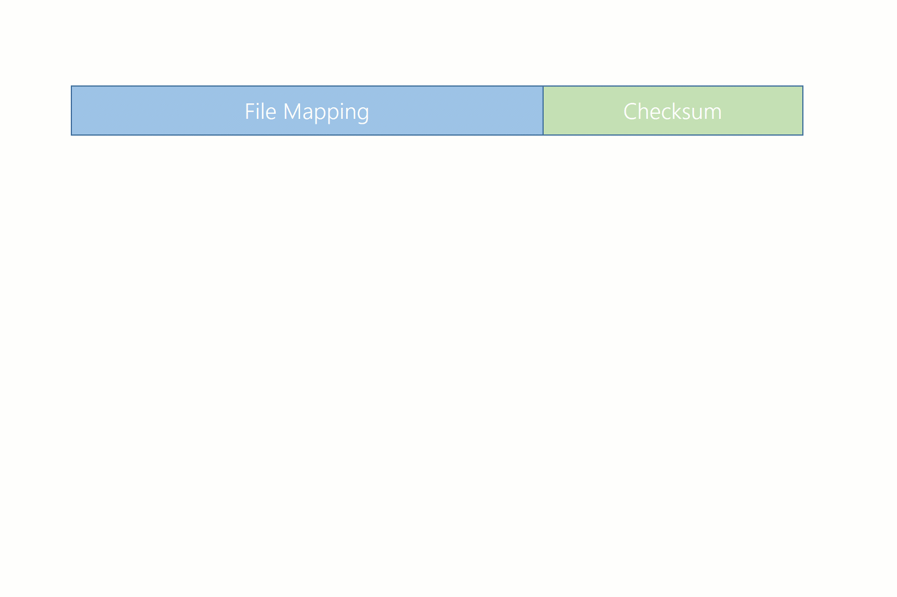
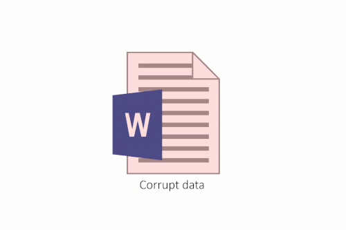

# ReFS integrity streams
>Applies to: Windows Server 2019, Windows Server 2016, Windows Server 2012 R2, Windows Server 2012, Windows Server (Semi-Annual Channel), Windows 10

Integrity streams is an optional feature in ReFS that validates and maintains data integrity using checksums. While ReFS always uses checksums for metadata, ReFS doesn't, by default, generate or validate checksums for file data. Integrity streams is an optional feature that allows users to utilize checksums for file data. When integrity streams are enabled, ReFS can clearly determine if data is valid or corrupt. Additionally, ReFS and Storage Spaces can jointly correct corrupt metadata and data automatically.

## How it works 

Integrity streams can be enabled for individual files, directories, or the entire volume, and integrity stream settings can be toggled at any time. Additionally, integrity stream settings for files and directories are inherited from their parent directories. 

Once integrity streams is enabled, ReFS will create and maintain a checksum for the specified file(s) in that file's metadata. This checksum allows ReFS to validate the integrity of the data before accessing it. Before returning any data that has integrity streams enabled, ReFS will first calculate its checksum:



Then, this checksum is compared to the checksum contained in the file metadata. If the checksums match, then the data is marked as valid and returned to the user. If the checksums don't match, then the data is corrupt. The resiliency of the volume determines how ReFS responds to corruptions:

- If ReFS is mounted on a non-resilient simple space or a bare drive, ReFS will return an error to the user without returning the corrupted data. 
- If ReFS is mounted on a resilient mirror or parity space, ReFS will attempt to correct the corruption. 
    - If the attempt is successful, ReFS will apply a corrective write to restore the integrity of the data, and it will return the valid data to the application. The application remains unaware of any corruptions.
    - If the attempt is unsuccessful, ReFS will return an error. 

ReFS will record all corruptions in the System Event Log, and the log will reflect whether the corruptions were fixed. 



## Performance 

Though integrity streams provides greater data integrity for the system, it also incurs a performance cost. There are a couple different reasons for this:
- If integrity streams are enabled, all write operations become allocate-on-write operations. Though this avoids any read-modify-write bottlenecks since ReFS doesn't need to read or modify any existing data, file data frequently becomes fragmented, which delays reads. 
- Depending on the workload and underlying storage of the system, the computational cost of computing and validating the checksum can cause IO latency to increase. 

Because integrity streams carries a performance cost, we recommend leaving integrity streams disabled on performance sensitive systems. 

## Integrity scrubber

As described above, ReFS will automatically validate data integrity before accessing any data. ReFS also uses a background scrubber, which enables ReFS to validate infrequently accessed data. This scrubber periodically scans the volume, identifies latent corruptions, and proactively triggers a repair of any corrupt data.

  >[!NOTE]
  >The data integrity scrubber can only validate file data for files where integrity streams is enabled.

By default, the scrubber runs every four weeks, though this interval can be configured within Task Scheduler under Microsoft\Windows\Data Integrity Scan. 

## Examples
To monitor and change the file data integrity settings, ReFS uses the **Get-FileIntegrity** and **Set-FileIntegrity** cmdlets.

### Get-FileIntegrity
To see if integrity streams is enabled for file data, use the **Get-FileIntegrity** cmdlet. 

```PowerShell
PS C:\> Get-FileIntegrity -FileName 'C:\Docs\TextDocument.txt'
```

You can also use the **Get-Item** cmdlet to get the integrity stream settings for all the files in a specified directory. 

```PowerShell
PS C:\> Get-Item -Path 'C:\Docs\*' | Get-FileIntegrity
```

### Set-FileIntegrity
To enable/disable integrity streams for file data, use the **Set-FileIntegrity** cmdlet. 

```PowerShell
PS C:\> Set-FileIntegrity -FileName 'H:\Docs\TextDocument.txt' -Enable $True
```

You can also use the **Get-Item** cmdlet to set the integrity stream settings for all the files in a specified folder. 

```PowerShell
PS C:\> Get-Item -Path 'H\Docs\*' | Set-FileIntegrity -Enable $True 
```

The **Set-FileIntegrity** cmdlet can also be used on volumes and directories directly. 

```PowerShell
PS C:\> Set-FileIntegrity H:\ -Enable $True
PS C:\> Set-FileIntegrity H:\Docs -Enable $True
```

## See also

-   [ReFS overview](refs-overview.md)
-   [ReFS block cloning](block-cloning.md)
-   [Storage Spaces Direct overview](../storage-spaces/storage-spaces-direct-overview.md)
