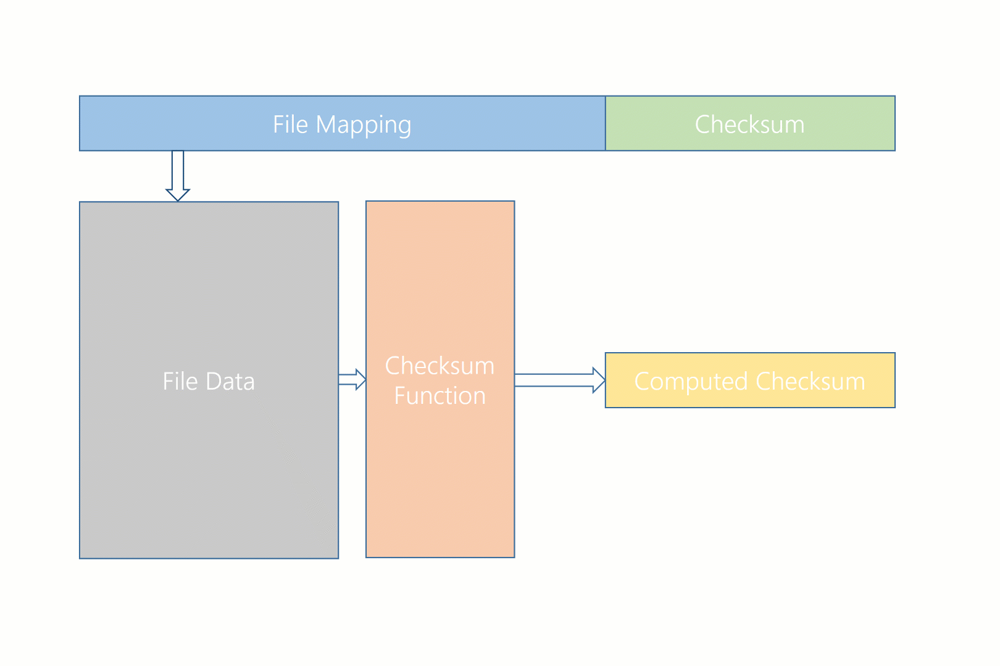
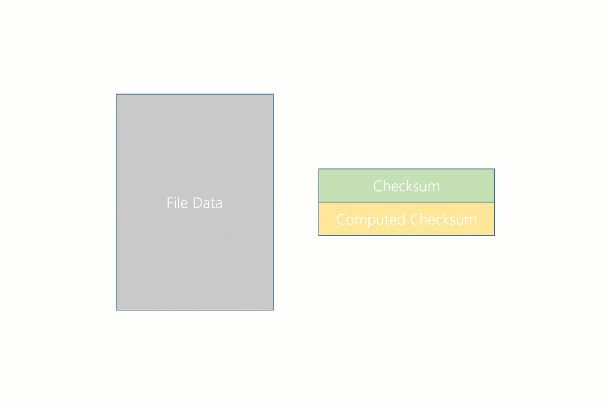
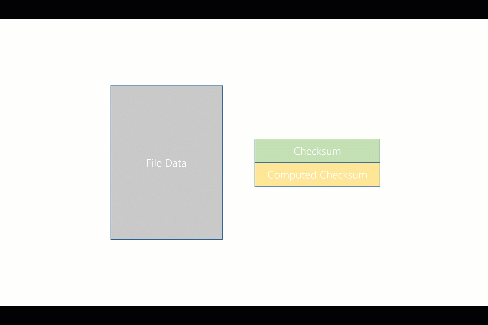

---
# required metadata

title: Integrity streams
description:
author: gawatu
ms.author: jgerend
manager: dmoss
ms.date: 11/14/2016
ms.topic: article
ms.prod: windows-server-threshold
ms.technology: storage
ms.assetid: 1f1215cd-404f-42f2-b55f-3888294d8a1f
---

# Integrity streams
>Applies To: Windows Server 2012, Windows Server 2012 R2, Windows Server 2016

Integrity streams is an optional feature in ReFS that validates and maintains file integrity. ReFS uses checksums for metadata and optionally for file data--file data checksums are disabled by default on current versions of ReFS. Using checksums is an important feature for ReFS, for it enables ReFS to clearly determine if a block is valid or corrupt. Additionally, ReFS can correct corrupt metadata and data if another valid copy of the data exists. 


## How it works 

Once integrity streams is enabled, ReFS will create and maintain a checksum in the metadata for the specified files. This checksum allows ReFS to validate the integrity of the data before accessing it. Before returning any data that has integrity streams enabled, ReFS will first calculate its checksum:


Then, this checksum is compared to the checksum contained in the file metadata:



If the checksums match, then the data is marked as valid and returned to the user:



If the checksums don't match, then the data is corrupted. The resiliency of the volume determines how ReFS responds to corruptions.  
- If ReFS is mounted on a non-resilient simple space or a bare drive, ReFS will return an error to the user without returning the corrupted data. 
    - If ReFS encounters a metadata corruption that it cannot fix, it will delete the file. 
    - If ReFS encounters a file data corruption, ReFS still permits users to access corrupted file data through its [FSCTL](https://msdn.microsoft.com/en-us/library/hh553984.aspx). 
- If ReFS is mounted on a resilient mirror or parity space, ReFS will attempt to correct the corruption. ReFS will apply a corrective write to restore the integrity of the data, and it will return the valid data to the application. The application remains unaware of any corruptions.

ReFS will record all corruptions in the System Event Log, and the log will reflect whether the corruptions were fixed. 




## Performance 

Though integrity streams provides greater data integrity for the system, it also incurs a performance cost. There are a couple different reasons for this:
- Read operations can trigger a write operation if integrity streams are enabled. If a read operation attempts to access corrupted data, ReFS will correct the data by rewriting the data from a valid copy, which increases the IO workload for the system. 
- If integrity streams are enabled, all write operations become allocate-on-write operations. Though this avoids the read-modify-write bottleneck, data frequently becomes fragmented, which delays reads. 

Because integrity streams carries a performance cost, we recommend leaving integrity streams disabled on highly performant systems. 

## Examples
To monitor and change the file data integrity settings, ReFS uses the **Get-FileIntegrity** and **Set-FileIntegrity** cmdlets.

### Get-FileIntegrity
To see if integrity streams is enabled for file data, use the **Get-FileIntegrity** cmdlet. 

```PowerShell
PS C:\> Get-FileIntegrity -FileName 'C:\Docs\TextDocument.txt'
```

You can also use the **Get-Item** cmdlet to get the integrity stream settings for all the files in a specified directory. 

```PowerShell
PS C:\> Get-Item -Path 'C:\Docs\*' | Get-FileIntegrity
```

### Set-FileIntegrity
To enable/disable integrity streams for file data, use the **Set-FileIntegrity** cmdlet. 

```PowerShell
PS C:\> Set-FileIntegrity -FileName 'H:\Docs\TextDocument.txt' -Enable $True
```

You can also use the **Get-Item** cmdlet to set the integrity stream settings for all the files in a specified folder. 

```PowerShell
PS C:\> Get-Item -Path 'H\Docs\*' | Set-FileIntegrity -Enable $True 
```

The **Set-FileIntegrity** cmdlet can also be used on volumes and directories directly. 

```PowerShell
PS C:\> Set-FileIntegrity H:\ -Enable $True
PS C:\> Set-FileIntegrity H:\Docs -Enable $True
```


