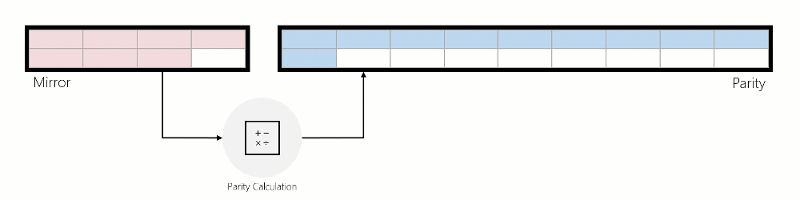

# Mirror-accelerated parity

>Applies to: Windows Server 2019, Windows Server 2016

Storage Spaces can provide fault tolerance for data using two fundamental techniques: mirror and parity. In [Storage Spaces Direct](../storage-spaces/storage-spaces-direct-overview.md), ReFS introduces mirror-accelerated parity, which enables you to create volumes that use both mirror and parity resiliencies. Mirror-accelerated parity offers inexpensive, space-efficient storage without sacrificing performance. 


## Background

Mirror and parity resiliency schemes have fundamentally different storage and performance characteristics:
- Mirror resiliency allows users to attain fast write performance, but replicating the data for each copy isn't space efficient. 
- Parity, on the other hand, must re-compute parity for every write, causing random write performance to suffer. Parity does, however, allow users to store their data with greater space efficiency. For more info, see [Storage Spaces fault tolerance](../storage-spaces/Storage-Spaces-Fault-Tolerance.md).

Thus, mirror is predisposed to deliver performance-sensitive storage while parity offers improved storage capacity utilization. In mirror-accelerated parity, ReFS leverages the benefits of each resiliency type to deliver both capacity-efficient and performance-sensitive storage by combining both resiliency schemes within a single volume.

## Data rotation on mirror-accelerated parity

ReFS actively rotates data between mirror and parity, in real-time. This allows incoming writes to be quickly written to mirror then rotated to parity to be stored efficiently. In doing so, incoming IO is serviced quickly in mirror while cold data is stored efficiently in parity, delivering both optimal performance and lost-cost storage within the same volume. 

To rotate data between mirror and parity, ReFS logically divides the volume into regions of 64 MiB, which are the unit of rotation. The image below depicts a mirror-accelerated parity volume divided into regions. 


ReFS begins rotating full regions from mirror to parity once the mirror tier has reached a specified capacity level. Instead of immediately moving data from mirror to parity, ReFS waits and retains data in mirror as long as possible, allowing ReFS to continue delivering optimal performance for the data (see “IO performance” below). 

When data is moved from mirror to parity, the data is read, parity encodings are computed, and then that data is written to parity. The animation below illustrates this using a three-way mirrored region that is converted into an erasure coded region during rotation:



## IO on mirror-accelerated parity
### IO behavior
**Writes:** ReFS services incoming writes in three distinct ways:

1.	**Writes to Mirror:**

    - **1a.** If the incoming write modifies existing data in mirror, ReFS will modify the data in place.
    - **1b.** If the incoming write is a new write, and ReFS can successfully find enough free space in mirror to service this write, ReFS will write to mirror.
    

2. **Writes to Mirror, Reallocated from Parity:**

    If the incoming write modifies data that's in parity, and ReFS can successfully find enough free space in mirror to service the incoming write, ReFS will first invalidate the previous data in parity and then write to mirror. This invalidation is a quick and inexpensive metadata operation that helps meaningfully improve write performance made to parity.
    

3. **Writes to Parity:**
    
    If ReFS cannot successfully find enough free space in mirror, ReFS will write new data to parity or modify existing data in parity directly. The “Performance optimizations” section below provides guidance that helps minimize writes to parity.
    

**Reads:** ReFS will read directly from the tier containing the relevant data. If parity is constructed with HDDs, the cache in Storage Spaces Direct will cache this data to accelerate future reads. 

> [!NOTE]
> Reads never cause ReFS to rotate data back into the mirror tier. 

### IO performance

**Writes:** Each type of write described above has its own performance characteristics. Roughly speaking, writes to the mirror tier are much faster than reallocated writes, and reallocated writes are significantly faster than writes made directly to the parity tier. This relationship is illustrated by the inequality below: 


- **Mirror Tier > Reallocated Writes >> Parity Tier**


**Reads:** There is no meaningful, negative performance impact when reading from parity:
- If mirror and parity are constructed with the same media type, read performance will be equivalent. 
- If mirror and parity are constructed with different media types—Mirrored SSDs, Parity HDDs, for example—[the cache in Storage Spaces Direct](../storage-spaces/understand-the-cache.md) will help cache hot data to accelerate any reads from parity.

## ReFS compaction

In this Fall's semi-annual release, ReFS introduces compaction, which substantially improves performance for mirror-accelerated parity volumes that are 90+% full. 

**Background:** Previously, as mirror-accelerated parity volumes became full, the performance of these volumes could degrade. The performance degrades because hot and cold data become mixed throughout the volume overtime. This means less hot data can be stored in mirror since cold data occupies space in mirror that could otherwise be used by hot data. Storing hot data in mirror is critical to maintaining high performance because writes directly to mirror are much faster than reallocated writes and orders of magnitude faster than writes directly to parity. Thus, having cold data in mirror is bad for performance, as it reduces the likelihood that ReFS can make writes directly to mirror. 

ReFS compaction addresses these performance issues by freeing up space in mirror for hot data. Compaction first consolidates all data—from both mirror and parity—into parity. This reduces fragmentation within the volume and increases the amount of addressable space in mirror. More importantly, this process enables ReFS to consolidate hot data back into mirror:
-	When new writes come in, they will be serviced in mirror. Thus, newly written, hot data resides in mirror. 
-	When a modifying write is made to data in parity, ReFS makes a reallocated write, so this write is serviced in mirror as well. Consequently, hot data that was moved into parity during compaction will be reallocated back into mirror. 

## Performance optimizations

>[!IMPORTANT]
> We recommend placing write-heavy VHDs in different subdirectories. This is because ReFS writes metadata changes at the level of a directory and its files. So if you distribute write-heavy files across directories, metadata operations are smaller and run in parallel, reducing latency for apps.

### Performance counters

ReFS maintains performance counters to help evaluate the performance of mirror-accelerated parity. 
- As described above in the Write to Parity section, ReFS will write directly to parity when it can't find free space in mirror. Generally, this occurs when the mirrored tier fills up faster than ReFS can rotate data to parity. In other words, ReFS rotation is not able to keep up with the ingestion rate. The performance counters below identify when ReFS writes directly to parity:

  ```
  # Windows Server 2016
  ReFS\Data allocations slow tier/sec
  ReFS\Metadata allocations slow tier/sec

  # Windows Server 2019
  ReFS\Allocation of Data Clusters on Slow Tier/sec
  ReFS\Allocation of Metadata Clusters on Slow Tier/sec
  ```

- If these counters are non-zero, this indicates ReFS is not rotating data fast enough out of mirror. To help alleviate this, one can either change the rotation aggressiveness or increase the size of the mirrored tier.

### Rotation aggressiveness

ReFS begins rotating data once mirror has reached a specified capacity threshold.
-	Higher values of this rotation threshold cause ReFS to retain data in the mirror tier longer. Leaving hot data in the mirror tier is optimal for performance, but ReFS will not be able to effectively service large amounts of incoming IO. 
-	Lower values enable ReFS to proactively destage data and better ingest incoming IO. This is applicable to ingest-heavy workloads, such as archival storage. Lower values, however, could degrade performance for general purpose workloads. Unnecessarily rotating data out of the mirror tier carries a performance penalty. 

ReFS introduces a tunable parameter to adjust this threshold, which is configurable using a registry key. This registry key must be configured on **each node in a Storage Spaces Direct deployment**, and a restart is required for any changes to take effect. 
-	**Key:** HKEY_LOCAL_MACHINE\System\CurrentControlSet\Policies
-	**ValueName (DWORD):** DataDestageSsdFillRatioThreshold
-	**ValueType:** Percentage

If this registry key is not set, ReFS will use a default value of 85%.  This default value is recommended for most deployments, and values below 50% are not recommended. The PowerShell command below demonstrates how to set this registry key with a value of 75%: 
```PowerShell
Set-ItemProperty -Path HKLM:\SYSTEM\CurrentControlSet\Policies -Name DataDestageSsdFillRatioThreshold -Value 75
 ```
 To configure this registry key across each node in a Storage Spaces Direct deployment, you can use the PowerShell command below:
 ```PowerShell
 $Nodes = 'S2D-01', 'S2D-02', 'S2D-03', 'S2D-04'
 Invoke-Command $Nodes {Set-ItemProperty -Path HKLM:\SYSTEM\CurrentControlSet\Policies -Name DataDestageSsdFillRatioThreshold -Value 75}
 ```

### Increasing the size of the mirrored tier

Increasing the size of the mirrored tier enables ReFS to retain a larger portion of the working set in mirror. This improves the likelihood that ReFS can write directly to mirror, which will help achieve better performance. The PowerShell cmdlets below demonstrate how to increase the size of the mirrored tier:
```PowerShell
Resize-StorageTier -FriendlyName “Performance” -Size 20GB
Resize-StorageTier -InputObject (Get-StorageTier -FriendlyName “Performance”) -Size 20GB
```
>[!TIP]
>Make sure to resize the **Partition** and **Volume** after you resize the **StorageTier**. For more information and examples, see [Resize-Volumes](../storage-spaces/resize-volumes.md).

## Creating a mirror-accelerated parity volume

The PowerShell cmdlet below creates a mirror-accelerated parity volume with a Mirror:Parity ratio of 20:80, which is the recommended configuration for most workloads. For more information and examples, see [Creating volumes in Storage Spaces Direct](../storage-spaces/Create-volumes.md).

```PowerShell
New-Volume – FriendlyName “TestVolume” -FileSystem CSVFS_ReFS -StoragePoolFriendlyName “StoragePoolName” -StorageTierFriendlyNames Performance, Capacity -StorageTierSizes 200GB, 800GB
```

## See also

-   [ReFS overview](refs-overview.md)
-   [ReFS block cloning](block-cloning.md)
-   [ReFS integrity streams](integrity-streams.md)
-   [Storage Spaces Direct overview](../storage-spaces/storage-spaces-direct-overview.md)
