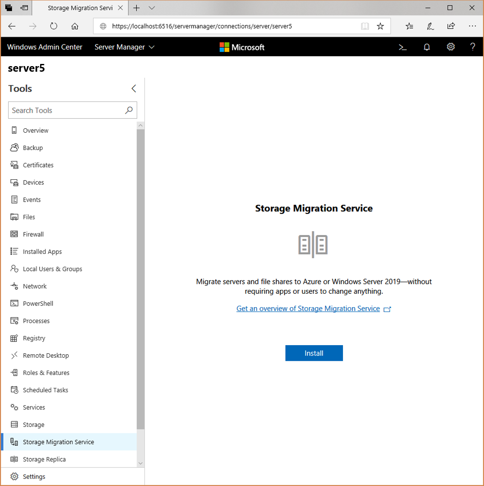
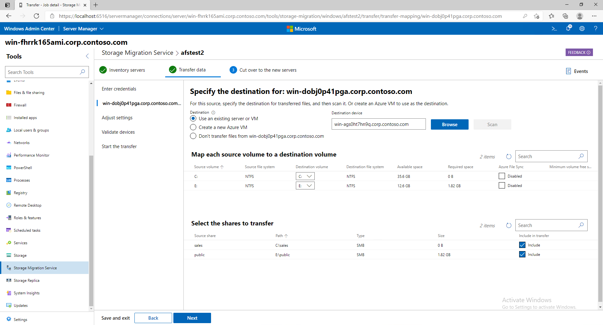

# Use Storage Migration Service to migrate a server

This topic discusses how to migrate a server, including its files and configuration, to another server by using [Storage Migration Service](overview.md) and Windows Admin Center. Migrating takes three steps once you've installed the service and opened any necessary firewall ports: inventory your servers, transfer data, and cut over to the new servers.

## Step 0: Install Storage Migration Service and check firewall ports

Before you get started, install Storage Migration Service and make sure that the necessary firewall ports are open.

1. Check the [Storage Migration Service requirements](overview.md#requirements) and install [Windows Admin Center](../../manage/windows-admin-center/understand/windows-admin-center.md) on your PC or a management server if you haven't already.
2. In Windows Admin Center, connect to the orchestrator server (or the destination server if that's what you're using to manage the migration).
1. Go to **Server Manager** > **Storage Migration Service**, and then select **Install** to install Storage Migration Service and its required components, as shown in Figure 1.
    
     **Figure 1: Installing Storage Migration Service**
1. Install the Storage Migration Service proxy on any source or destination servers running Windows Server 2019. This doubles the transfer speed and opens any necessary firewall ports for you.  To do so, connect to the destination server and then go to **Server Manager** > **Roles and features**, select **Storage Migration Service Proxy**, and then select **Install**.
1. If you're using source or destination servers running Windows Server 2016 or earlier, in Windows Admin Center, connect to each server, go to **Server Manager** > **Firewall** > **Incoming rules**, and then check that the following rules are enabled (there's a good chance they already are):
    - File and Printer Sharing (SMB-In)
    - Netlogon Service (NP-In)
    - Windows Management Instrumentation (DCOM-In)
    - Windows Management Instrumentation (WMI-In)
1. If you're using an orchestrator server to manage the migration and you want to download events or a log of what data you transfer, check that the File and Printer Sharing (SMB-In) firewall rule is enabled on that server as well.

## Step 1: Create a job and inventory your servers to figure out what to migrate

In this step you specify what servers you want to migrate and scan them to collect info on their files and configurations.

1. Select **New job**, name the job, and then select **OK**.
1. On the **Enter credentials** page, type admin credentials that work on the servers you want to migrate from, and then select **Next**.
1. Select **Add a device**, type a source server name, and then select **OK**.  Repeat this for any other servers you want to inventory.
1. Select **Start scan**. The page updates to shows when the scan is complete.
    
     **Figure 2: Inventorying servers**
1. Select each server to review the shares, configuration, network adapters, and volumes that were inventoried. 
1. Select **Next** to move on to transferring data.

## Step 2: Transfer data from your old servers to the destination servers

In this step you transfer data after specifying where on the destination servers to put the data.

 1. On the **Enter credentials** page, type admin credentials that work on the destination servers you want to migrate to, and then select **Next**.
 1. On the **Add a destination device and mappings** page, the first source device is listed. Type the name of the server you want to migrate this server to and then select **Scan device**.
 1. Map the source volumes to destination volumes, clear the **Include** checkbox for any shares you don't want to transfer, and then select **Next**.
    
     **Figure 2: A source server and where its storage will be transferred to**
 1. Add a destination device and mappings for any more source servers, and then select **Next**.
 1. Optionally adjust the transfer settings, and then select **Next**.
 1. Select **Validate** and then select **Next**.
 1. Select **Start transfer** to start transferring data.
 1. After the transfer completes, check out the destination server to make sure everything transferred properly. Select **Error log only** if you want to download a log of any errors that occurred.

At this point, you have two options:

- **Go to the next step**, cutting over so that the destination servers adopt the identities of the source servers.
- **Consider the migration complete** without taking over the source servers' identities.

If your goal is to sync the files with Azure, you could set up the destination servers with Azure File Sync after transferring files, or after cutting over to the destination servers (see [Planning for an Azure File Sync deployment](https://docs.microsoft.com/azure/storage/files/storage-sync-files-planning)).

## Step 3: Optionally cut over to the new servers

In this step you cut over from the source servers to the destination servers, moving the IP addresses and computer names to the destination servers. After this step is finished, apps and users use the old servers' names and addresses to access the new servers.

 1. If you've navigated away from the migration job, in Windows Admin Center, go to **Server Manager** > **Storage Migration Service** and then select the job that you want to complete. 
 1. On the **Cut over to the new servers** > **Enter credentials** page, select **Next** to use the credentials you typed previously.
 1. On the **Configure cutover** page, specify which network adapters to take over each source device's settings. This moves the IP address from the source to the destination as part of the cutover.
 1. Specify what IP address to use for the source server after cutover moves its existing address to the destination. You can use DHCP or a static address.
 1. Specify how to rename the source server after the destination server takes over its existing name. You can use a randomly generated name or type one yourself. Then select **Next**.

    [**Screenshot showing a source server and its IP addresses and computer names and what they'll be replaced with after the cut over**]

 1. Select **Next** on the **Adjust cutover settings** page.
 1. Select **Validate** on the **Validate source and destination device** page, and then select **Next**.
 1. When you're ready to perform the cutover, select **Start cutover**.  Users and apps might experience an interruption while the address and names are moved and the servers restarted several times each, but will otherwise be unaffected by the migration. How long cutover takes depends on how quickly the servers restart, Active Directory and DNS replication times.

## See also

- [Storage Migration Service overview](overview.md)
- [Planning for an Azure File Sync deployment](https://docs.microsoft.com/azure/storage/files/storage-sync-files-planning)