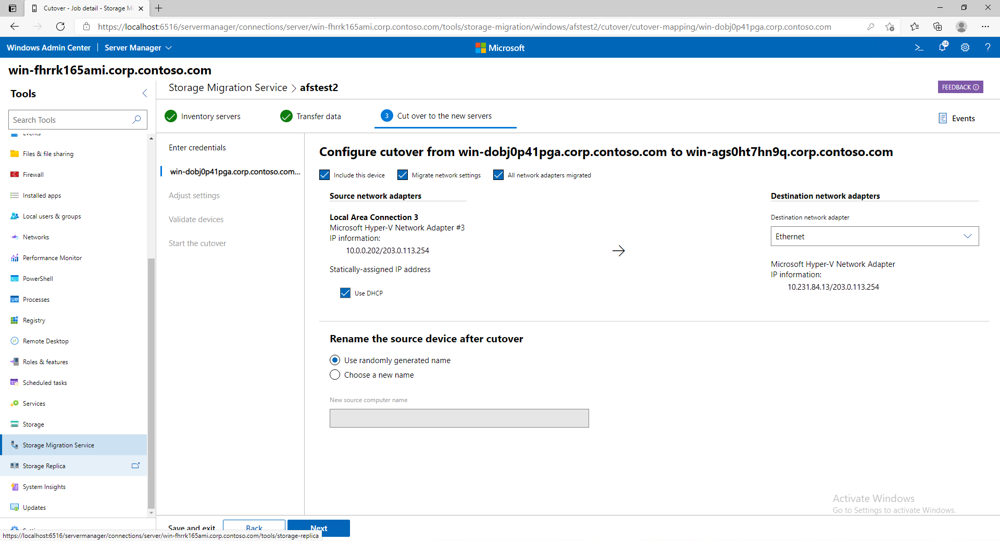

# Use Storage Migration Service to migrate a server

This topic discusses how to migrate a server, including its files and configuration, to another server by using [Storage Migration Service](overview.md) and Windows Admin Center. Migrating takes three steps once you've installed the service and opened any necessary firewall ports: inventory your servers, transfer data, and cut over to the new servers.

## Step 0: Install Storage Migration Service and check firewall ports

Before you get started, install Storage Migration Service and make sure that the necessary firewall ports are open.

1. Check the [Storage Migration Service requirements](overview.md#requirements) and install [Windows Admin Center](../../manage/windows-admin-center/understand/windows-admin-center.md) on your PC or a management server if you haven't already. If migrating domain-joined source computers, you must install and run the Storage Migration Service on a server joined to the same domain or forest as the source computers.
2. In Windows Admin Center, connect to the orchestrator server running Windows Server 2019.  This is the server that you'll install Storage Migration Service on and use to manage the migration. If you're migrating only one server, you can use the destination server as long as it's running Windows Server 2019. We recommend you use a separate orchestration server for any multi-server migrations.
3. Go to **Server Manager** (in Windows Admin Center) > **Storage Migration Service** and select **Install** to install Storage Migration Service and its required components (shown in Figure 1).
    
     **Figure 1: Installing Storage Migration Service**
4. Install the Storage Migration Service proxy on all destination servers running Windows Server 2019. This doubles the transfer speed when installed on destination servers.  To do so, connect to the destination server in Windows Admin Center and then go to **Server Manager** (in Windows Admin Center) > **Roles and features**, > **Features**, select **Storage Migration Service Proxy**, and then select **Install**. 
5. If you intend to migrate to or from Windows Failver Clusters, install the Failover Clustering tools on the orchestrator server.  To do so, connect to the orchestrator server in Windows Admin Center and then go to **Server Manager** (in Windows Admin Center) > **Roles and features**, > **Features**, > **Remote Server Administration Tools**, > **Feature Administration Tools**, select **Failover Clustering Tools**, and then select **Install**. 
6. On all source servers and on any destination servers running Windows Server 2012 R2 or Windows Server 2016, in Windows Admin Center, connect to each server, go to **Server Manager** (in Windows Admin Center) > **Firewall** > **Incoming rules**, and then check that the following rules are enabled:
    - File and Printer Sharing (SMB-In)
    - Netlogon Service (NP-In)
    - Windows Management Instrumentation (DCOM-In)
    - Windows Management Instrumentation (WMI-In)

   If you're using third party firewalls, the inbound port ranges to open are TCP/445 (SMB), TCP/135 (RPC/DCOM endpoint mapper), and TCP 1025-65535 (RPC/DCOM ephemeral ports). The Storage Migration service ports are TCP/28940 (Orchestrator) and TCP/28941 (Proxy).

7. If you're using an orchestrator server to manage the migration and you want to download events or a log of what data you transfer, check that the File and Printer Sharing (SMB-In) firewall rule is enabled on that server as well.

## Step 1: Create a job and inventory your servers to figure out what to migrate

In this step, you specify what servers to migrate and then scan them to collect info on their files and configurations.

1. Select **New job**, name the job, and then select whether to migrate Windows servers and clusters or Linux servers that use Samba. Then select **OK**.
2. On the **Enter credentials** page, type admin credentials that work on the servers you want to migrate from, and then select **Next**.  If you're migrating from Linux servers, instead enter credentials on the **Samba credentials** and **Linux credentials** pages, including an SSH password or private key. 

3. Select **Add a device**, type a source server name or the name of a clustered file server, and then select **OK**.  Repeat this for any other servers that you want to inventory.

4. Select **Start scan**. The page updates to shows when the scan is complete.
    
     **Figure 2: Inventorying servers**
5. Select each server to review the shares, configuration, network adapters, and volumes that were inventoried.   Storage Migration Service won't transfer files or folders that we know could interfere with Windows operation, so in this release you'll see warnings for any shares located in the Windows system folder. You'll have to skip these shares during the transfer phase. For more info, see [What files and folders are excluded from transfers](faq.md#what-files-and-folders-are-excluded-from-transfers).
6. Select **Next** to move on to transferring data.

## Step 2: Transfer data from your old servers to the destination servers

In this step you transfer data after specifying where to put it on the destination servers.

1. On the **Transfer data** > **Enter credentials** page, type admin credentials that work on the destination servers you want to migrate to, and then select **Next**.
2. On the **Add a destination device and mappings** page, the first source server is listed. Type the name of the server or clustered file server to which you want to migrate and then select **Scan device**. If migrating from a domain-joined source computer, the destination server must be joined to the same domain. You can also click "Create a new Azure VM" then use the wizard to deploy a new destination server in Azure. This will automatically size your VM, provision storage, format disks, join the domain, and add the Storage Migration Service proxy to a Windows Server 2019 destination. You can choose from Windows Server 2019 (recommended), Windows Server 2016, and Windows Server 2012 R2 VMs of any size and use managed disks.   

    > [!NOTE]
    > Using "Create a new Azure VM" requires that you have:
    > - A valid Azure subscription.
    > - An existing Azure Compute resource group where you have Create rights.
    > - An existing Azure Virtual Network and subnet. 
    > - An Azure Express Route or VPN solution tied to the Virtual Network and subnet that allows connectivity from this Azure IaaS VM to your on-premises clients, domain controllers, the Storage Migration Service orchestrator computer, the Windows Admin Center computer, and the source computer to be migrated.
   
    Here's a video showing how to use Storage Migration Service to migrate to Azure VMs.
    > [!VIDEO https://www.youtube-nocookie.com/embed/k8Z9LuVL0xQ] 

3. Map the source volumes to destination volumes, clear the **Include** checkbox for any shares you don't want to transfer (including any administrative shares located in the Windows system folder), and then select **Next**.
   
    **Figure 3: A source server and where its storage will be transferred to**
4. Add a destination server and mappings for any more source servers, and then select **Next**.
5. On the **Adjust transfer settings** page, specify whether to migrate local users and groups on the source servers and then select **Next**. This lets you recreate any local users and groups on the destination servers so that file or share permissions set to local users and groups aren't lost. Here are the options when migrating local users and groups:

    - **Rename accounts with the same name** is selected by default and migrates all local users and groups on the source server. If it finds local users or groups with the same name on the source and destination, it renames them on the destination unless they're built-in (for example, the Administrator user and the Administrators group). Do not use this setting if your source or destination server is a domain controller.
    - **Reuse accounts with the same name** maps identically named users and groups on the source and destination. Do not use this setting if your source or destination server is a domain controller.
    - **Don't transfer users and groups** skips migrating local users and groups, which is required when your source or destination is a domain controller, or when seeding data for DFS Replication (DFS Replication doesn't support local groups and users).

   > [!NOTE]
   > Migrated user accounts are disabled on the destination and assigned a 127-character password that's both complex and random, so you'll have to enable them and assign a new password when you're finished to keep using them. This helps ensure any old accounts with forgotten and weak passwords on the source don't continue to be a security problem on the destination. You might also want to check out [Local Administrator Password Solution (LAPS)](https://www.microsoft.com/download/details.aspx?id=46899) as a way to manage local Administrator passwords.

6. Select **Validate** and then select **Next**.
7. Select **Start transfer** to start transferring data. The first time you transfer, we'll move any existing files in a destination to a backup folder. On subsequent transfers, by default we'll refresh the destination without backing it up first.  Also, Storage Migration Service is smart enough to deal with overlapping shares—we won't copy the same folders twice in the same job.
8. After the transfer completes, check out the destination server to make sure everything transferred properly. Select **Error log only** if you want to download a log of any files that didn't transfer.

   > [!NOTE]
   > If you want to keep an audit trail of transfers or are planning to perform more than one transfer in a job, click **Transfer log** or the other log save options to save a CSV copy. Every subsequent transfer overwrites the database information of a previous run. 

At this point, you have three options:

- **Go to the next step**, cutting over so that the destination servers adopt the identities of the source servers.
- **Consider the migration complete** without taking over the source servers' identities.
- **Transfer again**, copying only files that were updated since the last transfer.

If your goal is to sync the files with Azure, you could set up the destination servers with Azure File Sync after transferring files, or after cutting over to the destination servers (see [Planning for an Azure File Sync deployment](https://docs.microsoft.com/azure/storage/files/storage-sync-files-planning)).

## Step 3: Cut over to the new servers

In this step you cut over from the source servers to the destination servers, moving the IP addresses and computer names to the destination servers. After this step is finished, apps and users access the new servers via the names and addresses of the servers you migrated from.

1. If you've navigated away from the migration job, in Windows Admin Center, go to **Server Manager** > **Storage Migration Service** and then select the job that you want to complete.
2. On the **Cut over to the new servers** > **Enter credentials** page, select **Next** to use the credentials you typed previously.

   If your destination is a clustered file server, you might need to provide credentials with permissions to remove the cluster from the domain and then add it back with the new name.

3. On the **Configure cutover** page, specify which network adapter on the destination should take over the settings from each adapter on the source. This moves the IP address from the source to the destination as part of the cutover, giving the source server a new DHCP or static IP address. You have the option to skip all network migrations or certain interfaces. 
4. Specify what IP address to use for the source server after cutover moves its address to the destination. You can use DHCP or a static address. If using a static address, the new subnet must be the same as the old subnet or cutover will fail.
    
    **Figure 4: A source server and how its network configuration will move to the destination**
5. Specify how to rename the source server after the destination server takes over its name. You can use a randomly generated name or type one yourself. Then select **Next**.
6. Select **Next** on the **Adjust cutover settings** page.
7. Select **Validate** on the **Validate source and destination device** page, and then select **Next**.
8. When you're ready to perform the cutover, select **Start cutover**.  Users and apps might experience an interruption while the address and names are moved and the servers restarted several times each, but will otherwise be unaffected by the migration. How long cutover takes depends on how quickly the servers restart, as well as Active Directory and DNS replication times.

## See also

- [Storage Migration Service overview](overview.md)
- [Storage Migration Services frequently asked questions (FAQ)](faq.md)
- [Planning for an Azure File Sync deployment](https://docs.microsoft.com/azure/storage/files/storage-sync-files-planning)
