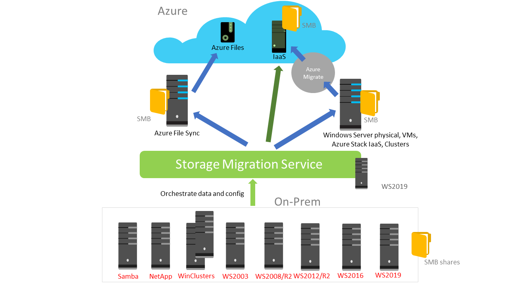
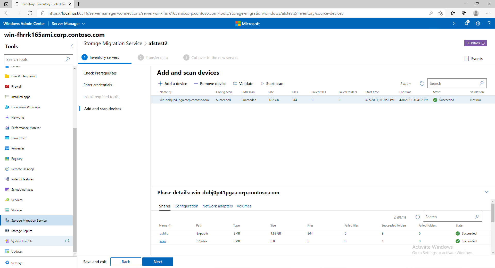

# Storage Migration Service overview

>Applies to: Windows Server 2019, Windows Server 2016, Windows Server 2012 R2, Windows Server (Semi-Annual Channel)

Storage Migration Service makes it easier to migrate storage to Windows Server or to Azure. It provides a graphical tool that inventories data on Windows and Linux servers and then transfers the data to newer servers or to Azure virtual machines. Storage Migration Service also provides the option to transfer the identity of a server to the destination server so that apps and users can access their data without changing links or paths.

This topic discusses why you'd want to use Storage Migration Service, how the migration process works, what the requirements are for source and destination servers, and [what's new in Storage Migration Service](#whats-new-in-storage-migration-service).

## Why use Storage Migration Service

Use Storage Migration Service because you've got a server (or a lot of servers) that you want to migrate to newer hardware or virtual machines. Storage Migration Service is designed to help by doing the following:

- Inventory multiple servers and their data
- Rapidly transfer files, file shares, and security configuration from the source servers
- Optionally take over the identity of the source servers (also known as cutting over) so that users and apps don't have to change anything to access existing data
- Manage one or multiple migrations from the Windows Admin Center user interface

**Figure 1: Storage Migration Service sources and destinations**

## How the migration process works

Migration is a three-step process:

1. **Inventory servers** to gather info about their files and configuration (shown in Figure 2).
2. **Transfer (copy) data** from the source servers to the destination servers.
3. **Cut over to the new servers** (optional). The destination servers assume the source servers' former identities so that apps and users don't have to change anything.  The source servers enter a maintenance state where they still contain the same files they always have (we never remove files from the source servers) but are unavailable to users and apps. You can then decommission the servers at your convenience.

**Figure 2: Storage Migration Service inventorying servers**

Here's a video showing how to use Storage Migration Service to take a server, such as a Windows Server 2008 R2 server that's now out of support, and move the storage to a newer server.

> [!VIDEO https://www.youtube.com/embed/h-Xc9j1w144]

## Requirements

To use Storage Migration Service, you need the following:

- A **source server** or **failover cluster** to migrate files and data from
- A **destination server** running Windows Server 2019 (clustered or standalone) to migrate to. Windows Server 2016 and Windows Server 2012 R2 work as well but are around 50% slower
- An **orchestrator server** running Windows Server 2019 to manage the migration   If you're migrating only a few servers and one of the servers is running Windows Server 2019, you can use that as the orchestrator. If you're migrating more servers, we recommend using a separate orchestrator server.
- A **PC or server running [Windows Admin Center](../../manage/windows-admin-center/understand/windows-admin-center.md)** to run the Storage Migration Service user interface, unless you prefer using PowerShell to manage the migration. The Windows Admin Center and Windows Server 2019 version must both be at least version 1809.

We strongly recommend that the orchestrator and destination computers have at least two cores or two vCPUs, and at least 2 GB of memory. Inventory and transfer operations are significantly faster with more processors and memory.

### Security requirements, the Storage Migration Service proxy service, and firewall ports

- A migration account that is an administrator on the source computers and the orchestrator computer.
- A migration account that is an administrator on the destination computers and the orchestrator computer.
- The orchestrator computer must have the File and Printer Sharing (SMB-In) firewall rule enabled *inbound*.
- The source and destination computers must have the following firewall rules enabled *inbound* (though you might already have them enabled):
  - File and Printer Sharing (SMB-In)
  - Netlogon Service (NP-In)
  - Windows Management Instrumentation (DCOM-In)
  - Windows Management Instrumentation (WMI-In)
  
  > [!TIP]
  > Installing the Storage Migration Service Proxy service on a Windows Server 2019 computer automatically opens the necessary firewall ports on that computer. To do so, connect to the destination server in Windows Admin Center and then go to **Server Manager** (in Windows Admin Center) > **Roles and features**, select **Storage Migration Service Proxy**, and then select **Install**.

- If the computers belong to an Active Directory Domain Services domain, they should all belong to the same forest. The destination server must also be in the same domain as the source server if you want to transfer the source's domain name to the destination when cutting over. Cutover technically works across domains, but the fully-qualified domain name of the destination will be different from the source...

### Requirements for source servers

The source server must run one of the following operating systems:

- Windows Server, Semi-Annual Channel
- Windows Server 2019
- Windows Server 2016
- Windows Server 2012 R2
- Windows Server 2012
- Windows Server 2008 R2
- Windows Server 2008
- Windows Server 2003 R2
- Windows Server 2003
- Windows Small Business Server 2003 R2
- Windows Small Business Server 2008
- Windows Small Business Server 2011
- Windows Server 2012 Essentials
- Windows Server 2012 R2 Essentials
- Windows Server 2016 Essentials
- Windows Server 2019 Essentials
- Windows Storage Server 2008
- Windows Storage Server 2008 R2
- Windows Storage Server 2012
- Windows Storage Server 2012 R2
- Windows Storage Server 2016

Note: Windows Small Business Server and Windows Server Essentials are domain controllers. Storage Migration Service can't yet cut over from domain controllers, but can inventory and transfer files from them.   

You can migrate the following additional source types if the orchestrator is running Windows Server, version 1903 or later, or if the orchestrator is running an earlier version of Windows Server with [KB4512534](https://support.microsoft.com/help/4512534/windows-10-update-kb4512534) installed:

- Failover clusters running Windows Server 2012, Windows Server 2012 R2, Windows Server 2016, Windows Server 2019
- Linux servers that use Samba. We've tested the following:
    - CentOS 7
    - Debian GNU/Linux 8
    - RedHat Enterprise Linux 7.6
    - SUSE Linux Enterprise Server (SLES) 11 SP4
    - Ubuntu 16.04 LTS and 12.04.5 LTS
    - Samba 4.8, 4.7, 4.3, 4.2, and 3.6

### Requirements for destination servers

The destination server must run one of the following operating systems:

- Windows Server, Semi-Annual Channel
- Windows Server 2019
- Windows Server 2016
- Windows Server 2012 R2

> [!TIP]
> Destination servers running Windows Server 2019 or Windows Server, Semi-Annual Channel or later have double the transfer performance of earlier versions of Windows Server. This performance boost is due to the inclusion of a built-in Storage Migration Service proxy service, which also opens the necessary firewall ports if they're not already open.

## Azure VM Migration

Windows Admin Center version 1910 allows you to deploy Azure virtual machines. This integrates VM deployment into Storage Migration Service. Instead of building new servers and VMs in the Azure Portal by hand prior to deploying your workload - and possibly missing required steps and configuration - Windows Admin Center can deploy the Azure VM, configure its storage, join it to your domain, install roles, and then set up your distributed system. 

   Here's a video showing how to use Storage Migration Service to migrate to Azure VMs.
   > [!VIDEO https://www.youtube-nocookie.com/embed/k8Z9LuVL0xQ] 

## What's new in Storage Migration Service

Windows Admin Center version 1910 adds the ability to deploy Azure virtual machines. This integrates Azure VM deployment into Storage Migration Service. For more info, see [Azure VM migration](#azure-vm-migration).

The following new features are available when running the Storage Migration Server orchestrator on Windows Server, version 1903 or later, or an earlier version of Windows Server with [KB4512534](https://support.microsoft.com/help/4512534/windows-10-update-kb4512534) installed:

- Migrate local users and groups to the new server
- Migrate storage from failover clusters, migrate to failover clusters, and migrate between standalone servers and failover clusters
- Migrate storage from a Linux server that uses Samba
- More easily sync migrated shares into Azure by using Azure File Sync
- Migrate to new networks such as Azure

## See also

- [Migrate a file server by using Storage Migration Service](migrate-data.md)
- [Storage Migration Services frequently asked questions (FAQ)](faq.md)
- [Storage Migration Service known issues](known-issues.md)
