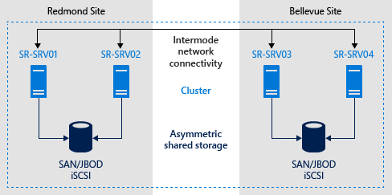

# Stretch Cluster Replication Using Shared Storage

>Applies to: Windows Server 2019, Windows Server 2016, Windows Server (Semi-Annual Channel)

In this evaluation example, you will configure these computers and their storage in a single stretch cluster, where two nodes share one set of storage and two nodes share another set of storage, then replication keeps both sets of storage mirrored in the cluster to allow immediate failover. These nodes and their storage should be located in separate physical sites, although it is not required. There are separate steps for creating Hyper-V and File Server clusters as sample scenarios.  

> [!IMPORTANT]  
> In this evaluation, servers in different sites must be able to communicate with the other servers via a network, but not have any physical connectivity to the other site's shared storage. This scenario does not make use of Storage Spaces Direct.  

## Terms  
This walkthrough uses the following environment as an example:  

-   Four servers, named **SR-SRV01**, **SR-SRV02**, **SR-SRV03**, and **SR-SRV04** formed into a single cluster called **SR-SRVCLUS**.  

-   A pair of logical "sites" that represent two different data centers, with one called **Redmond** and the other called **Bellevue.**  

> [!NOTE]  
> You can use only as few as two nodes, where one node each is in each site. However, you will not be able to perform intra-site failover with only two servers. You can use as many as 64 nodes.

  

**FIGURE 1:  Storage Replication in a stretch cluster**  

## Prerequisites  
-   Active Directory Domain Services forest (does not need to run Windows Server 2016).  
-   2-64 servers running Windows Server 2019 or Windows Server 2016, Datacenter Edition. If you're running Windows Server 2019, you can instead use Standard Edition if you're OK replicating only a single volume up to 2 TB in size. 
-   Two sets of shared storage, using SAS JBODs (such as with Storage Spaces), Fibre Channel SAN, Shared VHDX, or iSCSI Target. The storage should contain a mix of HDD and SSD media and must support Persistent Reservation. You will make each storage set available to two of the servers only (asymmetric).  
-   Each set of storage must allow creation of at least two virtual disks, one for replicated data and one for logs. The physical storage must have the same sector sizes on all the data disks. The physical storage must have the same sector sizes on all the log disks.  
-   At least one 1GbE connection on each server for synchronous replication, but preferably RDMA.   
-   At least 2GB of RAM and two cores per server. You will need more memory and cores for more virtual machines.  
-   Appropriate firewall and router rules to allow ICMP, SMB (port 445, plus 5445 for SMB Direct) and WS-MAN (port 5985) bi-directional traffic between all nodes.  
-   A network between servers with enough bandwidth to contain your IO write workload and an average of =5ms round trip latency, for synchronous replication. Asynchronous replication does not have a latency recommendation.  
-   The replicated storage cannot be located on the drive containing the Windows operating system folder.

Many of these requirements can be determined by using the `Test-SRTopology` cmdlet. You get access to this tool if you install Storage Replica or the Storage Replica Management Tools features on at least one server. There is no need to configure Storage Replica to use this tool, only to install the cmdlet. More information is included in the following steps.  

## Provision operating system, features, roles, storage, and network  

1.  Install Windows Server on all server nodes, using either the Server Core or Server with Desktop Experience installation options.  
    > [!IMPORTANT]
    > From this point on, always logon as a domain user who is a member of the built-in administrator group on all servers. Always remember to elevate your PowerShell and CMD prompts going forward when running on a graphical server installation or on a Windows 10 computer.

2.  Add network information and join the nodes to the domain, then restart them.  
    > [!NOTE]
    > As of this point, the guide presumes you have two pairings of servers for use in a stretch cluster. A WAN or LAN network separate the servers and the servers belong to either physical or logical sites. The guide considers **SR-SRV01** and **SR-SRV02** to be in site Redmond and **SR-SRV03** and **SR-SRV04** to be in site **Bellevue**.  

3.  Connect the first set of shared JBOD storage enclosure, Shared VHDX, iSCSI target, or FC SAN to the servers in site **Redmond**.  

4.  Connect the second set of storage to the servers in site **Bellevue**.  

5.  As appropriate, install latest vendor storage and enclosure firmware and drivers, latest vendor HBA drivers, latest vendor BIOS/UEFI firmware, latest vendor network drivers, and latest motherboard chipset drivers on all four nodes. Restart nodes as needed.  

    > [!NOTE]
    > Consult your hardware vendor documentation for configuring shared storage and networking hardware.  

6.  Ensure that BIOS/UEFI settings for servers enable high performance, such as disabling C-State, setting QPI speed, enabling NUMA, and setting highest memory frequency. Ensure power management in Windows Server is set to high performance. Restart as required.  

7.  Configure roles as follows:  

    -   **Graphical method**  

        Run **ServerManager.exe** and add all server nodes by clicking **Manage** and **Add Servers**.  

        > [!IMPORTANT]
        > Install the **Failover Clustering**, and **Storage Replica** roles and features on each of the nodes and restart them. If planning to use other roles like Hyper-V, File Server, etc. you can install them now too.  

    -   **Using Windows PowerShell method**  

        On **SR-SRV04** or a remote management computer, run the following command in a Windows PowerShell console to install the required features and roles for a stretch cluster on the four nodes and restart them:  

        ```PowerShell  
        $Servers = 'SR-SRV01','SR-SRV02','SR-SRV03','SR-SRV04'  

        $Servers | foreach { Install-WindowsFeature -ComputerName $_ -Name Storage-Replica,Failover-Clustering,FS-FileServer -IncludeManagementTools -restart }  

        ```  

        For more information on these steps, see [Install or Uninstall Roles, Role Services, or Features](../../administration/server-manager/install-or-uninstall-roles-role-services-or-features.md).  


8. Configure storage as follows:  

    > [!IMPORTANT]  
    > -   You must create two volumes on each enclosure: one for data and one for logs.  
    > -   Log and data disks must be initialized as GPT, not MBR.  
    > -   The two data volumes must be of identical size.  
    > -   The two log volumes should be of identical size.  
    > -   All replicated data disks must have the same sector sizes.  
    > -   All log  disks must have the same sector sizes.  
    > -   The log volumes should use flash-based storage and high performance resiliency settings. Microsoft recommends that the log storage be as faster than the data storage. Log volumes must never be used for other workloads. 
    > -   The data disks can use HDD, SSD, or a tiered combination and can use either mirrored or parity spaces or RAID 1 or 10, or RAID 5 or RAID 50.  
    > -  The log volume must be at least 9GB by default and can to be larger or smaller based on log requirements.  
    > - The volumes must be formatted with NTFS or ReFS.
    > - The File Server role is only necessary for Test-SRTopology to operate, as it opens the necessary firewall ports for testing.  

    -   **For JBOD enclosures:**  

        1.  Ensure that each set of paired server nodes can see that site's storage enclosures only (i.e. asymmetric storage) and that the SAS connections are correctly configured.  

        2.  Provision the storage using Storage Spaces by following **Steps 1-3** provided in the [Deploy Storage Spaces on a Stand-Alone Server](../storage-spaces/deploy-standalone-storage-spaces.md) using Windows PowerShell or Server Manager.  

    -   **For iSCSI storage:**  

        1.  Ensure that each set of paired server nodes can see that site's storage enclosures only (i.e. asymmetric storage). You should use more than one single network adapter if using iSCSI.  

        2.  Provision the storage using your vendor documentation. If using Windows-based iSCSI Targeting, consult [iSCSI Target Block Storage, How To](../iscsi/iscsi-target-server.md).  

    -   **For FC SAN storage:**  

        1.  Ensure that each set of paired server nodes can see that site's storage enclosures only (i.e. asymmetric storage) and that you have properly zoned the hosts.  

        2.  Provision the storage using your vendor documentation.  

## Configure a Hyper-V Failover Cluster or a File Server for a General Use Cluster

After you setup your server nodes, the next step is to create one of the following types of clusters:  
*  [Hyper-V failover cluster](#BKMK_HyperV)  
*  [File Server for general use cluster](#BKMK_FileServer)  

### <a name="BKMK_HyperV"></a> Configure a Hyper-V Failover Cluster  

>[!NOTE]
> Skip this section and go to the  [Configure a file server for general use cluster](#BKMK_FileServer) section,  if you want to create a file server cluster and not a Hyper-V cluster.  

You will now create a normal failover cluster. After configuration, validation, and testing, you will stretch it using Storage Replica. You can perform all of the steps below on the cluster nodes directly or from a remote management computer that contains the Windows Server Remote Server Administration Tools.  

#### Graphical method  

1. Run **cluadmin.msc**.  

2. Validate the proposed cluster and analyze the results to ensure you can continue.  

   > [!NOTE]  
   > You should expect storage errors from cluster validation, due to the use of asymmetric storage.  

3. Create the Hyper-V compute cluster. Ensure that the cluster name is 15 characters or fewer. The example used below is SR-SRVCLUS. If the nodes are going to reside in different subnets, you must create an IP Address for the Cluster Name for each subnet and use the “OR” dependency.  More information can be found at [Configuring IP Addresses and Dependencies for Multi-Subnet Clusters – Part III](https://techcommunity.microsoft.com/t5/Failover-Clustering/Configuring-IP-Addresses-and-Dependencies-for-Multi-Subnet/ba-p/371698).  

4. Configure a File Share Witness or Cloud Witness to provide quorum in the event of site loss.  

   > [!NOTE]  
   > WIndows Server now includes an option for Cloud (Azure)-based Witness. You can choose this quorum option instead of the file share witness.  

   > [!WARNING]  
   > For more information about quorum configuration, see the [Configure and Manage the Quorum in a Windows Server 2012 Failover Cluster guide's Witness Configuration](https://technet.microsoft.com/library/jj612870.aspx). For more information on the `Set-ClusterQuorum` cmdlet, see [Set-ClusterQuorum](https://docs.microsoft.com/powershell/module/failoverclusters/set-clusterquorum).  

5. Review [Network Recommendations for a Hyper-V Cluster in Windows Server 2012](https://technet.microsoft.com/library/dn550728.aspx) and ensure that you have optimally configured cluster networking.  

6. Add one disk in the Redmond site to the cluster CSV. To do so, right click a source disk in the **Disks** node of the **Storage** section, and then click **Add to Cluster Shared Volumes**.  

7. Using the [Deploy a Hyper-V Cluster](https://technet.microsoft.com/library/jj863389.aspx) guide, follow steps 7-10 within **Redmond** site to create a test virtual machine only to ensure the cluster is working normally within the two nodes sharing the storage in the first test site.  

8. If you're creating a two-node stretch cluster, you must add all storage before continuing. To do so, open a PowerShell session with administrative permissions on the cluster nodes, and run the following command: `Get-ClusterAvailableDisk -All | Add-ClusterDisk`.

   This is by-design behavior in Windows Server 2016.

9. Start Windows PowerShell and use the `Test-SRTopology` cmdlet to determine if you meet all the Storage Replica requirements.  

    For example, to validate two of the proposed stretch cluster nodes that each have a **D:** and **E:** volume and run the test for 30 minutes:
   1. Move all available storage to **SR-SRV01**.
   2. Click **Create Empty Role** in the **Roles** section of Failover Cluster Manager.
   3. Add the online storage to that empty role named **New Role**.
   4. Move all available storage to **SR-SRV03**.
   5. Click **Create Empty Role** in the **Roles** section of Failover Cluster Manager.
   6. Move the empty **New Role (2)** to **SR-SRV03**.
   7. Add the online storage to that empty role named **New Role (2)**.
   8. Now you have mounted all your storage with drive letters, and can evaluate the cluster with `Test-SRTopology`.

       For example:

           MD c:\temp  

           Test-SRTopology -SourceComputerName SR-SRV01 -SourceVolumeName D: -SourceLogVolumeName E: -DestinationComputerName SR-SRV03 -DestinationVolumeName D: -DestinationLogVolumeName E: -DurationInMinutes 30 -ResultPath c:\temp        

      > [!IMPORTANT]
      > When using a test server with no write IO load on the specified source volume during the evaluation period, consider adding a workload or it Test-SRTopology will not generate a useful report. You should test with production-like workloads in order to see real numbers and recommended log sizes. Alternatively, simply copy some files into the source volume during the test or download and run DISKSPD to generate write IOs. For instance, a sample with a low write IO workload for ten minutes to the D: volume:   
       `Diskspd.exe -c1g -d600 -W5 -C5 -b4k -t2 -o2 -r -w5 -i100 d:\test.dat`  

10. Examine the **TestSrTopologyReport-< date >.html** report to ensure you meet the Storage Replica requirements and note the initial sync time prediction and log recommendations.  

      

11. Return the disks to Available Storage and remove the temporary empty roles.

12. Once satisfied, remove the test virtual machine. Add any real test virtual machines needed for further evaluation to a proposed source node.  

13. Configure stretch cluster site awareness so that servers **SR-SRV01** and **SR-SRV02** are in site **Redmond**, **SR-SRV03** and **SR-SRV04** are in site **Bellevue**, and **Redmond** is preferred for node ownership of the source storage and VMs:  

    ```PowerShell
    New-ClusterFaultDomain -Name Seattle -Type Site -Description "Primary" -Location "Seattle Datacenter"  
   
    New-ClusterFaultDomain -Name Bellevue -Type Site -Description "Secondary" -Location "Bellevue Datacenter"  
   
    Set-ClusterFaultDomain -Name sr-srv01 -Parent Seattle  
    Set-ClusterFaultDomain -Name sr-srv02 -Parent Seattle  
    Set-ClusterFaultDomain -Name sr-srv03 -Parent Bellevue  
    Set-ClusterFaultDomain -Name sr-srv04 -Parent Bellevue  

    (Get-Cluster).PreferredSite="Seattle"
    ```

    > [!NOTE]
    > There is no option to configure site awareness using Failover Cluster Manager in Windows Server 2016.  

14. **(Optional)** Configure cluster networking and Active Directory for faster DNS site failover. You can utilize Hyper-V software defined networking, stretched VLANs, network abstraction devices, lowered DNS TTL, and other common techniques.

    For more information, review the Microsoft Ignite session: [Stretching Failover Clusters and Using Storage Replica in Windows Server vNext](http://channel9.msdn.com/Events/Ignite/2015/BRK3487) and the [Enable Change Notifications between Sites - How and Why?](http://blogs.technet.com/b/qzaidi/archive/2010/09/23/enable-change-notifications-between-sites-how-and-why.aspx) blog post.  

15. **(Optional)** Configure VM resiliency so that guests do not pause for long during node failures. Instead, they failover to the new replication source storage within 10 seconds.  

    ```PowerShell  
    (Get-Cluster).ResiliencyDefaultPeriod=10  
    ```  

    > [!NOTE]
    >  There is no option to configure VM resiliency using Failover Cluster Manager in  Windows Server 2016.  

#### Windows PowerShell method  

1. Test the proposed cluster and analyze the results to ensure you can continue:  

   ```PowerShell  
   Test-Cluster SR-SRV01, SR-SRV02, SR-SRV03, SR-SRV04  
   ```  

   > [!NOTE]
   >  You should expect storage errors from cluster validation, due to the use of asymmetric storage.  

2. Create the Hyper-V compute cluster (you must specify your own static IP address the cluster will use). Ensure that the cluster name is 15 characters or fewer.  If the nodes reside in different subnets, than an IP Address for the additional site must be created using the “OR” dependency. More information can be found at [Configuring IP Addresses and Dependencies for Multi-Subnet Clusters – Part III](https://techcommunity.microsoft.com/t5/Failover-Clustering/Configuring-IP-Addresses-and-Dependencies-for-Multi-Subnet/ba-p/371698).
   ```PowerShell  
   New-Cluster -Name SR-SRVCLUS -Node SR-SRV01, SR-SRV02, SR-SRV03, SR-SRV04 -StaticAddress <your IP here>  
   Add-ClusterResource -Name NewIPAddress -ResourceType “IP Address” -Group “Cluster Group”
   Set-ClusterResourceDependency -Resource “Cluster Name” -Dependency “[Cluster IP Address] or [NewIPAddress]”
   ```  

3. Configure a File Share Witness or Cloud (Azure) witness in the cluster that points to a share hosted on the domain controller or some other independent server. For example:  

   ```PowerShell  
   Set-ClusterQuorum -FileShareWitness \\someserver\someshare  
   ```  

   > [!NOTE]
   > WIndows Server now includes an option for Cloud (Azure)-based Witness. You can choose this quorum option instead of the file share witness.  
    
   For more information about quorum configuration, see the [Configure and Manage the Quorum in a Windows Server 2012 Failover Cluster guide's Witness Configuration](https://technet.microsoft.com/library/jj612870.aspx). For more information on the `Set-ClusterQuorum` cmdlet, see [Set-ClusterQuorum](https://docs.microsoft.com/powershell/module/failoverclusters/set-clusterquorum).  

4. Review [Network Recommendations for a Hyper-V Cluster in Windows Server 2012](https://technet.microsoft.com/library/dn550728.aspx) and ensure that you have optimally configured cluster networking.  

5. If you're creating a two-node stretch cluster, you must add all storage before continuing. To do so, open a PowerShell session with administrative permissions on the cluster nodes, and run the following command: `Get-ClusterAvailableDisk -All | Add-ClusterDisk`.

   This is by-design behavior in Windows Server 2016.

6. Using the [Deploy a Hyper-V Cluster](https://technet.microsoft.com/library/jj863389.aspx) guide, follow steps 7-10 within **Redmond** site to create a test virtual machine only to ensure the cluster is working normally within the two nodes sharing the storage in the first test site.  

7. Once satisfied, remove the test VM. Add any real test virtual machines needed for further evaluation to a proposed source node.  

8. Configure stretch cluster site awareness so that servers **SR-SRV01** and **SR-SRV02** are in site **Redmond**, **SR-SRV03** and **SR-SRV04** are in site **Bellevue**, and **Redmond** is preferred for node ownership of the source storage and virtual machines:  

   ```PowerShell  
   New-ClusterFaultDomain -Name Seattle -Type Site -Description "Primary" -Location "Seattle Datacenter"  

   New-ClusterFaultDomain -Name Bellevue -Type Site -Description "Secondary" -Location "Bellevue Datacenter"  

   Set-ClusterFaultDomain -Name sr-srv01 -Parent Seattle  
   Set-ClusterFaultDomain -Name sr-srv02 -Parent Seattle  
   Set-ClusterFaultDomain -Name sr-srv03 -Parent Bellevue  
   Set-ClusterFaultDomain -Name sr-srv04 -Parent Bellevue  

   (Get-Cluster).PreferredSite="Seattle"  
   ```  

9. **(Optional)** Configure cluster networking and Active Directory for faster DNS site failover. You can utilize Hyper-V software defined networking, stretched VLANs, network abstraction devices, lowered DNS TTL, and other common techniques.  

   For more information, review the Microsoft Ignite session: [Stretching Failover Clusters and Using Storage Replica in Windows Server vNext](http://channel9.msdn.com/Events/Ignite/2015/BRK3487) and [Enable Change Notifications between Sites - How and Why](http://blogs.technet.com/b/qzaidi/archive/2010/09/23/enable-change-notifications-between-sites-how-and-why.aspx).  

10. **(Optional)** Configure VM resiliency so that guests do not pause for long periods during node failures. Instead, they failover to the new replication source storage within 10 seconds.  

    ```PowerShell  
    (Get-Cluster).ResiliencyDefaultPeriod=10  
    ```  

    > [!NOTE]  
    > There is no option to VM Resiliency using Failover Cluster Manager in Windows Server 2016.  


### <a name="BKMK_FileServer"></a> Configure a File Server for General Use Cluster  

>[!NOTE]
> Skip this section if you have already configured a Hyper-V Failover cluster as described in [Configure a Hyper-V Failover Cluster](#BKMK_HyperV).  

You will now create a normal failover cluster. After configuration, validation, and testing, you will stretch it using Storage Replica. You can perform all of the steps below on the cluster nodes directly or from a remote management computer that contains the Windows Server Remote Server Administration Tools.  

#### Graphical method  

1. Run cluadmin.msc.  

2. Validate the proposed cluster and analyze the results to ensure you can continue.  
   >[!NOTE]
   >You should expect storage errors from cluster validation, due to the use of asymmetric storage.   
3. Create the File Server for General Use storage cluster. Ensure that the cluster name is 15 characters or fewer. The example used below is SR-SRVCLUS.  If the nodes are going to reside in different subnets, you must create an IP Address for the Cluster Name for each subnet and use the “OR” dependency.  More information can be found at [Configuring IP Addresses and Dependencies for Multi-Subnet Clusters – Part III](https://techcommunity.microsoft.com/t5/Failover-Clustering/Configuring-IP-Addresses-and-Dependencies-for-Multi-Subnet/ba-p/371698).  

4. Configure a File Share Witness or Cloud Witness to provide quorum in the event of site loss.  
   >[!NOTE]
   > WIndows Server now includes an option for Cloud (Azure)-based Witness. You can choose this quorum option instead of the file share witness.                                                                                                                                                                             
   >[!NOTE]
   >  For more information about quorum configuration, see the [Configure and Manage the Quorum in a Windows Server 2012 Failover Cluster guide's Witness Configuration](https://technet.microsoft.com/library/jj612870.aspx). For more information on the Set-ClusterQuorum cmdlet, see [Set-ClusterQuorum](https://docs.microsoft.com/powershell/module/failoverclusters/set-clusterquorum). 

5. If you're creating a two-node stretch cluster, you must add all storage before continuing. To do so, open a PowerShell session with administrative permissions on the cluster nodes, and run the following command: `Get-ClusterAvailableDisk -All | Add-ClusterDisk`.

   This is by-design behavior in Windows Server 2016.

6. Ensure that you have optimally configured cluster networking.  
    >[!NOTE]
    > The File Server role must be installed on all nodes prior to continuing to the next step.   |  

7. Under **Roles**, click **Configure Role**. Review **Before you Begin** and click **Next**.  

8. Select **File Server** and click **Next**.  

9. Leave **File Server for general use** selected and click **Next**.  

10. Provide a **Client Access Point** name (15 characters or fewer) and click **Next**.  

11. Select a disk to be your data volume and click **Next**.  

12. Review your settings and click **Next**. Click **Finish**.  

13. Right click your new File Server role and click **Add File Share**. Proceed through the wizard to configure shares.  

14. Optional: Add another File Server role that uses the other storage in this site.  

15. Configure stretch cluster site awareness so that servers SR-SRV01 and SR-SRV02 are in site Redmond, SR-SRV03 and SR-SRV04 are in site Bellevue, and Redmond is preferred for node ownership of the source storage and VMs:  

    ```PowerShell  
    New-ClusterFaultDomain -Name Seattle -Type Site -Description "Primary" -Location "Seattle Datacenter"  

    New-ClusterFaultDomain -Name Bellevue -Type Site -Description "Secondary" -Location "Bellevue Datacenter"  

    Set-ClusterFaultDomain -Name sr-srv01 -Parent Seattle  
    Set-ClusterFaultDomain -Name sr-srv02 -Parent Seattle  
    Set-ClusterFaultDomain -Name sr-srv03 -Parent Bellevue  
    Set-ClusterFaultDomain -Name sr-srv04 -Parent Bellevue  

    (Get-Cluster).PreferredSite="Seattle"  
    ```  

      >[!NOTE]
      > There is no option to configure site awareness using Failover Cluster Manager in Windows Server 2016.  

16. (Optional) Configure cluster networking and Active Directory for faster DNS site failover. You can utilize stretched VLANs, network abstraction devices, lowered DNS TTL, and other common techniques.  

For more information, review the Microsoft Ignite session [Stretching Failover Clusters and Using Storage Replica in Windows Server vNext](http://channel9.msdn.com/events/ignite/2015/brk3487) and the blog post [Enable Change Notifications between Sites - How and Why](http://blogs.technet.com/b/qzaidi/archive/2010/09/23/enable-change-notifications-between-sites-how-and-why.aspx).    

#### PowerShell Method

1. Test the proposed cluster and analyze the results to ensure you can continue:    

    ```PowerShell
    Test-Cluster SR-SRV01, SR-SRV02, SR-SRV03, SR-SRV04
    ```

    > [!NOTE]
    >  You should expect storage errors from cluster validation, due to the use of asymmetric storage.   

2.  Create the Hyper-V compute cluster (you must specify your own static IP address the cluster will use). Ensure that the cluster name is 15 characters or fewer.  If the nodes reside in different subnets, than an IP Address for the additional site must be created using the “OR” dependency. More information can be found at [Configuring IP Addresses and Dependencies for Multi-Subnet Clusters – Part III](https://techcommunity.microsoft.com/t5/Failover-Clustering/Configuring-IP-Addresses-and-Dependencies-for-Multi-Subnet/ba-p/371698).  

    ```PowerShell
    New-Cluster -Name SR-SRVCLUS -Node SR-SRV01, SR-SRV02, SR-SRV03, SR-SRV04 -StaticAddress <your IP here> 

    Add-ClusterResource -Name NewIPAddress -ResourceType “IP Address” -Group “Cluster Group”

    Set-ClusterResourceDependency -Resource “Cluster Name” -Dependency “[Cluster IP Address] or [NewIPAddress]”
    ```


3. Configure a File Share Witness or Cloud (Azure) witness in the cluster that points to a share hosted on the domain controller or some other independent server. For example:  

    ```PowerShell
    Set-ClusterQuorum -FileShareWitness \\someserver\someshare
    ```

    >[!NOTE]
    > Windows Server now includes an option for cloud witness using Azure. You can choose this quorum option instead of the file share witness.  

   For more information about quorum configuration, see the [Understanding cluster and pool quorum](../storage-spaces/understand-quorum.md). For more information on the Set-ClusterQuorum cmdlet, see [Set-ClusterQuorum](https://docs.microsoft.com/powershell/module/failoverclusters/set-clusterquorum).

4.  If you're creating a two-node stretch cluster, you must add all storage before continuing. To do so, open a PowerShell session with administrative permissions on the cluster nodes, and run the following command: `Get-ClusterAvailableDisk -All | Add-ClusterDisk`.

    This is by-design behavior in Windows Server 2016.

5. Ensure that you have optimally configured cluster networking.  

6.  Configure a File Server role. For example:

    ```PowerShell  
    Get-ClusterResource  
    Add-ClusterFileServerRole -Name SR-CLU-FS2 -Storage "Cluster Disk 4"  

    MD e:\share01  

    New-SmbShare -Name Share01 -Path f:\share01 -ContinuouslyAvailable $false  
    ```

7. Configure stretch cluster site awareness so that servers SR-SRV01 and SR-SRV02 are in site Redmond, SR-SRV03 and SR-SRV04 are in site Bellevue, and Redmond is preferred for node ownership of the source storage and virtual machines:  

    ```PowerShell
    New-ClusterFaultDomain -Name Seattle -Type Site -Description "Primary" -Location "Seattle Datacenter"  

    New-ClusterFaultDomain -Name Bellevue -Type Site -Description "Secondary" -Location "Bellevue Datacenter"  

    Set-ClusterFaultDomain -Name sr-srv01 -Parent Seattle  
    Set-ClusterFaultDomain -Name sr-srv02 -Parent Seattle  
    Set-ClusterFaultDomain -Name sr-srv03 -Parent Bellevue  
    Set-ClusterFaultDomain -Name sr-srv04 -Parent Bellevue  

    (Get-Cluster).PreferredSite="Seattle"  
    ```

8.  (Optional) Configure cluster networking and Active Directory for faster DNS site failover. You can utilize stretched VLANs, network abstraction devices, lowered DNS TTL, and other common techniques.  
    
    For more information, review the Microsoft Ignite session [Stretching Failover Clusters and Using Storage Replica in Windows Server vNext](http://channel9.msdn.com/events/ignite/2015/brk3487) and the blog post [Enable Change Notifications between Sites - How and Why](http://blogs.technet.com/b/qzaidi/archive/2010/09/23/enable-change-notifications-between-sites-how-and-why.aspx).

### Configure a stretch cluster  
Now you will configure the stretch cluster, using either Failover Cluster Manager or Windows PowerShell. You can perform all of the steps below on the cluster nodes directly or from a remote management computer that contains the Windows Server Remote Server Administration Tools.  

#### Failover Cluster Manager Method  

1.  For Hyper-V workloads, on one node where you have the data you wish to replicate out, add the source data disk from your available disks to cluster shared volumes if not already configured. Do not add all the disks; just add the single disk. At this point, half the disks will show offline because this is asymmetric storage.  
If replicating a physical disk resource (PDR) workload like File Server for general use, you already have a role-attached disk ready to go.  

      

2.  Right-click the CSV disk or role-attached disk, click **Replication**, and then click **Enable**.  

3.  Select the appropriate destination data volume and click **Next**. The destination disks shown will have a volume the same size as the selected source disk. When moving between these wizard dialogs, the available storage will automatically move and come online in the background as needed.  

      

4.  Select the appropriate source log disk and click **Next**. The source log volume should be on a disk that uses SSD or similarly fast media, not spinning disks.  

5.  Select the appropriate destination log volume and click Next. The destination log disks shown will have a volume the same size as the selected source log disk volume.  

6.  Leave the **Overwrite Volume** value at **Overwrite destination Volume**  if the destination volume does not contain a previous copy of the data from the source server. If the destination does contain similar data, from a recent backup or previous replication, select **Seeded destination disk**, and then click **Next**.  

7.  Leave the **Replication Mode** value at **Synchronous Replication** if you plan to use zero RPO replication. Change it to **Asynchronous Replication** if you plan to stretch your cluster over higher latency networks or need lower IO latency on the primary site nodes.  
8.  Leave the **Consistency Group** value at **Highest Performance** if you do not plan to use write ordering later with additional disk pairs in the replication group. If you plan to add further disks to this replication group and you require guaranteed write ordering, select **Enable Write Ordering**, and then click **Next**.  

9.  Click **Next** to configure replication and the stretch cluster formation.  

      

10. On the Summary screen, note the completion dialog results. You can view the report in a web browser.  

11. At this point, you have configured a Storage Replica partnership between the two halves of the cluster but replication is ongoing. There are several ways to see the state of replication via a graphical tool.  

    1.  Use the **Replication Role** column and the **Replication** tab. When done with initial synchronization, the source and destination disks will have a Replication Status of **Continuously Replicating**.   

          

    2.  Start **eventvwr.exe**.  

        1.  On the source server, navigate to **Applications and Services \ Microsoft \ Windows \ StorageReplica \ Admin** and examine events 5015, 5002, 5004, 1237, 5001, and 2200.  

        2.  On the destination server, navigate to **Applications and Services \ Microsoft \ Windows \ StorageReplica \ Operational** and wait for event 1215. This event states the number of copied bytes and the time taken. Example:  

            ```  
            Log Name:      Microsoft-Windows-StorageReplica/Operational  
            Source:        Microsoft-Windows-StorageReplica  
            Date:          4/6/2016 4:52:23 PM  
            Event ID:      1215  
            Task Category: (1)  
            Level:         Information  
            Keywords:      (1)  
            User:          SYSTEM  
            Computer:      SR-SRV03.Threshold.nttest.microsoft.com  
            Description:  
            Block copy completed for replica.  

            ReplicationGroupName: Replication 2  
            ReplicationGroupId: {c6683340-0eea-4abc-ab95-c7d0026bc054}  
            ReplicaName: \\?\Volume{43a5aa94-317f-47cb-a335-2a5d543ad536}\  
            ReplicaId: {00000000-0000-0000-0000-000000000000}  
            End LSN in bitmap:   
            LogGeneration: {00000000-0000-0000-0000-000000000000}  
            LogFileId: 0  
            CLSFLsn: 0xFFFFFFFF  
            Number of Bytes Recovered: 68583161856  
            Elapsed Time (ms): 140  
            ```  

        3.  On the destination server, navigate to **Applications and Services \ Microsoft \ Windows \ StorageReplica \ Admin** and examine events 5009, 1237, 5001, 5015, 5005, and 2200 to understand the processing progress. There should be no warnings of errors in this sequence. There will be many 1237 events; these indicate progress.  

            > [!WARNING]
            > CPU and memory usage are likely to be higher than normal until initial synchronization completes.  

#### Windows PowerShell method  

1.  Ensure your Powershell console is running with an elevated administrator account.  
2.  Add the source data storage only to the cluster as CSV. To get the size, partition, and volume layout of the available disks, use the following commands:  

    ```PowerShell  
    Move-ClusterGroup -Name "available storage" -Node sr-srv01  

    $DiskResources = Get-ClusterResource | Where-Object { $_.ResourceType -eq 'Physical Disk' -and $_.State -eq 'Online' }  
    $DiskResources | foreach {  
        $resource = $_  
        $DiskGuidValue = $resource | Get-ClusterParameter DiskIdGuid  

        Get-Disk | where { $_.Guid -eq $DiskGuidValue.Value } | Get-Partition | Get-Volume |  
            Select @{N="Name"; E={$resource.Name}}, @{N="Status"; E={$resource.State}}, DriveLetter, FileSystemLabel, Size, SizeRemaining  
    } | FT -AutoSize  

    Move-ClusterGroup -Name "available storage" -Node sr-srv03  

    $DiskResources = Get-ClusterResource | Where-Object { $_.ResourceType -eq 'Physical Disk' -and $_.State -eq 'Online' }  
    $DiskResources | foreach {  
        $resource = $_  
        $DiskGuidValue = $resource | Get-ClusterParameter DiskIdGuid  

        Get-Disk | where { $_.Guid -eq $DiskGuidValue.Value } | Get-Partition | Get-Volume |  
            Select @{N="Name"; E={$resource.Name}}, @{N="Status"; E={$resource.State}}, DriveLetter, FileSystemLabel, Size, SizeRemaining  
    } | FT -AutoSize  
    ```  

4.  Set the correct disk to CSV with:  

    ```PowerShell  
    Add-ClusterSharedVolume -Name "Cluster Disk 4"  
    Get-ClusterSharedVolume  
    Move-ClusterSharedVolume -Name "Cluster Disk 4" -Node sr-srv01  
    ```  

5.  Configure the stretch cluster, specifying the following:  

    -   Source and destination nodes (where the source data is a CSV disk and all other disks are not).  

    -   Source and Destination replication group names.  

    -   Source and destination disks, where the partition sizes match.  

    -   Source and destination log volumes, where there is enough free space to contain the log size on both disks and the storage is SSD or similar fast media.  

    -   Source and destination log volumes, where there is enough free space to contain the log size on both disks and the storage is SSD or similar fast media.  

    -   Log size.  

    -   The source log volume should be on a disk that uses SSD or similarly fast media, not spinning disks.  

    ```PowerShell  
    New-SRPartnership -SourceComputerName sr-srv01 -SourceRGName rg01 -SourceVolumeName "C:\ClusterStorage\Volume1" -SourceLogVolumeName e: -DestinationComputerName sr-srv03 -DestinationRGName rg02 -DestinationVolumeName d: -DestinationLogVolumeName e:  
    ```  

    > [!NOTE]  
    > You can also use `New-SRGroup` on one node in each site and `New-SRPartnership` to create replication in stages, rather than all at once.  

6.  Determine the replication progress.  

    1.  On the source server, run the following command and examine events 5015, 5002, 5004, 1237, 5001, and 2200:  

        ```PowerShell  
        Get-WinEvent -ProviderName Microsoft-Windows-StorageReplica -max 20  
        ```  

    2.  On the destination server, run the following command to see the Storage Replica events that show creation of the partnership. This event states the number of copied bytes and the time taken. Example:  

            Get-WinEvent -ProviderName Microsoft-Windows-StorageReplica | Where-Object {$_.ID -eq "1215"} | fl  

            TimeCreated  : 4/6/2016 4:52:23 PM  
            ProviderName : Microsoft-Windows-StorageReplica  
            Id           : 1215  
            Message      : Block copy completed for replica.  

               ReplicationGroupName: Replication 2  
               ReplicationGroupId: {c6683340-0eea-4abc-ab95-c7d0026bc054}  
               ReplicaName: ?Volume{43a5aa94-317f-47cb-a335-2a5d543ad536}  
               ReplicaId: {00000000-0000-0000-0000-000000000000}  
               End LSN in bitmap:   
               LogGeneration: {00000000-0000-0000-0000-000000000000}  
               LogFileId: 0  
               CLSFLsn: 0xFFFFFFFF  
               Number of Bytes Recovered: 68583161856  
               Elapsed Time (ms): 140  

    3.  On the destination server, run the following command and examine events 5009, 1237, 5001, 5015, 5005, and 2200 to understand the processing progress. There should be no warnings of errors in this sequence. There will be many 1237 events; these indicate progress.  

        ```PowerShell  
        Get-WinEvent -ProviderName Microsoft-Windows-StorageReplica | FL  
        ```  

    4.  Alternately, the destination server group for the replica states the number of byte remaining to copy at all times, and can be queried through PowerShell. For example:  

        ```PowerShell  
        (Get-SRGroup).Replicas | Select-Object numofbytesremaining  
        ```  

        As a progress sample (that will not terminate):  

        ```PowerShell  
        while($true) {  

         $v = (Get-SRGroup -Name "Replication 2").replicas | Select-Object numofbytesremaining  
         [System.Console]::Write("Number of bytes remaining: {0}`r", $v.numofbytesremaining)  
         Start-Sleep -s 5  
        }  
        ```  

7.  To get replication source and destination state within the stretch cluster, use `Get-SRGroup` and `Get-SRPartnership` to see the configured state of replication in the stretch cluster.  

    ```PowerShell  
    Get-SRGroup  
    Get-SRPartnership  
    (Get-SRGroup).replicas  
    ```  

### Manage stretched cluster replication  
Now you will manage and operate your stretch cluster. You can perform all of the steps below on the cluster nodes directly or from a remote management computer that contains the Windows Server Remote Server Administration Tools.  

#### Graphical Tools Method  

1.  Use Failover Cluster Manager to determine the current source and destination of replication and their status.  

2.  To measure replication performance, run **Perfmon.exe** on both the source and destination nodes.  

    1.  On the destination node:  

        1.  Add the **Storage Replica Statistics** objects with all their performance counters for the data volume.  

        2.  Examine the results.  

    2.  On the source node:  

        1.  Add the **Storage Replica Statistics** and **Storage Replica Partition I/O Statistics** objects with all their performance counters for the data volume (the latter is only available with data on the current source server).  

        2.  Examine the results.  

3.  To alter replication source and destination within the stretch cluster, use the following methods:  

    1.  To move the source replication between nodes in the same site: right-click the source CSV, click **Move Storage**, click **Select Node**, and then select a node in the same site. If using non-CSV storage for a role assigned disk, you move the role.  

    2.  To move the source replication from one site to another: right-click the source CSV, click **Move Storage**, click **Select Node**, and then select a node in another site. If you configured a preferred site, you can use best possible node to always move the source storage to a node in the preferred site. If using non-CSV storage for a role assigned disk, you move the role.  

    3.  To perform planned failover the replication direction from one site to another: shutdown both nodes in one site using **ServerManager.exe** or **SConfig**.  

    4.  To perform unplanned failover the replication direction from one site to another: cut power to both nodes in one site.  

        > [!NOTE]
        > In Windows Server 2016, you may need to use Failover Cluster Manager or Move-ClusterGroup to move the destination disks back to the other site manually after the nodes come back online.  

        > [!NOTE]
        > Storage Replica dismounts the destination volumes. This is by design.  

4.  To change the log size from the default 8GB, right-click both the source and destination log disks, click the **Replication Log** tab, then change the sizes on both the  disks to match.  

    > [!NOTE]  
    > The default log size is 8GB. Depending on the results of the `Test-SRTopology` cmdlet, you may decide to use `-LogSizeInBytes` with a higher or lower value.  

5.  To add another pair of replicated disks to the existing replication group, you must ensure that there is at least one extra disk in available storage. You can then right-click the Source disk and select **Add replication partnership**.  
    > [!NOTE]  
    > This need for an additional 'dummy' disk in available storage is due to a regression and not intentional. Failover Cluster Manager previously support adding more disks normally and will again in a later release.  


6.  To remove the existing replication:  

    1.  Start **cluadmin.msc**.  

    2.  Right-click the source CSV disk and click **Replication**, then click **Remove**. Accept the warning prompt.  

    3.  Optionally, remove the storage from CSV to return it to available storage for further testing.  

        > [!NOTE]  
        > You may need to use **DiskMgmt.msc** or **ServerManager.exe** to add back drive letters to volumes after return to available storage.  

#### Windows PowerShell Method  

1.  Use **Get-SRGroup** and **(Get-SRGroup).Replicas** to determine the current source and destination of replication and their status.  

2.  To measure replication performance, use the `Get-Counter` cmdlet on both the source and destination nodes. The counter names are:  

    -   \Storage Replica Partition I/O Statistics(*)\Number of times flush paused  

    -   \Storage Replica Partition I/O Statistics(*)\Number of pending flush I/O  

    -   \Storage Replica Partition I/O Statistics(*)\Number of requests for last log write  

    -   \Storage Replica Partition I/O Statistics(*)\Avg. Flush Queue Length  

    -   \Storage Replica Partition I/O Statistics(*)\Current Flush Queue Length  

    -   \Storage Replica Partition I/O Statistics(*)\Number of Application Write Requests  

    -   \Storage Replica Partition I/O Statistics(*)\Avg. Number of requests per log write  

    -   \Storage Replica Partition I/O Statistics(*)\Avg. App Write Latency  

    -   \Storage Replica Partition I/O Statistics(*)\Avg. App Read Latency  

    -   \Storage Replica Statistics(*)\Target RPO  

    -   \Storage Replica Statistics(*)\Current RPO  

    -   \Storage Replica Statistics(*)\Avg. Log Queue Length  

    -   \Storage Replica Statistics(*)\Current Log Queue Length  

    -   \Storage Replica Statistics(*)\Total Bytes Received  

    -   \Storage Replica Statistics(*)\Total Bytes Sent  

    -   \Storage Replica Statistics(*)\Avg. Network Send Latency  

    -   \Storage Replica Statistics(*)\Replication State  

    -   \Storage Replica Statistics(*)\Avg. Message Round Trip Latency  

    -   \Storage Replica Statistics(*)\Last Recovery Elapsed Time  

    -   \Storage Replica Statistics(*)\Number of Flushed Recovery Transactions  

    -   \Storage Replica Statistics(*)\Number of Recovery Transactions  

    -   \Storage Replica Statistics(*)\Number of Flushed Replication Transactions  

    -   \Storage Replica Statistics(*)\Number of Replication Transactions  

    -   \Storage Replica Statistics(*)\Max Log Sequence Number  

    -   \Storage Replica Statistics(*)\Number of Messages Received  

    -   \Storage Replica Statistics(*)\Number of Messages Sent  

    For more information on performance counters in Windows PowerShell, see [Get-Counter](https://docs.microsoft.com/powershell/module/Microsoft.PowerShell.Diagnostics/Get-Counter).  

3.  To alter replication source and destination within the stretch cluster, use the following methods:  

    1.  To move the replication source from one node to another in the **Redmond** site, move the CSV resource using the Move-ClusterSharedVolume cmdlet.  

        ```PowerShell  
        Get-ClusterSharedVolume | fl *  
        Move-ClusterSharedVolume -Name "cluster disk 4" -Node sr-srv02  
        ```  

    2.  To move the replication direction from one site to another "planned", move the CSV resource using the **Move-ClusterSharedVolume** cmdlet.  

        ```PowerShell 
        Get-ClusterSharedVolume | fl *  
        Move-ClusterSharedVolume -Name "cluster disk 4" -Node sr-srv04  
        ```  

        This will also move the logs and data appropriately for the other site and nodes.  

    3.  To perform unplanned failover the replication direction from one site to another: cut power to both nodes in one site.  

        > [!NOTE]  
        > Storage Replica dismounts the destination volumes. This is by design.  

4.  To change the log size from the default 8GB, use **Set-SRGroup** on both the source and destination Storage Replica Groups.   For example, to set all logs to 2GB:  

    ```PowerShell  
    Get-SRGroup | Set-SRGroup -LogSizeInBytes 2GB  
    Get-SRGroup  
    ```  

5.  To add another pair of replicated disks to the existing replication group, you must ensure that there is at least one extra disk in available storage. You can then right click the Source disk and select add replication partnership.  
       >[!NOTE]
       >This need for an additional 'dummy' disk in available storage is due to a regression and not intentional. Failover Cluster Manager previously support adding more disks normally and will again in a later release.  

    Use the **Set-SRPartnership** cmdlet with the **-SourceAddVolumePartnership** and **-DestinationAddVolumePartnership** parameters.  
6.  To remove replication, use `Get-SRGroup`, Get-`SRPartnership`, `Remove-SRGroup`, and `Remove-SRPartnership` on any node.  

    ```PowerShell  
    Get-SRPartnership | Remove-SRPartnership  
    Get-SRGroup | Remove-SRGroup  
    ```  

    > [!NOTE]
    > If using a remote management computer you will need to specify the cluster name to these cmdlets and provide the two RG names.  

### Related Topics  
- [Storage Replica Overview](storage-replica-overview.md)  
- [Server to Server Storage Replication](server-to-server-storage-replication.md)  
- [Cluster to Cluster Storage Replication](cluster-to-cluster-storage-replication.md)  
- [Storage Replica: Known Issues](storage-replica-known-issues.md) 
- [Storage Replica: Frequently Asked Questions](storage-replica-frequently-asked-questions.md)  

## See Also  
- [Windows Server 2016](../../get-started/windows-server-2016.md)  
- [Storage Spaces Direct in Windows Server 2016](../storage-spaces/storage-spaces-direct-overview.md)
