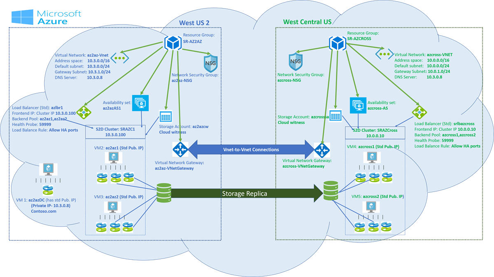

# Cluster to Cluster Storage Replica cross region in Azure

> Applies to: Windows Server 2019, Windows Server 2016, Windows Server (Semi-Annual Channel)

You can configure Cluster to Cluster Storage Replicas for cross-region applications in Azure. In the examples below, we use a two-node cluster, but Cluster to Cluster storage replica isn’t restricted to a two-node cluster. The illustration below is a two-node Storage Space Direct cluster that can communicate with each other, are in the same domain, and are cross-region.

Watch the video below for a complete walk-through of the process.
> [!video https://www.microsoft.com/en-us/videoplayer/embed/RE26xeW]


> [!IMPORTANT]
> All referenced examples are specific to the illustration above.


1. In the Azure portal, create [resource groups](https://ms.portal.azure.com/#create/Microsoft.ResourceGroup)  in two different regions.

    For example, **SR-AZ2AZ** in **West US 2** and **SR-AZCROSS** in **West Central US**, as shown above.

2. Create two [availability sets](https://ms.portal.azure.com/#create/Microsoft.AvailabilitySet-ARM), one in each resource group for each cluster.
    - Availability set (**az2azAS1**) in (**SR-AZ2AZ**)
    - Availability set (**azcross-AS**) in (**SR-AZCROSS**)

3. Create two virtual networks
   - Create the [virtual network](https://ms.portal.azure.com/#create/Microsoft.VirtualNetwork-ARM)  (**az2az-Vnet**) in the first resource group (**SR-AZ2AZ**), having one subnet and one Gateway subnet.
   - Create the [virtual network](https://ms.portal.azure.com/#create/Microsoft.VirtualNetwork-ARM)  (**azcross-VNET**) in the second resource group (**SR-AZCROSS**), having one subnet and one Gateway subnet.

4. Create two network security groups
   - Create the [network security group](https://ms.portal.azure.com/#create/Microsoft.NetworkSecurityGroup-ARM) (**az2az-NSG**) in the first resource group (**SR-AZ2AZ**).
   - Create the [network security group](https://ms.portal.azure.com/#create/Microsoft.NetworkSecurityGroup-ARM)  (**azcross-NSG**) in the second resource group (**SR-AZCROSS**).

   Add one Inbound security rule for RDP:3389 to both Network Security Groups. You can choose to remove this rule once you finish your setup.

5. Create Windows Server [virtual machines](https://ms.portal.azure.com/#create/Microsoft.WindowsServer2016Datacenter-ARM) in the previously created resource groups.

   Domain Controller (**az2azDC**). You can choose to create a 3rd availability set for your domain controller or add the domain controller in one of the two availability set. If you are adding this to the availability set created for the two clusters, assign it a Standard public IP address during VM creation.
      - Install Active Directory Domain Service.
      - Create a domain (contoso.com)
      - Create a user with administrator privileges (contosoadmin)

   Create two virtual machines (**az2az1**, **az2az2**) in the resource group (**SR-AZ2AZ**) using virtual network (**az2az-Vnet**) and network security group (**az2az-NSG**) in availability set (**az2azAS1**). Assign a standard public IP address to each virtual machine during the creation itself.
      - Add at-least two managed disks to each machine
      - Install Failover Clustering and the Storage Replica feature

   Create two virtual machines (**azcross1**, **azcross2**) in the resource group (**SR-AZCROSS**) using virtual network (**azcross-VNET**) and network security group (**azcross-NSG**) in availability set (**azcross-AS**). Assign standard Public IP address to each virtual machine during the creation itself
      - Add at least two managed disks to each machine
      - Install Failover Clustering and the Storage Replica feature

   Connect all the nodes to the domain and provide administrator privileges to the previously created user.

   Change the DNS Server of the virtual network to domain controller private IP address.
   - In the example, the domain controller **az2azDC** has private IP address (10.3.0.8). In the Virtual Network (**az2az-Vnet** and **azcross-VNET**) change DNS Server 10.3.0.8. 

     In the example, connect all the nodes to "contoso.com" and provide administrator privileges to "contosoadmin".
   - Login as contosoadmin from all the nodes. 
 
6. Create the clusters (**SRAZC1**, **SRAZCross**).

   Below is the PowerShell commands for the example
   ```powershell
      New-Cluster -Name SRAZC1 -Node az2az1,az2az2 –StaticAddress 10.3.0.100
   ```
   ```powershell
      New-Cluster -Name SRAZCross -Node azcross1,azcross2 –StaticAddress 10.0.0.10
   ```

7. Enable storage spaces direct.

   ```powershell
      Enable-clusterS2D
   ```

   > [!NOTE]
   > For each cluster create virtual disk and volume. One for the data and another for the log.

8. Create an internal Standard SKU [Load Balancer](https://ms.portal.azure.com/#create/Microsoft.LoadBalancer-ARM) for each cluster (**azlbr1**, **azlbazcross**).

   Provide the Cluster IP address as static private IP address for the load balancer.
      - azlbr1 => Frontend IP: 10.3.0.100 (Pick up an unused IP address from the Virtual network (**az2az-Vnet**) subnet)
      - Create Backend Pool for each load balancer. Add the associated cluster nodes.
      - Create Health Probe: port 59999
      - Create Load Balance Rule: Allow HA ports, with enabled Floating IP.

   Provide the Cluster IP address as static private IP address for the load balancer. 
      - azlbazcross => Frontend IP: 10.0.0.10 (Pick up an unused IP address from the Virtual network (**azcross-VNET**) subnet)
      - Create Backend Pool for each load balancer. Add the associated cluster nodes.
      - Create Health Probe: port 59999
      - Create Load Balance Rule: Allow HA ports, with enabled Floating IP. 

9. Create [Virtual network gateway](https://ms.portal.azure.com/#create/Microsoft.VirtualNetworkGateway-ARM) for Vnet-to-Vnet connectivity.

   - Create the first virtual network gateway (**az2az-VNetGateway**) in the first resource group (**SR-AZ2AZ**)
   - Gateway Type = VPN, and VPN type = Route-based

   - Create the second Virtual network gateway (**azcross-VNetGateway**) in the second resource group (**SR-AZCROSS**)
   - Gateway Type = VPN, and VPN type = Route-based

   - Create a Vnet-to-Vnet connection from first Virtual network gateway to second Virtual network gateway. Provide a shared key

   - Create a Vnet-to-Vnet connection from second Virtual network gateway to first Virtual network gateway. Provide the same shared key as provided in the step above. 

10. On each cluster node, open port 59999 (Health Probe).

    Run the following command on each node:

    ```powershell
      netsh advfirewall firewall add rule name=PROBEPORT dir=in protocol=tcp action=allow localport=59999 remoteip=any profile=any 
    ```

11. Instruct the cluster to listen for Health Probe messages on Port 59999 and respond from the node that currently owns this resource.

    Run it once from any one node of the cluster, for each cluster. 
    
    In our example, make sure to change the "ILBIP" according to your configuration values. Run the following command from any one node **az2az1**/**az2az2**

    ```PowerShell
     $ClusterNetworkName = "Cluster Network 1" # Cluster network name (Use Get-ClusterNetwork on Windows Server 2012 or higher to find the name. And use Get-ClusterResource to find the IPResourceName).
     $IPResourceName = "Cluster IP Address" # IP Address cluster resource name.
     $ILBIP = "10.3.0.100" # IP Address in Internal Load Balancer (ILB) - The static IP address for the load balancer configured in the Azure portal.
     [int]$ProbePort = 59999
     Get-ClusterResource $IPResourceName | Set-ClusterParameter -Multiple @{"Address"="$ILBIP";"ProbePort"=$ProbePort;"SubnetMask"="255.255.255.255";"Network"="$ClusterNetworkName";”ProbeFailureThreshold”=5;"EnableDhcp"=0}  
    ```

12. Run the following command from any one node **azcross1**/**azcross2**
    ```PowerShell
     $ClusterNetworkName = "Cluster Network 1" # Cluster network name (Use Get-ClusterNetwork on Windows Server 2012 or higher to find the name. And use Get-ClusterResource to find the IPResourceName).
     $IPResourceName = "Cluster IP Address" # IP Address cluster resource name.
     $ILBIP = "10.0.0.10" # IP Address in Internal Load Balancer (ILB) - The static IP address for the load balancer configured in the Azure portal.
     [int]$ProbePort = 59999
     Get-ClusterResource $IPResourceName | Set-ClusterParameter -Multiple @{"Address"="$ILBIP";"ProbePort"=$ProbePort;"SubnetMask"="255.255.255.255";"Network"="$ClusterNetworkName";”ProbeFailureThreshold”=5;"EnableDhcp"=0}  
    ```

    Make sure both clusters can connect / communicate with each other.

    Either use "Connect to Cluster" feature in Failover cluster manager to connect to the other cluster or check other cluster responds from one of the nodes of the current cluster.

    From the example we've been using:
    ```powershell
      Get-Cluster -Name SRAZC1 (ran from azcross1)
    ```
    ```powershell
      Get-Cluster -Name SRAZCross (ran from az2az1) 
    ```

13. Create cloud witness for both clusters. Create two [storage accounts](https://ms.portal.azure.com/#create/Microsoft.StorageAccount-ARM) (**az2azcw**,**azcrosssa**) in Azure, one for each cluster in each resource group (**SR-AZ2AZ**, **SR-AZCROSS**).
   
    - Copy the storage account name and key from "access keys"
    - Create the cloud witness from “failover cluster manager” and use the above account name and key to create it. 

14. Run [cluster validation tests](../../failover-clustering/create-failover-cluster.md#validate-the-configuration) before moving on to the next step

15. Start Windows PowerShell and use the [Test-SRTopology](https://docs.microsoft.com/powershell/module/storagereplica/test-srtopology?view=win10-ps) cmdlet to determine if you meet all the Storage Replica requirements. You can use the cmdlet in a requirements-only mode for a quick test as well as a long running performance evaluation mode.
 
16. Configure cluster-to-cluster storage replica.
    Grant access from one cluster to another cluster in both directions:

    From our example:
    ```powershell
     Grant-SRAccess -ComputerName az2az1 -Cluster SRAZCross
    ```
    If you're using Windows Server 2016, then also run this command:

    ```powershell
     Grant-SRAccess -ComputerName azcross1 -Cluster SRAZC1
    ```

17. Create SR-Partnership for the two clusters:</ol>

    - For cluster **SRAZC1**
      - Volume location:- c:\ClusterStorage\DataDisk1
      - Log location:- g:
    - For cluster **SRAZCross**
      - Volume location:- c:\ClusterStorage\DataDiskCross
      - Log location:- g:

Run the command:

```powershell
PowerShell

New-SRPartnership -SourceComputerName SRAZC1 -SourceRGName rg01 -SourceVolumeName c:\ClusterStorage\DataDisk1 -SourceLogVolumeName  g: -DestinationComputerName SRAZCross -DestinationRGName rg02 -DestinationVolumeName c:\ClusterStorage\DataDiskCross -DestinationLogVolumeName  g:
```