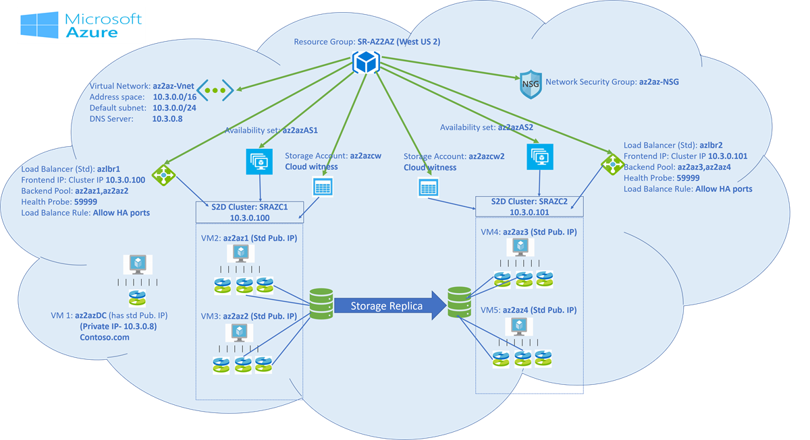

# Cluster to cluster Storage Replica within the same region in Azure

> Applies to: Windows Server 2019, Windows Server 2016, Windows Server (Semi-Annual Channel)

You can configure cluster to cluster storage replication within the same region in Azure. In the examples below, we use a two-node cluster, but cluster to cluster storage replica isn’t restricted to a two-node cluster. The illustration below is a two-node Storage Space Direct cluster that can communicate with each other, are in the same domain, and within the same region.

Watch the videos below for a complete walk-through of the process.

Part one
> [!VIDEO https://www.microsoft.com/en-us/videoplayer/embed/RE26f2Y]

Part two
> [!VIDEO https://www.microsoft.com/en-us/videoplayer/embed/RE269Pq]


> [!IMPORTANT]
> All referenced examples are specific to the illustration above.

1. Create a [resource group](https://ms.portal.azure.com/#create/Microsoft.ResourceGroup) in the Azure portal in a region (**SR-AZ2AZ** in **West US 2**). 
2. Create two [availability sets](https://ms.portal.azure.com/#create/Microsoft.AvailabilitySet-ARM) in the resource group (**SR-AZ2AZ**) created above, one for each cluster. 
    a. Availability set (**az2azAS1**)
    b. Availability set (**az2azAS2**)
3. Create a [virtual network](https://ms.portal.azure.com/#create/Microsoft.VirtualNetwork-ARM) (**az2az-Vnet**) in the previously created resource group (**SR-AZ2AZ**), having at-least one subnet. 
4. Create a [network security group](https://ms.portal.azure.com/#create/Microsoft.NetworkSecurityGroup-ARM) (**az2az-NSG**), and add one Inbound security rule for RDP:3389. You can choose to remove this rule once you finish your setup. 
5. Create Windows Server [virtual machines](https://ms.portal.azure.com/#create/Microsoft.WindowsServer2016Datacenter-ARM) in the previously created Resource group (**SR-AZ2AZ**). Use the previously created virtual network (**az2az-Vnet**) and network security group (**az2az-NSG**). 
   
   Domain Controller (**az2azDC**). You can choose to create a third availability set for your domain controller or add the domain controller in one of the two availability sets. If you are adding this to the availability set created for the two clusters, assign it a Standard public IP address during VM creation. 
   - Install Active Directory Domain Service.
   - Create a domain (Contoso.com)
   - Create a user with administrator privileges (contosoadmin) 
   - Create two virtual machines (**az2az1**, **az2az2**) in the first availability set (**az2azAS1**). Assign a standard Public IP address to each virtual machine during the creation itself.
   - Add at-least 2 managed disks to each machine
   - Install Failover Clustering and Storage Replica feature
   - Create two virtual machines (**az2az3**, **az2az4**) in the second availability set (**az2azAS2**). Assign standard Public IP address to each virtual machine during the creation itself. 
   - Add at-least 2 managed disks to each machine. 
   - Install Failover Clustering and Storage Replica feature. 
   
6. Connect all the nodes to the domain and provide Administrator privileges to the previously created user. 

7. Change the DNS Server of the virtual network to domain controller private IP address. 
8. In our example, the domain controller **az2azDC** has private IP address (10.3.0.8). In the Virtual Network (**az2az-Vnet**) change DNS Server 10.3.0.8. Connect all the nodes to "Contoso.com" and provide administrator privileges to "contosoadmin".
   - Login as contosoadmin from all the nodes. 
    
9. Create the clusters (**SRAZC1**, **SRAZC2**). 
   Below is the PowerShell commands for our example
   ```PowerShell
    New-Cluster -Name SRAZC1 -Node az2az1,az2az2 –StaticAddress 10.3.0.100
   ```
   ```PowerShell
    New-Cluster -Name SRAZC2 -Node az2az3,az2az4 –StaticAddress 10.3.0.101
   ```
10. Enable storage spaces direct
    ```PowerShell
    Enable-clusterS2D
    ```   
   
    For each cluster create virtual disk and volume. One for the data and another for the log. 
   
11. Create an internal Standard SKU [Load Balancer](https://ms.portal.azure.com/#create/Microsoft.LoadBalancer-ARM) for each cluster (**azlbr1**,**azlbr2**). 
   
    Provide the Cluster IP address as static private IP address for the load balancer.
    - azlbr1 => Frontend IP: 10.3.0.100 (Pick up an unused IP address from the Virtual network (**az2az-Vnet**) subnet)
    - Create Backend Pool for each load balancer. Add the associated cluster nodes.
    - Create Health Probe: port 59999
    - Create Load Balance Rule: Allow HA ports, with enabled Floating IP. 
   
    Provide the Cluster IP address as static private IP address for the load balancer.
    - azlbr2 => Frontend IP: 10.3.0.101 (Pick up an unused IP address from the Virtual network (**az2az-Vnet**) subnet)
    - Create Backend Pool for each load balancer. Add the associated cluster nodes.
    - Create Health Probe: port 59999
    - Create Load Balance Rule: Allow HA ports, with enabled Floating IP. 
   
12. On each cluster node, open port 59999 (Health Probe). 
   
    Run the following command on each node:
    ```PowerShell
    netsh advfirewall firewall add rule name=PROBEPORT dir=in protocol=tcp action=allow localport=59999 remoteip=any profile=any 
    ```   
13. Instruct the cluster to listen for Health Probe messages on Port 59999 and respond from the node that currently owns this resource. 
    Run it once from any one node of the cluster, for each cluster. 
    
    In our example, make sure to change the "ILBIP" according to your configuration values. Run the following command from any one node **az2az1**/**az2az2**:

    ```PowerShell
     $ClusterNetworkName = "Cluster Network 1" # Cluster network name (Use Get-ClusterNetwork on Windows Server 2012 or higher to find the name. And use Get-ClusterResource to find the IPResourceName).
     $IPResourceName = "Cluster IP Address" # IP Address cluster resource name.
     $ILBIP = "10.3.0.100" # IP Address in Internal Load Balancer (ILB) - The static IP address for the load balancer configured in the Azure portal.
     [int]$ProbePort = 59999
     Get-ClusterResource $IPResourceName | Set-ClusterParameter -Multiple @{"Address"="$ILBIP";"ProbePort"=$ProbePort;"SubnetMask"="255.255.255.255";"Network"="$ClusterNetworkName";”ProbeFailureThreshold”=5;"EnableDhcp"=0}
    ```

14. Run the following command from any one node **az2az3**/**az2az4**. 

    ```PowerShell
    $ClusterNetworkName = "Cluster Network 1" # Cluster network name (Use Get-ClusterNetwork on Windows Server 2012 or higher to find the name. And use Get-ClusterResource to find the IPResourceName).
    $IPResourceName = "Cluster IP Address" # IP Address cluster resource name.
    $ILBIP = "10.3.0.101" # IP Address in Internal Load Balancer (ILB) - The static IP address for the load balancer configured in the Azure portal.
    [int]$ProbePort = 59999
    Get-ClusterResource $IPResourceName | Set-ClusterParameter -Multiple @{"Address"="$ILBIP";"ProbePort"=$ProbePort;"SubnetMask"="255.255.255.255";"Network"="$ClusterNetworkName";”ProbeFailureThreshold”=5;"EnableDhcp"=0}  
    ```   
    Make sure both clusters can connect / communicate with each other. 

    Either use "Connect to Cluster" feature in Failover cluster manager to connect to the other cluster or check other cluster responds from one of the nodes of the current cluster.  
   
    ```PowerShell
     Get-Cluster -Name SRAZC1 (ran from az2az3)
    ```
    ```PowerShell
     Get-Cluster -Name SRAZC2 (ran from az2az1)
    ```   

15. Create cloud witnesses for both clusters. Create two [storage accounts](https://ms.portal.azure.com/#create/Microsoft.StorageAccount-ARM) (**az2azcw**, **az2azcw2**) in azure one for each cluster in the same resource group (**SR-AZ2AZ**).

    - Copy the storage account name and key from "access keys"
    - Create the cloud witness from “failover cluster manager” and use the above account name and key to create it.

16. Run [cluster validation tests](../../failover-clustering/create-failover-cluster.md#validate-the-configuration) before moving on to the next step.

17. Start Windows PowerShell and use the [Test-SRTopology](https://docs.microsoft.com/powershell/module/storagereplica/test-srtopology?view=win10-ps) cmdlet to determine if you meet all the Storage Replica requirements. You can use the cmdlet in a requirements-only mode for a quick test as well as a long-running performance evaluation mode.

18. Configure cluster-to-cluster Storage Replica.
   
    Grant access from one cluster to another cluster in both directions:

    In our example:

    ```PowerShell
      Grant-SRAccess -ComputerName az2az1 -Cluster SRAZC2
    ```
    If you're using Windows Server 2016 then also run this command:

    ```PowerShell
      Grant-SRAccess -ComputerName az2az3 -Cluster SRAZC1
    ```   
   
19. Create SRPartnership for the clusters:</ol>

    - For cluster **SRAZC1**.
    - Volume location:- c:\ClusterStorage\DataDisk1
    - Log location:- g:
    - For cluster **SRAZC2**
    - Volume location:- c:\ClusterStorage\DataDisk2
    - Log location:- g:

Run the following command:

```PowerShell

New-SRPartnership -SourceComputerName SRAZC1 -SourceRGName rg01 -SourceVolumeName c:\ClusterStorage\DataDisk1 -SourceLogVolumeName  g: -DestinationComputerName **SRAZC2** -DestinationRGName rg02 -DestinationVolumeName c:\ClusterStorage\DataDisk2 -DestinationLogVolumeName  g:
```