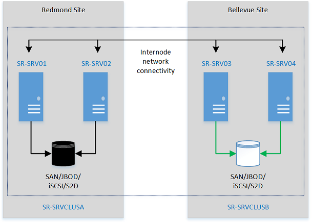
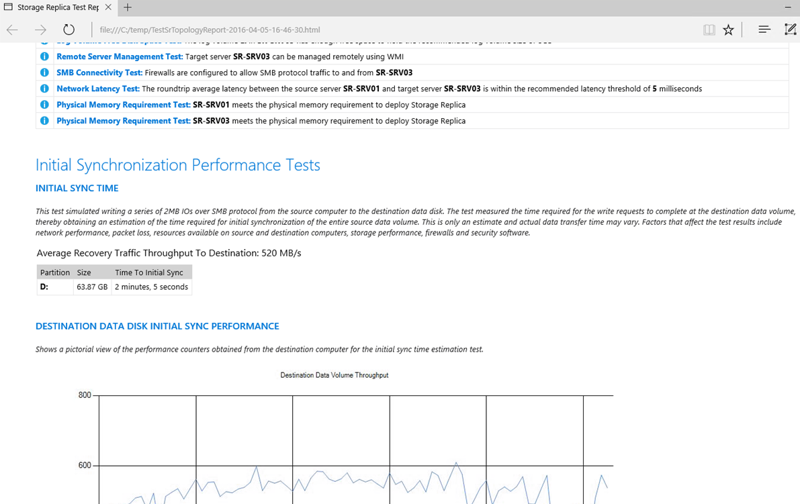

# Cluster to cluster Storage Replication

> Applies to: Windows Server 2019, Windows Server 2016, Windows Server (Semi-Annual Channel)

Storage Replica can replicate volumes between clusters, including the replication of clusters using Storage Spaces Direct. The management and configuration is similar to server-to-server replication.  

You will configure these computers and storage in a cluster-to-cluster configuration, where one cluster replicates its own set of storage with another cluster and its set of storage. These nodes and their storage should be located in separate physical sites, although it is not required.  

> [!IMPORTANT]
> In this test, the four servers are an example. You can use any number of servers supported by Microsoft in each cluster, which is currently 8 for a Storage Spaces Direct cluster and 64 for a shared storage cluster.  
>   
> This guide does not cover configuring Storage Spaces Direct. For information about configuring Storage Spaces Direct, see [Storage Spaces Direct overview](../storage-spaces/storage-spaces-direct-overview.md).  

This walkthrough uses the following environment as an example:  

-   Two member servers, named **SR-SRV01** and **SR-SRV02** that are later formed into a cluster named **SR-SRVCLUSA**.  

-   Two member servers named **SR-SRV03** and **SR-SRV04** that are later formed into  a cluster named **SR-SRVCLUSB**.  

-   A pair of logical "sites" that represent two different data centers, with one called **Redmond** and one called **Bellevue**.  

  

**FIGURE 1: Cluster to cluster Replication**  

## Prerequisites  

* Active Directory Domain Services forest (does not need to run Windows Server 2016).  
* 4-128 servers (two clusters of 2-64 servers) running Windows Server 2019 or Windows Server 2016, Datacenter Edition. If you're running Windows Server 2019, you can instead use Standard Edition if you're OK replicating only a single volume up to 2 TB in size.  
* Two sets of storage, using SAS JBODs, fibre channel SAN, Shared VHDX, Storage Spaces Direct, or iSCSI target. The storage should contain a mix of HDD and SSD media. You will make each storage set available only to each of the clusters, with no shared access between clusters.  
* Each set of storage must allow creation of at least two virtual disks, one for replicated data and one for logs. The physical storage must have the same sector sizes on all the data disks. The physical storage must have the same sector sizes on all the log disks.  
* At least one ethernet/TCP connection on each server for synchronous replication, but preferably RDMA.   
* Appropriate firewall and router rules to allow ICMP, SMB (port 445, plus 5445 for SMB Direct) and WS-MAN (port 5985) bi-directional traffic between all nodes.  
* A network between servers with enough bandwidth to contain your IO write workload and an average of =5ms round trip latency, for synchronous replication. Asynchronous replication does not have a latency recommendation.  
* The replicated storage cannot be located on the drive containing the Windows operating system folder.
* There are important considerations & limitations for Storage Spaces Direct replication - please review the detailed information below.

Many of these requirements can be determined by using the `Test-SRTopology` cmdlet. You get access to this tool if you install Storage Replica or the Storage Replica Management Tools features on at least one server. There is no need to configure Storage Replica to use this tool, only to install the cmdlet. More information is included in the steps below.  

## Step 1: Provision operating system, features, roles, storage, and network

1.  Install Windows Server on all four server nodes with an installation type of Windows Server **(Desktop Experience)**. 

2.  Add network information and join them to the domain, then restart them.  

    > [!IMPORTANT]  
    > From this point on, always logon as a domain user who is a member of the built-in administrator group on all servers. Always remember to elevate your Windows PowerShell and CMD prompts going forward when running on a graphical server installation or on a Windows 10 computer.  

3.  Connect first set of JBOD storage enclosure, iSCSI target, FC SAN, or local fixed disk (DAS) storage to the server in site **Redmond**.  

4.  Connect second set of storage to the server in site **Bellevue**.  

5.  As appropriate, install latest vendor storage and enclosure firmware and drivers, latest vendor HBA drivers, latest vendor BIOS/UEFI firmware, latest vendor network drivers, and latest motherboard chipset drivers on all four nodes. Restart nodes as needed.  

    > [!NOTE]  
    > Consult your hardware vendor documentation for configuring shared storage and networking hardware.  

6.  Ensure that BIOS/UEFI settings for servers enable high performance, such as disabling C-State, setting QPI speed, enabling NUMA, and setting highest memory frequency. Ensure power management in Windows Server is set to high performance. Restart as required.  

7.  Configure roles as follows:  

    -   **Graphical method**  

        1.  Run **ServerManager.exe** and create a server group, adding all server nodes.  

        2.  Install the **File Server** and **Storage Replica** roles and features on each of the nodes and restart them.  

    -   **Windows PowerShell method**  

        On SR-SRV04 or a remote management computer, run the following command in a Windows PowerShell console to install the required features and roles for a stretch cluster on the four nodes and restart them:  

        ```PowerShell
        $Servers = 'SR-SRV01','SR-SRV02','SR-SRV03','SR-SRV04'  

        $Servers | ForEach { Install-WindowsFeature -ComputerName $_ -Name Storage-Replica,Failover-Clustering,FS-FileServer -IncludeManagementTools -restart }  
        ```  

        For more information on these steps, see [Install or Uninstall Roles, Role Services, or Features](../../administration/server-manager/install-or-uninstall-roles-role-services-or-features.md)  

9. Configure storage as follows:  

    > [!IMPORTANT]  
    > -   You must create two volumes on each enclosure: one for data and one for logs.  
    > -   Log and data disks must be initialized as **GPT**, not **MBR**.  
    > -   The two data volumes must be of identical size.  
    > -   The two log volumes should be of identical size.  
    > -   All replicated data disks must have the same sector sizes.  
    > -   All log disks must have the same sector sizes.  
    > -   The log volumes should use flash-based storage, such as SSD.  Microsoft recommends that the log storage be faster than the data storage. Log volumes must never be used for other workloads.
    > -   The data disks can use HDD, SSD, or a tiered combination and can use either mirrored or parity spaces or RAID 1 or 10, or RAID 5 or RAID 50.  
    > -   The log volume must be at least 8GB by default and may be larger or smaller based on log requirements.
    > -   When using Storage Spaces Direct (Storage Spaces Direct) with an NVME or SSD cache, you see a greater than expected increase in latency when configuring Storage Replica replication between Storage Spaces Direct clusters. The change in latency is proportionally much higher than you see when using NVME and SSD in a performance + capacity configuration and no HDD tier nor capacity tier.

    This issue occurs due to architectural limitations within SR's log mechanism combined with the extremely low latency of NVME when compared to slower media. When using Storage Spaces Direct Storage Spaces Direct cache, all IO of SR logs, along with all recent read/write IO of applications, will occur in the cache and never on the performance or capacity tiers. This means that all SR activity happens on the same speed media - this configuration is not supported not recommended (see https://aka.ms/srfaq for log recommendations). 

    When using Storage Spaces Direct with HDDs, you cannot disable or avoid the cache. As a workaround, if using just SSD and NVME, you can configure just performance and capacity tiers. If using that configuration, and by placing the SR logs on the performance tier only with the data volumes they service being on the capacity tier only, you will avoid the high latency issue described above. The same could be done with a mix of faster and slower SSDs and no NVME.

    This workaround is of course not ideal and some customers may not be able to make use of it. The SR team is working on optimizations and updated log mechanism for the future to reduce these artificial bottlenecks that occur. There is no ETA for this, but when available to TAP customers for testing, this FAQ will be updated. 

-   **For JBOD enclosures:**  

1. Ensure that each cluster can see that site's storage enclosures only and that the SAS connections are correctly configured.  

2. Provision the storage using Storage Spaces by following **Steps 1-3** provided in the [Deploy Storage Spaces on a Stand-Alone Server](../storage-spaces/deploy-standalone-storage-spaces.md) using Windows PowerShell or Server Manager.  

-   **For iSCSI Target storage:**  

1. Ensure that each cluster can see that site's storage enclosures only. You should use more than one single network adapter if using iSCSI.  

2. Provision the storage using your vendor documentation. If using Windows-based iSCSI Targeting, consult [iSCSI Target Block Storage, How To](../iscsi/iscsi-target-server.md).  

-   **For FC SAN storage:**  

1. Ensure that each cluster can see that site's storage enclosures only and that you have properly zoned the hosts.  

2. Provision the storage using your vendor documentation.  

-   **For Storage Spaces Direct:**  

1. Ensure that each cluster can see that site's storage enclosures only by deploying Storage Spaces Direct. (https://docs.microsoft.com/windows-server/storage/storage-spaces/hyper-converged-solution-using-storage-spaces-direct) 

2. Ensure that the SR log volumes will always be on the fastest flash storage and the data volumes on slower high capacity storage.

3. Start Windows PowerShell and use the `Test-SRTopology` cmdlet to determine if you meet all the Storage Replica requirements. You can use the cmdlet in a requirements-only mode for a quick test as well as a long running performance evaluation mode.  
   For example,  

   ```PowerShell
   MD c:\temp

   Test-SRTopology -SourceComputerName SR-SRV01 -SourceVolumeName f: -SourceLogVolumeName g: -DestinationComputerName SR-SRV03 -DestinationVolumeName f: -DestinationLogVolumeName g: -DurationInMinutes 30 -ResultPath c:\temp        
   ```

     > [!IMPORTANT]
     > When using a test server with no write IO load on the specified source volume during the evaluation period,  consider adding a workload or it will not generate a useful report. You should test with production-like workloads in order to see real numbers and recommended log sizes. Alternatively, simply copy some files into the source volume during the test or download and run [DISKSPD](https://gallery.technet.microsoft.com/DiskSpd-a-robust-storage-6cd2f223) to generate write IOs. For instance, a sample with a low write IO workload for five minutes to the D: volume:  
     > `Diskspd.exe -c1g -d300 -W5 -C5 -b8k -t2 -o2 -r -w5 -h d:\test.dat`  

4. Examine the **TestSrTopologyReport.html** report to ensure that you meet the Storage Replica requirements.  

         

## Step 2: Configure two Scale-Out File Server Failover Clusters  
You will now create two normal failover clusters. After configuration, validation, and testing, you will replicate them using Storage Replica. You can perform all of the steps below on the cluster nodes directly or from a remote management computer that contains the Windows Server Remote Server Administration Tools.  

### Graphical method  

1.  Run **cluadmin.msc** against a node in each site.  

2.  Validate the proposed cluster and analyze the results to ensure you can continue. The example used below are **SR-SRVCLUSA** and **SR-SRVCLUSB**.  

3.  Create the two clusters. Ensure that the cluster names are 15 characters or fewer.  

4.  Configure a File Share Witness or Cloud Witness.  

    > [!NOTE]  
    > WIndows Server now includes an option for Cloud (Azure)-based Witness. You can choose this quorum option instead of the file share witness.  

    > [!WARNING]  
    > For more information about quorum configuration, see the **Witness Configuration** section in [Configure and Manage Quorum](../../failover-clustering/manage-cluster-quorum.md). For more information on the `Set-ClusterQuorum` cmdlet, see [Set-ClusterQuorum](https://docs.microsoft.com/powershell/module/failoverclusters/set-clusterquorum).  

5.  Add one disk in the **Redmond** site to the cluster CSV. To do so, right click a source disk in the **Disks** node of the **Storage** section, and then click **Add to Cluster Shared Volumes**.  

6.  Create the clustered Scale-Out File Servers on both clusters using the instructions in [Configure Scale-Out File Server](https://technet.microsoft.com/library/hh831718.aspx)  

### Windows PowerShell method  

1.  Test the proposed cluster and analyze the results to ensure you can continue:  

    ```PowerShell
    Test-Cluster SR-SRV01,SR-SRV02  
    Test-Cluster SR-SRV03,SR-SRV04  
    ```  

2.  Create the clusters (you must specify your own static IP addresses for the clusters). Ensure that each cluster name is 15 characters or fewer:  

    ```PowerShell
    New-Cluster -Name SR-SRVCLUSA -Node SR-SRV01,SR-SRV02 -StaticAddress <your IP here>  
    New-Cluster -Name SR-SRVCLUSB -Node SR-SRV03,SR-SRV04 -StaticAddress <your IP here>  
    ```  

3.  Configure a File Share Witness or Cloud (Azure) witness in each cluster that points to a share hosted on the domain controller or some other independent server. For example:  

    ```PowerShell  
    Set-ClusterQuorum -FileShareWitness \\someserver\someshare  
    ```  

    > [!NOTE]  
    > WIndows Server now includes an option for Cloud (Azure)-based Witness. You can choose this quorum option instead of the file share witness.  

    > [!WARNING]  
    > For more information about quorum configuration, see the **Witness Configuration** section in [Configure and Manage Quorum](../../failover-clustering/manage-cluster-quorum.md). For more information on the `Set-ClusterQuorum` cmdlet, see [Set-ClusterQuorum](https://docs.microsoft.com/powershell/module/failoverclusters/set-clusterquorum).  

4.  Create the clustered Scale-Out File Servers on both clusters using the instructions in [Configure Scale-Out File Server](https://technet.microsoft.com/library/hh831718.aspx)  

## Step 3: Set up Cluster to Cluster Replication using Windows PowerShell  
Now you will set up cluster-to-cluster replication using Windows PowerShell. You can perform all of the steps below on the nodes directly or from a remote management computer that contains the Windows Server Remote Server Administration Tools  

1. Grant the first cluster full access to the other cluster by running the **Grant-SRAccess** cmdlet on any node in the first cluster, or remotely.  Windows Server Remote Server Administration Tools

   ```PowerShell
   Grant-SRAccess -ComputerName SR-SRV01 -Cluster SR-SRVCLUSB  
   ```  

2. Grant the second cluster full access to the other cluster by running the **Grant-SRAccess** cmdlet on any node in the second cluster, or remotely.  

   ```PowerShell
   Grant-SRAccess -ComputerName SR-SRV03 -Cluster SR-SRVCLUSA  
   ```  

3. Configure the cluster-to-cluster replication, specifying the source and destination disks, the source and destination logs, the source and destination cluster names, and the log size. You can perform this command locally on the server or using a remote management computer.  

   ```powershell  
   New-SRPartnership -SourceComputerName SR-SRVCLUSA -SourceRGName rg01 -SourceVolumeName c:\ClusterStorage\Volume2 -SourceLogVolumeName f: -DestinationComputerName SR-SRVCLUSB -DestinationRGName rg02 -DestinationVolumeName c:\ClusterStorage\Volume2 -DestinationLogVolumeName f:  
   ```  

   > [!WARNING]  
   > The default log size is 8GB. Depending on the results of the **Test-SRTopology** cmdlet, you may decide to use **-LogSizeInBytes** with a higher or lower value.  

4. To get replication source and destination state, use **Get-SRGroup** and **Get-SRPartnership** as follows:  

   ```powershell
   Get-SRGroup  
   Get-SRPartnership  
   (Get-SRGroup).replicas  
   ```  

5. Determine the replication progress as follows:  

   1.  On the source server, run the following command and examine events 5015, 5002, 5004, 1237, 5001, and 2200:
        
       ```PowerShell
       Get-WinEvent -ProviderName Microsoft-Windows-StorageReplica -max 20
       ```
   2.  On the destination server, run the following command to see the Storage Replica events that show creation of the partnership. This event states the number of copied bytes and the time taken. Example:  
        
       ```powershell
       Get-WinEvent -ProviderName Microsoft-Windows-StorageReplica | Where-Object {$_.ID -eq "1215"} | Format-List
       ```
       Here's an example of the output:
        
       ```
       TimeCreated  : 4/8/2016 4:12:37 PM  
       ProviderName : Microsoft-Windows-StorageReplica  
       Id           : 1215  
       Message      : Block copy completed for replica.  
           ReplicationGroupName: rg02  
           ReplicationGroupId:  
           {616F1E00-5A68-4447-830F-B0B0EFBD359C}  
           ReplicaName: f:\  
           ReplicaId: {00000000-0000-0000-0000-000000000000}  
           End LSN in bitmap:  
           LogGeneration: {00000000-0000-0000-0000-000000000000}  
           LogFileId: 0  
           CLSFLsn: 0xFFFFFFFF  
           Number of Bytes Recovered: 68583161856  
           Elapsed Time (seconds): 117  
       ```
   3. Alternately, the destination server group for the replica states the number of byte remaining to copy at all times, and can be queried through PowerShell. For example:

      ```PowerShell
      (Get-SRGroup).Replicas | Select-Object numofbytesremaining
      ```

      As a progress sample (that will not terminate):  

      ```PowerShell
        while($true) {  
        $v = (Get-SRGroup -Name "Replication 2").replicas | Select-Object numofbytesremaining  
        [System.Console]::Write("Number of bytes remaining: {0}`n", $v.numofbytesremaining)  
        Start-Sleep -s 5  
       }
       ```

6. On the destination server in the destination cluster, run the following command and examine events 5009, 1237, 5001, 5015, 5005, and 2200 to understand the processing progress. There should be no warnings of errors in this sequence. There will be many 1237 events; these indicate progress.  
    
   ```PowerShell
   Get-WinEvent -ProviderName Microsoft-Windows-StorageReplica | FL  
   ```
   > [!NOTE]
   > The destination cluster disk will always show as **Online (No Access)** when replicated.  

## Step 4: Manage replication

Now you will manage and operate your cluster-to-cluster replication. You can perform all of the steps below on the cluster nodes directly or from a remote management computer that contains the Windows Server Remote Server Administration Tools.  

1.  Use **Get-ClusterGroup** or **Failover Cluster Manager** to determine the current source and destination of replication and their status.  Windows Server Remote Server Administration Tools

2.  To measure replication performance, use the **Get-Counter** cmdlet on both the source and destination nodes. The counter names are:  

    -   \Storage Replica Partition I/O Statistics(*)\Number of times flush paused  

    -   \Storage Replica Partition I/O Statistics(*)\Number of pending flush I/O  

    -   \Storage Replica Partition I/O Statistics(*)\Number of requests for last log write  

    -   \Storage Replica Partition I/O Statistics(*)\Avg. Flush Queue Length  

    -   \Storage Replica Partition I/O Statistics(*)\Current Flush Queue Length  

    -   \Storage Replica Partition I/O Statistics(*)\Number of Application Write Requests  

    -   \Storage Replica Partition I/O Statistics(*)\Avg. Number of requests per log write  

    -   \Storage Replica Partition I/O Statistics(*)\Avg. App Write Latency  

    -   \Storage Replica Partition I/O Statistics(*)\Avg. App Read Latency  

    -   \Storage Replica Statistics(*)\Target RPO  

    -   \Storage Replica Statistics(*)\Current RPO  

    -   \Storage Replica Statistics(*)\Avg. Log Queue Length  

    -   \Storage Replica Statistics(*)\Current Log Queue Length  

    -   \Storage Replica Statistics(*)\Total Bytes Received  

    -   \Storage Replica Statistics(*)\Total Bytes Sent  

    -   \Storage Replica Statistics(*)\Avg. Network Send Latency  

    -   \Storage Replica Statistics(*)\Replication State  

    -   \Storage Replica Statistics(*)\Avg. Message Round Trip Latency  

    -   \Storage Replica Statistics(*)\Last Recovery Elapsed Time  

    -   \Storage Replica Statistics(*)\Number of Flushed Recovery Transactions  

    -   \Storage Replica Statistics(*)\Number of Recovery Transactions  

    -   \Storage Replica Statistics(*)\Number of Flushed Replication Transactions  

    -   \Storage Replica Statistics(*)\Number of Replication Transactions  

    -   \Storage Replica Statistics(*)\Max Log Sequence Number  

    -   \Storage Replica Statistics(*)\Number of Messages Received  

    -   \Storage Replica Statistics(*)\Number of Messages Sent  

    For more information on performance counters in Windows PowerShell, see [Get-Counter](https://docs.microsoft.com/powershell/module/Microsoft.PowerShell.Diagnostics/Get-Counter).  

3.  To move the replication direction from one site, use the **Set-SRPartnership** cmdlet.  

    ```PowerShell
    Set-SRPartnership -NewSourceComputerName SR-SRVCLUSB -SourceRGName rg02 -DestinationComputerName SR-SRVCLUSA -DestinationRGName rg01  
    ```  

    > [!NOTE]  
    > Windows Server prevents role switching when initial sync is ongoing, as it can lead to data loss if you attempt to switch before allowing initial replication to complete. Do not force switch directions until initial sync is complete.

    Check the event logs to see the direction of replication change and recovery mode occur, and then reconcile. Write IOs can then write to the storage owned by the new source server. Changing the replication direction will block write IOs on the previous source computer.  

    > [!NOTE]  
    > The destination cluster disk will always show as **Online (No Access)** when replicated.  

4.  To change the log size from the default 8GB, use **Set-SRGroup** on both the source and destination Storage Replica groups.  

    > [!IMPORTANT]  
    > The default log size is 8GB. Depending on the results of the **Test-SRTopology** cmdlet, you may decide to use -LogSizeInBytes with a higher or lower value.  

5.  To remove replication, use **Get-SRGroup**, **Get-SRPartnership**, **Remove-SRGroup**, and **Remove-SRPartnership** on each cluster.  

    ```powershell
    Get-SRPartnership | Remove-SRPartnership  
    Get-SRGroup | Remove-SRGroup  
    ```  

    > [!NOTE]  
    > Storage Replica dismounts the destination volumes. This is by design.

## See also

-   [Storage Replica Overview](storage-replica-overview.md) 
-   [Stretch Cluster Replication Using Shared Storage](stretch-cluster-replication-using-shared-storage.md)  
-   [Server to Server Storage Replication](server-to-server-storage-replication.md)  
-   [Storage Replica: Known Issues](storage-replica-known-issues.md)  
-   [Storage Replica: Frequently Asked Questions](storage-replica-frequently-asked-questions.md)  
-   [Storage Spaces Direct in Windows Server 2016](../storage-spaces/storage-spaces-direct-overview.md)  
