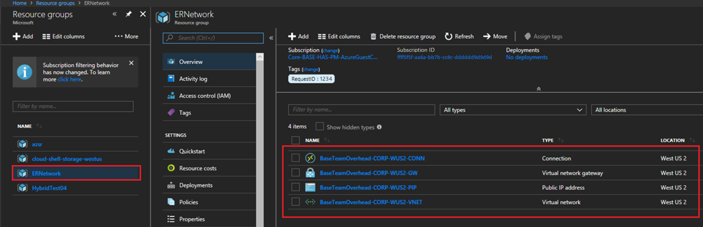

# Server-to-server storage replication

You can use Storage Replica to configure two servers to sync data so that each has an identical copy of the same volume. This article provides some background of this server-to-server replication configuration, and how to set it up and manage the environment.

To manage Storage Replica, you can use [Windows Admin Center](../../manage/windows-admin-center/overview.md) or PowerShell.

Here's an overview video of using Storage Replica in Windows Admin Center.

> [!video 310d4531-23a6-4140-8892-fecc4a65c2a1]

## Prerequisites

- Active Directory Domain Services forest (doesn't need to run Windows Server 2016).
- Two servers running either Windows Server 2019 or later, or Windows Server 2016 Datacenter Edition. If you're running Windows Server 2019, you can use Standard Edition if you're OK replicating only a single volume up to 2 TB in size.
- Two sets of storage, using SAS JBODs, fibre channel SAN, iSCSI target, or local SCSI/SATA storage. The storage should contain a mix of HDD and SSD media. Make each storage set available only to each of the servers, with no shared access.
- Each set of storage must allow creation of at least two virtual disks, one for replicated data and one for logs. The physical storage must have the same sector sizes on all the data disks. The physical storage must have the same sector sizes on all the log disks.
- At least one ethernet/TCP connection on each server for synchronous replication, but preferably RDMA.
- Appropriate firewall and router rules to allow ICMP, SMB port 445, SMB Direct port 5445, and WS-MAN port 5985 bi-directional traffic between all nodes.
- A network between servers with enough bandwidth to contain your IO write workload and an average of =5ms round trip latency, for synchronous replication. Asynchronous replication doesn't have a latency recommendation.
- The replicated storage can't be located on the drive containing the Windows operating system folder.

If you're replicating between on-premises servers and Azure VMs, you must create a network link between the on-premises servers and the Azure VMs. To do so, use [Express Route](#adding-an-azure-vm-connected-to-your-network-via-expressroute), a [Site-to-Site VPN gateway connection](/azure/vpn-gateway/vpn-gateway-howto-site-to-site-resource-manager-portal), or install VPN software in your Azure VMs to connect them with your on-premises network.

> [!IMPORTANT]
> In this scenario, each server should be in a different physical or logical site. Each server must be able to communicate with the other via a network.

Many of these requirements can be determined by using the `Test-SRTopology` cmdlet. You get access to this tool if you install Storage Replica or the Storage Replica Management Tools features on at least one server. There's no need to configure Storage Replica to use this tool, only to install the cmdlet.

## Windows Admin Center requirements

To use Storage Replica and Windows Admin Center together, you need the following requirements:

| System                        | Operating system                                            | Required for     |
|-------------------------------|-------------------------------------------------------------|------------------|
| Two servers <br>(any mix of on-premises hardware, VMs, and cloud VMs including Azure VMs)| Windows Server 2019, Windows Server 2016, or Windows Server (Semi-Annual Channel) | Storage Replica  |
| One PC                     | Windows 10 or later                                              | Windows Admin Center |

> [!NOTE]
> Right now you can't use Windows Admin Center on a server to manage Storage Replica.

## Terms

This walkthrough uses the following environment as an example:

- Two servers, named **SR-SRV05** and **SR-SRV06**.

- A pair of logical "sites" that represent two different data centers, with one called **Redmond** and one called **Bellevue**.


## Step 1: Install and configure Windows Admin Center

If you're using Windows Admin Center to manage Storage Replica, use the following steps to prep your PC to manage Storage Replica.

1. Download and install [Windows Admin Center](../../manage/windows-admin-center/overview.md).
1. Download and install the [Remote Server Administration Tools](https://www.microsoft.com/download/details.aspx?id=45520).

   If you're using Windows 10, version 1809 or later, install the **RSAT: Storage Replica Module for Windows PowerShell** from Features on Demand.

1. Open an elevated PowerShell window and run the following command to enable the WS-Management protocol on the local computer and set up the default configuration for remote management on the client:

   ```PowerShell
   winrm quickconfig
   ```

1. Type **Y** to enable WinRM services and enable WinRM Firewall Exception.

## Step 2: Provision operating system, features, roles, storage, and network

1. Install Windows Server Desktop Experience on both server nodes.

   To use an Azure VM connected to your network via an ExpressRoute, see [Adding an Azure VM connected to your network via ExpressRoute](#adding-an-azure-vm-connected-to-your-network-via-expressroute).

   > [!NOTE]
   > Starting in Windows Admin Center version 1910, you can configure a destination server automatically in Azure. If you choose that option, install Windows Server on the source server and then skip to [Step 3: Set up server-to-server replication](#step-3-set-up-server-to-server-replication).

1. Add network information, join the servers to the same domain as your Windows 10 management PC (if you're using one), and then restart the servers.

   > [!NOTE]
   > From this point on, always sign in as a domain user who is a member of the built-in administrator group on all servers. Always remember to elevate your PowerShell and CMD prompts going forward when running on a graphical server installation or on Windows 10 and later computer.

1. Connect the first set of JBOD storage enclosure, iSCSI target, FC SAN, or local fixed disk (DAS) storage to the server in site **Redmond**.

1. Connect the second set of storage to the server in site **Bellevue**.

1. As appropriate, install latest vendor storage and enclosure firmware and drivers, latest vendor HBA drivers, latest vendor BIOS/UEFI firmware, latest vendor network drivers, and latest motherboard chipset drivers on both nodes. Restart nodes as needed.

   > [!NOTE]
   > Consult your hardware vendor documentation for configuring shared storage and networking hardware.

1. Ensure that BIOS/UEFI settings for servers enable high performance, such as disabling C-State, setting QPI speed, enabling NUMA, and setting highest memory frequency. Ensure power management in Windows Server is set to High Performance. Restart as required.

1. Configure roles as follows:

   - **Windows Admin Center method**

     1. In Windows Admin Center, navigate to **Server Manager**, then select one of the servers.
     1. Navigate to **Roles & Features**.
     1. Select **Features**, select **Storage Replica**, then select **Install**.
     1. Repeat these steps on the other server.

   - **Server Manager method**

     1. In **Server Manager**, select **Create a server group**, then add all server nodes.

     1. Install the **File Server** role and **Storage Replica** feature on each of the nodes and restart them. To learn more, see [Install or Uninstall Roles, Role Services, or Features](../../administration/server-manager/install-or-uninstall-roles-role-services-or-features.md)

   - **Windows PowerShell method**

     On **SR-SRV06** or a remote management computer, run the following command to install the required features and roles and restart them:

     ```powershell
     $Servers = 'SR-SRV05','SR-SRV06'
     $Servers | ForEach { Install-WindowsFeature -ComputerName $_ -Name Storage-Replica,FS-FileServer -IncludeManagementTools -Restart }
     ```

1. Configure storage as follows:

   > [!IMPORTANT]
   >
   > - You must create two volumes on each enclosure: one for data and one for logs.
   > - Log and data disks must be initialized as GPT, not MBR.
   > - The two data volumes must be of identical size.
   > - The two log volumes should be of identical size.
   > - All replicated data disks must have the same sector sizes.
   > - All log disks must have the same sector sizes.
   > - The log volumes should use flash-based storage, such as SSD. Microsoft recommends that the log storage be faster than the data storage. Log volumes must never be used for other workloads.
   > - The data disks can use HDD, SSD, or a tiered combination and can use either mirrored or parity spaces or RAID 1 or 10, or RAID 5 or RAID 50.
   > - The log volume must be at least 9GB by default and may be larger or smaller based on log requirements.
   > - The File Server role is only necessary for Test-SRTopology to operate, as it opens the necessary firewall ports for testing.

   - **For JBOD enclosures:**

     1. Ensure that each server can see that site's storage enclosures only and that the SAS connections are correctly configured.

     1. Provision the storage using Storage Spaces by following **Steps 1 - 3** provided in the [Deploy Storage Spaces on a Stand-Alone Server](../storage-spaces/deploy-standalone-storage-spaces.md) using Windows PowerShell or Server Manager.

   - **For iSCSI storage:**

     1. Ensure that each cluster can see that site's storage enclosures only. You should use more than one single network adapter if using iSCSI.

     1. Provision the storage using your vendor documentation. If using Windows-based iSCSI Targeting, see [iSCSI Target Server overview](../iscsi/iscsi-target-server.md).

   - **For FC SAN storage:**

     1. Ensure that each cluster can see that site's storage enclosures only and that you properly zoned the hosts.

     1. Provision the storage using your vendor documentation.

   - **For local fixed disk storage:**

     - Ensure the storage doesn't contain a system volume, page file, or dump files.

     - Provision the storage using your vendor documentation.

1. Start Windows PowerShell and use the `Test-SRTopology` cmdlet to determine if you meet all the Storage Replica requirements. You can use the cmdlet in a requirements-only mode for a quick test and a long running performance evaluation mode. For example:

   To validate the proposed nodes that each have a **F:** and **G:** volume and run the test for 30 minutes:

   ```PowerShell
   $params = @{
       SourceComputerName   = 'SR-SRV05'
       SourceVolumeName     = 'F:'
       SourceLogVolumeName  = 'G:'
       DestinationComputerName = 'SR-SRV06'
       DestinationVolumeName = 'F:'
       DestinationLogVolumeName = 'G:'
       DurationInMinutes    = 30
       ResultPath           = 'C:\Temp'
   }
   MD C:\Temp
   Test-SRTopology @params
   ```

   > [!IMPORTANT]
   > When using a test server with no write IO load on the specified source volume during the evaluation period, consider adding a workload to generate a useful report. You should test with production-like workloads in order to see real numbers and recommended log sizes. Alternatively, copy some files into the source volume during the test or download and run [DISKSPD](/azure/azure-local/manage/diskspd-overview?view=azloc-24113&context=%2Fwindows-server%2Fcontext%2Fwindows-server-storage#quick-start-install-and-run-diskspd) to generate write IOs. For instance, a sample with a low write IO workload for 10 minutes to the D: volume:
   >
   > `Diskspd.exe -c1g -d600 -W5 -C5 -b8k -t2 -o2 -r -w5 -i100 -j100 d:\test`

1. Examine the **TestSrTopologyReport.html** report to ensure that you meet the Storage Replica requirements.

   

## Step 3: Set up server-to-server replication

### Using Windows Admin Center

1. Add the source server.

   1. Select the **Add** button.
   1. Select **Add server connection**.
   1. Type the name of the server and then select **Submit**.

1. On the **All Connections** page, select the source server.
1. Select **Storage Replica** from Tools panel.
1. Select **New** to create a new partnership. To create a new Azure VM to use as the destination for the partnership:

   1. Under **Replicate with another server** select **Use a New Azure VM** and then select **Next**. If you don't see this option, make sure that you're using Windows Admin Center version 1910 or a later version.

   1. Specify your source server information and replication group name, and then select **Next**.

      This begins a process that automatically selects a Windows Server 2019 or Windows Server 2016 Azure VM as a destination for the migration source. Storage Migration Service recommends VM sizes to match your source, but you can override this by selecting **See all sizes**. Inventory data is used to automatically configure your managed disks and their file systems, and join your new Azure VM to your Active Directory domain.

   1. After Windows Admin Center creates the Azure VM, provide a replication group name and then select **Create**. Windows Admin Center then begins the normal Storage Replica initial synchronization process to start protecting your data.

      Here's a video showing how to use Storage Replica to migrate to Azure VMs.

      > [!VIDEO https://www.youtube-nocookie.com/embed/_VqD7HjTewQ]

1. Provide the details of the partnership, and then select **Create**.

   

> [!NOTE]
> Removing the partnership from Storage Replica in Windows Admin Center doesn't remove the replication group name.

### Using Windows PowerShell

Configure server-to-server replication using Windows PowerShell. You must perform all of the steps below on the nodes directly or from a remote management computer that contains the Windows Server Remote Server Administration Tools.

1. Ensure you're using an elevated PowerShell console as an administrator.
1. Configure the server-to-server replication, specifying the source and destination disks, the source and destination logs, the source and destination nodes, and the log size.

   ```PowerShell
   $params = @{
      SourceComputerName      = 'SR-SRV05'
      SourceRGName            = 'RG01'
      SourceVolumeName        = 'F:'
      SourceLogVolumeName     = 'G:'
      DestinationComputerName = 'SR-SRV06'
      DestinationRGName       = 'RG02'
      DestinationVolumeName   = 'F:'
      DestinationLogVolumeName= 'G:'
      LogType                 = 'Raw'
   }
   New-SRPartnership @params
   ```

   ```output
   DestinationComputerName : SR-SRV06
   DestinationRGName       : RG02
   SourceComputerName      : SR-SRV05
   PSComputerName          :
   ```

   > [!IMPORTANT]
   > The default log size is 8GB. Depending on the results of the `Test-SRTopology` cmdlet, you may decide to use the **LogSizeInBytes** parameter with a higher or lower value.

1. To get replication source and destination state, use `Get-SRGroup` and `Get-SRPartnership` as follows:

   ```PowerShell
   Get-SRGroup
   Get-SRPartnership
   (Get-SRGroup).replicas
   ```

   ```output
   CurrentLsn             : 0
   DataVolume             : F:\
   LastInSyncTime         :
   LastKnownPrimaryLsn    : 1
   LastOutOfSyncTime      :
   NumOfBytesRecovered    : 37731958784
   NumOfBytesRemaining    : 30851203072
   PartitionId            : c3999f10-dbc9-4a8e-8f9c-dd2ee6ef3e9f
   PartitionSize          : 68583161856
   ReplicationMode        : synchronous
   ReplicationStatus      : InitialBlockCopy
   PSComputerName         :
   ```

1. Determine the replication progress as follows:

   1. On the source server, run the following command and examine events 1237, 2200, 5001, 5002, 5004, and 5015:

      ```PowerShell
      Get-WinEvent -ProviderName Microsoft-Windows-StorageReplica -max 20
      ```

   1. On the destination server, run the following command to see the Storage Replica events that show creation of the partnership. This event states the number of copied bytes and the time taken.

      ```PowerShell
      Get-WinEvent -ProviderName Microsoft-Windows-StorageReplica | Where-Object {$_.ID -eq "1215"} | FL
      ```

      ```output
      TimeCreated  : 4/8/2016 4:12:37 PM
      ProviderName : Microsoft-Windows-StorageReplica
      Id           : 1215
      Message      : Block copy completed for replica.

      ReplicationGroupName: rg02
      ReplicationGroupId: {616F1E00-5A68-4447-830F-B0B0EFBD359C}
      ReplicaName: f:\
      ReplicaId: {00000000-0000-0000-0000-000000000000}
      End LSN in bitmap:
      LogGeneration: {00000000-0000-0000-0000-000000000000}
      LogFileId: 0
      CLSFLsn: 0xFFFFFFFF
      Number of Bytes Recovered: 68583161856
      Elapsed Time (ms): 117
      ```

      > [!NOTE]
      > Storage Replica dismounts the destination volumes and their drive letters or mount points. This is by design.

   1. Alternatively, the destination server group for the replica states the number of byte remaining to copy always, and can be queried through PowerShell. For example:

      ```PowerShell
      (Get-SRGroup).Replicas | Select-Object numofbytesremaining
      ```

      As a progress sample (that won't terminate):

      ```PowerShell
      while($true) {

       $v = (Get-SRGroup -Name "RG02").replicas | Select-Object numofbytesremaining
       [System.Console]::Write("Number of bytes remaining: {0}`r", $v.numofbytesremaining)
       Start-Sleep -s 5
      }
      ```

   1. On the destination server, run the following command and examine events 1237, 2200, 5001, 5002, 5004, and 5015 to understand the processing progress. There should be no warnings of errors in this sequence. If several 1237 events occur, this indicates progress.

      ```PowerShell
      Get-WinEvent -ProviderName Microsoft-Windows-StorageReplica | FL
      ```

## Step 4: Manage replication

Now you'll manage and operate your server-to-server replicated infrastructure. You can perform all of the steps on the nodes directly or from a remote management computer that contains the Windows Server Remote Server Administration Tools.

1. Use `Get-SRPartnership` and `Get-SRGroup` to determine the current source and destination of replication and their status.

1. To measure replication performance, use the `Get-Counter` cmdlet on both the source and destination nodes. The counter names are:

   ```
   \Storage Replica Partition I/O Statistics(*)\Number of times flush paused
   \Storage Replica Partition I/O Statistics(*)\Number of pending flush I/O
   \Storage Replica Partition I/O Statistics(*)\Number of requests for last log write
   \Storage Replica Partition I/O Statistics(*)\Avg. Flush Queue Length
   \Storage Replica Partition I/O Statistics(*)\Current Flush Queue Length
   \Storage Replica Partition I/O Statistics(*)\Number of Application Write Requests
   \Storage Replica Partition I/O Statistics(*)\Avg. Number of requests per log write
   \Storage Replica Partition I/O Statistics(*)\Avg. App Write Latency
   \Storage Replica Partition I/O Statistics(*)\Avg. App Read Latency
   \Storage Replica Statistics(*)\Target RPO
   \Storage Replica Statistics(*)\Current RPO
   \Storage Replica Statistics(*)\Avg. Log Queue Length
   \Storage Replica Statistics(*)\Current Log Queue Length
   \Storage Replica Statistics(*)\Total Bytes Received
   \Storage Replica Statistics(*)\Total Bytes Sent
   \Storage Replica Statistics(*)\Avg. Network Send Latency
   \Storage Replica Statistics(*)\Replication State
   \Storage Replica Statistics(*)\Avg. Message Round Trip Latency
   \Storage Replica Statistics(*)\Last Recovery Elapsed Time
   \Storage Replica Statistics(*)\Number of Flushed Recovery Transactions
   \Storage Replica Statistics(*)\Number of Recovery Transactions
   \Storage Replica Statistics(*)\Number of Flushed Replication Transactions
   \Storage Replica Statistics(*)\Number of Replication Transactions
   \Storage Replica Statistics(*)\Max Log Sequence Number
   \Storage Replica Statistics(*)\Number of Messages Received
   \Storage Replica Statistics(*)\Number of Messages Sent
   ```

   For more information on performance counters in Windows PowerShell, see [Get-Counter](/powershell/module/microsoft.powershell.diagnostics/get-counter).

1. To move the replication direction from one site, use the `Set-SRPartnership` cmdlet.

   ```PowerShell
   Set-SRPartnership -NewSourceComputerName sr-srv06 -SourceRGName rg02 -DestinationComputerName sr-srv05 -DestinationRGName rg01
   ```

   > [!WARNING]
   > Windows Server prevents role switching when the initial sync is ongoing, as it can lead to data loss if you attempt to switch before allowing initial replication to complete. Don't force switch directions until the initial sync is complete.

   Check the event logs to see the direction of replication change and recovery mode occur, and then reconcile. Write IOs can then write to the storage owned by the new source server. Changing the replication direction blocks write IOs on the previous source computer.

1. To remove replication, use `Get-SRGroup`, `Get-SRPartnership`, `Remove-SRGroup`, and `Remove-SRPartnership` on each node. Ensure you run the `Remove-SRPartnership` cmdlet on the current source of replication only, not on the destination server. Run `Remove-SRGroup` on both servers. For example, to remove all replication from two servers:

   ```powershell
   Get-SRPartnership
   Get-SRPartnership | Remove-SRPartnership
   Get-SRGroup | Remove-SRGroup
   ```

## Replacing DFS Replication with Storage Replica

Many Microsoft customers deploy DFS Replication as a disaster recovery solution for unstructured user data like home folders and departmental shares. DFS Replication shipped in Windows Server 2003 R2 and all later operating systems and operates on low bandwidth networks, which make it attractive for high latency and low change environments with many nodes. However, DFS Replication has notable limitations as a data replication solution:

- It doesn't replicate in-use or open files.
- It doesn't replicate synchronously.
- Its asynchronous replication latency can be many minutes, hours, or even days.
- It relies on a database that can require lengthy consistency checks after a power interruption.
- It's configured as multi-master, which allows changes to flow in both directions, possibly overwriting newer data.

Storage Replica has none of these limitations. It does, however, have several that might make it less interesting in some environments:

- It only allows one-to-one replication between volumes. It's possible to replicate different volumes between multiple servers.
- While it supports asynchronous replication, it's not designed for low bandwidth, high latency networks.
- It doesn't allow user access to the protected data on the destination while replication is ongoing

If these aren't blocking factors, Storage Replica allows you to replace DFS Replication servers with this newer technology. The process at a high level is to:

1. Install Windows Server on two servers and configure your storage. This could mean to upgrade an existing set of servers or cleanly installing.
1. Ensure that any data you want to replicate exists on one or more data volumes and not on the C: drive.
   1. You can also seed the data on the other server to save time, using a backup or file copies, and use thin provisioned storage. Making the metadata-like security match perfectly is unnecessary, unlike DFS Replication.
1. Share the data on your source server and make it accessible through a DFS namespace. This is important, to ensure that users can still access it if the server name changes to one in a disaster site.
   1. You can create matching shares on the destination server, which will be unavailable during normal operations,
   1. Don't add the destination server to the DFS Namespaces namespace, or if you do, ensure that all its folder targets are disabled.
1. Enable Storage Replica replication and complete initial sync. Replication can be either synchronous or asynchronous.
   1. However, synchronous is recommended in order to guarantee IO data consistency on the destination server.
   1. We strongly recommend enabling Volume Shadow Copies and periodically taking snapshots with VSSADMIN or your other tools of choice. This guarantees applications flush their data files to disk consistently. If a disaster, you can recover files from snapshots on the destination server that might have been partially replicated asynchronously. Snapshots replicate along with files.
1. Operate normally until there's a disaster.
1. Switch the destination server to be the new source, which surfaces its replicated volumes to users.
1. If using synchronous replication, no data restore will be necessary unless the user was using an application that was writing data without transaction protection (this is irrespective of replication) during loss of the source server. If using asynchronous replication, the need for a VSS snapshot mount is higher but consider using VSS in all circumstances for application consistent snapshots.
1. Add the server and its shares as a DFS Namespaces folder target.
1. Users can then access their data.

> [!NOTE]
> Disaster Recovery planning is a complex subject and requires great attention to detail. Creation of runbooks and the performance of annual live failover drills is highly recommended. When an actual disaster strikes, experienced personnel might be unavailable.

## Adding an Azure VM connected to your network via ExpressRoute

1. Create an [ExpressRoute in the Azure portal](/azure/expressroute/expressroute-howto-circuit-portal-resource-manager).

   After the ExpressRoute is approved, a resource group is added to the subscription. Navigate to **Resource groups** to view this new group. Take note of the virtual network name.

   

1. [Create a new resource group](/azure/azure-resource-manager/resource-group-portal).
1. [Add a network security group](/azure/virtual-network/virtual-networks-create-nsg-arm-pportal). When creating it, select the subscription ID associated with the ExpressRoute you created, and select the resource group you just created as well.

   Add any inbound and outbound security rules you need to the network security group. For example, you might want to allow Remote Desktop access to the VM.

1. [Create an Azure VM](/azure/virtual-machines/windows/quick-create-portal) with the following settings:

   - **Public IP address**: None
   - **Virtual network**: Select the virtual network you took note of from the resource group added with the ExpressRoute.
   - **Network security group (firewall)**: Select the network security group you created previously.

   

1. After the VM is created, see [Step 2: Provision operating system, features, roles, storage, and network](#step-2-provision-operating-system-features-roles-storage-and-network).

## See also

- [Storage Replica Overview](storage-replica-overview.md)
- [Stretch Cluster Replication Using Shared Storage](stretch-cluster-replication-using-shared-storage.md)
- [Cluster to Cluster Storage Replication](cluster-to-cluster-storage-replication.md)
- [Storage Replica: Known Issues](storage-replica-known-issues.md)
- [Storage Replica: Frequently Asked Questions](storage-replica-frequently-asked-questions.yml)
- [Storage Spaces Direct](/azure/azure-local/concepts/storage-spaces-direct-overview?context=/windows-server/context/windows-server-storage)
