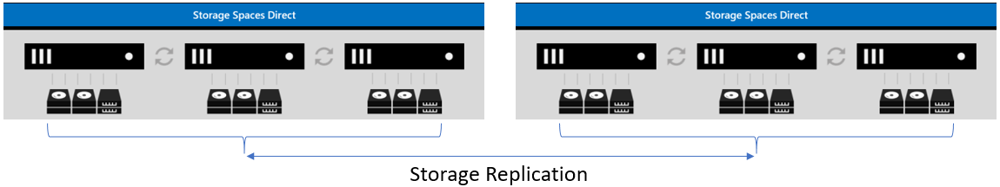
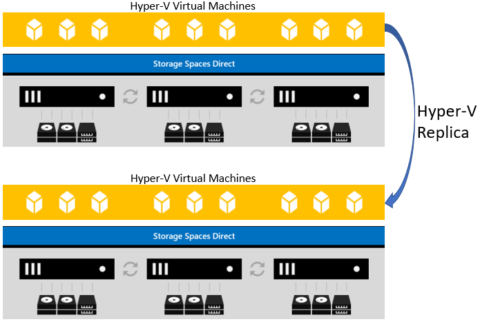

# Disaster recovery with Storage Spaces Direct

> Applies to: Windows Server 2019, Windows Server 2016

This topic provides scenarios on how hyper-converged infrastructure (HCI) can be configured for disaster recovery.

Numerous companies are running hyper-converged solutions and planning for a disaster gives the ability to remain in or get back to production quickly if a disaster were to occur. There are several ways to configure HCI for disaster recovery and this document explains the options that are available to you today.

When discussions of restoring availability if disaster occurs revolve around what's known as Recovery Time Objective (RTO). This is the duration of time targeted where services must be restored to avoid unacceptable consequences to the business. In some cases, this process can occur automatically with production restored nearly immediately. In other cases, manual administrator intervention must occur to restore services.

The disaster recovery options with a hyper-converged today are:

1. Multiple clusters utilizing Storage Replica
2. Hyper-V Replica between clusters
3. Backup and Restore

## Multiple clusters utilizing Storage Replica

[Storage Replica](../storage-replica/storage-replica-overview.md) enables the replication of volumes and supports both synchronous and asynchronous replication. When choosing between using either synchronous or asynchronous replication, you should consider your Recovery Point Objective (RPO). Recovery Point Objective is the amount of possible data loss you are willing to incur before it is considered major loss. If you go with synchronous replication, it will sequentially write to both ends at the same time. If you go with asynchronous, writes will replicate very fast but could still be lost. You should consider the application or file usage to see which best works for you.

Storage Replica is a block level copy mechanism versus file level; meaning, it does not matter what types of data being replicated. This makes it a popular option for hyper-converged infrastructure. Storage Replica also can utilize different types of drives between the replication partners, so having all of one type storage on one HCI and another type storage on the other is perfectly fine. 

One important capability of Storage Replica is that it can be run in Azure as well as on-premises. You can set up on-premises to on-premises, Azure to Azure, or even on-premises to Azure (or vice versa).

In this scenario, there are two separate independent clusters. For configuring Storage Replica between HCI, you can follow the steps in [Cluster-to-cluster storage replication](../storage-replica/cluster-to-cluster-storage-replication.md).



The following considerations apply when deploying Storage Replica. 

1.	Configuring replication is done outside of Failover Clustering. 
2.	Choosing the method of replication will be dependent upon your network latency and RPO requirements. Synchronous replicates the data on low-latency networks with crash consistency to ensure no data loss at a time of failure. Asynchronous replicates the data over networks with higher latencies, but each site may not have identical copies at a time of failure. 
3.	In the case of a disaster, failovers between the clusters are not automatic and need to be orchestrated manually through the Storage Replica PowerShell cmdlets. In the diagram above, ClusterA is the primary and ClusterB is the secondary. If ClusterA goes down, you would need to manually set ClusterB as Primary before you can bring the resources up. Once ClusterA is back up, you would need to make it Secondary. Once all data has been synced up, make the change and swap the roles back to the way they were originally set.
4.	Since Storage Replica is only replicating the data, a new virtual machine or Scale Out File Server (SOFS) utilizing this data would need to be created inside Failover Cluster Manager on the replica partner.

Storage Replica can be used if you have virtual machines or an SOFS running on your cluster. Bringing resources online in the replica HCI can be manual or automated through the use of PowerShell scripting.

## Hyper-V Replica

[Hyper-V Replica](https://docs.microsoft.com/windows-server/virtualization/hyper-v/manage/set-up-hyper-v-replica) provides virtual machine level replication for disaster recovery on hyper-converged infrastructures. What Hyper-V Replica can do is to take a virtual machine and replicate it to a secondary site or Azure (replica). Then from the secondary site, Hyper-V Replica can replicate the virtual machine to a third (extended replica).



With Hyper-V Replica, the replication is taken care of by Hyper-V. When you first enable a virtual machine for replication, there are three choices for how you wish the initial copy to be sent to the corresponding replica cluster(s).

1.	Send the initial copy over the network
2.	Send the initial copy to external media so that it can be copied onto your server manually
3.	Use an existing virtual machine already created on the replica hosts

The other option is for when you wish this initial replication should take place.

1.	Start the replication immediately
2.	Schedule a time for when the initial replication takes place. 

Other considerations you will need are:

- What VHD/VHDX's you wish to replicate. You can choose to replicate all of them or only one of them.
- Number of recovery points you wish to save. If you wish to have several options about what point in time you wish to restore, then you would want to specify how many you want. If you only want one restore point, you can choose that as well.
- How often you wish to have the Volume Shadow Copy Service (VSS) replicate an incremental shadow copy.
- How often changes get replicated (30 seconds, 5 minutes, 15 minutes).

When HCI participate in Hyper-V Replica, you must have the [Hyper-V Replica Broker](https://blogs.technet.microsoft.com/virtualization/2012/03/27/why-is-the-hyper-v-replica-broker-required/) resource created in each cluster. This resource does several things:

1.	Gives you a single namespace for each cluster for Hyper-V Replica to connect to.
2.	Determines which node within that cluster the replica (or extended replica) will reside on when it first receives the copy.
3.	Keeps track of which node owns the replica (or extended replica) in case the virtual machine moves to another node. It needs to track this so that when replication takes place, it can send the information to the proper node.

## Backup and restore

One traditional disaster recovery option that isn't talked about very much but is just as important is the failure of the entire cluster or a node in the cluster. Either option with this scenario makes use of Windows NT Backup. 

It is always a recommendation to have periodic backups of the hyper-converged infrastructure. While the Cluster Service is running, if you take a System State Backup, the cluster registry database would be a part of that backup. Restoring the cluster or the database has two different methods (Non-Authoritative and Authoritative).

### Non-authoritative

A Non-Authoritative restore can be accomplished using Windows NT Backup and equates to a full restore of just the cluster node itself. If you only need to restore a cluster node (and the cluster registry database) and all current cluster information good, you would restore using non-authoritative. Non-Authoritative restores can be done through the Windows NT Backup interface or the command line WBADMIN.EXE.

Once you restore the node, let it join the cluster. What will happen is that it will go out to the existing running cluster and update all of its information with what is currently there.

### Authoritative

An Authoritative restore of the cluster configuration, on the other hand, takes the cluster configuration back in time. This type of restore should only be accomplished when the cluster information itself has been lost and needs restored. For example, someone accidentally deleted a File Server that contained over 1000 shares and you need them back. Completing an Authoritative restore of the cluster requires that Backup be run from the command line.

When an Authoritative restore is initiated on a cluster node, the cluster service is stopped on all other nodes in the cluster view and the cluster configuration is frozen. This is why it is critical that the cluster service on the node on which the restore was executed be started first so the cluster is formed using the new copy of the cluster configuration.

To run through an authoritative restore, the following steps can be accomplished.

1.	Run WBADMIN.EXE from an administrative command prompt to get the latest version of backups that you want to install and ensure that System State is one of the components you can restore.

    ```powershell
    Wbadmin get versions
    ```

2.	Determine if the version backup you have has the cluster registry information in it as a component. There are a couple items you will need from this command, the version and the application/component for use in Step 3. For the version, for example, say the backup was done January 3, 2018 at 2:04am and this is the one you need restored.

    ```powershell
    wbadmin get items -backuptarget:\\backupserver\location
    ```

3.  Start the authoritative restore to recover only the cluster registry version you need. 

    ```powershell
    wbadmin start recovery -version:01/03/2018-02:04 -itemtype:app -items:cluster
    ```

Once the restore has taken place, this node must be the one to start the Cluster Service first and form the cluster. All other nodes would then need to be started and join the cluster.

## Summary 

To sum this all up, hyper-converged disaster recovery is something that should be planned out carefully. There are several scenarios that can best suits your needs and should be thoroughly tested. One item to note is that if you are familiar with Failover Clusters in the past, stretch clusters have been a very popular option over the years. There was a bit of a design change with the hyper-converged solution and it is based on resiliency. If you lose two nodes in a hyper-converged cluster, the entire cluster will go down. With this being the case, in a hyper-converged environment, the stretch scenario is not supported.


