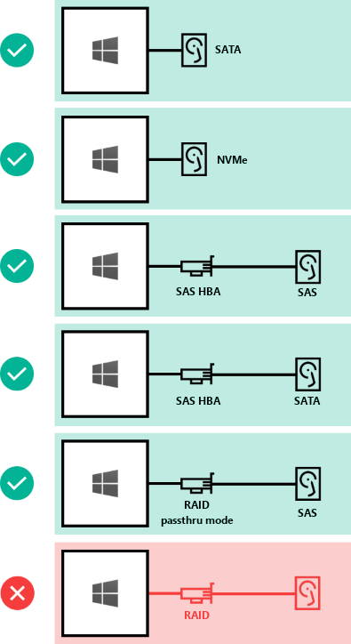

# Storage Spaces Direct hardware requirements

> Applies to: Windows Server 2016, Windows Server Insider Preview

This topic describes minimum hardware requirements for Storage Spaces Direct.

For production, Microsoft recommends these [Windows Server Software-Defined](https://microsoft.com/wssd) hardware/software offers from our partners, which include deployment tools and procedures. They are designed, assembled, and validated against our reference architecture to ensure compatibility and reliability, so you get up and running quickly. Learn more at [https://microsoft.com/wssd](https://microsoft.com/wssd).

   > [!TIP]
   > Want to evaluate Storage Spaces Direct but don't have hardware? Use Hyper-V or Azure virtual machines as described in [Using Storage Spaces Direct in guest virtual machine clusters](storage-spaces-direct-in-vm.md).

## Base requirements

Systems, components, devices, and drivers must be **Windows Server 2016 Certified** per the [Windows Server Catalog](https://www.windowsservercatalog.com). In addition, we recommend that servers, drives, host bus adapters, and network adapters have the **Software-Defined Data Center (SDDC) Standard** and/or **Software-Defined Data Center (SDDC) Premium** additional qualifications (AQs), as pictured below. There are over 1,000 components with the SDDC AQs.

The fully configured cluster (servers, networking, and storage) must pass all [cluster validation tests](https://technet.microsoft.com/library/cc732035(v=ws.10).aspx) per the wizard in Failover Cluster Manager or with the `Test-Cluster` [cmdlet](https://docs.microsoft.com/powershell/module/failoverclusters/test-cluster?view=win10-ps) in PowerShell.

In addition, the following requirements apply:

## Servers

- Minimum of 2 servers, maximum of 16 servers
- Recommended that all servers be the same manufacturer and model

## CPU

- Intel Nehalem or later compatible processor; or
- AMD EPYC or later compatible processor

## Memory

- Memory for Windows Server, VMs, and other apps or workloads; plus
- 4 GB of RAM per terabyte (TB) of cache drive capacity on each server, for Storage Spaces Direct metadata

## Boot

- Any boot device supported by Windows Server, which [now includes SATADOM](https://cloudblogs.microsoft.com/windowsserver/2017/08/30/announcing-support-for-satadom-boot-drives-in-windows-server-2016/)
- RAID 1 mirror is **not** required, but is supported for boot
- Recommended: 200 GB minimum size

## Networking

- Minimum of 1 x 10 Gbps network interface per server
- Recommended: Two or more NICs for redundancy and performance
- Recommended: NICs that are remote-direct memory access (RDMA) capable, iWARP or RoCE
- With 2 servers, direct-connect (switchless) is supported

## Drives

Storage Spaces Direct works with direct-attached SATA, SAS, or NVMe drives that are physically attached to just one server each. For more help choosing drives, see the [Choosing drives](choosing-drives.md) topic.

- SATA, SAS, and NVMe (M.2, U.2, and Add-In-Card) drives are all supported
- 512n, 512e, and 4K native drives are all supported
- Solid-state drives must provide [power-loss protection](https://blogs.technet.microsoft.com/filecab/2016/11/18/dont-do-it-consumer-ssd/)
- Same number and types of drives in every server – see [Drive symmetry considerations](drive-symmetry-considerations.md)
- Recommended: Number of capacity drives is a whole multiple of the number of cache drives
- Recommended: Cache drives should have high write endurance: at least 3 drive-writes-per-day (DWPD) or at least 4 terabytes written (TBW) per day – see [Understanding drive writes per day (DWPD), terabytes written (TBW), and the minimum recommended for Storage Spaces Direct](https://blogs.technet.microsoft.com/filecab/2017/08/11/understanding-dwpd-tbw/)

Here's how drives can be connected for Storage Spaces Direct:

1. Direct-attached SATA drives
2. Direct-attached NVMe drives
3. SAS host-bus adapter (HBA) with SAS drives
4. SAS host-bus adapter (HBA) with SATA drives
5. **NOT SUPPORTED:** RAID controller cards or SAN (Fibre Channel, iSCSI, FCoE) storage. Host-bus adapter (HBA) cards must implement simple pass-through mode.

Drives can be internal to the server, or in an external enclosure that is connected to just one server. SCSI Enclosure Services (SES) is required for slot mapping and identification. Each external enclosure must present a unique identifier (Unique ID).

1. Drives internal to the server
2. Drives in an external enclosure ("JBOD") connected to one server
3. **NOT SUPPORTED:** Shared SAS enclosures connected to multiple servers or any form of multi-path IO (MPIO) where drives are accessible by multiple paths.

> [!NOTE]
> Microsoft has a critical product advisory for Storage Spaces Direct customers using the Intel P3x00 family of NVMe devices (all capacities of the P3500, P3600, P3700). See Knowledge Base article [4052341](https://support.microsoft.com/help/4052341) for more information.

### Minimum number of drives (excludes boot drive)

- If there are drives used as cache, there must be at least 2 per server
- There must be at least 4 capacity (non-cache) drives per server

| Drive types present   | Minimum number required |
|-----------------------|-------------------------|
| All NVMe (same model) | 4 NVMe                  |
| All SSD (same model)  | 4 SSD                   |
| NVMe + SSD            | 2 NVMe + 4 SSD          |
| NVMe + HDD            | 2 NVMe + 4 HDD          |
| SSD + HDD             | 2 SSD + 4 HDD           |
| NVMe + SSD + HDD      | 2 NVMe + 4 Others       |

   >[!NOTE]
   > This table provides the minimum for hardware deployments. If you're deploying with virtual machines and virtualized storage, such as in Microsoft Azure, see [Using Storage Spaces Direct in guest virtual machine clusters](storage-spaces-direct-in-vm.md).

### Maximum capacity

- Recommended: Maximum 100 terabytes (TB) raw storage capacity per server
- Maximum 1 petabyte (1,000 TB) raw capacity in the storage pool
