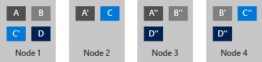

---
title: Storage Spaces Fault Tolerance
ms.custom: na
ms.prod: windows-server-threshold
ms.reviewer: na
ms.suite: na
ms.technology:
  - techgroup-storage
ms.tgt_pltfrm: na
ms.topic: article
ms.assetid: 5e1d7ecc-e22e-467f-8142-bad6d82fc5d0
author: kumudd
manager: dongill
ms.author: JGerend
---
# Storage Spaces Fault Tolerance

>Applies To: Windows Server 2016


Windows Server 2016 Storage Spaces Direct enhances the resiliency of virtual disks to enable resiliency to node failures. This is in addition to the existing disk and enclosure resiliency.  

When using Storage Spaces Direct, storage pools and virtual disks will, by default, be resilient to node failures. When a storage pool is created the "FaultDomainAwarenessDefault" property is set to "StorageScaleUnit". This controls the default for virtual disk creation. You can inspect the storage pool property by running the following command:  

```  
Get-StoragePool -FriendlyName <PoolName> | FL FriendlyName, Size, FaultDomainAwarenessDefault  

FriendlyName                : <PoolName>  
Size                        : <Size>  
FaultDomainAwarenessDefault : StorageScaleUnit  
```  

Subsequently, when a virtual disk is created in a pool, it inherits the default value of the pool and therefore will have its "FaultDomainAwareness" set to "StorageScaleUnit". You can inspect the virtual disk property by running the following command:  

```  
Get-VirtualDisk -FriendlyName <VirtualDiskName>| FL FriendlyName, Size, FaultDomainAwareness, ResiliencySettingName  

FriendlyName          : <VirtualDiskName>  
Size                  : <Size>  
FaultDomainAwareness  : StorageScaleUnit  
ResiliencySettingName : Mirror  
```  

> [!NOTE]  
> Do not change the **FaultDomainAwarenessDefault** and **FaultDomainAwareness** values in a Storage Spaces Direct deployment.  

The FaultDomainAwareness property on the virtual disk controls data placement in all scenarios, including initial data allocation when creating the virtual disk,  when repairing a virtual disk from a disk, enclosure or node failure, when rebalancing virtual disks in a storage pool. All of these operations will take into account the "StorageScaleUnit" fault domain and ensure that copies of data are placed on different nodes.  

Let us examine some basics about virtual disks. A virtual disk consists of extents, each of which are 1GB in size. A 100GB virtual disk will therefore consist of 100 1GB extents. If the virtual disk is mirrored (using ResiliencySettingName) there will be multiple copies of each  extent. The number of copies of the extent (using NumberOfDataCopes) can be two or three. All in all, a 100GB mirrored virtual disk with three data copes will consume 300 extents. The placement of extents is governed by the fault domain, which in Storage Spaces Direct is nodes (StorageScaleUnit), so the three copies of an extent (A) will be placed on three different storage nodes e.g. node 1, 2 and 3 in the diagram below. Another extent (B) of the same virtual disk might have its three copies placed on different nodes, e.g. 1, 3, and 4 and so on. This means that a virtual disk might have its extents distributed all storage nodes and the copies of each extent is placed on different nodes. Figure 6 below illustrates a four node deployment with a mirrored virtual disk with 3 copies and an example layout of extents:  

  

**FIGURE 1: Four nodes with a mirrored virtual disk with 3 copies space**  

Understanding the above, let us review the various failure scenarios  included in this section, and examine how Storage Spaces handles them.  

-   [Scenario 1: One or more sectors on a disk has failed](#BKMK_FaultTolerance_Scenario1)  

-   [Scenario 2: A disk has failed](#BKMK_FaultTolerance_Scenario2)  

-   [Scenario 3: A disk is missing](#BKMK_FaultTolerance_Scenario3)  

-   [Scenario 4: Storage node restart or maintenance](#BKMK_FaultTolerance_Scenario4)  

-   [Scenario 5: Permanent storage node failure](#BKMK_FaultTolerance_Scenario5)  

### <a name="BKMK_FaultTolerance_Scenario1"></a>Scenario 1: One or more sectors on a disk has failed  
In this scenario, Storage Spaces will reallocate the extent that is affected by the failing sectors. The target for the reallocation could be another disk in the same node, or another disk in another node that does not already have a copy of the extent. So if the three copies of the extent are on node A, B and C, and the extent on node A is affected by a sector failure, the new copy can be generated on a different disk in node A or any disk in Node D. Disks in node B and C cannot be used as these two nodes already have a copy of the extent.  

### <a name="BKMK_FaultTolerance_Scenario2"></a>Scenario 2: A disk has failed  
In this scenario Storage Spaces will retire the physical disk from the storage pool when it discovers the disk has failed. After the physical disk has been retired, each virtual disk will start its repair process. Since the physical disk has been retired, the virtual disks will generate a new copy of the extents that were on the retired physical disk. The new copies will follow the same logic as in scenario 1.  

### <a name="BKMK_FaultTolerance_Scenario3"></a>Scenario 3: A disk is missing  
In this scenario Storage Spaces will do one of two things:  

-   If the storage node or the physical enclosure to which the physical disk is attached is also missing, then Storage Spaces will not retire the physical disk.  

-   If however only the physical disk is missing, then Storage Spaces will retire the disk.  

    The reason for #1 above is that during a storage node restart or temporary maintenance of a storage node all the disks associated with that node will be reported missing. Automatically retiring all those disks would potentially result in a massive amount of repair activity as all extents on those disks would have to be rebuild elsewhere in the storage system - this could easily be multiple terabytes of data. If the disks are really missing and will not come back to the storage system, the administrator will need to retire the missing physical disks and start the repair process.  

### <a name="BKMK_FaultTolerance_Scenario4"></a>Scenario 4: Storage node restart or maintenance  
In this scenario Storage Spaces will not automatically retire physical disks from the storage pool for the reasons described above in scenario 3. Once the storage node comes back online, Storage Spaces will automatically update all extents that are not up to date with the copies that were not affected by the restart or maintenance.  

### <a name="BKMK_FaultTolerance_Scenario5"></a>Scenario 5: Permanent storage node failure  
In this scenario, Storage Spaces will require the administrator to retire all the affected physical disks from the storage pool, add additional storage nodes to the storage system if needed, and then start repair. The reason this not an automatic process is that Storage Spaces does not know if it is a temporary or permanent failure. It is not desirable to initiate a repair that could potentially result in significant I/O and CPU activity.  

For more information on Fault Domains, see [Fault Domains in Windows Server 2016](../../failover-clustering/fault-domains.md)  

## Related Topics  
-   [Storage Spaces Direct in Windows Server 2016](storage-spaces-direct-overview.md)  
-   [Storage Spaces Direct Hardware Requirements](Storage-Spaces-Direct-Hardware-Requirements.md)  
-   [Hyper-converged solution using Storage Spaces Direct in Windows Server 2016](hyper-converged-solution-using-storage-spaces-direct.md)  
-   [Storage Spaces Optimize Pool](Storage-Spaces-Optimize-Pool.md)  

## See Also  
-   [Enabling Private Cloud Storage Using Servers with Local Disks](http://channel9.msdn.com/Events/Ignite/2015/BRK3474) (video)  
-   [Testing Storage Spaces Direct using Windows Server 2016 virtual machines](http://blogs.msdn.com/b/clustering/archive/2015/05/27/10617612.aspx) (blog)  
-   [What's New in Failover Clustering in Windows Server](../../failover-clustering/whats-new-failover-clustering.md)  
-   [Storage Replica in Windows Server 2016](../storage-replica/overview.md)  
-   [Storage Quality of Service](../storage-qos/overview.md)  