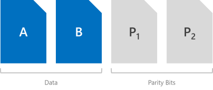

# Fault tolerance and storage efficiency in Storage Spaces Direct

>Applies to: Windows Server 2016

This topic introduces the resiliency options available in [Storage Spaces Direct](storage-spaces-direct-overview.md) and outlines the scale requirements, storage efficiency, and general advantages and tradeoffs of each. It also presents some usage instructions to get you started, and references some great papers, blogs, and additional content where you can learn more.

If you are already familiar with Storage Spaces, you may want to skip to the [Summary](#summary) section.

## Overview

At its heart, Storage Spaces is about providing fault tolerance, often called 'resiliency', for your data. Its implementation is similar to RAID, except distributed across servers and implemented in software.

As with RAID, there are a few different ways Storage Spaces can do this, which make different tradeoffs between fault tolerance, storage efficiency, and compute complexity. These broadly fall into two categories: 'mirroring' and 'parity', the latter sometimes called 'erasure coding'.

## Mirroring

Mirroring provides fault tolerance by keeping multiple copies of all data. This most closely resembles RAID-1. How that data is striped and placed is non-trivial (see [this blog](https://blogs.technet.microsoft.com/filecab/2016/11/21/deep-dive-pool-in-spaces-direct/) to learn more), but it is absolutely true to say that any data stored using mirroring is written, in its entirety, multiple times. Each copy is written to different physical hardware (different drives in different servers) that are assumed to fail independently.

In Windows Server 2016, Storage Spaces offers two flavors of mirroring – 'two-way' and 'three-way'.

### Two-way mirror

Two-way mirroring writes two copies of everything. Its storage efficiency is 50% – to write 1 TB of data, you need at least 2 TB of physical storage capacity. Likewise, you need at least two [hardware 'fault domains'](../../failover-clustering/fault-domains.md) – with Storage Spaces Direct, that means two servers.

   >[!WARNING]
   > If you have more than two servers, we recommend using three-way mirorring instead.

### Three-way mirror

Three-way mirroring writes three copies of everything. Its storage efficiency is 33.3% – to write 1 TB of data, you need at least 3 TB of physical storage capacity. Likewise, you need at least three hardware fault domains – with Storage Spaces Direct, that means three servers.

Three-way mirroring can safely tolerate at least [two hardware problems (drive or server) at a time](#examples). For example, if you're rebooting one server when suddenly another drive or server fails, all data remains safe and continuously accessible.

## Parity

Parity encoding, often called 'erasure coding', provides fault tolerance using bitwise arithmetic, which can get [remarkably complicated](https://www.microsoft.com/en-us/research/wp-content/uploads/2016/02/LRC12-cheng20webpage.pdf). The way this works is less obvious than mirroring, and there are many great online resources (for example, this third-party [Dummies Guide to Erasure Coding](http://smahesh.com/blog/2012/07/01/dummies-guide-to-erasure-coding/)) that can help you get the idea. Sufficed to say it provides better storage efficiency without compromising fault tolerance.

In Windows Server 2016, Storage Spaces offers two flavors of parity – 'single' parity and 'dual' parity, the latter employing an advanced technique called 'local reconstruction codes' at larger scales.

> [!IMPORTANT]
> We recommend using mirroring for most performance-sensitive workloads. To learn more about how to balance performance and capacity depending on your workload, see [Plan volumes](plan-volumes.md#choosing-the-resiliency-type).

### Single parity
Single parity keeps only one bitwise parity symbol, which provides fault tolerance against only one failure at a time. It most closely resembles RAID-5. To use single parity, you need at least three hardware fault domains – with Storage Spaces Direct, that means three servers. Because three-way mirroring provides more fault tolerance at the same scale, we discourage using single parity. But, it's there if you insist on using it, and it is fully supported.

   >[!WARNING]
   > We discourage using single parity because it can only safely tolerate one hardware failure at a time: if you're rebooting one server when suddenly another drive or server fails, you will experience downtime. If you only have three servers, we recommend using three-way mirroring. If you have four or more, see the next section.

### Dual parity

Dual parity implements Reed-Solomon error-correcting codes to keep two bitwise parity symbols, thereby providing the same fault tolerance as three-way mirroring (i.e. up to two failures at once), but with better storage efficiency. It most closely resembles RAID-6. To use dual parity, you need at least four hardware fault domains – with Storage Spaces Direct, that means four servers. At that scale, the storage efficiency is 50% – to store 2 TB of data, you need 4 TB of physical storage capacity.

The storage efficiency of dual parity increases the more hardware fault domains you have, from 50% up to 80%. For example, at seven (with Storage Spaces Direct, that means seven servers) the efficiency jumps to 66.7% – to store 4 TB of data, you need just 6 TB of physical storage capacity.

See the [Summary](#summary) section for the efficiency of dual party and local reconstruction codes at every scale.

### Local reconstruction codes

Storage Spaces in Windows Server 2016 introduces an advanced technique developed by Microsoft Research called 'local reconstruction codes', or LRC. At large scale, dual parity uses LRC to split its encoding/decoding into a few smaller groups, to reduce the overhead required to make writes or recover from failures.

With hard disk drives (HDD) the group size is four symbols; with solid-state drives (SSD), the group size is six symbols. For example, here's what the layout looks like with hard disk drives and 12 hardware fault domains (meaning 12 servers) – there are two groups of four data symbols. It achieves 72.7% storage efficiency.

We recommend this in-depth yet eminently readable walk-through of [how local reconstruction codes handle various failure scenarios, and why they're appealing](https://blogs.technet.microsoft.com/filecab/2016/09/06/volume-resiliency-and-efficiency-in-storage-spaces-direct/), by our very own [Claus Joergensen](https://twitter.com/clausjor).

## Mirror-accelerated parity

Beginning in Windows Server 2016, a Storage Spaces Direct volume can be part mirror and part parity. Writes land first in the mirrored portion and are gradually moved into the parity portion later. Effectively, this is [using mirroring to accelerate erasure coding](https://blogs.technet.microsoft.com/filecab/2016/09/06/volume-resiliency-and-efficiency-in-storage-spaces-direct/).

To mix three-way mirror and dual parity, you need at least four fault domains, meaning four servers.

The storage efficiency of mirror-accelerated parity is in between what you'd get from using all mirror or all parity, and depends on the proportions you choose. For example, the demo at the 37-minute mark of this presentation shows [various mixes achieving 46%, 54%, and 65% efficiency](https://www.youtube.com/watch?v=-LK2ViRGbWs&t=36m55s) with 12 servers.

> [!IMPORTANT]
> We recommend using mirroring for most performance-sensitive workloads. To learn more about how to balance performance and capacity depending on your workload, see [Plan volumes](plan-volumes.md#choosing-the-resiliency-type).

## Summary

This section summarizes the resiliency types available in Storage Spaces Direct, the minimum scale requirements to use each type, how many failures each type can tolerate, and the corresponding storage efficiency.

### Resiliency types

|    Resiliency          |    Failure tolerance       |    Storage efficiency      |
|------------------------|----------------------------|----------------------------|
|    Two-way mirror      |    1                       |    50.0%                   |
|    Three-way mirror    |    2                       |    33.3%                   |
|    Dual parity         |    2                       |    50.0% - 80.0%           |
|    Mixed               |    2                       |    33.3% - 80.0%           |

### Minimum scale requirements

|    Resiliency          |    Minimum required fault domains   |
|------------------------|-------------------------------------|
|    Two-way mirror      |    2                                |
|    Three-way mirror    |    3                                |
|    Dual parity         |    4                                |
|    Mixed               |    4                                |

   >[!TIP]
   > Unless you are using [chassis or rack fault tolerance](../../failover-clustering/fault-domains.md), the number of fault domains refers to the number of servers. The number of drives in each server does not affect which resiliency types you can use, as long as you meet the minimum requirements for Storage Spaces Direct. 

### Dual parity efficiency for hybrid deployments

This table shows the storage efficiency of dual parity and local reconstruction codes at each scale for hybrid deployments which contain both hard disk drives (HDD) and solid-state drives (SSD).

|    Fault domains      |    Layout           |    Efficiency   |
|-----------------------|---------------------|-----------------|
|    2                  |    –                |    –            |
|    3                  |    –                |    –            |
|    4                  |    RS 2+2           |    50.0%        |
|    5                  |    RS 2+2           |    50.0%        |
|    6                  |    RS 2+2           |    50.0%        |
|    7                  |    RS 4+2           |    66.7%        |
|    8                  |    RS 4+2           |    66.7%        |
|    9                  |    RS 4+2           |    66.7%        |
|    10                 |    RS 4+2           |    66.7%        |
|    11                 |    RS 4+2           |    66.7%        |
|    12                 |    LRC (8, 2, 1)    |    72.7%        |
|    13                 |    LRC (8, 2, 1)    |    72.7%        |
|    14                 |    LRC (8, 2, 1)    |    72.7%        |
|    15                 |    LRC (8, 2, 1)    |    72.7%        |
|    16                 |    LRC (8, 2, 1)    |    72.7%        |

### Dual parity efficiency for all-flash deployments

This table shows the storage efficiency of dual parity and local reconstruction codes at each scale for all-flash deployments which contain only solid-state drives (SSD). The parity layout can use larger group sizes and achieve better storage efficiency in an all-flash configuration.

|    Fault domains      |    Layout           |    Efficiency   |
|-----------------------|---------------------|-----------------|
|    2                  |    –                |    –            |
|    3                  |    –                |    –            |
|    4                  |    RS 2+2           |    50.0%        |
|    5                  |    RS 2+2           |    50.0%        |
|    6                  |    RS 2+2           |    50.0%        |
|    7                  |    RS 4+2           |    66.7%        |
|    8                  |    RS 4+2           |    66.7%        |
|    9                  |    RS 6+2           |    75.0%        |
|    10                 |    RS 6+2           |    75.0%        |
|    11                 |    RS 6+2           |    75.0%        |
|    12                 |    RS 6+2           |    75.0%        |
|    13                 |    RS 6+2           |    75.0%        |
|    14                 |    RS 6+2           |    75.0%        |
|    15                 |    RS 6+2           |    75.0%        |
|    16                 |    LRC (12, 2, 1)   |    80.0%        |

## Examples

Unless you have only two servers, we recommend using three-way mirroring and/or dual parity, because they offer better fault tolerance. Specifically, they ensure that all data remains safe and continuously accessible even when two fault domains – with Storage Spaces Direct, that means two servers - are affected by simultaneous failures.

### Examples where everything stays online

These six examples show what three-way mirroring and/or dual parity **can** tolerate.

- **1.**	One drive lost (includes cache drives)
- **2.**	One server lost

- **3.**	One server and one drive lost
- **4.**	Two drives lost in different servers

- **5.**	More than two drives lost, so long as at most two servers are affected
- **6.**	Two servers lost

...in every case, all volumes will stay online. (Make sure your cluster maintains quorum.)

### Examples where everything goes offline

Over its lifetime, Storage Spaces can tolerate any number of failures, because it restores to full resiliency after each one, given sufficient time. However, at most two fault domains can safely be affected by failures at any given moment. The following are therefore examples of what three-way mirroring and/or dual parity **cannot** tolerate.

- **7.** Drives lost in three or more servers at once
- **8.** Three or more servers lost at once

## Usage

Check out [Creating volumes in Storage Spaces Direct](create-volumes.md).

## See also

Every link below is inline somewhere in the body of this topic.

- [Storage Spaces Direct in Windows Server 2016](storage-spaces-direct-overview.md)
- [Fault Domain Awareness in Windows Server 2016](../../failover-clustering/fault-domains.md)
- [Erasure Coding in Azure by Microsoft Research](https://www.microsoft.com/en-us/research/publication/erasure-coding-in-windows-azure-storage/)
- [Local Reconstruction Codes and Accelerating Parity Volumes](https://blogs.technet.microsoft.com/filecab/2016/09/06/volume-resiliency-and-efficiency-in-storage-spaces-direct/)
- [Volumes in the Storage Management API](https://blogs.technet.microsoft.com/filecab/2016/08/29/deep-dive-volumes-in-spaces-direct/)
- [Storage Efficiency Demo at Microsoft Ignite 2016](https://www.youtube.com/watch?v=-LK2ViRGbWs&t=36m55s)
- [Capacity Calculator PREVIEW for Storage Spaces Direct](http://aka.ms/s2dcalc)
