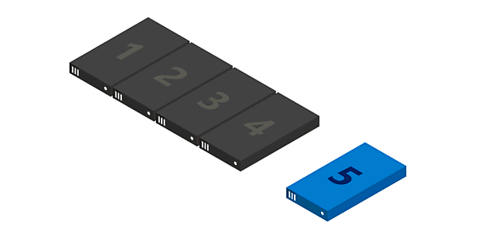
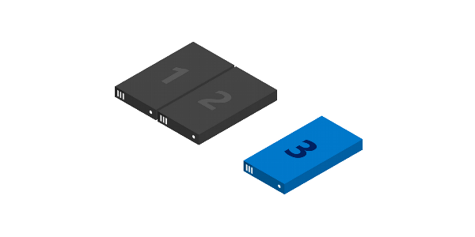
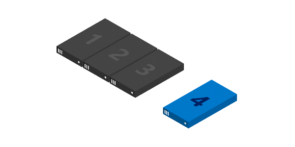
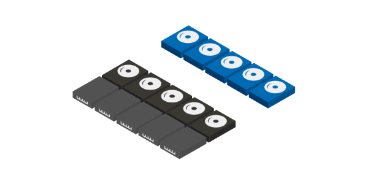

# Adding servers or drives to Storage Spaces Direct

>Applies to: Windows Server 2019, Windows Server 2016

This topic describes how to add servers or drives to Storage Spaces Direct.

## <a name="adding-servers"></a> Adding servers

Adding servers, often called scaling out, adds storage capacity and can improve storage performance and unlock better storage efficiency. If your deployment is hyper-converged, adding servers also provides more compute resources for your workload.



Typical deployments are simple to scale out by adding servers. There are just two steps:

1. Run the [cluster validation wizard](https://technet.microsoft.com/library/cc732035(v=ws.10).aspx) using the Failover Cluster snap-in or with the **Test-Cluster** cmdlet in PowerShell (run as Administrator). Include the new server *\<NewNode>* you wish to add.

   ```PowerShell
   Test-Cluster -Node <Node>, <Node>, <Node>, <NewNode> -Include "Storage Spaces Direct", Inventory, Network, "System Configuration"
   ```

   This confirms that the new server is running Windows Server 2016 Datacenter Edition, has joined the same Active Directory Domain Services domain as the existing servers, has all the required roles and features, and has networking properly configured.

   >[!IMPORTANT]
   > If you are re-using drives that contain old data or metadata you no longer need, clear them using **Disk Management** or the **Reset-PhysicalDisk** cmdlet. If old data or metadata is detected, the drives aren't pooled.

2. Run the following cmdlet on the cluster to finish adding the server:

```
Add-ClusterNode -Name NewNode 
```

   >[!NOTE]
   > Automatic pooling depends on you having only one pool. If you've circumvented the standard configuration to create multiple pools, you will need to add new drives to your preferred pool yourself using **Add-PhysicalDisk**.

### From 2 to 3 servers: unlocking three-way mirroring



With two servers, you can only create two-way mirrored volumes (compare with distributed RAID-1). With three servers, you can create three-way mirrored volumes for better fault tolerance. We recommend using three-way mirroring whenever possible.

Two-way mirrored volumes cannot be upgraded in-place to three-way mirroring. Instead, you can create a new volume and migrate (copy, such as by using [Storage Replica](../storage-replica/server-to-server-storage-replication.md)) your data to it, and then remove the old volume.

To begin creating three-way mirrored volumes, you have several good options. You can use whichever you prefer. 

#### Option 1

Specify **PhysicalDiskRedundancy = 2** on each new volume upon creation.

```PowerShell
New-Volume -FriendlyName <Name> -FileSystem CSVFS_ReFS -StoragePoolFriendlyName S2D* -Size <Size> -PhysicalDiskRedundancy 2
```

#### Option 2

Instead, you can set **PhysicalDiskRedundancyDefault = 2** on the pool's **ResiliencySetting** object named **Mirror**. Then, any new mirrored volumes will automatically use *three-way* mirroring even if you don't specify it.

```PowerShell
Get-StoragePool S2D* | Get-ResiliencySetting -Name Mirror | Set-ResiliencySetting -PhysicalDiskRedundancyDefault 2

New-Volume -FriendlyName <Name> -FileSystem CSVFS_ReFS -StoragePoolFriendlyName S2D* -Size <Size>
```

#### Option 3

Set **PhysicalDiskRedundancy = 2** on the **StorageTier** template called *Capacity*, and then create volumes by referencing the tier.

```PowerShell
Set-StorageTier -FriendlyName Capacity -PhysicalDiskRedundancy 2 

New-Volume -FriendlyName <Name> -FileSystem CSVFS_ReFS -StoragePoolFriendlyName S2D* -StorageTierFriendlyNames Capacity -StorageTierSizes <Size>
```

### From 3 to 4 servers: unlocking dual parity



With four servers, you can use dual parity, also commonly called erasure coding (compare to distributed RAID-6). This provides the same fault tolerance as three-way mirroring, but with better storage efficiency. To learn more, see [Fault tolerance and storage efficiency](storage-spaces-fault-tolerance.md).

If you're coming from a smaller deployment, you have several good options to begin creating dual parity volumes. You can use whichever you prefer.

#### Option 1

Specify **PhysicalDiskRedundancy = 2** and **ResiliencySettingName = Parity** on each new volume upon creation.

```PowerShell
New-Volume -FriendlyName <Name> -FileSystem CSVFS_ReFS -StoragePoolFriendlyName S2D* -Size <Size> -PhysicalDiskRedundancy 2 -ResiliencySettingName Parity
```

#### Option 2

Set **PhysicalDiskRedundancy = 2** on the pool's **ResiliencySetting** object named **Parity**. Then, any new parity volumes will automatically use *dual* parity even if you don't specify it

```PowerShell
Get-StoragePool S2D* | Get-ResiliencySetting -Name Parity | Set-ResiliencySetting -PhysicalDiskRedundancyDefault 2

New-Volume -FriendlyName <Name> -FileSystem CSVFS_ReFS -StoragePoolFriendlyName S2D* -Size <Size> -ResiliencySettingName Parity
```

With four servers, you can also begin using mirror-accelerated parity, where an individual volume is part mirror and part parity.

For this, you will need to update your **StorageTier** templates to have both *Performance* and *Capacity* tiers, as they would be created if you had first run **Enable-ClusterS2D** at four servers. Specifically, both tiers should have the **MediaType** of your capacity devices (such as SSD or HDD) and **PhysicalDiskRedundancy = 2**. The *Performance* tier should be **ResiliencySettingName = Mirror**, and the *Capacity* tier should be **ResiliencySettingName = Parity**.

#### Option 3

You may find it easiest to simply remove the existing tier template and create the two new ones. This will not affect any pre-existing volumes which were created by refering the tier template: it's just a template.

```PowerShell
Remove-StorageTier -FriendlyName Capacity

New-StorageTier -StoragePoolFriendlyName S2D* -MediaType HDD -PhysicalDiskRedundancy 2 -ResiliencySettingName Mirror -FriendlyName Performance
New-StorageTier -StoragePoolFriendlyName S2D* -MediaType HDD -PhysicalDiskRedundancy 2 -ResiliencySettingName Parity -FriendlyName Capacity
```

That's it! You are now ready to create mirror-accelerated parity volumes by referencing these tier templates.

#### Example

```PowerShell
New-Volume -FriendlyName "Sir-Mix-A-Lot" -FileSystem CSVFS_ReFS -StoragePoolFriendlyName S2D* -StorageTierFriendlyNames Performance, Capacity -StorageTierSizes <Size, Size> 
```

### Beyond 4 servers: greater parity efficiency

As you scale beyond four servers, new volumes can benefit from ever-greater parity encoding efficiency. For example, between six and seven servers, efficiency improves from 50.0% to 66.7% as it becomes possible to use Reed-Solomon 4+2 (rather than 2+2). There are no steps you need to take to begin enjoying this new efficiency; the best possible encoding is determined automatically each time you create a volume.

However, any pre-existing volumes will *not* be "converted" to the new, wider encoding. One good reason is that to do so would require a massive calculation affecting literally *every single bit* in the entire deployment. If you would like pre-existing data to become encoded at the higher efficiency, you can migrate it to new volume(s).

For more details, see [Fault tolerance and storage efficiency](storage-spaces-fault-tolerance.md).

### Adding servers when using chassis or rack fault tolerance

If your deployment uses chassis or rack fault tolerance, you must specify the chassis or rack of new servers before adding them to the cluster. This tells Storage Spaces Direct how best to distribute data to maximize fault tolerance.

1. Create a temporary fault domain for the node by opening an elevated PowerShell session and then using the following command, where *\<NewNode>* is the name of the new cluster node:

   ```PowerShell
   New-ClusterFaultDomain -Type Node -Name <NewNode> 
   ```

2. Move this temporary fault-domain into the chassis or rack where the new server is located in the real world, as specified by *\<ParentName>*:

   ```PowerShell
   Set-ClusterFaultDomain -Name <NewNode> -Parent <ParentName> 
   ```

   For more information, see [Fault domain awareness in Windows Server 2016](../../failover-clustering/fault-domains.md).

3. Add the server to the cluster as described in [Adding servers](#adding-servers). When the new server joins the cluster, it's automatically associated (using its name) with the placeholder fault domain.

## <a name="adding-drives"></a> Adding drives

Adding drives, also known as scaling up, adds storage capacity and can improve performance. If you have available slots, you can add drives to each server to expand your storage capacity without adding servers. You can add cache drives or capacity drives independently at any time.

   >[!IMPORTANT]
   > We strongly recommend that all servers have identical storage configurations.



To scale up, connect the drives and verify that Windows discovers them. They should appear in the output of the **Get-PhysicalDisk** cmdlet in PowerShell with their **CanPool** property set to **True**. If they show as **CanPool = False**, you can see why by checking their **CannotPoolReason** property.

```PowerShell
Get-PhysicalDisk | Select SerialNumber, CanPool, CannotPoolReason
```

Within a short time, eligible drives will automatically be claimed by Storage Spaces Direct, added to the storage pool, and volumes will automatically be [redistributed evenly across all the drives](https://blogs.technet.microsoft.com/filecab/2016/11/21/deep-dive-pool-in-spaces-direct/). At this point, you're finished and ready to [extend your volumes](resize-volumes.md) or [create new ones](create-volumes.md).

If the drives don't appear, manually scan for hardware changes. This can be done using **Device Manager**, under the **Action** menu. If they contain old data or metadata, consider reformatting them. This can be done using **Disk Management** or with the **Reset-PhysicalDisk** cmdlet.

   >[!NOTE]
   > Automatic pooling depends on you having only one pool. If you've circumvented the standard configuration to create multiple pools, you will need to add new drives to your preferred pool yourself using **Add-PhysicalDisk**.

## Optimizing drive usage after adding drives or servers

Over time, as drives are added or removed, the distribution of data among the drives in the pool can become uneven. In some cases, this can result in certain drives becoming full while other drives in pool have much lower consumption.

To help keep drive allocation even across the pool, Storage Spaces Direct automatically optimizes drive usage after you add drives or servers to the pool (this is a manual process for Storage Spaces systems that use Shared SAS enclosures). Optimization starts 15 minutes after you add a new drive to the pool. Pool optimization runs as a low-priority background operation, so it can take hours or days to complete, especially if you're using large hard drives.

Optimization uses two jobs - one called *Optimize* and one called *Rebalance* - and you can monitor their progress with the following command:

```powershell
Get-StorageJob
```

You can manually optimize a storage pool with the [Optimize-StoragePool](https://docs.microsoft.com/powershell/module/storage/optimize-storagepool?view=win10-ps) cmdlet. Here's an example:

```powershell
Get-StoragePool <PoolName> | Optimize-StoragePool
```
