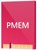
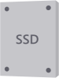

# Choose drives for Azure Local and Windows Server clusters

This article provides guidance on how to choose drives to meet your performance and capacity requirements.

## Drive types

Storage Spaces Direct, the underlying storage virtualization technology behind Azure Local and Windows Server currently works with four types of drives:

| Type of drive | Description |
|----------------------|--------------------------|
||**PMem** refers to persistent memory, a new type of low latency, high-performance storage.|
||**NVMe** (Non-Volatile Memory Express) refers to solid-state drives that sit directly on the PCIe bus. Common form factors are 2.5" U.2, PCIe Add-In-Card (AIC), and M.2. NVMe offers higher IOPS and IO throughput with lower latency than any other type of drive we support today except PMem.|
||**SSD** refers to solid-state drives, which connect via conventional SATA or SAS.|
||**HDD** refers to rotational, magnetic hard disk drives, which offer vast storage capacity.|

   >[!NOTE]
   > This article covers choosing drive configurations with NVMe, SSD, and HDD. For more information on PMem, see [Understand and deploy persistent memory](deploy-persistent-memory.md).

  > [!NOTE]
  > Storage Bus Layer (SBL) cache isn't supported in single server configuration. All flat single storage type configurations (for example all-NVMe or all-SSD) is the only supported storage type for single server.

## Built-in cache

Storage Spaces Direct features a built-in server-side cache. It's a large, persistent, real-time read and write cache. In deployments with multiple types of drives, it's configured automatically to use all drives of the "fastest" type. The remaining drives are used for capacity.

For more information, check out [Understanding the storage pool cache](cache.md).

## Option 1 – Maximizing performance

To achieve predictable and uniform submillisecond latency across random reads and writes to any data, or to achieve extremely high IOPS (we've done [over 13 million](https://techcommunity.microsoft.com/t5/storage-at-microsoft/the-new-hci-industry-record-13-7-million-iops-with-windows/ba-p/428314)!) or IO throughput (we've done over 500 GB/sec reads), you should go "all-flash."

There are multiple ways to do so:

:::image type="content" source="media/choose-drives/all-flash-deployment-possibilities.png" alt-text="Diagram shows deployment options, including all NVMe for capacity, NVMe for cache with SSD for capacity, and all SSD for capacity." lightbox="media/choose-drives/all-flash-deployment-possibilities.png":::

1. **All NVMe.** Using all NVMe provides unmatched performance, including the most predictable low latency. If all your drives are the same model, there's no cache. You can also mix higher-endurance and lower-endurance NVMe models, and configure the former to cache writes for the latter ([requires set-up](/windows-server/storage/storage-spaces/understand-the-cache#manual-configuration)).

2. **NVMe + SSD.** Using NVMe together with SSDs, the NVMe automatically cache writes to the SSDs. This allows writes to coalesce in cache and be destaged only as needed, to reduce wear on the SSDs. This provides NVMe-like write characteristics, while reads are served directly from the also-fast SSDs.

3. **All SSD.** As with All-NVMe, there's no cache if all your drives are the same model. If you mix higher-endurance and lower-endurance models, you can configure the former to cache writes for the latter ([requires set-up](/windows-server/storage/storage-spaces/understand-the-cache#manual-configuration)).

   >[!NOTE]
   > An advantage to using all-NVMe or all-SSD with no cache is that you get usable storage capacity from every drive. There's no capacity "spent" on caching, which may be appealing at smaller scale.

## Option 2 – Balancing performance and capacity

For environments with a variety of applications and workloads, some with stringent performance requirements and others requiring considerable storage capacity, you should go "hybrid" with either NVMe or SSDs caching for larger HDDs.

:::image type="content" source="media/choose-drives/hybrid-deployment-possibilities.png" alt-text="Diagram shows deployment possibilities, including NVMe for cache with HDD for capacity, SSD for cache with HDD for capacity, and NVMe for cache with mixed SSD and HDD for capacity." lightbox="media/choose-drives/hybrid-deployment-possibilities.png":::

1. **NVMe + HDD**. The NVMe drives accelerate reads and writes by caching both. Caching reads allows the HDDs to focus on writes. Caching writes absorbs bursts and allows writes to coalesce and be destaged only as needed, in an artificially serialized manner that maximizes HDD IOPS and IO throughput. This provides NVMe-like write characteristics, and for frequently or recently read data, NVMe-like read characteristics too.

2. **SSD + HDD**. Similar to the above, the SSDs accelerate reads and writes by caching both. This provides SSD-like write characteristics, and SSD-like read characteristics for frequently or recently read data.

    There's one more, rather exotic option: to use drives of *all three* types.

3. **NVMe + SSD + HDD.** With drives of all three types, the NVMe drives cache for both the SSDs and HDDs. The appeal is that you can create volumes on the SSDs, and volumes on the HDDs, side by side in the same cluster, all accelerated by NVMe. The former are exactly as in an "all-flash" deployment, and the latter are exactly as in the "hybrid" deployments described above. This is conceptually like having two pools, with largely independent capacity management, failure and repair cycles, and so on.

   >[!IMPORTANT]
   > We recommend using the SSD tier to place your most performance-sensitive workloads on all-flash.

## Option 3 – Maximizing capacity

For workloads that require vast capacity and write infrequently, such as archival, backup targets, data warehouses or "cold" storage, you should combine a few SSDs for caching with many larger HDDs for capacity.

:::image type="content" source="media/choose-drives/maximizing-capacity.png" alt-text="Deployment options for maximizing capacity." lightbox="media/choose-drives/maximizing-capacity.png":::

1. **SSD + HDD**. The SSDs cache reads and writes, to absorb bursts and provide SSD-like write performance, with optimized destaging later to the HDDs.

>[!IMPORTANT]
>Configuration with HDDs only isn't supported. High endurance SSDs caching to low endurance SSDs isn't advised.

## Sizing considerations

### Cache

Every server must have at least two cache drives (the minimum required for redundancy). We recommend making the number of capacity drives a multiple of the number of cache drives. For example, if you have 4 cache drives, you'll experience more consistent performance with 8 capacity drives (1:2 ratio) than with 7 or 9.

The cache should be sized to accommodate the working set of your applications and workloads, that is, all the data they're actively reading and writing at any given time. There's no cache size requirement beyond that. For deployments with HDDs, a fair starting place is 10 percent of capacity – for example, if each server has 4 x 4 TB HDD = 16 TB of capacity, then 2 x 800 GB SSD = 1.6 TB of cache per server. For all-flash deployments, especially with [high endurance](https://techcommunity.microsoft.com/t5/storage-at-microsoft/understanding-ssd-endurance-drive-writes-per-day-dwpd-terabytes/ba-p/426024) SSDs, it may be fair to start closer to 5 percent of capacity – for example, if each server has 24 x 1.2 TB SSD = 28.8 TB of capacity, then 2 x 750 GB NVMe = 1.5 TB of cache per server. You can always add or remove cache drives later to adjust.

### General

We recommend limiting the total storage capacity per server to approximately 400 terabytes (TB). The more storage capacity per server, the longer the time required to resync data after downtime or rebooting, such when applying software updates. The current maximum size per storage pool is 4 petabytes (PB) (4,000 TB) (1 PB for Windows Server 2016).

## Next steps

For more information, see also:

- [Understand the storage pool cache](cache.md)
- [Drive symmetry considerations](drive-symmetry-considerations.md)
- [Plan volumes](plan-volumes.md)
- [Fault tolerance and storage efficiency](fault-tolerance.md)
- [Understand and deploy persistent memory](deploy-persistent-memory.md)
