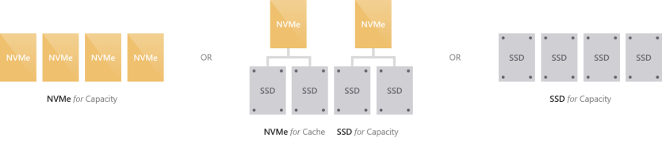
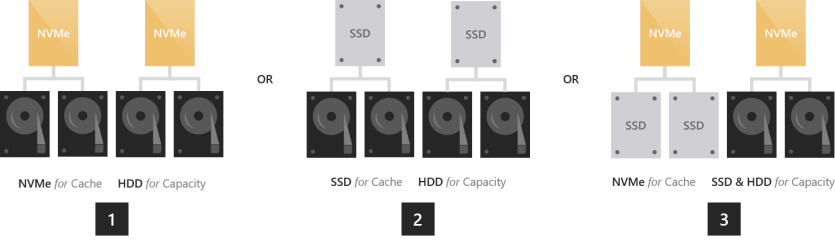

# Choosing drives and resiliency types in Storage Spaces Direct to meet performance and capacity requirements
>Applies To: Windows Server 2016

This topic provides guidance on how to choose drives and resiliency types (mirroring versus parity) in Storage Spaces Direct to meet your workload's performance, capacity, and cost requirements.

Storage Spaces Direct currently works with three types of storage devices:

-   **NVMe** (Non-Volatile Memory Express) drives are solid-state drives that sit directly on the PCIe bus. Common form factors are 2.5" U.2*,* PCIe Add-In-Card (AIC), and M.2. NVMe can vary considerably from model to model, but universally offers lower latency and higher IOPS and IO throughput than any other type of drive we support today.

-   **SSD** refers to solid-state drives which connect via conventional SATA or SAS.

-   **HDD** refers to rotational magnetic hard disk drives which connect via SATA or SAS and offer vast storage capacity.

Besides the underlying storage devices, the performance and capacity of Storage Spaces Direct depends on how you configure the resiliency of your volumes. There are several *resiliency types with differing storage efficiency* you can choose from.

## Option 1 – Maximizing performance

To achieve predictable and uniform sub-millisecond latency across random reads and writes to any data, or to achieve extremely high IOPS (we’ve done *over six million*!) or IO throughput (we’ve done *over 1 Tb/s*!), this is for you.

### Choosing device types

You should go "all-flash". There are currently three ways to do that:

1.  **All NVMe.** Using all NVMe provides unmatched performance, including the most predictable low latency. If all your drives are the same model, there is no cache. You can also mix higher-endurance and lower-endurance NVMe models, and configure the former to cache writes for the latter (requires set-up).

2.  **NVMe + SATA/SAS SSD.** Using NVMe together with SATA/SAS SSDs, the former will automatically cache writes to latter. This allows writes to coalesce in cache and be de-staged only as needed, to reduce wear on the SATA/SAS SSDs. This provides NVMe-like write characteristics, while reads are served directly from the also-fast SATA/SAS SSDs.

3.  **All SATA/SAS SSD.** As with All-NVMe, if all your drives are the same model, there is no cache. Or, you can mix higher-endurance and lower-endurance SATA/SAS SSD models, and configure the former to cache writes for the latter (requires set-up).

   >[!NOTE]
   > An advantage to choosing all NVMe or all SATA SSD with no cache is that you get usable storage capacity from every drive. There is no capacity "spent" on caching, which may be appealing at smaller scale.

### Choosing resiliency types

To maximize performance, all volumes should use mirroring for resiliency. Unless you have only two servers, we strongly recommend three-way mirroring, because it provides better fault tolerance as well as better performance.

   >[!NOTE]
   > Mirroring is faster than any other resiliency type.

## Option 2 – Balancing performance and capacity

For environments with a variety of applications and workloads, not all of which have stringent performance requirements, and some of which require considerable storage capacity, you have a few good options.

### Choosing device types

You should go "hybrid" with either NVMe or SATA/SAS SSDs caching for larger HDDs.

1.  **NVMe + HDD**. The NVMe drives will accelerate reads and writes by caching both. Caching reads allows the HDDs to focus on writes. Caching writes absorbs bursts and allows writes to coalesce and be de-staged only as needed, in an artificially serialized manner that maximizes HDD IOPS and IO throughput. This provides NVMe-like write characteristics, and for frequently or recently read data, NVMe-like read characteristics too.

2.  **SATA/SAS SSD + HDD**. Similar to the above, the SATA/SAS SSDs will accelerate reads and writes by caching both. This provides SSD-like write characteristics, and SSD-like read characteristics for frequently or recently read data.

You have one additional, rather exotic option: to use drives of *all three types*.

3.  **NVMe + SATA/SAS SSD + HDD.** With drives of all three types, the NVMe will cache for the others. The appeal is that you can create volumes on the SSDs, and volumes on the HDDs, side-by-side in the same cluster, all accelerated by NVMe! The former are exactly as in an "all-flash" deployment, and the latter are exactly as in the "hybrid" deployments described above. This is conceptually like having two pools, with largely independent capacity management, failure and repair cycles, and so on.

   >[!IMPORTANT]
   > There is no significant performance advantage to one volume spanning drives of all three types. Do not create volumes which span the SSDs and HDDs in deployments with drives of all three types. The NVMe drives are already accelerating all IO to/from the hottest data by caching and de-staging it in real time. This fulfills most people’s expectation for real-time storage tiering. The latency, IOPS, and IO throughput you get depends almost exclusively on the NVMe drives.

### Choosing resiliency types

Our current recommendation is that all volumes should use mirroring for resiliency. Unless you have only two servers, we strongly recommend three-way mirroring, because it provides better fault tolerance.

   >[!NOTE]
   >  We do not currently recommend mixing mirroring and parity resiliency for general-purpose workloads. We hope to do so in the future as we continue to evolve the technology. We do recommend it for maximizing capacity – see below.

## Option 3 – Maximizing capacity

For workloads which write infrequently and in large, sequential passes such as archival, backup targets, or cold data storage, this is for you.

### Choosing device types

You should combine few SATA/SAS SSDs for caching with many larger HDDs for capacity.

1.  **SATA/SAS SSD + HDD**. The SATA/SAS SSDs will cache reads and writes, to absorb bursts and provide SSD-like write performance, with optimized de-staging later to the HDDs. You can use as few as two SSDs per server (the minimum required for redundancy) and we’ve tested at cache-to-capacity device ratios of up to 1:12, which is to say 24 HDDs per server.

### Choosing resiliency types

For archival, backup targets, or cold data storage, we recommend mixing mirroring and parity resiliency to achieve mirror-accelerated erasure coding. This has been called "mixed" or "multi-" resiliency. The lesser mirror portion accelerates ingestion and mitigate and amortize the compute spike incurred by the parity encoding when large writes arrive.

For sizing the mirror and parity parts of the volume, the ideal is that the number of writes that happen at once (e.g. one daily backup) should comfortably fit in mirror. For example, if you ingest 100 GB once daily, consider using 150 GB to 200 GB of mirror.
