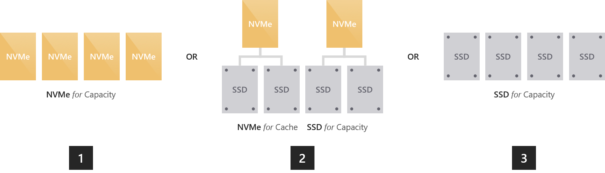
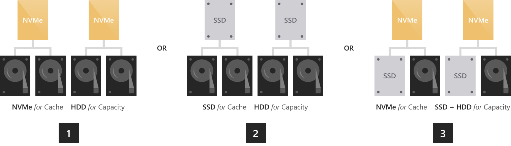
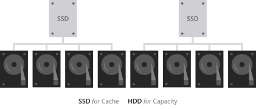

# Choosing drives for Storage Spaces Direct

>Applies to: Windows 2019, Windows Server 2016

This topic provides guidance on how to choose drives for [Storage Spaces Direct](storage-spaces-direct-overview.md) to meet your performance and capacity requirements.

## Drive types

Storage Spaces Direct currently works with three types of drives:

<table>
	<tr style="border: 0;">
		<td style="padding: 10px; border: 0; width:70px">
			
		</td>
		<td style="padding: 10px; border: 0;" valign="middle">
			<b>NVMe</b> (Non-Volatile Memory Express) refers to solid-state drives that sit directly on the PCIe bus. Common form factors are 2.5" U.2, PCIe Add-In-Card (AIC), and M.2. NVMe offers higher IOPS and IO throughput with lower latency than any other type of drive we support today.
		</td>
	</tr>
	<tr style="border: 0;">
		<td style="padding: 10px; border: 0; width:70px" >
			
		</td>
		<td style="padding: 10px; border: 0;" valign="middle">
			<b>SSD</b> refers to solid-state drives which connect via conventional SATA or SAS.
		</td>
	</tr>
	<tr style="border: 0;">
		<td style="padding: 10px; border: 0; width:70px">
			
		</td>
		<td style="padding: 10px; border: 0;" valign="middle">
			<b>HDD</b> refers to rotational, magnetic hard disk drives which offer vast storage capacity.
		</td>
	</tr>
</table>

## Built-in cache

Storage Spaces Direct features a built-in server-side cache. It is a large, persistent, real-time read and write cache. In deployments with multiple types of drives, it is configured automatically to use all drives of the "fastest" type. The remaining drives are used for capacity.

For more information, check out [Understanding the cache in Storage Spaces Direct](understand-the-cache.md).

## Option 1 – Maximizing performance

To achieve predictable and uniform sub-millisecond latency across random reads and writes to any data, or to achieve extremely high IOPS (we've done [over six million](https://www.youtube.com/watch?v=0LviCzsudGY&t=28m)!) or IO throughput (we've done [over 1 Tb/s](https://www.youtube.com/watch?v=-LK2ViRGbWs&t=16m50s)!), you should go "all-flash".

There are currently three ways to do so:

1. **All NVMe.** Using all NVMe provides unmatched performance, including the most predictable low latency. If all your drives are the same model, there is no cache. You can also mix higher-endurance and lower-endurance NVMe models, and configure the former to cache writes for the latter ([requires set-up](understand-the-cache.md#manual-configuration)).

2. **NVMe + SSD.** Using NVMe together with SSDs, the NVMe will automatically cache writes to the SSDs. This allows writes to coalesce in cache and be de-staged only as needed, to reduce wear on the SSDs. This provides NVMe-like write characteristics, while reads are served directly from the also-fast SSDs.

3. **All SSD.** As with All-NVMe, there is no cache if all your drives are the same model. If you mix higher-endurance and lower-endurance models, you can configure the former to cache writes for the latter ([requires set-up](understand-the-cache.md#manual-configuration)).

   >[!NOTE]
   > An advantage to using all-NVMe or all-SSD with no cache is that you get usable storage capacity from every drive. There is no capacity "spent" on caching, which may be appealing at smaller scale.

## Option 2 – Balancing performance and capacity

For environments with a variety of applications and workloads, some with stringent performance requirements and others requiring considerable storage capacity, you should go "hybrid" with either NVMe or SSDs caching for larger HDDs.

1. **NVMe + HDD**. The NVMe drives will accelerate reads and writes by caching both. Caching reads allows the HDDs to focus on writes. Caching writes absorbs bursts and allows writes to coalesce and be de-staged only as needed, in an artificially serialized manner that maximizes HDD IOPS and IO throughput. This provides NVMe-like write characteristics, and for frequently or recently read data, NVMe-like read characteristics too.

2. **SSD + HDD**. Similar to the above, the SSDs will accelerate reads and writes by caching both. This provides SSD-like write characteristics, and SSD-like read characteristics for frequently or recently read data.

	There is one additional, rather exotic option: to use drives of *all three* types.

3. **NVMe + SSD + HDD.** With drives of all three types, the NVMe drives cache for both the SSDs and HDDs. The appeal is that you can create volumes on the SSDs, and volumes on the HDDs, side-by-side in the same cluster, all accelerated by NVMe. The former are exactly as in an "all-flash" deployment, and the latter are exactly as in the "hybrid" deployments described above. This is conceptually like having two pools, with largely independent capacity management, failure and repair cycles, and so on.

   >[!IMPORTANT]
   > We recommend using the SSD tier to place your most performance-sensitive workloads on all-flash.

## Option 3 – Maximizing capacity

For workloads which require vast capacity and write infrequently, such as archival, backup targets, data warehouses or "cold" storage, you should combine a few SSDs for caching with many larger HDDs for capacity.

1. **SSD + HDD**. The SSDs will cache reads and writes, to absorb bursts and provide SSD-like write performance, with optimized de-staging later to the HDDs.

>[!IMPORTANT]
>Configuration with HDDs only is not supported. High endurance SSDs caching to low endurance SSDs is not advised.

## Sizing considerations

### Cache

Every server must have at least two cache drives (the minimum required for redundancy). We recommend making the number of capacity drives a multiple of the number of cache drives. For example, if you have 4 cache drives, you will experience more consistent performance with 8 capacity drives (1:2 ratio) than with 7 or 9.

The cache should be sized to accommodate the working set of your applications and workloads, i.e. all the data they are actively reading and writing at any given time. There is no cache size requirement beyond that. For deployments with HDDs, a fair starting place is 10% of capacity – for example, if each server has 4 x 4 TB HDD = 16 TB of capacity, then 2 x 800 GB SSD = 1.6 TB of cache per server. For all-flash deployments, especially with very [high endurance](https://blogs.technet.microsoft.com/filecab/2017/08/11/understanding-dwpd-tbw/) SSDs, it may be fair to start closer to 5% of capacity – for example, if each server has 24 x 1.2 TB SSD = 28.8 TB of capacity, then 2 x 750 GB NVMe = 1.5 TB of cache per server. You can always add or remove cache drives later to adjust.

### General

We recommend limiting the total storage capacity per server to approximately 100 terabytes (TB). The more storage capacity per server, the longer the time required to resync data after downtime or rebooting, such when applying software updates.

The current maximum size per storage pool is 4 petabyte (PB) (4,000 TB) for Windows Server 2019, or 1 petabyte for Windows Server 2016.

## See also

- [Storage Spaces Direct overview](storage-spaces-direct-overview.md)
- [Understand the cache in Storage Spaces Direct](understand-the-cache.md)
- [Storage Spaces Direct hardware requirements](storage-spaces-direct-hardware-requirements.md)
- [Planning volumes in Storage Spaces Direct](plan-volumes.md)
- [Fault tolerance and storage efficiency](storage-spaces-fault-tolerance.md)
