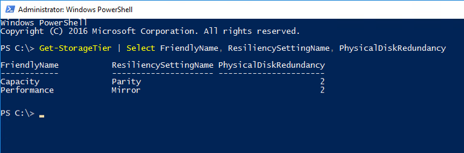
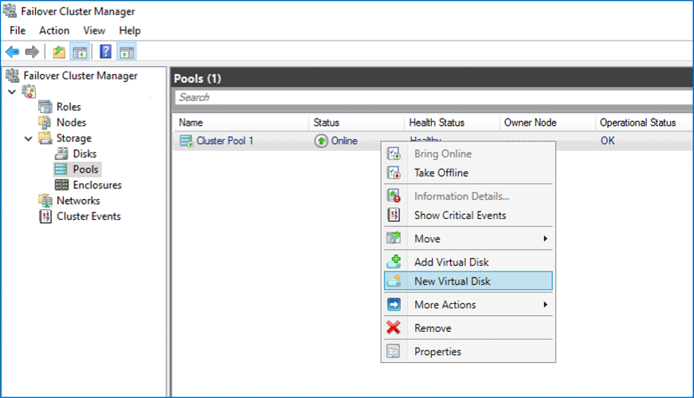
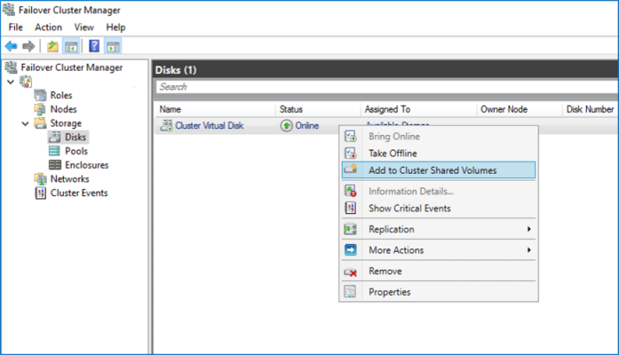

# Creating volumes in Storage Spaces Direct

>Applies To: Windows Server 2016

This topic describes how to create volumes in Storage Spaces Direct using PowerShell or Failover Cluster Manager.

   >[!TIP]
   >  If you haven't already, check out [Planning volumes in Storage Spaces Direct](plan-volumes.md) first.

## Create volumes using PowerShell

We recommend using the **New-Volume** cmdlet to create volumes for Storage Spaces Direct. It provides the fastest and most straightforward experience. This single cmdlet automatically creates the virtual disk, partitions and formats it, creates the volume with matching name, and adds it to cluster shared volumes – all in one easy step.

The **New-Volume** cmdlet has four parameters you'll always need to provide:

- **FriendlyName:** Any string you want, for example *"Volume1"*
- **FileSystem:** Either **CSVFS_ReFS** (recommended) or **CSVFS_NTFS**
- **StoragePoolFriendlyName:** The name of your storage pool, for example *"S2D on ClusterName"*
- **Size:** The size of the volume, for example *"10TB"*

   >[!NOTE]
   >  Windows, including PowerShell, counts using binary (base-2) numbers, whereas drives are often labeled using decimal (base-10) numbers. This explains why a "one terabyte" drive, defined as 1,000,000,000,000 bytes, appears in Windows as about "909 GB". This is expected. When creating volumes using **New-Volume**, you should specify the **Size** parameter in binary (base-2) numbers. For example, specifying "909GB" or "0.909495TB" will create a volume of approximately 1,000,000,000,000 bytes.

### Example: With 2 or 3 servers

To make things easier, if your deployment has only two servers, Storage Spaces Direct will automatically use two-way mirroring for resiliency. If your deployment has only three servers, it will automatically use three-way mirroring.

```
New-Volume -FriendlyName "Volume1" -FileSystem CSVFS_ReFS -StoragePoolFriendlyName S2D* -Size 1TB
```

### Example: With 4+ servers

If you have four or more servers, you can use the optional **ResiliencySettingName** parameter to choose your resiliency type.

-	**ResiliencySettingName:** Either **Mirror** or **Parity**.

In the following example, *"Volume2"* uses three-way mirroring and *"Volume3"* uses dual parity (often called "erasure coding").

```
New-Volume -FriendlyName "Volume2" -FileSystem CSVFS_ReFS -StoragePoolFriendlyName S2D* -Size 1TB -ResiliencySettingName Mirror
New-Volume -FriendlyName "Volume3" -FileSystem CSVFS_ReFS -StoragePoolFriendlyName S2D* -Size 1TB -ResiliencySettingName Parity
```

### Example: Using storage tiers

In deployments with three types of drives, one volume can span the SSD and HDD tiers to reside partially on each. Likewise, in deployments with four or more servers, one volume can mix mirroring and dual parity to reside partially on each.

To help you create such volumes, Storage Spaces Direct provides default tier templates called *Performance* and *Capacity*. They encapsulate definitions for three-way mirroring on the faster capacity drives (if applicable), and dual parity on the slower capacity drives (if applicable).

You can see them by running the **Get-StorageTier** cmdlet.

```
Get-StorageTier | Select FriendlyName, ResiliencySettingName, PhysicalDiskRedundancy
```



To create tiered volumes, reference these tier templates using the **StorageTierFriendlyNames** and **StorageTierSizes** parameters of the **New-Volume** cmdlet. For example, the following cmdlet creates one volume which mixes three-way mirroring and dual parity in 30:70 proportions.

```
New-Volume -FriendlyName "Volume4" -FileSystem CSVFS_ReFS -StoragePoolFriendlyName S2D* -StorageTierFriendlyNames Performance, Capacity -StorageTierSizes 300GB, 700GB
```

## Create volumes using Failover Cluster Manager

You can also create volumes using the *New Virtual Disk Wizard (Storage Spaces Direct)* followed by the *New Volume Wizard* from Failover Cluster Manager, although this workflow has many more manual steps and is not recommended.

There are three major steps:

### Step 1: Create virtual disk



1. In Failover Cluster Manager, navigate to **Storage** -> **Pools**.
2. Select **New Virtual Disk** from the Actions pane on the right, or right-click the pool and select **New Virtual Disk**.
3. Select the storage pool and click **OK**. The *New Virtual Disk Wizard (Storage Spaces Direct)* will open.
4. Use the wizard to name the virtual disk and specify its size.
5. Review your selections and click **Create**.
6. Be sure to check the box marked **Create a volume when this wizard closes** before closing.

### Step 2: Create volume

The *New Volume Wizard* will open.

7. Select the virtual disk you just created and click **Next**.
8. Specify the volume's size (default: the same size as the virtual disk) and click **Next**. 
9. Assign the volume to a drive letter or choose **Don't assign to a drive letter** and click **Next**.
10. Specify the filesystem to use, leave the allocation unit size as *Default*, name the volume, and click **Next**.
11. Review your selections and click **Create**, then **Close**.

### Step 3: Add to cluster shared volumes



12. In Failover Cluster Manager, navigate to **Storage** -> **Disks**.
13. Select the virtual disk you just created and select **Add to Cluster Shared Volumes** from the Actions pane on the right, or right-click the virtual disk and select **Add to Cluster Shared Volumes**.

You're done! Repeat as needed to create more than one volume.

## See also

- [Storage Spaces Direct overview](storage-spaces-direct-overview.md)
- [Planning volumes in Storage Spaces Direct](plan-volumes.md)
