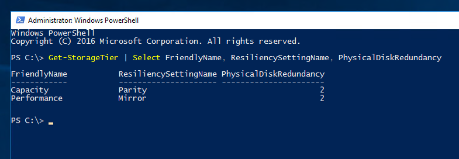

# Creating volumes in Storage Spaces Direct

>Applies To: Windows Server 2016

This topic provides instructions for how to create volumes in Storage Spaces Direct using PowerShell or using the wizards from Failover Cluster Manager.

   >[!TIP]
   >  If you haven’t already, check out [Choosing drives and resiliency types in Storage Spaces Direct](choosing-drives-and-resiliency-types.md).

## PowerShell

We recommend using the **New-Volume** cmdlet to create volumes for Storage Spaces Direct. It provides the fastest and most straightforward experience. This single cmdlet automatically creates the virtual disk, partitions and formats it, creates the volume with matching name, and adds it to cluster shared volumes – all in one easy step.

The **New-Volume** cmdlet has four parameters you'll always need to provide:

-	**FriendlyName:** Any string you want – for example, *"Volume1"*
-	**FileSystem:** Either **CSVFS_ReFS** or **CSVFS_NTFS**
-	**StoragePoolFriendlyName:** The name of your storage pool, probably *"S2D*"*
-	**Size:** The size of the volume, interpreted in binary units – for example, "0.909495 TB" will create a volume of size 1,000,000,000,000 bytes

### Example: With 2 or 3 servers

If you have only two servers, Storage Spaces Direct will automatically use two-way mirroring for resiliency. If you have three servers, it will automatically use three-way mirroring.

```
New-Volume -FriendlyName "Volume1" -FileSystem CSVFS_ReFS -StoragePoolFriendlyName S2D* -Size 1TB
```

### Example: With 4+ servers

If you have four or more servers, you can use the optional **ResiliencySettingName** parameter to choose your resiliency type.

-	**ResiliencySettingName:** Either **Mirror** or **Parity**, the latter referring to erasure coding. If you don’t specify, the default is **Mirror**.

In the following example, *"Volume2"* uses three-way mirroring and *"Volume3"* uses erasure coding.

```
New-Volume -FriendlyName "Volume2" -FileSystem CSVFS_ReFS -StoragePoolFriendlyName S2D* -Size 1TB -ResiliencySettingName Mirror
New-Volume -FriendlyName "Volume3" -FileSystem CSVFS_ReFS -StoragePoolFriendlyName S2D* -Size 1TB -ResiliencySettingName Parity
```

### Example: Tiers

In deployments with three types of drives, one volume can span the SSD and HDD tiers to reside partially on each.

Likewise, in deployments with four or more servers, one volume can mix mirroring and erasure coding to reside partially on each.

To help you create such volumes, Storage Spaces Direct provides default 'tier templates' called *Performance* and *Capacity*. They encapsulate definitions for three-way mirroring on the faster capacity drives (if applicable), and erasure coding on the slower capacity drives (if applicable). If you're curious, you can see them by running the **Get-StorageTier** cmdlet.

```
Get-StorageTier | Select FriendlyName, ResiliencySettingName, PhysicalDiskRedundancy
```



To create tiered volumes, reference these tier templates using the **StorageTierFriendlyNames** and **StorageTierSizes** parameters of the **New-Volume** cmdlet.

For example, the following cmdlet creates one volume which uses 30% three-way mirroring and 70% erasure coding.

```
New-Volume -FriendlyName "Volume4" -FileSystem CSVFS_ReFS -StoragePoolFriendlyName S2D* -StorageTierFriendlyNames Performance, Capacity -StorageTierSizes 300GB, 700GB
```

## Failover Cluster Manager

You can also create volumes using the *New Virtual Disk Wizard (Storage Spaces Direct)* followed by the *New Volume Wizard* from Failover Cluster Manager.

In Failover Cluster Manager, navigate to **Storage** -> **Pools**.

Select **New Virtual Disk** from the Actions pane on the right, or right-click the pool and select **New Virtual Disk**.

[ IMAGE ]

Select the storage pool and click **OK**.

This will open the *New Virtual Disk Wizard (Storage Spaces Direct)*.

Click **Next**.

Name the virtual disk and click **Next**.

Specify its size, optionally spanning multiple tiers (if applicable), and click **Next**.

Review your selections and click **Create**.

Once the virtual disk has been created, be sure to check the box marked **[Check] Create a volume when this wizard closes**, and click **Close**.

[ IMAGE ]

The *New Volume Wizard* will open.

Click **Next**.

...
