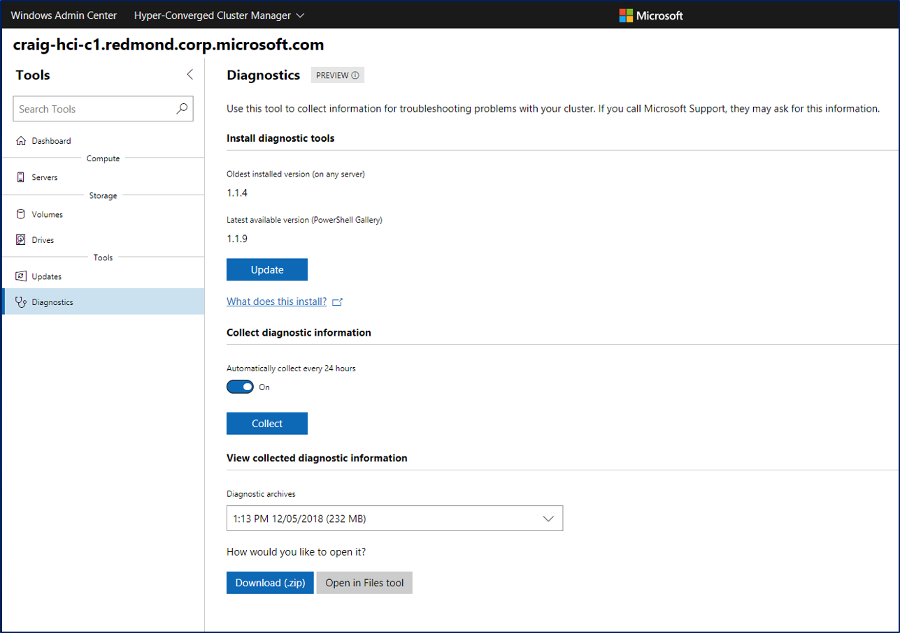

# Collect diagnostic data with Storage Spaces Direct

> Applies to: Windows Server 2019, Windows Server 2016

There are various diagnostic tools that can be used to collect the data needed to troubleshoot Storage Spaces Direct and Failover Cluster. In this article, we will focus on **Get-SDDCDiagnosticInfo** - a one touch tool that will gather all relevant information to help you diagnose your cluster.

Given that the logs and other information that **Get-SDDCDiagnosticInfo** are dense, the information on troubleshooting presented below will be helpful for troubleshooting advanced issues that have been escalated and that may require data to be sent to Microsoft for triaging.

## Installing Get-SDDCDiagnosticInfo

The **Get-SDDCDiagnosticInfo** PowerShell cmdlet (a.k.a. **Get-PCStorageDiagnosticInfo**, previously known as **Test-StorageHealth**) can be used to gather logs for and perform health checks for Failover Clustering (Cluster, Resources, Networks, Nodes), Storage Spaces (Physical Disks, Enclosures, Virtual Disks), Cluster Shared Volumes, SMB File Shares, and Deduplication. 

There are two methods of installing the script, both of which are outlines below.

### PowerShell Gallery

The [PowerShell Gallery](https://www.powershellgallery.com/packages/PrivateCloud.DiagnosticInfo) is a snapshot of the GitHub Repo. Note that installing items from the PowerShell Gallery requires the latest version of the PowerShellGet module, which is available in Windows 10, in Windows Management Framework (WMF) 5.0, or in the MSI-based installer (for PowerShell 3 and 4).

We install the latest version of the [Microsoft Networking Diagnostics tools](https://www.powershellgallery.com/packages/MSFT.Network.Diag) during this process as well since Get-SDDCDiagnosticInfo relies on this. This manifest module contains network diagnostic and troubleshooting tool, which are maintained by the Microsoft Core Networking Product Group at Microsoft.

You can install the module by running following command in PowerShell with administrator privileges:

``` PowerShell
Install-PackageProvider NuGet -Force
Install-Module PrivateCloud.DiagnosticInfo -Force
Import-Module PrivateCloud.DiagnosticInfo -Force
Install-Module -Name MSFT.Network.Diag
```

To update the module, run the following command in PowerShell:

``` PowerShell
Update-Module PrivateCloud.DiagnosticInfo
```

### GitHub

The [GitHub Repo](https://github.com/PowerShell/PrivateCloud.DiagnosticInfo/) is the most up-to-date version of the module, since we are continually iterating here. To install the module from GitHub, download the latest module from the [archive](https://github.com/PowerShell/PrivateCloud.DiagnosticInfo/archive/master.zip) and extract the PrivateCloud.DiagnosticInfo directory to the correct PowerShell modules path pointed by ```$env:PSModulePath```

``` PowerShell
# Allowing Tls12 and Tls11 -- e.g. github now requires Tls12
# If this is not set, the Invoke-WebRequest fails with "The request was aborted: Could not create SSL/TLS secure channel."
[Net.ServicePointManager]::SecurityProtocol = [Net.SecurityProtocolType]::Tls12
$module = 'PrivateCloud.DiagnosticInfo'
Invoke-WebRequest -Uri https://github.com/PowerShell/$module/archive/master.zip -OutFile $env:TEMP\master.zip
Expand-Archive -Path $env:TEMP\master.zip -DestinationPath $env:TEMP -Force
if (Test-Path $env:SystemRoot\System32\WindowsPowerShell\v1.0\Modules\$module) {
    rm -Recurse $env:SystemRoot\System32\WindowsPowerShell\v1.0\Modules\$module -ErrorAction Stop
    Remove-Module $module -ErrorAction SilentlyContinue
} else {
    Import-Module $module -ErrorAction SilentlyContinue
} 
if (-not ($m = Get-Module $module -ErrorAction SilentlyContinue)) {
    $md = "$env:ProgramFiles\WindowsPowerShell\Modules"
} else {
    $md = (gi $m.ModuleBase -ErrorAction SilentlyContinue).PsParentPath
    Remove-Module $module -ErrorAction SilentlyContinue
    rm -Recurse $m.ModuleBase -ErrorAction Stop
}
cp -Recurse $env:TEMP\$module-master\$module $md -Force -ErrorAction Stop
rm -Recurse $env:TEMP\$module-master,$env:TEMP\master.zip
Import-Module $module -Force

``` 

If you need to get this module on an offline cluster, download the zip, move it to your target server node, and install the module.

## Gathering Logs

After you have enabled event channels and completed the installation process, you can use the Get-SDDCDiagnosticInfo PowerShell cmdlet in the module to get:

- Reports on storage health, plus details on unhealthy components
- Reports of storage capacity by pool, volume and deduplicated volume
- Event logs from all cluster nodes and a summary error report

Assume that your storage cluster has the name *"CLUS01".*

To execute against a remote storage cluster:

``` PowerShell
Get-SDDCDiagnosticInfo -ClusterName CLUS01
```

To execute locally on clustered storage node:

``` PowerShell
Get-SDDCDiagnosticInfo
```

To save results to a specified folder:

``` PowerShell
Get-SDDCDiagnosticInfo -WriteToPath D:\Folder 
```

Here is an example of how this looks on a real cluster:

``` PowerShell
New-Item -Name SDDCDiagTemp -Path d:\ -ItemType Directory -Force
Get-SddcDiagnosticInfo -ClusterName S2D-Cluster -WriteToPath d:\SDDCDiagTemp
```

As you can see, script will also do validation of current cluster state


As you can see, all data are being written to SDDCDiagTemp folder


After script will finish, it will create ZIP in your users directory


Let's generate a report into a text file

```PowerShell
#find the latest diagnostic zip in UserProfile
    $DiagZip=(get-childitem $env:USERPROFILE | where Name -like HealthTest*.zip)
    $LatestDiagPath=($DiagZip | sort lastwritetime | select -First 1).FullName
#expand to temp directory
    New-Item -Name SDDCDiagTemp -Path d:\ -ItemType Directory -Force
    Expand-Archive -Path $LatestDiagPath -DestinationPath D:\SDDCDiagTemp -Force
#generate report and save to text file
    $report=Show-SddcDiagnosticReport -Path D:\SDDCDiagTemp
    $report | out-file d:\SDDCReport.txt
    
```

For reference, here is a link to the [sample report](https://github.com/Microsoft/WSLab/blob/dev/Scenarios/S2D%20Tools/Get-SDDCDiagnosticInfo/SDDCReport.txt) and [sample zip](https://github.com/Microsoft/WSLab/blob/dev/Scenarios/S2D%20Tools/Get-SDDCDiagnosticInfo/HealthTest-S2D-Cluster-20180522-1546.ZIP).

To view this in Windows Admin Center (version 1812 onwards), navigate to the *Diagnostics* tab. As you see in the screenshot below, you can 

- Install diagnostic tools
- Update them (if they are out-of-date), 
- Schedule daily diagnostic runs (these have a low impact on your system, usually take <5 minutes in the background, and won't take up more than 500mb on your cluster)
- View previously collected diagnostic information if you need to give it to support or analyze it yourself.



## Get-SDDCDiagnosticInfo output

The following are the files included in the zipped output of Get-SDDCDiagnosticInfo.

### Health Summary Report

The health summary report is saved as:
- 0_CloudHealthSummary.log

This file is generated after parsing all the data collected and is meant to provide a quick summary of your system. It contains:

- System information
- Storage health overview (number of nodes up, resources online, cluster shared volumes online, unhealthy components, etc.)
- Details on unhealthy components (cluster resources that are offline, failed, or online pending)
- Firmware and driver information
- Pool, physical disk, and volume details
- Storage Performance (performance counters are collected)

This report is being continually updated to include more useful information. For the latest information, see the [GitHub README](https://github.com/PowerShell/PrivateCloud.DiagnosticInfo/edit/master/README.md).

### Logs and XML files

The script runs various log gathering scripts and saves the output as xml files. We collect cluster and health logs, system information (MSInfo32), unfiltered event logs (failover clustering, dis diagnostics, hyper-v, storage spaces, and more), and storage diagnostics information (operational logs). For the latest information on what information is collected, see the [GitHub README (what we collect)](https://github.com/PowerShell/PrivateCloud.DiagnosticInfo/blob/master/README.md#what-does-the-cmdlet-output-include).

## How to consume the XML files from Get-PCStorageDiagnosticInfo
You can consume the data from the XML files provided in data collected by the **Get-PCStorageDiagnosticInfo** cmdlet. These files have information about the virtual disks, physical disks, basic cluster info and other PowerShell related outputs. 

To see the results of these outputs, open a PowerShell window and run the following steps. 

```PowerShell
ipmo storage
$d = import-clixml <filename> 
$d
```

## What to expect next?
A lot of improvements and new cmdlets to analyze SDDC system health.
Provide feedback on what you'd like to see by filing issues [here](https://github.com/PowerShell/PrivateCloud.DiagnosticInfo/issues). Also, feel free to contribute helpful changes to the script, by submitting a [pull request](https://github.com/PowerShell/PrivateCloud.DiagnosticInfo/pulls).
