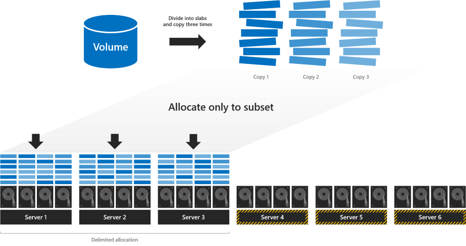
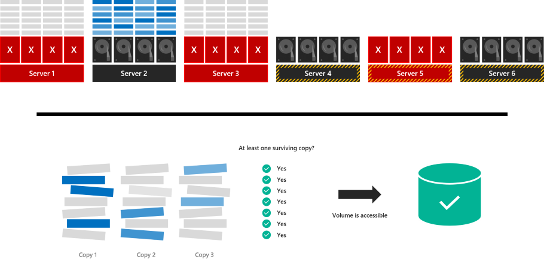
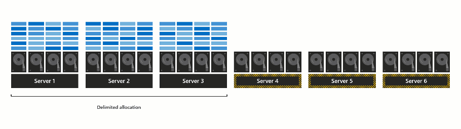

# Delimit the allocation of volumes in Storage Spaces Direct
> Applies To: Windows Server Insider Preview

Windows Server Insider Preview introduces an option to manually delimit the allocation of volumes in Storage Spaces Direct. Doing so can significantly increase fault tolerance under certain conditions, but imposes some management considerations and complexity. This topic explains how it works and gives examples in PowerShell.

   > [!IMPORTANT]
   > This feature is new in Windows Server Insider Preview only. It is not available in Windows Server 2016.

## Prerequisites

###  Consider using this option if:

- Your cluster has six or more servers; and
- Your cluster uses only [three-way mirror](storage-spaces-fault-tolerance.md#mirroring) resiliency

###  Do not use this option if:

- Your cluster has fewer than six servers; or
- Your cluster uses [parity](storage-spaces-fault-tolerance.md#parity) or [mirror-accelerated parity](storage-spaces-fault-tolerance.md#mirror-accelerated-parity) resiliency

## Understand: Regular versus delimited allocation

With regular three-way mirroring, the volume is divided into many small "slabs" that are copied three times and distributed evenly across every drive in every server in the cluster. For more details, read [this Deep Dive blog](https://blogs.technet.microsoft.com/filecab/2016/11/21/deep-dive-pool-in-spaces-direct/).


This default allocation maximizes parallel reads and writes, yielding better performance, and is appealing in its simplicity: every server is equally busy, every drive is equally full, and all volumes live and die together. Every volume is guaranteed to survive up to two concurrent failures, as [these examples](storage-spaces-fault-tolerance.md#examples) illustrate.

However, with this allocation, no volume can survive three concurrent failures. If three servers fail at once, or if drives in three servers fail at once, every volume becomes inaccessible because at least *some* of its slabs were (with very high probability) allocated to the exact three drives or servers that failed.

In the example below, servers 1, 3, and 5 fail at the same time. Although many slabs have surviving copies, some do not:


The volume is inaccessible until the servers are recovered.

With delimited allocation, you specify a subset of servers to use (minimum three for three-way mirror). As before, the volume is divided into slabs that are copied three times – but instead of allocating across every server, **the slabs are allocated only to the subset of servers you specify**.



### Advantages

With this allocation, the volume is very likely to survive three concurrent failures: in fact, the probability of survival is increased from 0% (with regular allocation) to 95% (with delimited allocation)! Intuitively, this is because the volume is not affected by failures in servers 4, 5, or 6 because it does not depend on their drives to store its slabs. Survival probability depends on the number of servers and other factors – for more details, see the [analysis](#analysis-of-survival-probabilities) section. 

In the example (same as above), servers 1, 3, and 5 fail at the same time. Our delimited allocation ensures that server 2 contains a copy of *every* slab, so every slab has a surviving copy, and the volume stays accessible:



### Disadvantages

Delimited allocation imposes some added management considerations and complexity:

1. You are responsible for delimiting the allocation of each volume in a way that balances storage utilization across servers and upholds high probability of survival. We recommend delimiting each volume to three servers, and ensuring that every volume's delimitation is unique, meaning it does not share *all* three servers with another volume (sharing *some* servers is fine). With 6 servers, there are 20 unique combinations; with 8 servers, there are 56 unique combinations; and so on. See the [analysis](#analysis-of-survival-probabilities) section for more details.

2. When using delimited allocation, we recommend reserving the equivalent of one capacity drive per server, **with no maximum**. This is more than the [published recommendation](plan-volumes#choosing-the-size-of-volumes) for regular allocation, which maxes out at four capacity drives total.

3. If a server fails and needs to be replaced, as described in [Remove a server and its drives](remove-servers#remove-a-server-and-its-drives), you are responsible for updating the delimitation of each affected volume (i.e. adding a new server to its delimitation and removing the failed one – example below).

## Usage in PowerShell

### Create a volume and delimit its allocation

You can use the `New-Volume` cmdlet to create volumes in Storage Spaces Direct.

For example, to create a regular three-way mirror volume, you would run:

```PowerShell
New-Volume -FriendlyName "MyRegularVolume" -Size 100GB
```

To create a three-way mirror volume and delimit its allocation:

1. First assign the servers in your cluster to the variable `$Servers`:

    ```PowerShell
    $Servers = Get-StorageFaultDomain -Type StorageScaleUnit | Sort FriendlyName
    ```

   > [!TIP]
   > In Storage Spaces Direct, the term 'Storage Scale Unit' refers to all the raw storage attached to one server, including direct-attached drives and direct-attached external enclosures with drives. In this context, it's like a synonym for 'server'.

2. Then, specify which servers to use with the new `-StorageFaultDomainsToUse` parameter and by indexing into `$Servers`. For example, to delimit the allocation to the first, second, and third servers (indices 0, 1, and 2) only, run:

    ```PowerShell
    New-Volume -FriendlyName "MyVolume" -Size 100GB -StorageFaultDomainsToUse $Servers[0,1,2]
    ```

### See a delimited allocation

To see how MyVolume is allocated, the [Appendix](#appendix) provides a helpful script:

```PowerShell
PS C:\> .\Get-VirtualDiskFootprintBySSU.ps1

VirtualDiskFriendlyName TotalFootprint Server1 Server2 Server3 Server4 Server5 Server6
----------------------- -------------- ------- ------- ------- ------- ------- -------
MyVolume                300 GB         100 GB  100 GB  100 GB  0       0       0      
```

Note that only Server1, Server2, and Server3 contains slabs of MyVolume.

### Change a delimited allocation

Use the new `Add-StorageFaultDomain` and `Remove-StorageFaultDomain` cmdlets to change how the allocation is delimited.

For example, to move MyVolume "to the right" by one server:

1. Specify that the fourth server (index 3 in `$Servers`) **can** store slabs of MyVolume:

    ```PowerShell
    Get-VirtualDisk MyVolume | Add-StorageFaultDomain -StorageFaultDomains $Servers[3]
    ```

2. Specify that the first server (index 0 in `$Servers`) **cannot** store slabs of MyVolume:

    ```PowerShell
    Get-VirtualDisk MyVolume | Remove-StorageFaultDomain -StorageFaultDomains $Servers[0]
    ```

3. Rebalance the storage pool for the change to take effect:

    ```PowerShell
    Optimize-StoragePool
    ```



Once the rebalance has completed (you can monitor it with `Get-StorageJob`), you can verify that MyVolume has moved by running the `Get-VirtualDiskFootprintBySSU.ps1` script again.

```PowerShell
PS C:\> .\Get-VirtualDiskFootprintBySSU.ps1

VirtualDiskFriendlyName TotalFootprint Server1 Server2 Server3 Server4 Server5 Server6
----------------------- -------------- ------- ------- ------- ------- ------- -------
MyVolume                300 GB         0       100 GB  100 GB  100 GB  0       0      
```

Note that Server1 does not contain slabs of MyVolume anymore – instead, Server04 does.

## Analysis of survival probabilities

Coming soon.

## Frequently asked questions

### Can I use regular and delimited volumes together?

Yes. You can choose per-volume whether or not to delimit allocation.

### Are there any changes to drive replacement?

No. Drive replacement works the same with delimited allocation as with regular allocation.

## See also

- [Storage Spaces Direct overview](storage-spaces-direct-overview.md)
- [Fault tolerance in Storage Spaces Direct](storage-spaces-fault-tolerance)

## Appendix

This script helps you see how your volumes are allocated.

To use it as described above, copy/paste and save as `Get-VirtualDiskFootprintBySSU.ps1`.

```PowerShell
Function ConvertTo-PrettyCapacity {
    Param (
        [Parameter(
            Mandatory = $True,
            ValueFromPipeline = $True
            )
        ]
    [Int64]$Bytes,
    [Int64]$RoundTo = 0
    )
    If ($Bytes -Gt 0) {
        $Base = 1024
        $Labels = ("bytes", "KB", "MB", "GB", "TB", "PB", "EB", "ZB", "YB")
        $Order = [Math]::Floor( [Math]::Log($Bytes, $Base) )
        $Rounded = [Math]::Round($Bytes/( [Math]::Pow($Base, $Order) ), $RoundTo)
        [String]($Rounded) + " " + $Labels[$Order]
    }
    Else {
        "0"
    }
    Return
}

Function Get-VirtualDiskFootprintByStorageFaultDomain {

    ################################################
    ### Step 1: Gather Configuration Information ###
    ################################################

    Write-Progress -Activity "Get-VirtualDiskFootprintByStorageFaultDomain" -CurrentOperation "Gathering configuration information..." -Status "Step 1/4" -PercentComplete 00

    $ErrorCannotGetCluster = "Cannot proceed because 'Get-Cluster' failed."
    $ErrorNotS2DEnabled = "Cannot proceed because the cluster is not running Storage Spaces Direct."
    $ErrorCannotGetClusterNode = "Cannot proceed because 'Get-ClusterNode' failed."
    $ErrorClusterNodeDown = "Cannot proceed because one or more cluster nodes is not Up."
    $ErrorCannotGetStoragePool = "Cannot proceed because 'Get-StoragePool' failed."
    $ErrorPhysicalDiskFaultDomainAwareness = "Cannot proceed because the storage pool is set to 'PhysicalDisk' fault domain awareness. This cmdlet only supports 'StorageScaleUnit', 'StorageChassis', or 'StorageRack' fault domain awareness."

    Try  {
        $GetCluster = Get-Cluster -ErrorAction Stop
    }
    Catch {
        throw $ErrorCannotGetCluster
    }

    If ($GetCluster.S2DEnabled -Ne 1) {
        throw $ErrorNotS2DEnabled
    }

    Try  {
        $GetClusterNode = Get-ClusterNode -ErrorAction Stop
    }
    Catch {
        throw $ErrorCannotGetClusterNode
    }

    If ($GetClusterNode | Where State -Ne Up) {
        throw $ErrorClusterNodeDown
    }

    Try {
        $GetStoragePool = Get-StoragePool -IsPrimordial $False -ErrorAction Stop
    }
    Catch {
        throw $ErrorCannotGetStoragePool
    }

    If ($GetStoragePool.FaultDomainAwarenessDefault -Eq "PhysicalDisk") {
        throw $ErrorPhysicalDiskFaultDomainAwareness
    }

    ###########################################################
    ### Step 2: Create SfdList[] and PhysicalDiskToSfdMap{} ###
    ###########################################################

    Write-Progress -Activity "Get-VirtualDiskFootprintByStorageFaultDomain" -CurrentOperation "Analyzing physical disk information..." -Status "Step 2/4" -PercentComplete 25

    $SfdList = Get-StorageFaultDomain -Type ($GetStoragePool.FaultDomainAwarenessDefault) | Sort FriendlyName # StorageScaleUnit, StorageChassis, or StorageRack

    $PhysicalDiskToSfdMap = @{} # Map of PhysicalDisk.UniqueId -> StorageFaultDomain.FriendlyName
    $SfdList | ForEach {
        $StorageFaultDomain = $_
        $_ | Get-StorageFaultDomain -Type PhysicalDisk | ForEach {
            $PhysicalDiskToSfdMap[$_.UniqueId] = $StorageFaultDomain.FriendlyName
        }
    }

    ##################################################################################################
    ### Step 3: Create VirtualDisk.FriendlyName -> { StorageFaultDomain.FriendlyName -> Size } Map ###
    ##################################################################################################

    Write-Progress -Activity "Get-VirtualDiskFootprintByStorageFaultDomain" -CurrentOperation "Analyzing virtual disk information..." -Status "Step 3/4" -PercentComplete 50

    $GetVirtualDisk = Get-VirtualDisk | Sort FriendlyName

    $VirtualDiskMap = @{}

    $GetVirtualDisk | ForEach {
        # Map of PhysicalDisk.UniqueId -> Size for THIS virtual disk
        $PhysicalDiskToSizeMap = @{}
        $_ | Get-PhysicalExtent | ForEach {
            $PhysicalDiskToSizeMap[$_.PhysicalDiskUniqueId] += $_.Size
        }
        # Map of StorageFaultDomain.FriendlyName -> Size for THIS virtual disk
        $SfdToSizeMap = @{}
        $PhysicalDiskToSizeMap.keys | ForEach {
            $SfdToSizeMap[$PhysicalDiskToSfdMap[$_]] += $PhysicalDiskToSizeMap[$_]
        }
        # Store
        $VirtualDiskMap[$_.FriendlyName] = $SfdToSizeMap
    }

    #########################
    ### Step 4: Write-Out ###
    #########################

    Write-Progress -Activity "Get-VirtualDiskFootprintByStorageFaultDomain" -CurrentOperation "Formatting output..." -Status "Step 4/4" -PercentComplete 75

    $Output = $GetVirtualDisk | ForEach {
        $Row = [PsCustomObject]@{}

        $VirtualDiskFriendlyName = $_.FriendlyName
        $Row | Add-Member -MemberType NoteProperty "VirtualDiskFriendlyName" $VirtualDiskFriendlyName

        $TotalFootprint = $_.FootprintOnPool | ConvertTo-PrettyCapacity
        $Row | Add-Member -MemberType NoteProperty "TotalFootprint" $TotalFootprint

        $SfdList | ForEach {
            $Size = $VirtualDiskMap[$VirtualDiskFriendlyName][$_.FriendlyName] | ConvertTo-PrettyCapacity
            $Row | Add-Member -MemberType NoteProperty $_.FriendlyName $Size
        }

        $Row
    }

    # Calculate width, in characters, required to Format-Table
    $RequiredWindowWidth = ("TotalFootprint").length + 1 + ("VirtualDiskFriendlyName").length + 1
    $SfdList | ForEach {
        $RequiredWindowWidth += $_.FriendlyName.Length + 1
    }

    $ActualWindowWidth = (Get-Host).UI.RawUI.WindowSize.Width

    If ($ActualWindowWidth -Lt $RequiredWindowWidth) {
        # Narrower window, Format-List
        Write-Warning "For the best experience, try making your PowerShell window at least $RequiredWindowWidth characters wide. Current width is $ActualWindowWidth characters."
        $Output | Format-List
    }
    Else {
        # Wider window, Format-Table
        $Output | Format-Table
    }
}

Get-VirtualDiskFootprintByStorageFaultDomain
```
