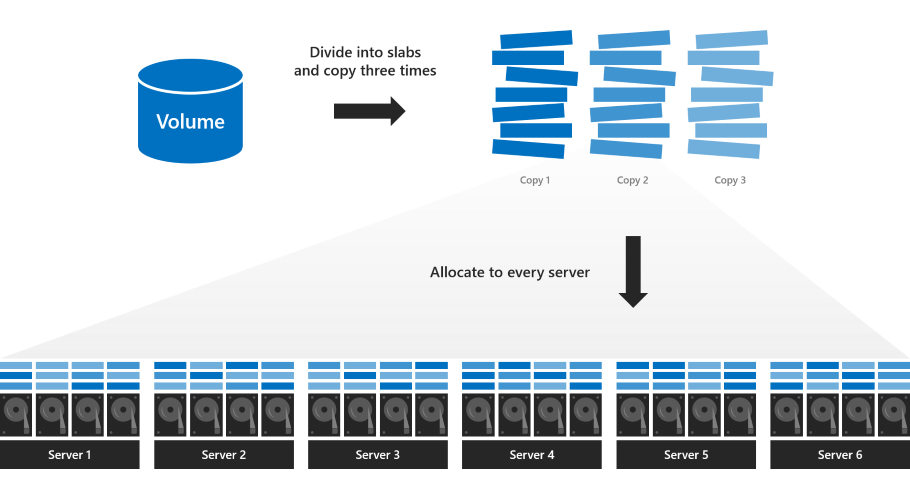
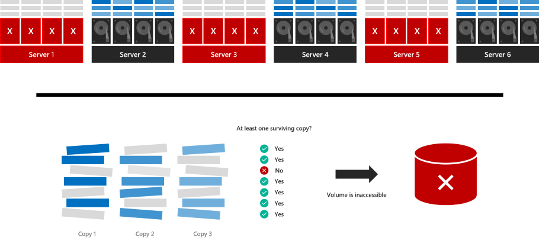

# Delimit the allocation of volumes in Storage Spaces Direct
> Applies to: Windows Server 2019

Windows Server 2019 introduces an option to manually delimit the allocation of volumes in Storage Spaces Direct. Doing so can significantly increase fault tolerance under certain conditions, but imposes some added management considerations and complexity. This topic explains how it works and gives examples in PowerShell.

   > [!IMPORTANT]
   > This feature is new in Windows Server 2019. It is not available in Windows Server 2016. 

## Prerequisites

###  Consider using this option if:

- Your cluster has six or more servers; and
- Your cluster uses only [three-way mirror](storage-spaces-fault-tolerance.md#mirroring) resiliency

###  Do not use this option if:

- Your cluster has fewer than six servers; or
- Your cluster uses [parity](storage-spaces-fault-tolerance.md#parity) or [mirror-accelerated parity](storage-spaces-fault-tolerance.md#mirror-accelerated-parity) resiliency

## Understand

### Review: regular allocation

With regular three-way mirroring, the volume is divided into many small "slabs" that are copied three times and distributed evenly across every drive in every server in the cluster. For more details, read [this deep dive blog](https://blogs.technet.microsoft.com/filecab/2016/11/21/deep-dive-pool-in-spaces-direct/).



This default allocation maximizes parallel reads and writes, leading to better performance, and is appealing in its simplicity: every server is equally busy, every drive is equally full, and all volumes stay online or go offline together. Every volume is guaranteed to survive up to two concurrent failures, as [these examples](storage-spaces-fault-tolerance.md#examples) illustrate.

However, with this allocation, volumes can't survive three concurrent failures. If three servers fail at once, or if drives in three servers fail at once, volumes become inaccessible because at least some slabs were (with very high probability) allocated to the exact three drives or servers that failed.

In the example below, servers 1, 3, and 5 fail at the same time. Although many slabs have surviving copies, some do not:



The volume goes offline and becomes inaccessible until the servers are recovered.

### New: delimited allocation

With delimited allocation, you specify a subset of servers to use (minimum four). The volume is divided into slabs that are copied three times, like before, but instead of allocating across every server, **the slabs are allocated only to the subset of servers you specify**.

For example, if you have an 8 node cluster (nodes 1 through 8), you can specify a volume to be located only on disks in nodes 1, 2, 3, 4.
#### Advantages

With the example allocation, the volume is likely to survive three concurrent failures. If nodes 1, 2, and 6 go down, only 2 of the nodes that hold the 3 copies of data for the volume are down and the volume will stay online.

Survival probability depends on the number of servers and other factors – see [Analysis](#analysis) for details.

#### Disadvantages

Delimited allocation imposes some added management considerations and complexity:

1. The administrator is responsible for delimiting the allocation of each volume to balance storage utilization across servers and uphold high probability of survival, as described in the [Best practices](#best-practices) section.

2. With delimited allocation, reserve the equivalent of **one capacity drive per server (with no maximum)**. This is more than the [published recommendation](plan-volumes.md#choosing-the-size-of-volumes) for regular allocation, which maxes out at four capacity drives total.

3. If a server fails and needs to be replaced, as described in [Remove a server and its drives](remove-servers.md#remove-a-server-and-its-drives), the administrator is responsible for updating the delimitation of affected volumes by adding the new server and removing the failed one – example below.

## Usage in PowerShell

You can use the `New-Volume` cmdlet to create volumes in Storage Spaces Direct.

For example, to create a regular three-way mirror volume:

```PowerShell
New-Volume -FriendlyName "MyRegularVolume" -Size 100GB
```

### Create a volume and delimit its allocation

To create a three-way mirror volume and delimit its allocation:

1. First assign the servers in your cluster to the variable `$Servers`:

    ```PowerShell
    $Servers = Get-StorageFaultDomain -Type StorageScaleUnit | Sort FriendlyName
    ```

   > [!TIP]
   > In Storage Spaces Direct, the term 'Storage Scale Unit' refers to all the raw storage attached to one server, including direct-attached drives and direct-attached external enclosures with drives. In this context, it's the same as 'server'.

2. Specify which servers to use with the new `-StorageFaultDomainsToUse` parameter and by indexing into `$Servers`. For example, to delimit the allocation to the first, second, third, and fourth servers (indices 0, 1, 2, and 3):

    ```PowerShell
    New-Volume -FriendlyName "MyVolume" -Size 100GB -StorageFaultDomainsToUse $Servers[0,1,2,3]
    ```

### See a delimited allocation

To see how *MyVolume* is allocated, use the `Get-VirtualDiskFootprintBySSU.ps1` script in [Appendix](#appendix):

```PowerShell
PS C:\> .\Get-VirtualDiskFootprintBySSU.ps1

VirtualDiskFriendlyName TotalFootprint Server1 Server2 Server3 Server4 Server5 Server6
----------------------- -------------- ------- ------- ------- ------- ------- -------
MyVolume                300 GB         100 GB  100 GB  100 GB  100 GB  0       0      
```

Note that only Server1, Server2, Server3, and Server4 contain slabs of *MyVolume*.

### Change a delimited allocation

Use the new `Add-StorageFaultDomain` and `Remove-StorageFaultDomain` cmdlets to change how the allocation is delimited.

For example, to move *MyVolume* over by one server:

1. Specify that the fifth server **can** store slabs of *MyVolume*:

    ```PowerShell
    Get-VirtualDisk MyVolume | Add-StorageFaultDomain -StorageFaultDomains $Servers[4]
    ```

2. Specify that the first server **cannot** store slabs of *MyVolume*:

    ```PowerShell
    Get-VirtualDisk MyVolume | Remove-StorageFaultDomain -StorageFaultDomains $Servers[0]
    ```

3. Rebalance the storage pool for the change to take effect:

    ```PowerShell
    Get-StoragePool S2D* | Optimize-StoragePool
    ```

You can monitor the progress of the rebalance with `Get-StorageJob`.

Once it is complete, verify that *MyVolume* has moved by running `Get-VirtualDiskFootprintBySSU.ps1` again.

```PowerShell
PS C:\> .\Get-VirtualDiskFootprintBySSU.ps1

VirtualDiskFriendlyName TotalFootprint Server1 Server2 Server3 Server4 Server5 Server6
----------------------- -------------- ------- ------- ------- ------- ------- -------
MyVolume                300 GB         0       100 GB  100 GB  100 GB  100 GB  0      
```

Note that Server1 does not contain slabs of *MyVolume* anymore – instead, Server5 does.

## Best practices

Here are the best practices to follow when using delimited volume allocation:

### Choose four servers

Delimit each three-way mirror volume to four servers, not more.

### Balance storage

Balance how much storage is allocated to each server, accounting for volume size.

### Stagger delimited allocation volumes

To maximize fault tolerance, make each volume's allocation unique, meaning it does not share *all* its servers with another volume (some overlap is okay). 

For example on an eight-node system:
Volume 1: Servers 1, 2, 3, 4
Volume 2: Servers 5, 6, 7, 8
Volume 3: Servers 3, 4, 5, 6
Volume 4: Servers 1, 2, 7, 8

## Analysis

This section derives the mathematical probability that a volume stays online and accessible (or equivalently, the expected fraction of overall storage that stays online and accessible) as a function of the number of failures and the cluster size.

   > [!NOTE]
   > This section is optional reading. If you're keen to see the math, read on! But if not, don't worry: [Usage in PowerShell](#usage-in-powershell) and [Best practices](#best-practices) is all you need to implement delimited allocation successfully.

### Up to two failures is always okay

Every three-way mirror volume can survive up to two failures at the same time, regardless of its allocation. If two drives fail, or two servers fail, or one of each, every three-way mirror volume stays online and accessible, even with regular allocation.

### More than half the cluster failing is never okay

Conversely, in the extreme case that more than half of servers or drives in the cluster fail at once, [quorum is lost](understand-quorum.md) and every three-way mirror volume goes offline and becomes inaccessible, regardless of its allocation.

### What about in between?

If three or more failures occur at once, but at least half of the servers and the drives are still up, volumes with delimited allocation may stay online and accessible, depending on which servers have failures.

## Frequently asked questions

### Can I delimit some volumes but not others?

Yes. You can choose per-volume whether or not to delimit allocation.

### Does delimited allocation change how drive replacement works?

No, it's the same as with regular allocation.

## See also

- [Storage Spaces Direct overview](storage-spaces-direct-overview.md)
- [Fault tolerance in Storage Spaces Direct](storage-spaces-fault-tolerance.md)

## Appendix

This script helps you see how your volumes are allocated.

To use it as described above, copy/paste and save as `Get-VirtualDiskFootprintBySSU.ps1`.

```PowerShell
Function ConvertTo-PrettyCapacity {
    Param (
        [Parameter(
            Mandatory = $True,
            ValueFromPipeline = $True
            )
        ]
    [Int64]$Bytes,
    [Int64]$RoundTo = 0
    )
    If ($Bytes -Gt 0) {
        $Base = 1024
        $Labels = ("bytes", "KB", "MB", "GB", "TB", "PB", "EB", "ZB", "YB")
        $Order = [Math]::Floor( [Math]::Log($Bytes, $Base) )
        $Rounded = [Math]::Round($Bytes/( [Math]::Pow($Base, $Order) ), $RoundTo)
        [String]($Rounded) + " " + $Labels[$Order]
    }
    Else {
        "0"
    }
    Return
}

Function Get-VirtualDiskFootprintByStorageFaultDomain {

    ################################################
    ### Step 1: Gather Configuration Information ###
    ################################################

    Write-Progress -Activity "Get-VirtualDiskFootprintByStorageFaultDomain" -CurrentOperation "Gathering configuration information..." -Status "Step 1/4" -PercentComplete 00

    $ErrorCannotGetCluster = "Cannot proceed because 'Get-Cluster' failed."
    $ErrorNotS2DEnabled = "Cannot proceed because the cluster is not running Storage Spaces Direct."
    $ErrorCannotGetClusterNode = "Cannot proceed because 'Get-ClusterNode' failed."
    $ErrorClusterNodeDown = "Cannot proceed because one or more cluster nodes is not Up."
    $ErrorCannotGetStoragePool = "Cannot proceed because 'Get-StoragePool' failed."
    $ErrorPhysicalDiskFaultDomainAwareness = "Cannot proceed because the storage pool is set to 'PhysicalDisk' fault domain awareness. This cmdlet only supports 'StorageScaleUnit', 'StorageChassis', or 'StorageRack' fault domain awareness."

    Try  {
        $GetCluster = Get-Cluster -ErrorAction Stop
    }
    Catch {
        throw $ErrorCannotGetCluster
    }

    If ($GetCluster.S2DEnabled -Ne 1) {
        throw $ErrorNotS2DEnabled
    }

    Try  {
        $GetClusterNode = Get-ClusterNode -ErrorAction Stop
    }
    Catch {
        throw $ErrorCannotGetClusterNode
    }

    If ($GetClusterNode | Where State -Ne Up) {
        throw $ErrorClusterNodeDown
    }

    Try {
        $GetStoragePool = Get-StoragePool -IsPrimordial $False -ErrorAction Stop
    }
    Catch {
        throw $ErrorCannotGetStoragePool
    }

    If ($GetStoragePool.FaultDomainAwarenessDefault -Eq "PhysicalDisk") {
        throw $ErrorPhysicalDiskFaultDomainAwareness
    }

    ###########################################################
    ### Step 2: Create SfdList[] and PhysicalDiskToSfdMap{} ###
    ###########################################################

    Write-Progress -Activity "Get-VirtualDiskFootprintByStorageFaultDomain" -CurrentOperation "Analyzing physical disk information..." -Status "Step 2/4" -PercentComplete 25

    $SfdList = Get-StorageFaultDomain -Type ($GetStoragePool.FaultDomainAwarenessDefault) | Sort FriendlyName # StorageScaleUnit, StorageChassis, or StorageRack

    $PhysicalDiskToSfdMap = @{} # Map of PhysicalDisk.UniqueId -> StorageFaultDomain.FriendlyName
    $SfdList | ForEach {
        $StorageFaultDomain = $_
        $_ | Get-StorageFaultDomain -Type PhysicalDisk | ForEach {
            $PhysicalDiskToSfdMap[$_.UniqueId] = $StorageFaultDomain.FriendlyName
        }
    }

    ##################################################################################################
    ### Step 3: Create VirtualDisk.FriendlyName -> { StorageFaultDomain.FriendlyName -> Size } Map ###
    ##################################################################################################

    Write-Progress -Activity "Get-VirtualDiskFootprintByStorageFaultDomain" -CurrentOperation "Analyzing virtual disk information..." -Status "Step 3/4" -PercentComplete 50

    $GetVirtualDisk = Get-VirtualDisk | Sort FriendlyName

    $VirtualDiskMap = @{}

    $GetVirtualDisk | ForEach {
        # Map of PhysicalDisk.UniqueId -> Size for THIS virtual disk
        $PhysicalDiskToSizeMap = @{}
        $_ | Get-PhysicalExtent | ForEach {
            $PhysicalDiskToSizeMap[$_.PhysicalDiskUniqueId] += $_.Size
        }
        # Map of StorageFaultDomain.FriendlyName -> Size for THIS virtual disk
        $SfdToSizeMap = @{}
        $PhysicalDiskToSizeMap.keys | ForEach {
            $SfdToSizeMap[$PhysicalDiskToSfdMap[$_]] += $PhysicalDiskToSizeMap[$_]
        }
        # Store
        $VirtualDiskMap[$_.FriendlyName] = $SfdToSizeMap
    }

    #########################
    ### Step 4: Write-Out ###
    #########################

    Write-Progress -Activity "Get-VirtualDiskFootprintByStorageFaultDomain" -CurrentOperation "Formatting output..." -Status "Step 4/4" -PercentComplete 75

    $Output = $GetVirtualDisk | ForEach {
        $Row = [PsCustomObject]@{}

        $VirtualDiskFriendlyName = $_.FriendlyName
        $Row | Add-Member -MemberType NoteProperty "VirtualDiskFriendlyName" $VirtualDiskFriendlyName

        $TotalFootprint = $_.FootprintOnPool | ConvertTo-PrettyCapacity
        $Row | Add-Member -MemberType NoteProperty "TotalFootprint" $TotalFootprint

        $SfdList | ForEach {
            $Size = $VirtualDiskMap[$VirtualDiskFriendlyName][$_.FriendlyName] | ConvertTo-PrettyCapacity
            $Row | Add-Member -MemberType NoteProperty $_.FriendlyName $Size
        }

        $Row
    }

    # Calculate width, in characters, required to Format-Table
    $RequiredWindowWidth = ("TotalFootprint").length + 1 + ("VirtualDiskFriendlyName").length + 1
    $SfdList | ForEach {
        $RequiredWindowWidth += $_.FriendlyName.Length + 1
    }

    $ActualWindowWidth = (Get-Host).UI.RawUI.WindowSize.Width

    If (!($ActualWindowWidth)) {
        # Cannot get window width, probably ISE, Format-List
        Write-Warning "Could not determine window width. For the best experience, use a Powershell window instead of ISE"
        $Output | Format-Table
    }
    ElseIf ($ActualWindowWidth -Lt $RequiredWindowWidth) {
        # Narrower window, Format-List
        Write-Warning "For the best experience, try making your PowerShell window at least $RequiredWindowWidth characters wide. Current width is $ActualWindowWidth characters."
        $Output | Format-List
    }
    Else {
        # Wider window, Format-Table
        $Output | Format-Table
    }
}

Get-VirtualDiskFootprintByStorageFaultDomain
```
