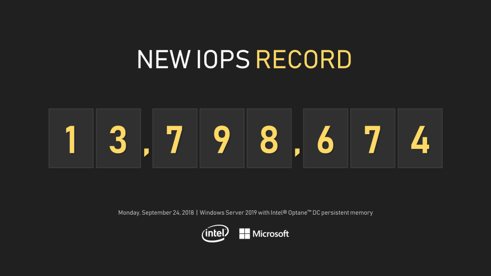
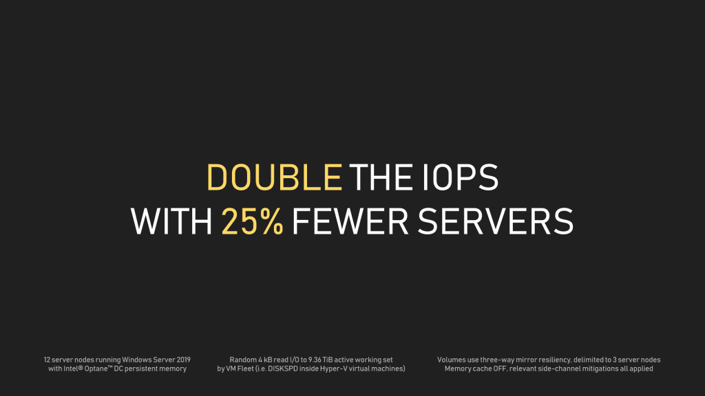

# Understand and deploy persistent memory

> Applies to: Windows Server 2019

Persistent memory (or PMem) is a new type of memory technology that delivers a unique combination of affordable large capacity and persistence. This article provides background on PMem and the steps to deploy it in Windows Server 2019 by using Storage Spaces Direct.

## Background

PMem is a type of non-volatile RAM (NVDIMM) that retains its content through power cycles. Memory contents remain even when system power goes down in the event of an unexpected power loss, user initiated shutdown, system crash, and so on. This unique characteristic means that you can also use PMem as storage. This is why you may hear people refer to PMem as "storage-class memory."

To see some of these benefits, let's look at the following demo from Microsoft Ignite 2018.

[](http://www.youtube.com/watch?v=8WMXkMLJORc)

Any storage system that provides fault tolerance necessarily makes distributed copies of writes. Such operations must traverse the network and amplify backend write traffic. For this reason, the absolute largest IOPS benchmark numbers are typically achieved by measuring reads only, especially if the storage system has common-sense optimizations to read from the local copy whenever possible. Storage Spaces Direct is optimized to do so.

**When measured by using only read operations, the cluster delivers 13,798,674 IOPS.**



If you watch the video closely, you'll notice that what's even more jaw-dropping is the latency. Even at over 13.7 M IOPS, the file system in Windows is reporting latency that's consistently less than 40 µs! (That's the symbol for microseconds, one-millionth of a second.) This speed is an order of magnitude faster than what typical all-flash vendors proudly advertise today.

Together, Storage Spaces Direct in Windows Server 2019 and Intel® Optane™ DC persistent memory deliver breakthrough performance. This industry-leading HCI benchmark of over 13.7M IOPS, accompanied by predictable and extremely low latency, is more than double our previous industry-leading benchmark of 6.7M IOPS. What's more, this time we needed only 12 server nodes&mdash;25 percent fewer than two years ago.



The test hardware was a 12-server cluster that was configured to use three-way mirroring and delimited ReFS volumes, **12** x Intel® S2600WFT, **384 GiB** memory, 2 x 28-core “CascadeLake,” **1.5 TB** Intel® Optane™ DC persistent memory as cache, **32 TB** NVMe (4 x 8 TB Intel® DC P4510) as capacity, **2** x Mellanox ConnectX-4 25 Gbps.

The following table shows the full performance numbers.  

| Benchmark                   | Performance         |
|-----------------------------|---------------------|
| 4K 100% random read         | 13.8 million IOPS   |
| 4K 90/10% random read/write | 9.45 million IOPS   |
| 2 MB sequential read         | 549 GB/s throughput |

### Supported hardware

The following table shows supported persistent memory hardware for Windows Server 2019 and Windows Server 2016.  

| Persistent Memory Technology                                      | Windows Server 2016 | Windows Server 2019 |
|-------------------------------------------------------------------|--------------------------|--------------------------|
| **NVDIMM-N** in persistent mode                                  | Supported                | Supported                |
| **Intel Optane™ DC Persistent Memory** in App Direct Mode             | Not Supported            | Supported                |
| **Intel Optane™ DC Persistent Memory** in Memory Mode | Supported            | Supported                |

> [!NOTE]  
> Intel Optane supports both *Memory* (volatile) and *App Direct* (persistent) modes.
   
> [!NOTE]  
> When you restart a system that has multiple Intel® Optane™ PMem modules in App Direct mode that are divided into multiple namespaces, you might lose access to some or all of the related logical storage disks. This issue occurs on Windows Server 2019 versions that are older than version 1903.
>   
> This loss of access occurs because a PMem module is untrained or otherwise fails when the system starts. In such a case, all the storage namespaces on any PMem module on the system fail, including namespaces that do not physically map to the failed module.
>   
> To restore access to all the namespaces, replace the failed module.
>   
> If a module fails on Windows Server 2019 version 1903 or newer versions, you lose access to only namespaces that physically map to the affected module. Other namespaces are not affected.

Now, let's dive into how you configure persistent memory.

## Interleaved sets

### Understanding interleaved sets

Recall that an NVDIMM resides in a standard DIMM (memory) slot, which puts data closer to the processor. This configuration reduces latency and improves fetch performance. To further increase throughput, two or more NVDIMMs create an n-way interleaved set to stripe read/write operations. The most common configurations are two-way or four-way interleaving. An interleaved set also makes multiple persistent memory devices appear as a single logical disk to Windows Server. You can use the Windows PowerShell **get-PmemDisk** cmdlet to review the configuration of such logical disks, as follows:

```PowerShell
Get-PmemDisk

DiskNumber Size   HealthStatus AtomicityType CanBeRemoved PhysicalDeviceIds UnsafeShutdownCount
---------- ----   ------------ ------------- ------------ ----------------- -------------------
2          252 GB Healthy      None          True         {20, 120}         0
3          252 GB Healthy      None          True         {1020, 1120}      0
```

We can see that the logical PMem disk #2 uses the physical devices Id20 and Id120, and logical PMem disk #3 uses the physical devices Id1020 and Id1120.  

To retrieve further information about the interleaved set that a logical drive uses, run the **Get-PmemPhysicalDevice** cmdlet:

```PowerShell
(Get-PmemDisk)[0] | Get-PmemPhysicalDevice

DeviceId DeviceType           HealthStatus OperationalStatus PhysicalLocation FirmwareRevision Persistent memory size Volatile memory size
-------- ----------           ------------ ----------------- ---------------- ---------------- ---------------------- --------------------
20       Intel INVDIMM device Healthy      {Ok}              CPU1_DIMM_C1     102005310        126 GB                 0 GB
120      Intel INVDIMM device Healthy      {Ok}              CPU1_DIMM_F1     102005310        126 GB                 0 GB
```

### Configuring interleaved sets

To configure an interleaved set, start by reviewing all the persistent memory regions that are not assigned to a logical PMem disk on the system. To do this, run the following PowerShell cmdlet:

```PowerShell
Get-PmemUnusedRegion

RegionId TotalSizeInBytes DeviceId
-------- ---------------- --------
       1     270582939648 {20, 120}
       3     270582939648 {1020, 1120}
```

To see all the PMem device information in the system, including device type, location, health and operational status, and so on, run the following cmdlet on the local server:

```PowerShell
Get-PmemPhysicalDevice

DeviceId DeviceType           HealthStatus OperationalStatus PhysicalLocation FirmwareRevision Persistent memory size Volatile
                                                                                                                      memory size
-------- ----------           ------------ ----------------- ---------------- ---------------- ---------------------- --------------
1020     Intel INVDIMM device Healthy      {Ok}              CPU2_DIMM_C1     102005310        126 GB                 0 GB
1120     Intel INVDIMM device Healthy      {Ok}              CPU2_DIMM_F1     102005310        126 GB                 0 GB
120      Intel INVDIMM device Healthy      {Ok}              CPU1_DIMM_F1     102005310        126 GB                 0 GB
20       Intel INVDIMM device Healthy      {Ok}              CPU1_DIMM_C1     102005310        126 GB                 0 GB
```

Because we have an available unused PMem region, we can create new persistent memory disks. We can use the unused region to create multiple persistent memory disks by running the following cmdlets:

```PowerShell
Get-PmemUnusedRegion | New-PmemDisk
Creating new persistent memory disk. This may take a few moments.
```

After this is done, we can see the results by running:

```PowerShell
Get-PmemDisk

DiskNumber Size   HealthStatus AtomicityType CanBeRemoved PhysicalDeviceIds UnsafeShutdownCount
---------- ----   ------------ ------------- ------------ ----------------- -------------------
2          252 GB Healthy      None          True         {20, 120}         0
3          252 GB Healthy      None          True         {1020, 1120}      0
```

It is worth noting that we can run **Get-PhysicalDisk | Where MediaType -Eq SCM** instead of **Get-PmemDisk** to get the same results. The newly-created PMem disk corresponds one-to-one with drives that appear in PowerShell and in Windows Admin Center.

### Using persistent memory for cache or capacity

Storage Spaces Direct on Windows Server 2019 supports using persistent memory as either a cache or a capacity drive. For more information about how to set up cache and capacity drives, see [Understanding the cache in Storage Spaces Direct](understand-the-cache.md).

## Creating a DAX volume

### Understanding DAX

There are two methods for accessing persistent memory. They are:

1. **Direct access (DAX)**, which operates like memory to get the lowest latency. The app directly modifies the persistent memory, bypassing the stack. Note that you can only use DAX in combination with NTFS.
1. **Block access**, which operates like storage for app compatibility. In this configuraion, the data flows through the stack. You can use this configuration in combination with NTFS and ReFS.

The following figure shows an example of a DAX configuration:


### Configuring DAX

We have to use PowerShell cmdlets to create a DAX volume on a persistent memory disk. By using the **-IsDax** switch, we can format a volume to be DAX-enabled.

```PowerShell
Format-Volume -IsDax:$true
```

The following code snippet helps you create a DAX volume on a persistent memory disk.

```PowerShell
# Here we use the first pmem disk to create the volume as an example
$disk = (Get-PmemDisk)[0] | Get-PhysicalDisk | Get-Disk
# Initialize the disk to GPT if it is not initialized
If ($disk.partitionstyle -eq "RAW") {$disk | Initialize-Disk -PartitionStyle GPT}
# Create a partition with drive letter 'S' (can use any available drive letter)
$disk | New-Partition -DriveLetter S -UseMaximumSize


   DiskPath: \\?\scmld#ven_8980&dev_097a&subsys_89804151&rev_0018#3&1b1819f6&0&03018089fb63494db728d8418b3cbbf549997891#{53f56307-b6
bf-11d0-94f2-00a0c91efb8b}

PartitionNumber  DriveLetter Offset                                               Size Type
---------------  ----------- ------                                               ---- ----
2                S           16777216                                        251.98 GB Basic

# Format the volume with drive letter 'S' to DAX Volume
Format-Volume -FileSystem NTFS -IsDax:$true -DriveLetter S

DriveLetter FriendlyName FileSystemType DriveType HealthStatus OperationalStatus SizeRemaining      Size
----------- ------------ -------------- --------- ------------ ----------------- -------------      ----
S                        NTFS           Fixed     Healthy      OK                    251.91 GB 251.98 GB

# Verify the volume is DAX enabled
Get-Partition -DriveLetter S | fl


UniqueId             : {00000000-0000-0000-0000-000100000000}SCMLD\VEN_8980&DEV_097A&SUBSYS_89804151&REV_0018\3&1B1819F6&0&03018089F
                       B63494DB728D8418B3CBBF549997891:WIN-8KGI228ULGA
AccessPaths          : {S:\, \\?\Volume{cf468ffa-ae17-4139-a575-717547d4df09}\}
DiskNumber           : 2
DiskPath             : \\?\scmld#ven_8980&dev_097a&subsys_89804151&rev_0018#3&1b1819f6&0&03018089fb63494db728d8418b3cbbf549997891#{5
                       3f56307-b6bf-11d0-94f2-00a0c91efb8b}
DriveLetter          : S
Guid                 : {cf468ffa-ae17-4139-a575-717547d4df09}
IsActive             : False
IsBoot               : False
IsHidden             : False
IsOffline            : False
IsReadOnly           : False
IsShadowCopy         : False
IsDAX                : True                   # <- True: DAX enabled
IsSystem             : False
NoDefaultDriveLetter : False
Offset               : 16777216
OperationalStatus    : Online
PartitionNumber      : 2
Size                 : 251.98 GB
Type                 : Basic
```

## Monitoring health

When you use persistent memory, there are a few differences in the monitoring experience:

- Persistent memory doesn't create Physical Disk performance counters, so you won't see it appear on charts in Windows Admin Center.
- Persistent memory doesn't create Storport 505 data, so you won't get proactive outlier detection.

Apart from that, the monitoring experience is the same as for any other physical disk. You can query for the health of a persistent memory disk by running the following cmdlets:

```PowerShell
Get-PmemDisk

DiskNumber Size   HealthStatus AtomicityType CanBeRemoved PhysicalDeviceIds UnsafeShutdownCount
---------- ----   ------------ ------------- ------------ ----------------- -------------------
2          252 GB Unhealthy    None          True         {20, 120}         2
3          252 GB Healthy      None          True         {1020, 1120}      0

Get-PmemDisk | Get-PhysicalDisk | select SerialNumber, HealthStatus, OperationalStatus, OperationalDetails

SerialNumber               HealthStatus OperationalStatus  OperationalDetails
------------               ------------ ------------------ ------------------
802c-01-1602-117cb5fc      Healthy      OK
802c-01-1602-117cb64f      Warning      Predictive Failure {Threshold Exceeded,NVDIMM_N Error}
```

**HealthStatus** shows whether the PMem disk is healthy.  

The **UnsafeshutdownCount** value tracks the number of shutdowns that may cause data loss on this logical disk. It is the sum of the unsafe shutdown counts of all the underlying PMem devices of this disk. For more information about the health status, use the **Get-PmemPhysicalDevice** cmdlet to find information such as **OperationalStatus**.

```PowerShell
Get-PmemPhysicalDevice

DeviceId DeviceType           HealthStatus OperationalStatus PhysicalLocation FirmwareRevision Persistent memory size Volatile memory size
-------- ----------           ------------ ----------------- ---------------- ---------------- ---------------------- --------------------
1020     Intel INVDIMM device Healthy      {Ok}              CPU2_DIMM_C1     102005310        126 GB                 0 GB
1120     Intel INVDIMM device Healthy      {Ok}              CPU2_DIMM_F1     102005310        126 GB                 0 GB
120      Intel INVDIMM device Healthy      {Ok}              CPU1_DIMM_F1     102005310        126 GB                 0 GB
20       Intel INVDIMM device Unhealthy    {HardwareError}   CPU1_DIMM_C1     102005310        126 GB                 0 GB
```

This cmdlet shows which persistent memory device is unhealthy. The unhealthy device (**DeviceId** 20) matches the case in the previous example. The **PhysicalLocation** in BIOS can help identify which persistent memory device is in faulty state.

## Replacing persistent memory

This article describes how to view the health status of your persistent memory. If you have to replace a failed module, you have to re-provision the PMem disk (refer to the steps that we outlined previously).

When you troubleshoot, you might have to use **Remove-PmemDisk**. This cmdlet removes a specific persistent memory disk. We can remove all current PMem disks by running the following cmdlets:

```PowerShell
Get-PmemDisk | Remove-PmemDisk

cmdlet Remove-PmemDisk at command pipeline position 1
Supply values for the following parameters:
DiskNumber: 2

This will remove the persistent memory disk(s) from the system and will result in data loss.
Remove the persistent memory disk(s)?
[Y] Yes  [A] Yes to All  [N] No  [L] No to All  [S] Suspend  [?] Help (default is "Y"): Y
Removing the persistent memory disk. This may take a few moments.
```

> [!IMPORTANT]  
> Removing a persistent memory disk causes data loss on that disk.

Another cmdlet you might need is **Initialize-PmemPhysicalDevice**. This cmdlet initializes the label storage areas on the physical persistent memory devices, and can clear corrupted label storage information on the PMem devices.

```PowerShell
Get-PmemPhysicalDevice | Initialize-PmemPhysicalDevice

This will initialize the label storage area on the physical persistent memory device(s) and will result in data loss.
Initializes the physical persistent memory device(s)?
[Y] Yes  [A] Yes to All  [N] No  [L] No to All  [S] Suspend  [?] Help (default is "Y"): A
Initializing the physical persistent memory device. This may take a few moments.
Initializing the physical persistent memory device. This may take a few moments.
Initializing the physical persistent memory device. This may take a few moments.
Initializing the physical persistent memory device. This may take a few moments.
```

> [!IMPORTANT]  
> **Initialize-PmemPhysicalDevice** causes data loss in persistent memory. Use it as a last resort to fix persistent memory-related issues.

## See also

- [Storage Spaces Direct overview](storage-spaces-direct-overview.md)
- [Storage-class Memory (NVDIMM-N) Health Management in Windows](storage-class-memory-health.md)
- [Understand the cache](understand-the-cache.md)
