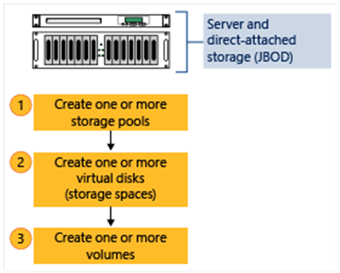

---
title: Deploy Storage Spaces on a stand-alone server
description: Describes how to deploy Storage Spaces on a stand-alone Windows Server 2012-based server.
ms.prod: windows-server-threshold 
ms.topic: article 
author: JasonGerend 
ms.author: jgerend 
ms.technology: storage-spaces
ms.date: 07/09/2018
ms.localizationpriority: medium
---
# Deploy Storage Spaces on a stand-alone server

>Applies to: Windows Server 2019, Windows Server 2016, Windows Server 2012 R2, Windows Server 2012

This topic describes how to deploy Storage Spaces on a stand-alone server. For information about how to create a clustered storage space, see [Deploy a Storage Spaces cluster on Windows Server 2012 R2](<https://docs.microsoft.com/previous-versions/windows/it-pro/windows-server-2012-r2-and-2012/mt270997(v%3dws.11)>).

To create a storage space, you must first create one or more storage pools. A storage pool is a collection of physical disks. A storage pool enables storage aggregation, elastic capacity expansion, and delegated administration.

From a storage pool, you can create one or more virtual disks. These virtual disks are also referred to as *storage spaces*. A storage space appears to the Windows operating system as a regular disk from which you can create formatted volumes. When you create a virtual disk through the File and Storage Services user interface, you can configure the resiliency type (simple, mirror, or parity), the provisioning type (thin or fixed), and the size. Through Windows PowerShell, you can set additional parameters such as the number of columns, the interleave value, and which physical disks in the pool to use. For information about these additional parameters, see [New-VirtualDisk](https://docs.microsoft.com/powershell/module/storage/new-virtualdisk?view=win10-ps) and [What are columns and how does Storage Spaces decide how many to use?](https://social.technet.microsoft.com/wiki/contents/articles/11382.storage-spaces-frequently-asked-questions-faq.aspx%23what_are_columns_and_how_does_storage_spaces_decide_how_many_to_use) in Storage Spaces Frequently Asked Questions (FAQ).

>[!NOTE]
>You can't use a storage space to host the Windows operating system.

From a virtual disk, you can create one or more volumes. When you create a volume, you can configure the size, drive letter or folder, file system (NTFS file system or Resilient File System (ReFS)), allocation unit size, and an optional volume label.

The following figure illustrates the Storage Spaces workflow.



**Figure 1: Storage Spaces workflow**

>[!NOTE]
>This topic includes sample Windows PowerShell cmdlets that you can use to automate some of the procedures described. For more information, see [PowerShell](https://docs.microsoft.com/powershell/scripting/powershell-scripting?view=powershell-6).

## Prerequisites

To use Storage Spaces on a stand-alone Windows Server 2012−based server, make sure that the physical disks that you want to use meet the following prerequisites.

> [!IMPORTANT]
> If you want to learn how to deploy Storage Spaces on a failover cluster, see [Deploy a Storage Spaces cluster on Windows Server 2012 R2](<https://docs.microsoft.com/previous-versions/windows/it-pro/windows-server-2012-r2-and-2012/mt270997(v%3dws.11)>). A failover cluster deployment has different prerequisites, such as supported disk bus types, supported resiliency types, and the required minimum number of disks.

|Area|Requirement|Notes|
|---|---|---|
|Disk bus types|- Serial Attached SCSI (SAS)<br>- Serial Advanced Technology Attachment (SATA)<br>- iSCSI and Fibre Channel Controllers. |You can also use USB drives. However, it's not optimal to use USB drives in a server environment.<br>Storage Spaces is supported on iSCSI and Fibre Channel (FC) controllers as long as the virtual disks created on top of them are non-resilient (Simple with any number of columns).<br>|
|Disk configuration|- Physical disks must be at least 4 GB<br>- Disks must be blank and not formatted. Do not create volumes.||
|HBA considerations|- Simple host bus adapters (HBAs) that do not support RAID functionality are recommended<br>- If RAID-capable, HBAs must be in non-RAID mode with all RAID functionality disabled<br>- Adapters must not abstract the physical disks, cache data, or obscure any attached devices. This includes enclosure services that are provided by attached just-a-bunch-of-disks (JBOD) devices. |Storage Spaces is compatible only with HBAs where you can completely disable all RAID functionality.|
|JBOD enclosures|- JBOD enclosures are optional<br>- Recommended to use Storage Spaces certified enclosures listed on the Windows Server Catalog<br>- If you're using a JBOD enclosure, verify with your storage vendor that the enclosure supports Storage Spaces to ensure full functionality<br>- To determine whether the JBOD enclosure supports enclosure and slot identification, run the following Windows PowerShell cmdlet:<br><br>`Get-PhysicalDisk \| ? {$_.BusType –eq "SAS"} \| fc`<br><br>If the **EnclosureNumber** and **SlotNumber** fields contain values, then the enclosure supports these features.||

To plan for the number of physical disks and the desired resiliency type for a stand-alone server deployment, use the following guidelines.

|Resiliency type|Disk requirements|When to use|
|---|---|---|
|**Simple**<br><br>- Stripes data across physical disks<br>- Maximizes disk capacity and increases throughput<br>- No resiliency (does not protect from disk failure)<br><br><br><br><br><br><br>|Requires at least one physical disk.|Do not use to host irreplaceable data. Simple spaces do not protect against disk failure.<br><br>Use to host temporary or easily recreated data at a reduced cost.<br><br>Suited for high-performance workloads where resiliency is not required or is already provided by the application.|
|**Mirror**<br><br>- Stores two or three copies of the data across the set of physical disks<br>- Increases reliability, but reduces capacity. Duplication occurs with every write. A mirror space also stripes the data across multiple physical drives.<br>- Greater data throughput and lower access latency than parity<br>- Uses dirty region tracking (DRT) to track modifications to the disks in the pool. When the system resumes from an unplanned shutdown and the spaces are brought back online, DRT makes disks in the pool consistent with each other.|Requires at least two physical disks to protect from single disk failure.<br><br>Requires at least five physical disks to protect from two simultaneous disk failures.|Use for most deployments. For example, mirror spaces are suited for a general-purpose file share or a virtual hard disk (VHD) library.|
|**Parity**<br><br>- Stripes data and parity information across physical disks<br>- Increases reliability when it is compared to a simple space, but somewhat reduces capacity<br>- Increases resiliency through journaling. This helps prevent data corruption if an unplanned shutdown occurs.|Requires at least three physical disks to protect from single disk failure.|Use for workloads that are highly sequential, such as archive or backup.|

## Step 1: Create a storage pool

You must first group available physical disks into one or more storage pools.

1. In the Server Manager navigation pane, select **File and Storage Services**.

2. In the navigation pane, select the **Storage Pools** page.
    
    By default, available disks are included in a pool that is named the *primordial* pool. If no primordial pool is listed under **STORAGE POOLS**, this indicates that the storage does not meet the requirements for Storage Spaces. Make sure that the disks meet the requirements that are outlined in the Prerequisites section.
    
    >[!TIP]
    >If you select the **Primordial** storage pool, the available physical disks are listed under **PHYSICAL DISKS**.

3. Under **STORAGE POOLS**, select the **TASKS** list, and then select **New Storage Pool**. The New Storage Pool Wizard will open.

4. On the **Before you begin** page, select **Next**.

5. On the **Specify a storage pool name and subsystem** page, enter a name and optional description for the storage pool, select the group of available physical disks that you want to use, and then select **Next**.

6. On the **Select physical disks for the storage pool** page, do the following, and then select **Next**:
    
    1. Select the check box next to each physical disk that you want to include in the storage pool.
    
    2. If you want to designate one or more disks as hot spares, under **Allocation**, select the drop-down arrow, then select **Hot Spare**.

7. On the **Confirm selections** page, verify that the settings are correct, and then select **Create**.

8. On the **View results** page, verify that all tasks completed, and then select **Close**.
    
    >[!NOTE]
    >Optionally, to continue directly to the next step, you can select the **Create a virtual disk when this wizard closes** check box.

9. Under **STORAGE POOLS**, verify that the new storage pool is listed.

### Windows PowerShell equivalent commands for creating storage pools

The following Windows PowerShell cmdlet or cmdlets perform the same function as the preceding procedure. Enter each cmdlet on a single line, even though they may appear word-wrapped across several lines here because of formatting constraints.

The following example shows which physical disks are available in the primordial pool.

```PowerShell
Get-StoragePool -IsPrimordial $true | Get-PhysicalDisk | Where-Object CanPool -eq $True
```

The following example creates a new storage pool named *StoragePool1* that uses all available disks.

```PowerShell
New-StoragePool –FriendlyName StoragePool1 –StorageSubsystemFriendlyName “Storage Spaces*” –PhysicalDisks (Get-PhysicalDisk –CanPool $True)
```

The following example creates a new storage pool, *StoragePool1*, that uses four of the available disks.

```PowerShell
New-StoragePool –FriendlyName StoragePool1 –StorageSubsystemFriendlyName “Storage Spaces*” –PhysicalDisks (Get-PhysicalDisk PhysicalDisk1, PhysicalDisk2, PhysicalDisk3, PhysicalDisk4)
```

The following example sequence of cmdlets shows how to add an available physical disk *PhysicalDisk5* as a hot spare to the storage pool *StoragePool1*.

```PowerShell
$PDToAdd = Get-PhysicalDisk –FriendlyName PhysicalDisk5
Add-PhysicalDisk –StoragePoolFriendlyName StoragePool1 –PhysicalDisks $PDToAdd –Usage HotSpare
```

## Step 2: Create a virtual disk

Next, you must create one or more virtual disks from the storage pool. When you create a virtual disk, you can select how the data is laid out across the physical disks. This affects both reliability and performance. You can also select whether to create thin- or fixed-provisioned disks.

1. If the New Virtual Disk Wizard is not already open, on the **Storage Pools** page in Server Manager, under **STORAGE POOLS**, make sure that the desired storage pool is selected.

2. Under **VIRTUAL DISKS**, select the **TASKS** list, and then select **New Virtual Disk**. The New Virtual Disk Wizard will open.

3. On the **Before you begin** page, select **Next**.

4. On the **Select the storage pool** page, select the desired storage pool, and then select **Next**.

5. On the **Specify the virtual disk name** page, enter a name and optional description, then select **Next**.

6. On the **Select the storage layout** page, select the desired layout, then select **Next**.
    
    >[!NOTE]
    >If you select a layout where you do not have enough physical disks, you will receive an error message when you select **Next**. For information about which layout to use and the disk requirements, see [Prerequisites](#prerequisites)).

7. If you selected **Mirror** as the storage layout, and you have five or more disks in the pool, the **Configure the resiliency settings** page will appear. Select one of the following options:
    
      - **Two-way mirror**
      - **Three-way mirror**

8. On the **Specify the provisioning type** page, select one of the following options, then select **Next**.
    
   - **Thin**
        
     With thin provisioning, space is allocated on an as-needed basis. This optimizes the usage of available storage. However, because this enables you to over-allocate storage, you must carefully monitor how much disk space is available.
    
   - **Fixed**
        
     With fixed provisioning, the storage capacity is allocated immediately, at the time a virtual disk is created. Therefore, fixed provisioning uses space from the storage pool that is equal to the virtual disk size.
    
     >[!TIP]
     >With Storage Spaces, you can create both thin- and fixed-provisioned virtual disks in the same storage pool. For example, you could use a thin-provisioned virtual disk to host a database and a fixed-provisioned virtual disk to host the associated log files.

9. On the **Specify the size of the virtual disk** page, do the following:
    
    If you selected thin provisioning in the previous step, in the **Virtual disk size** box, enter a virtual disk size, select the units (**MB**, **GB**, or **TB**), then select **Next**.
    
    If you selected fixed provisioning in the previous step, select one of the following:
    
      - **Specify size**
        
        To specify a size, enter a value in the **Virtual disk size** box, then select the units (**MB**, **GB**, or **TB**).
        
        If you use a storage layout other than simple, the virtual disk uses more free space than the size that you specify. To avoid a potential error where the size of the volume exceeds the storage pool free space, you can select the **Create the largest virtual disk possible, up to the specified size** check box.
    
      - **Maximum size**
        
        Select this option to create a virtual disk that uses the maximum capacity of the storage pool.

10. On the **Confirm selections** page, verify that the settings are correct, and then select **Create**.

11. On the **View results** page, verify that all tasks completed, and then select **Close**.
    
    >[!TIP]
    >By default, the **Create a volume when this wizard closes** check box is selected. This takes you directly to the next step.

### Windows PowerShell equivalent commands for creating virtual disks

The following Windows PowerShell cmdlet or cmdlets perform the same function as the preceding procedure. Enter each cmdlet on a single line, even though they may appear word-wrapped across several lines here because of formatting constraints.

The following example creates a 50 GB virtual disk named *VirtualDisk1* on a storage pool named *StoragePool1*.

```PowerShell
New-VirtualDisk –StoragePoolFriendlyName StoragePool1 –FriendlyName VirtualDisk1 –Size (50GB)
```

The following example creates a mirrored virtual disk named *VirtualDisk1* on a storage pool named *StoragePool1*. The disk uses the storage pool's  maximum storage capacity.

```PowerShell
New-VirtualDisk –StoragePoolFriendlyName StoragePool1 –FriendlyName VirtualDisk1 –ResiliencySettingName Mirror –UseMaximumSize
```

The following example creates a 50 GB virtual disk named *VirtualDisk1* on a storage pool that is named *StoragePool1*. The disk uses the thin provisioning type.

```PowerShell
New-VirtualDisk –StoragePoolFriendlyName StoragePool1 –FriendlyName VirtualDisk1 –Size (50GB) –ProvisioningType Thin
```

The following example creates a virtual disk named *VirtualDisk1* on a storage pool named *StoragePool1*. The virtual disk uses three-way mirroring and is a fixed size of 20 GB.

>[!NOTE]
>You must have at least five physical disks in the storage pool for this cmdlet to work. (This does not include any disks that are allocated as hot spares.)

```PowerShell
New-VirtualDisk -StoragePoolFriendlyName StoragePool1 -FriendlyName VirtualDisk1 -ResiliencySettingName Mirror -NumberOfDataCopies 3 -Size 20GB -ProvisioningType Fixed
```

## Step 3: Create a volume

Next, you must create a volume from the virtual disk. You can assign an optional drive letter or folder, then format the volume with a file system.

1. If the New Volume Wizard is not already open, on the **Storage Pools** page in Server Manager, under **VIRTUAL DISKS**, right-click the desired virtual disk, and then select **New Volume**.
    
    The New Volume Wizard opens.

2. On the **Before you begin** page, select **Next**.

3. On the **Select the server and disk** page, do the following, and then select **Next**.
    
    1. In the **Server** area, select the server on which you want to provision the volume.
    
    2. In the **Disk** area, select the virtual disk on which you want to create the volume.

4. On the **Specify the size of the volume** page, enter a volume size, specify the units (**MB**, **GB**, or **TB**), and then select **Next**.

5. On the **Assign to a drive letter or folder** page, configure the desired option, and then select **Next**.

6. On the **Select file system settings** page, do the following, and then select **Next**.
    
    1. In the **File system** list, select either **NTFS** or **ReFS**.
    
    2. In the **Allocation unit size** list, either leave the setting at **Default** or set the allocation unit size.
        
        >[!NOTE]
        >For more information about allocation unit size, see [Default cluster size for NTFS, FAT, and exFAT](https://support.microsoft.com/help/140365/default-cluster-size-for-ntfs-fat-and-exfat).

    
    3. Optionally, in the **Volume label** box, enter a volume label name, for example **HR Data**.

7. On the **Confirm selections** page, verify that the settings are correct, and then select **Create**.

8. On the **View results** page, verify that all tasks completed, and then select **Close**.

9. To verify that the volume was created, in Server Manager, select the **Volumes** page. The volume is listed under the server where it was created. You can also verify that the volume is in Windows Explorer.

### Windows PowerShell equivalent commands for creating volumes

The following Windows PowerShell cmdlet performs the same function as the previous procedure. Enter the command on a single line.

The following example initializes the disks for virtual disk *VirtualDisk1*, creates a partition with an assigned drive letter, and then formats the volume with the default NTFS file system.

```PowerShell
Get-VirtualDisk –FriendlyName VirtualDisk1 | Get-Disk | Initialize-Disk –Passthru | New-Partition –AssignDriveLetter –UseMaximumSize | Format-Volume
```

## Additional information

- [Storage Spaces](overview.md)
- [Storage Cmdlets in Windows PowerShell](https://docs.microsoft.com/powershell/module/storage/index?view=win10-ps)
- [Deploy Clustered Storage Spaces](https://docs.microsoft.com/previous-versions/windows/it-pro/windows-server-2012-r2-and-2012/jj822937(v%3dws.11))
- [Storage Spaces Frequently Asked Questions (FAQ)](https://social.technet.microsoft.com/wiki/contents/articles/11382.storage-spaces-frequently-asked-questions-faq.aspx)
